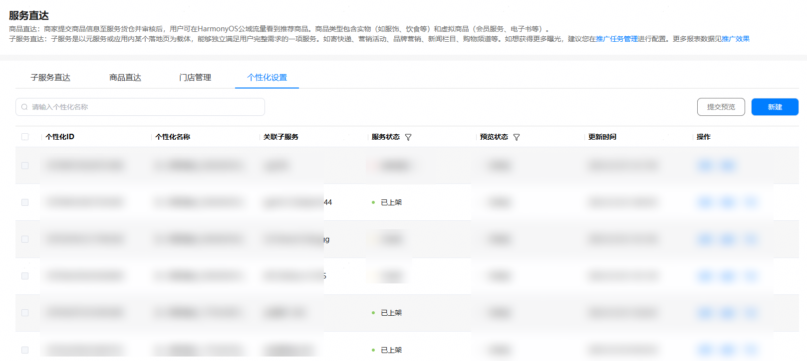
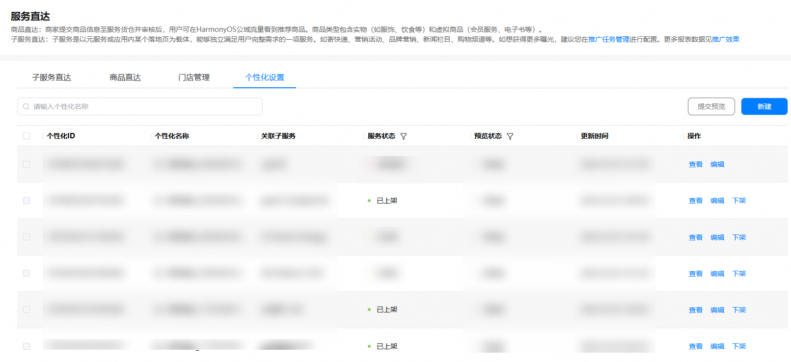
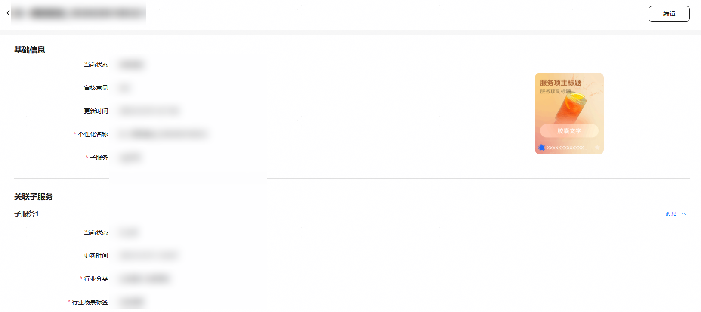
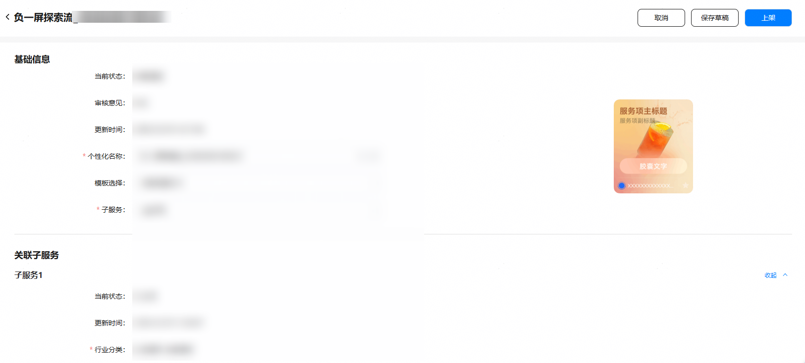

对于已通过审核、个性化设置状态为“已上架”的个性化设置，开发者可进行更新个性化设置的操作。

进行更新操作的方式有两种：

* 在“个性化设置”页签中的操作栏点击“编辑”。
* 在“个性化设置”页签中的操作栏点击“查看”后，再点击“编辑”。

1. 点击“编辑”后进入编辑页中，开发者可以对个性化设置的信息进行更新。

   
2. 点击“上架”，将更新后的个性化设置进行重新上架操作，由平台进行审核，个性化设置状态由“已上架”变更为“待审核”。

   

   个性化设置更新后，如果平台仍在审核当中，面向鸿蒙公域流量仅展示已上架个性化设置，不展示待审核状态的个性化设置。
