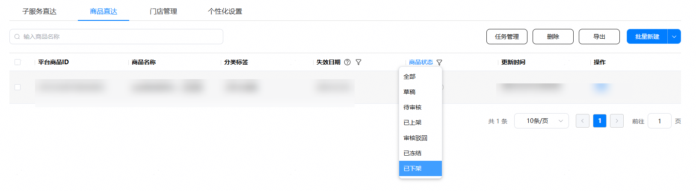
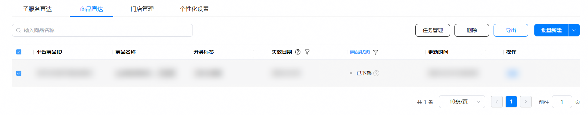
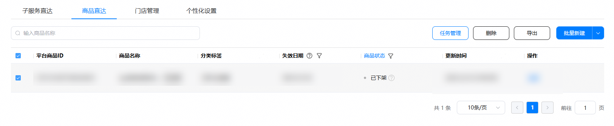
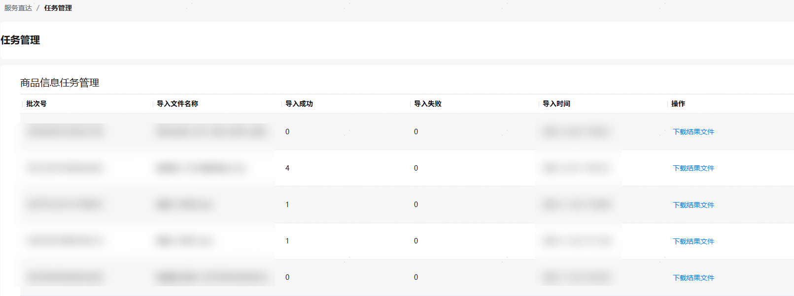
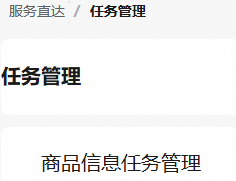
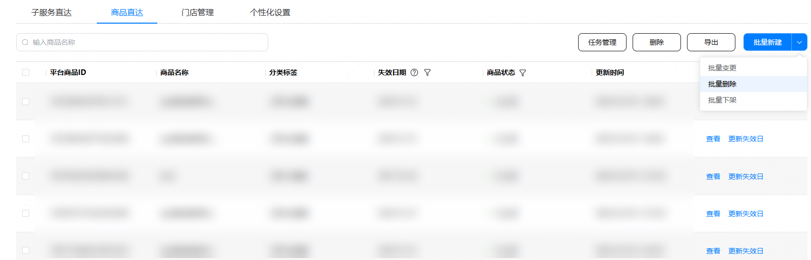
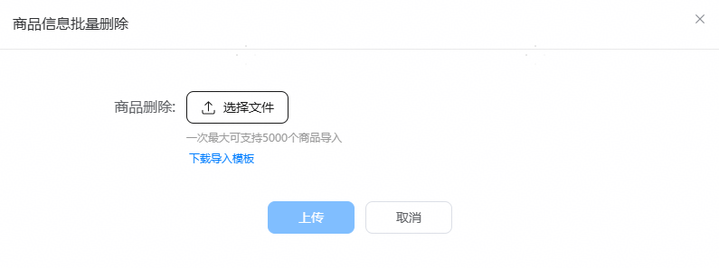

在商品状态为“已下架”状态时，您可以点击“删除”按钮或“批量删除”按钮，以完成删除商品操作。

详细操作指导如下：

1. 点击“删除”按钮删除商品。
   1. 在服务直达主界面，选择“商品直达”页签，点击“商品状态”列筛选出“已下架”状态的商品。

      
   2. 勾选想要删除的商品，点击删除。

      
2. 上传文件删除商品。
   1. 在服务直达主界面，选择“商品直达”页签，点击“商品状态”列筛选出“已下架”状态的商品。

      
   2. 点击“导出”。

      不勾选时，点击“导出”可导出全部商品。勾选商品时，点击“导出”仅导出已勾选商品。

      
   3. 导出完成后，点击“任务管理”，下载导出结果。

      

      
   4. 编辑表格，仅保留需要删除的商品。

      

      删除场景中，“平台侧商品ID”列不可修改。
   5. 点击“服务直达”,返回“商品直达”页签。

      
   6. 点击“批量删除”，上传编辑后的表格文件，点击“上传”按钮。

      

      
