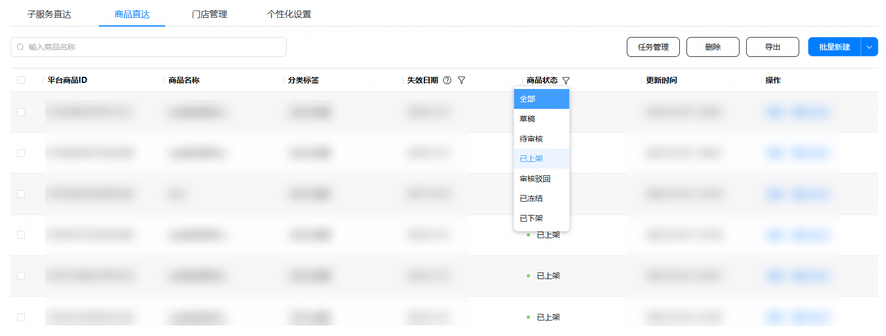
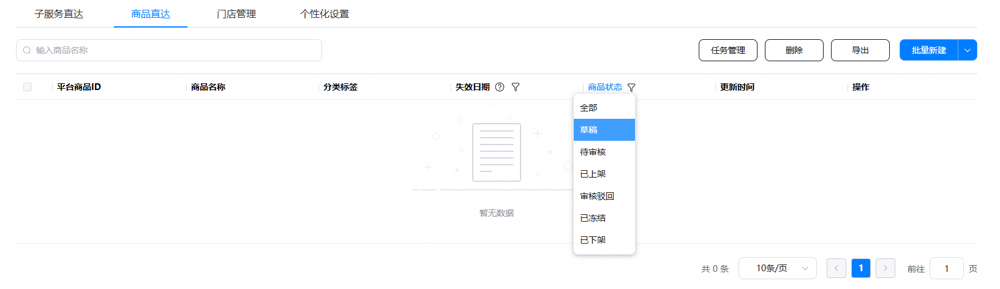
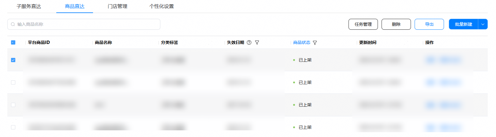
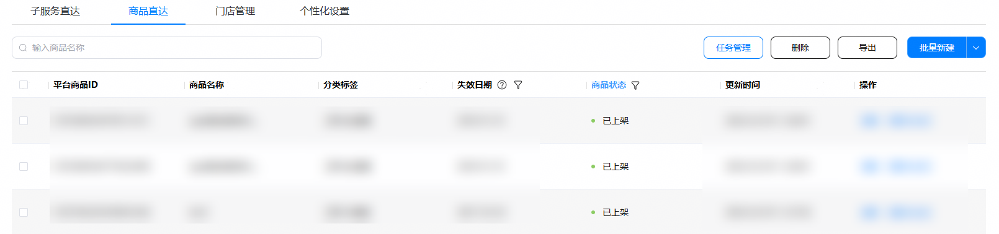
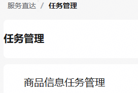
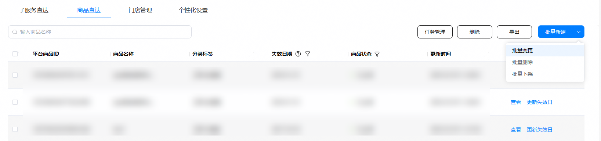
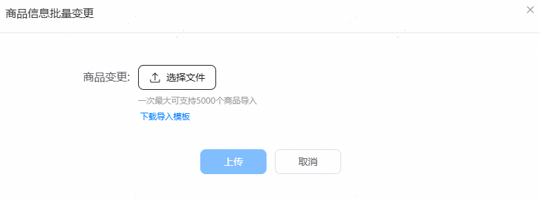

在商品状态为“草稿”、“审核驳回”、“已上架”状态时，开发者可以通过“批量变更”操作更新商品信息并发起审核。

1. 在服务直达主界面，选择“商品直达”页签，点击“商品状态”列筛选出“已上架”状态的商品。

   

   
2. 点击“导出”。
   * 没有勾选项时，点击“导出”可导出全部商品。
   * 存在已勾选商品时，点击“导出”仅导出已勾选商品。

   
3. 导出完成后，点击“任务管理”，下载导出结果。

   
4. 编辑表格，修改商品信息。

   

   “SKU”Sheet页中，删除一行时会删除该SKU。若需新增SKU，请新增一行并填写必填字段。
5. 点击“服务直达”,返回“商品直达”页签。

   
6. 点击“批量变更”，上传编辑后的表格文件，点击“上传”按钮。

   

   
