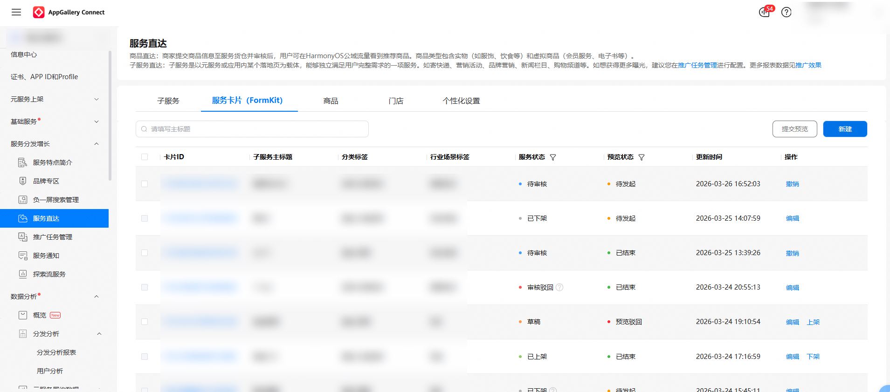
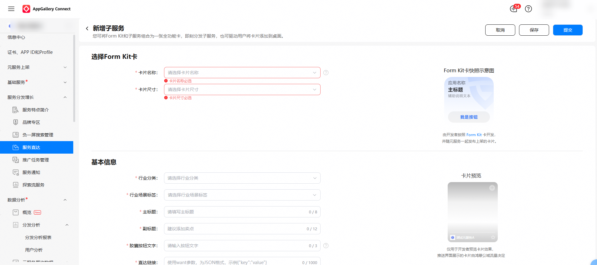
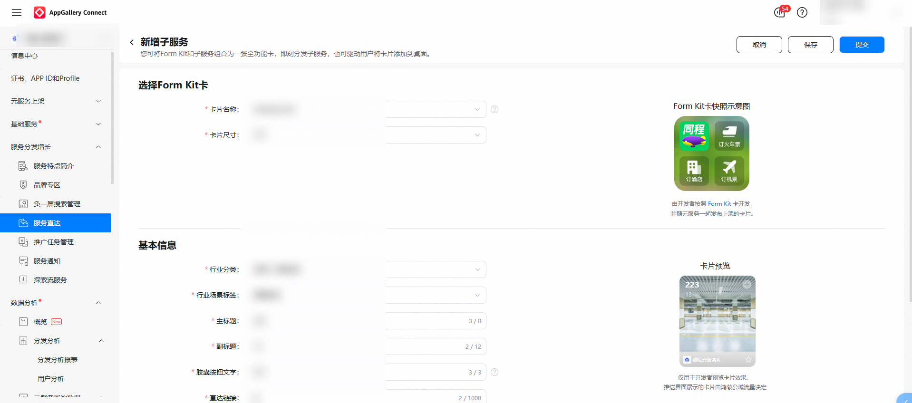
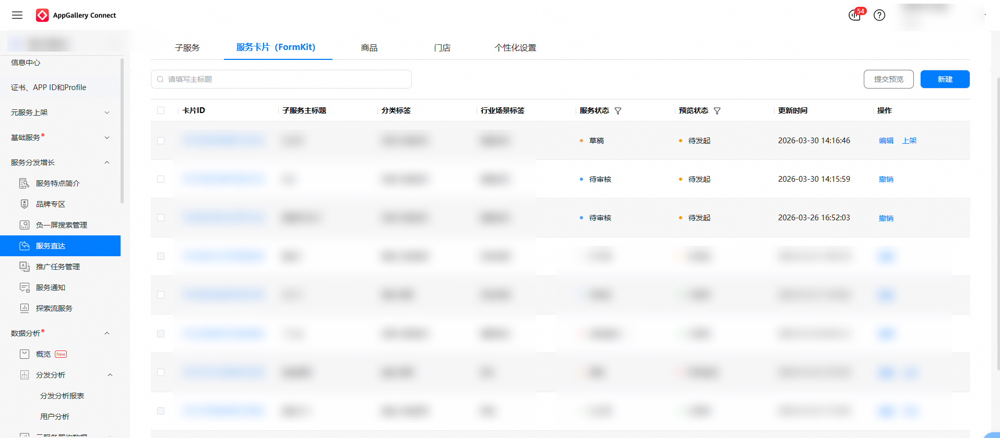

1. 在服务直达主界面，选择“服务卡片（FormKit）”页签，点击“新建”。

   

2. 在“新增子服务”页录入服务卡片（FormKit）的相关信息，如图所示。

   

   

   

   * FormKit卡的主标题（title）在整个元服务内必须唯一。
3. 录入信息后点击“保存”，服务卡片的状态将变为草稿，可再次编辑；点击“提交”，服务卡片的状态将变为待审核。

   

   

   * FormKit卡状态说明：

     | FormKit卡状态 | 说明 |
     | --- | --- |
     | 草稿 | 开发者点击“保存”或“保存草稿”后，FormKit卡状态变更为“草稿”。 |
     | 审核驳回 | 开发者提交FormKit卡信息后，若平台审核不通过，FormKit卡状态变更为“审核驳回”。 |
     | 待审核 | 开发者提交FormKit卡信息后，若平台尚未完成审核，FormKit卡状态变更为“待审核”。 |
     | 已上架 | 开发者提交FormKit卡信息后，若平台通过审核，FormKit卡状态变更为“已上架”。 |
