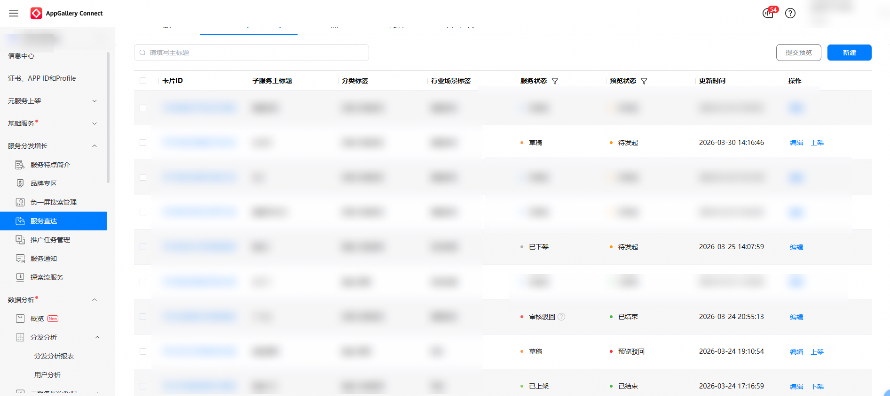
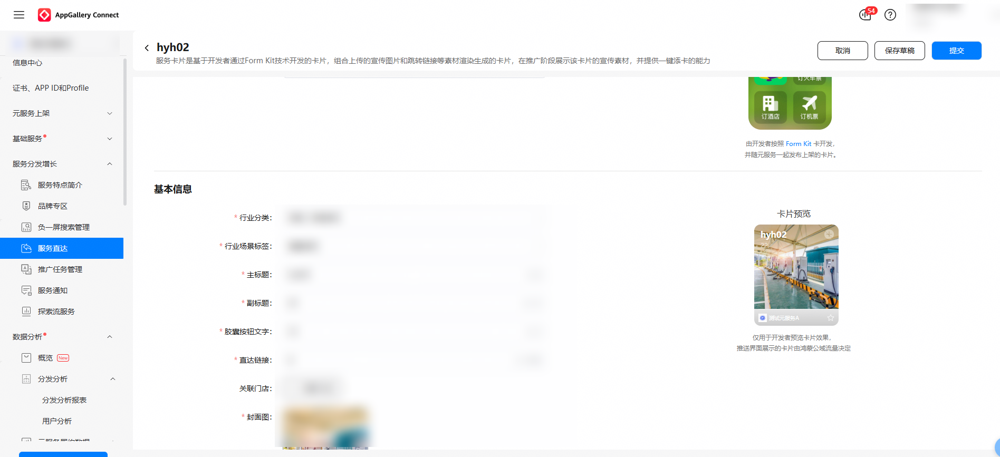
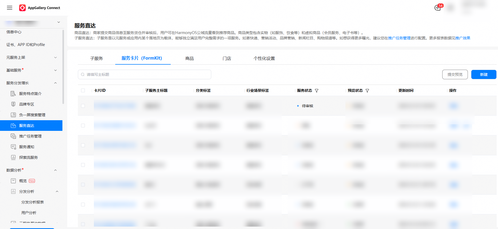

1. 对于状态为“已上架”、“已下架”、“审核驳回”、“草稿”的FormKit卡可被编辑，点击列表操作列“编辑”后进入编辑页中，开发者可以对子服务的信息进行更新。

   

   
2. 更新完成后，点击“提交”，将更新后的FormKit卡进行重新上架操作，由平台进行审核，FormKit卡状态由“已上架”变更为“待审核”。

   

   

   FormKit卡更新后，如果平台仍在审核当中，面向鸿蒙公域流量仅展示已上架FormKit卡信息，不展示待审核状态的FormKit卡信息。
