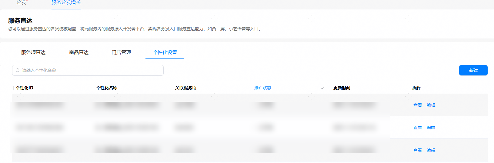
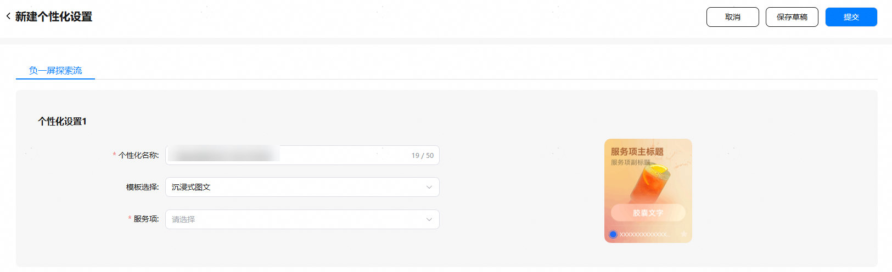

1. 如果您已下架子服务关联的个性化数据，您可在“个性化设置”页签，点击“新建”。

   
2. 在个性化设置中，开发者进行模板选择并输入信息。

   

   

   子服务下拉框中只会显示子服务状态为“已上架”且未被个性化设置关联过的子服务。

3. 点击“提交”，进行个性化设置的提交，由平台进行审核，个性化设置状态变更为“待审核”。可在个性化设置列表中查看个性化设置状态。

   个性化设置状态说明：

   | 个性化设置状态 | 说明 |
   | --- | --- |
   | 草稿 | 开发者点击“保存草稿”后，个性化设置状态变更为“草稿”。 |
   | 审核驳回 | 开发者提交个性化设置信息后，若平台审核不通过，个性化设置状态变更为“审核驳回”。 |
   | 待审核 | 开发者提交个性化设置信息后，若平台尚未完成审核，个性化设置状态变更为“待审核”。 |
   | 已上架 | 开发者提交个性化设置信息后，若平台通过审核，个性化设置状态变更为“已上架”。 |
   | 已下架 | 开发者对“已上架”的个性化设置发起下架申请后，个性化设置状态变更为“已下架”。处于“已下架”的个性化设置，开发者可进行查看、编辑，该个性化设置可重复上架。 |
   | 已冻结 | 平台会周期性对已上架的个性化设置进行巡检，如发现个性化设置存在违规问题等，可能会导致个性化设置被处罚并冻结，个性化设置状态将变更为“已冻结”。处于“已冻结”的个性化设置，开发者可以查看详情、申请复核。 |
