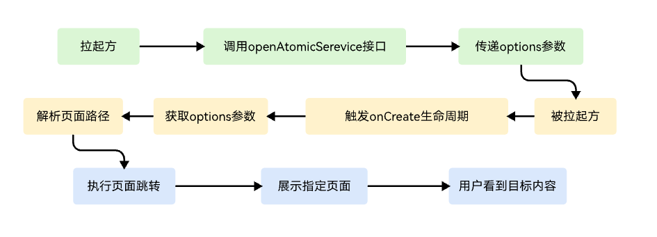
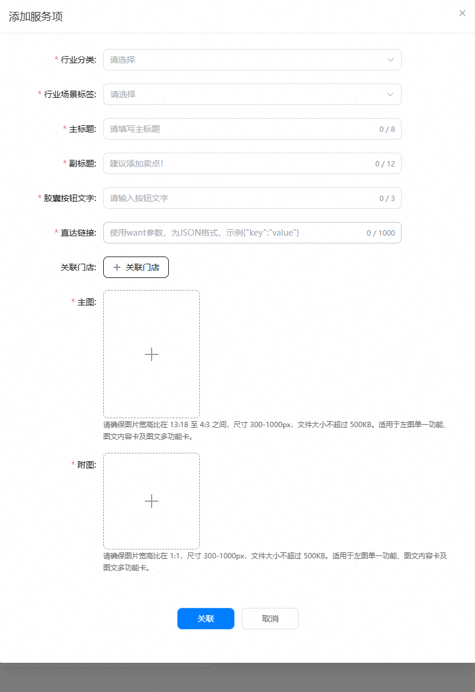

Want参数是应用组件间通信的核心载体对象，作用为启动目标应用/元服务并传递信息。

**图1** 常见Want用法示意图


**拉起方代码示例：**

此段代码，可用于测试跳转参数是否可以正常跳转至对应商品、门店、子服务的落地页。

```
//page/xxx.ets
let context: common.UIAbilityContext = this.getUIContext().getHostContext() as common.UIAbilityContext
// 待拉起元服务appId
let appId: string = '123456';
// 开发者自定义参数options，在openAtomicService接口中可看做是want
//此处展示的是当开发者配置了展示的栏目ID与对应的跳转地址
let options: AtomicServiceOptions = {
  parameters:{
    displayId: 0,
    path:'pages/Detail'
  }
};
try {
    //使用openAtomicService接口打开元服务，本质上此处的options与want相同
  context.openAtomicService(appId, options)
    .then((result: common.AbilityResult) => {
      // 执行正常业务
      console.info('openAtomicService succeed');
    })
    .catch((err: BusinessError) => {
      // 处理业务逻辑错误
      console.error(`openAtomicService failed, code is ${err.code}, message is ${err.message}`);
    });
} catch (err) {
  // 处理入参错误异常
  let code = (err as BusinessError).code;
  let message = (err as BusinessError).message;
  console.error(`openAtomicService failed, code is ${code}, message is ${message}`);
}
```

**被拉起方代码示例：**

此段为开发者在元服务内根据want参数跳转对应落地页的代码示例。

```
//page/xxx.ets
import { AbilityConstant, UIAbility, Want } from '@kit.AbilityKit';

export default class FuncAbilityA extends UIAbility {
  onCreate(want: Want, launchParam: AbilityConstant.LaunchParam): void {
    // 接收拉起方UIAbility传过来的参数
    let funcAbilityWant = want;
    let displayId = funcAbilityWant?.parameters?.displayId;
    console.info('displayId', displayId)
    //执行跳转操作
    router.pushUrl({
        url: funcAbilityWant?.path // 解析want中携带的地址参数并进行对应的跳转操作
    }, router.RouterMode.Standard, (err) => {
    if (err) {
      console.error(`Invoke pushUrl failed, code is ${err.code}, message is ${err.message}`);
      return;
    }
    console.info('Invoke pushUrl succeeded.');
  });
  }
  //...
}
```

**在子服务根据实际需求配置want**

例如可以配置为某个指定栏目的 "channelID"："123"。

**图2** 添加子服务示意图


**被拉起方代码示例：**

```
//page/xxx.ets
import { AbilityConstant, UIAbility, Want } from '@kit.AbilityKit';

export default class FuncAbilityA extends UIAbility {
  onCreate(want: Want, launchParam: AbilityConstant.LaunchParam): void {
    // 接收拉起方UIAbility传过来的参数
    let funcAbilityWant = want;
    let channelID = funcAbilityWant?.parameters?.channelID;
    console.log('want.channelID: ', channelID)
    //执行跳转操作
    router.pushUrl({
        url: `pages/${channelID}` // 解析want中携带的地址参数并进行对应的跳转操作
    }, router.RouterMode.Standard, (err) => {
    if (err) {
      console.error(`Invoke pushUrl failed, code is ${err.code}, message is ${err.message}`);
      return;
    }
    console.info('Invoke pushUrl succeeded.');
  });
  }
  //...
}
```
