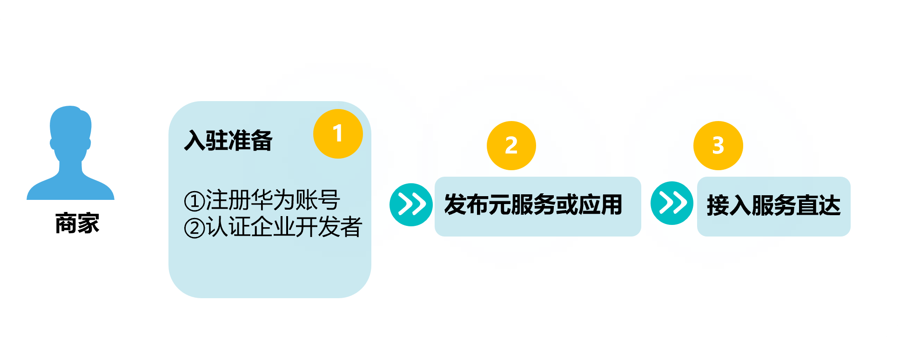

如图为商家直接接入服务直达的流程。

**适用范围**

元服务、应用

**如何成为企业开发者**

商家先注册华为账号，并完成[企业开发者认证](https://developer.huawei.com/consumer/cn/doc/start/ht-edrna-0000001154848578)。

**如何通过API接入服务直达**

1. 商家先按照[元服务开发指南](/docs/dev/atomic-dev/atomic-service/atomic-service)开发元服务或应用并完成上架。
2. 配置[鉴权方式](/docs/dev/atomic-dev/instant-service-access-credentials/instant-service-merchant-authentication)。
3. 依次接入[图片管理](/docs/dev/atomic-dev/instant-service-image-management/instant-service-image-management)、[门店管理](/docs/dev/atomic-dev/instant-service-store-management/instant-service-store-management)及[商品管理](/docs/dev/atomic-dev/instant-service-offerings-management/instant-service-offerings-management)。
