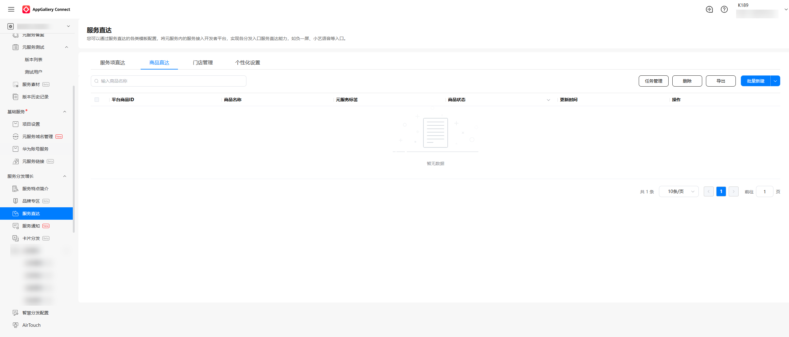
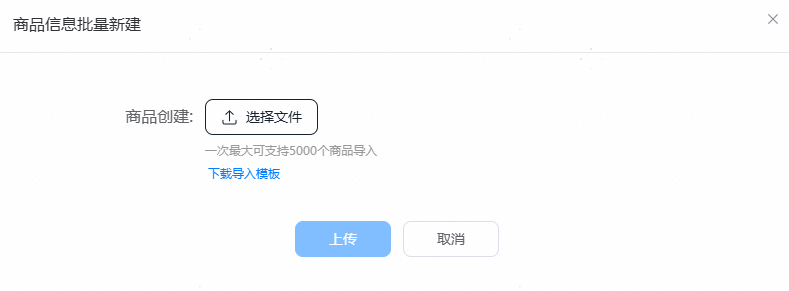
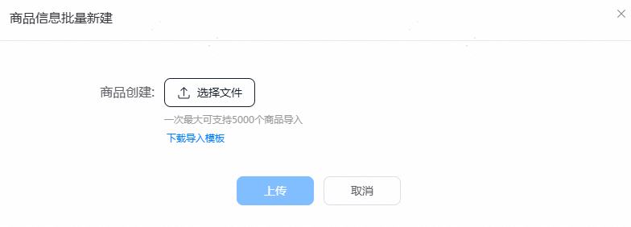
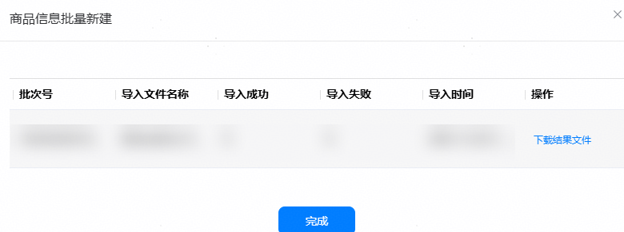

1. 在服务直达主界面，选择“商品直达”页签，点击“批量新建”。

   
2. 点击“下载导入模板”。

   按照导入模板要求填写信息。

   

   **表1** 商品基本信息

   | 字段 | 定义 | 是否必选 |
   | --- | --- | --- |
   | 元服务标签 | 取自[元服务分类标签](/docs/distribute/app-dist/app-services/classification-0000002068852289/ability-0000002032931302)。 | 必选 |
   | 商家侧商品ID | 商家侧上传的商家商品编码，商家侧唯一。 | 必选 |
   | 商品名称 | 字符类型，最少不低于3个字符，最长不超过30个字符。商品名称不宜过长，影响用户视觉体验。  注：1.商品名称只允许汉字、数字、英文字母、特殊字符集；特殊字符集为：`·~～!@#$%^&()！@#￥%……&\*（）-\_——=+[]\【】、&#123;&#125; \|｜;'；’:"： ‘“”,./，。、\&lt;\&gt;?《》？\u00A0\u0020\u3000  2.商品名称不得仅为数字、字母、特殊字符集或上述三种的组合。  元服务提供多种卡片规范，建议商品字数按照对应卡片规范来，避免展示信息重叠等，降低用户吸引力。 | 必选 |
   | 商品副标题 | 最多不超过50个字符，展示在卡片中，用于增量描述商品信息。  元服务提供多种卡片规范，建议商品字数按照对应卡片规范来，避免展示信息重叠等，降低用户吸引力。 | 可选 |
   | 商品主图 | 商品主图url链接，上传规格为宽高比 1:1，图片文件大小为200K，最大不超过500K。图片像素宽高600px，最大不超过1000px。文件格式：png、jpeg 、jpg 3种格式，推荐使用png格式，效果将更加沉浸。建议商品主图尽量铺满整个图片区域。 | 必选 |
   | 商品属性 | 商品属性名称-json串，请参考商品属性。 | 有条件必选 |
   | 失效日期 | 必须大于等于系统显示的当天日期，日期格式为：2026/01/01。  注意实际失效的时间为所选日期当天23:59:59。  商品有售卖周期，按照分类标签系统设置了最大可设置的有效期。如果您所输入的失效日期超过系统允许的最大有效期，系统将按照最大有效期设置失效日期。票务一般最长设置90天，其余不超过365天。 | 必选 |
   | 商品直达链接 | 实际打开元服务对应商品页面的参数。会通过[openAtomicService API](https://developer.huawei.com/consumer/cn/doc/harmonyos-references/js-apis-inner-application-uiextensioncontext#openatomicservice12)跳转绑定的元服务。  链接格式为json字符串，内容为[want.parameters](https://developer.huawei.com/consumer/cn/doc/harmonyos-references/js-apis-app-ability-want)参数。  例如：  \&#123;"path":"page1", "productId":123\&#125; | 是 |

   **表2** SKU基本信息

   | 字段 | 定义 | 是否必选 |
   | --- | --- | --- |
   | 商家侧skuId | 输入商家的SKUID，确保商家侧唯一。 | 必选 |
   | 商家侧商品ID | 商家侧上传的商家商品编码，商家侧唯一标识。 | 必选 |
   | SKU原价 | SKU原价，分为单位。 | 必选 |
   | SKU售价 | SKU售价，分为单位。 | 可选 |
   | SKU属性 | 使用json标识属性和属性值。 | 可选 |

   **表3** 商品属性清单

   | 属性 | 属性Key | 属性取值说明 | 示例 |
   | --- | --- | --- | --- |
   | 导购标签 | sellingPointTag | 总长度不超过64个字符，每组推荐词不超过6个字符。 | ["鲜果饮品","瘦身王者"] |
   | 商品支持的配送方式 | supportedDeliveryMode | deliveryTypeIds枚举数组，枚举定义为：  1 支持自提  2 支持同城外送  3 快递  allShops 是否全部门店均可配送该商品，false时则必须传入shopIds。  shopIds 对应配送方式的门店ID列表。 | [\&#123;"deliveryTypeIds": [1,2],  "shopIds": [  "13047733319470939112",  "13047733319470939113"],  "allShops": false\&#125;,  \&#123;"deliveryTypeIds": [3]\&#125;] |
3. 点击“选择文件”。

   选择保存后的表格文件。点击“上传”。

   
4. 上传完成后，可在导入弹窗稍等片刻，查看导入结果。

   此页面可查看导入成功数、导入失败数，并可点击“下载结果文件”下载以查询导入失败的原因。

   
5. 导入完成后，可在商品列表中查看商品状态。

   **表4** 商品状态说明

   | 商品状态 | 说明 |
   | --- | --- |
   | 待审核 | 商家提交商品信息后，若平台尚未完成审核，商品的状态变更为“待审核”。处于“待审核”状态的商品，仅允许查看商品详情。 |
   | 已上架 | 商家提交审核的商品，若平台审核通过，商品的状态变更为“已上架”。处于“已上架”的商品，商家可查看详情、下架商品。 |
   | 审核驳回 | 商家提交审核的商品，若平台审核不通过，商品的状态变更为“审核驳回”。处于“审核驳回”的商品，商家可查看详情、申请复核。 |
   | 已冻结 | 平台会周期性对已上架的商品进行巡检，如发现商品存在质量问题等，可能会导致商品被处罚并冻结，商品的状态将变更为“已冻结”。处于“已冻结”的商品，商家可以查看详情、申请复核。 |
   | 已下架 | 商家对“已上架”的商品发起下架申请后，商品状态变更为“已下架”。处于“已下架”的商品，商家可查看详情、删除商品，但是该商品不能被重复上架。 |
