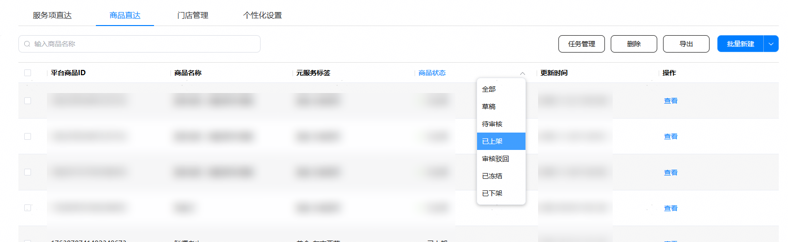
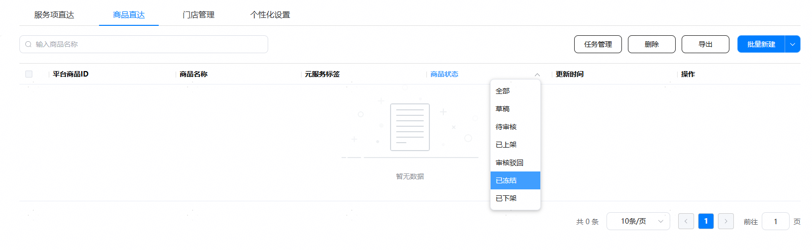
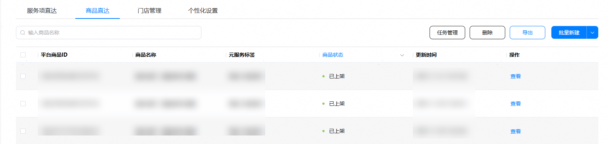
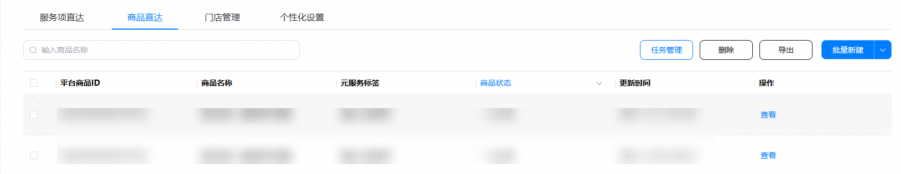
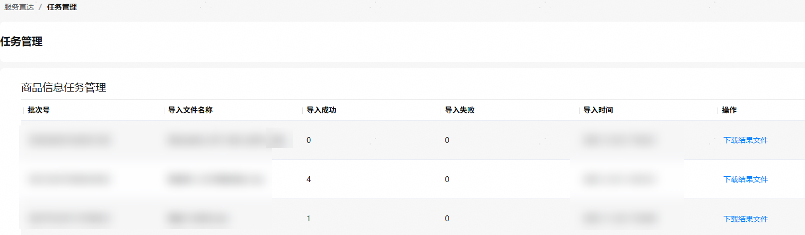
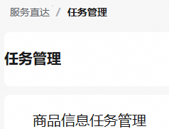
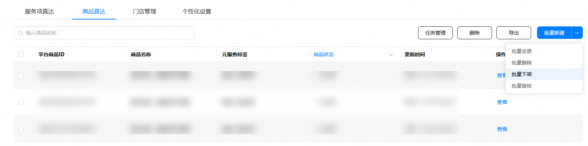
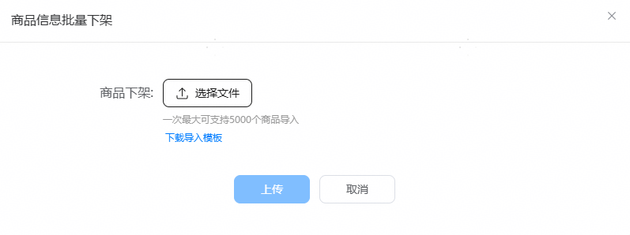

在商品状态为“已上架”或“已冻结”状态时，您可以通过“批量下架”操作完成商品下架。

1. 在服务直达主界面，选择“商品直达”页签，点击“商品状态”列筛选出“已上架”或“已冻结”状态的商品。

   

   
2. 点击“导出”。
   * 没有勾选项时，点击“导出”可导出全部商品。
   * 存在已勾选商品时，点击“导出”仅导出已勾选商品。

   
3. 导出完成后，点击“任务管理”，下载导出结果。

   

   
4. 编辑表格，仅保留需要下架的商品。

   

   下架场景中，“平台侧商品ID”列不可修改。
5. 点击“服务直达”,返回“商品直达”页签。

   
6. 点击“批量下架”，上传编辑后的表格文件，点击“上传”按钮。

   

   
