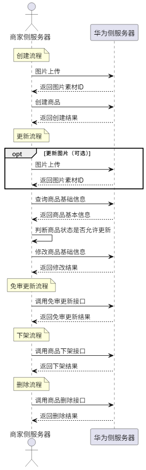

商家可通过开放接口对商品进行全生命周期管理，涵盖创建、更新、下架及删除等操作。所有商品变更均需经平台审核生效，确保合规与体验一致。接口调用流程如下：

## 场景介绍

* **创建图片**：上传商品主图素材，生成平台托管的图片资源URL，用于后续商品信息构建。
* **创建商品**：提交商品基本信息、价格库存、履约规则等内容，发起商品上架审核流程，待审核通过后进入可分发状态。
* **查询商品**：按商品ID查询单个商品详情，用于信息核对、前端展示或调试定位。
* **更新商品**：对已创建但未上架或已上架的商品进行信息变更，变更后会重新进入审核流程。
* **免审更新商品**：针对特定字段（如价格、售卖状态）支持无需审核的快速更新。
* **下架商品**：主动将已上架商品从公域流量中移除，停止对外曝光。
* **撤回商品审核**：在商品审核过程中，若发现信息有误或暂不上架，可主动撤回审核申请，转为草稿状态进行修改。
* **删除商品**：对长期无效或错误创建的商品执行删除操作，删除后商品不可恢复。
* **查询商品列表**：分页查询商家名下商品的ID列表，适用于后台管理、对账同步等批量场景。

## 商品状态说明

| 商品状态字段值 | 商品状态 | 说明 |
| --- | --- | --- |
| DRAFT | 草稿 | 当商家提交商品变更后主动撤回，商品状态变更为“草稿”。处于“草稿”状态的商品表示已提交的变更被取消，暂不进入审核流程。 |
| PENDING\_REVIEW | 待审核 | 商家提交商品信息后，若平台尚未完成审核，商品的状态变更为“待审核”。处于“待审核”状态的商品，仅允许查看商品详情。 |
| ACTIVE | 已上架 | 商家提交审核的商品，若平台审核通过，商品的状态变更为“已上架”。处于“已上架”的商品，商家可查看详情、更新和下架商品。 |
| REJECTED | 审核驳回 | 商家提交审核的商品，若平台审核不通过，商品的状态变更为“审核驳回”。处于“审核驳回”的商品，商家可查看详情、更新和申请复核。 |
| FROZEN | 已冻结 | 平台会周期性对已上架的商品进行巡检，如发现商品存在质量问题等，可能会导致商品被处罚并冻结，商品的状态将变更为“已冻结”。处于“已冻结”的商品，商家可以查看详情、申请复核。 |
| INACTIVE | 已下架 | 商家对“已上架”的商品发起下架申请后，商品状态变更为“已下架”。处于“已下架”的商品，商家可查看详情、删除商品，但是该商品不能被重复上架。 |
