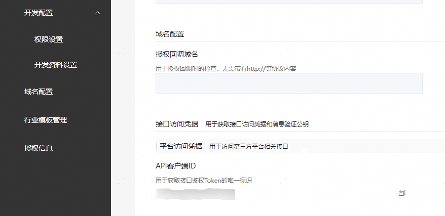

服务商代理商家元服务接入服务直达前，需先**[与商家建立授权关系](https://developer.huawei.com/consumer/cn/doc/SPPartnerCenter-develop-Guides/fa_sp_template-authorization-0000001606839553)**。授权权限集中须包含 “应用开发与发布管理” 或 “服务集成与开发” 权限之一，方可代理该商家进行元服务的接入与配置。

服务商代理接入服务直达的鉴权方式为API 客户端鉴权。

## 代调用流程

代调用华为开放服务的关键流程：

1. 服务商创建第三方平台时，在“权限集”列表页面，勾选代商家开发元服务的权限集“应用开发与发布管理” 或“服务集成与开发”。详情请参见[创建第三方平台](https://developer.huawei.com/consumer/cn/doc/SPPartnerCenter-develop-Guides/fa_sp_template-create-platform-0000001486409992#li87792335219)。
2. 商家在授权页面授权服务商“服务集成与开发”权限集。详情请参见[商家确认授权](https://developer.huawei.com/consumer/cn/doc/SPPartnerCenter-develop-Guides/fa_sp_template-merchant-confirm-0000001556200346#li10116153994813)。
3. 服务商获取[平台级Token](https://developer.huawei.com/consumer/cn/doc/FASP-by-Template-develop-References/get-token-0000001569170877)，获取生成的access\_token字段。
4. 服务商调用服务直达相关API。

服务商应用服务器调用服务直达API时，需将服务商client\_id和已获得的平台级认证Token（access\_token字段）放在Authorization头部来进行鉴权。

**服务商client\_id获取**



**鉴权Header字段说明**

| 参数 | 是否必选 | 参数类型 | 描述 |
| --- | --- | --- | --- |
| Authorization | 是 | String | 通过[接口访问凭证](/docs/dev/atomic-dev/instant-service-access-credentials/instant-service-access-credentials)获取的鉴权令牌。  Bearer后面拼接空格，再拼接获取的鉴权信息（access\_token）。 |
| client\_id | 否 | String | 服务商接入场景必传。  API客户端ID。  创建第三方平台成功后系统自动分配的客户端ID，可在第三方管理平台“开发管理资料 \&gt; 开发配置 \&gt; 开发资料设置”页面中获取，详情请参见[接口访问凭证](/docs/dev/atomic-dev/instant-service-access-credentials/instant-service-access-credentials)。 |
| appId | 是 | String(64) | 在创建应用后，由华为开发者联盟为应用分配的唯一标识。参数取值详见[查看应用基本信息](/docs/distribute/agc/agc-help-app-0000002235710234/agc-help-view-app-info-0000002282674569)中的应用-APP ID。 |

**请求示例**

```
GET https://connect-api.cloud.huawei.com/api/ability-platform-connect/hag-developer/v1/venues?venueId=1773242566167455872
Authorization: Bearer eyJr*****OiIx---****.eyJh*****iJodHR--***.QRod*****4Gp---****
Content-Type: application/json;charset=UTF-8
appId: 5981*****5845
client_id: 17355*****44*****67
```
