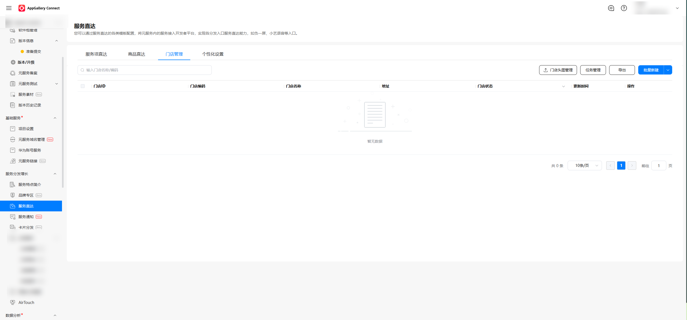
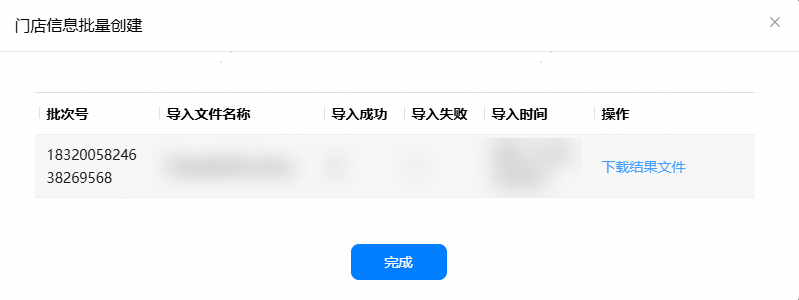
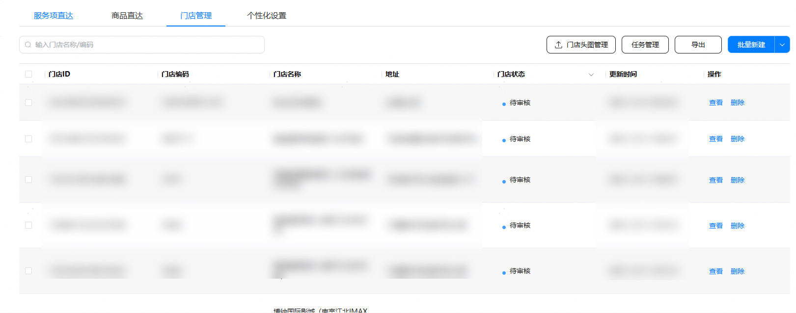

1. 在服务直达主界面，选择“门店管理”页签，点击“批量新建”。

   
2. 点击“下载导入模板”。

   开发者需按照导入模板要求填写信息。

   

   **表1** 门店基本信息

   | 字段 | 定义 | 是否必选 |
   | --- | --- | --- |
   | 门店名称 | 最长100个字符 | 是 |
   | 省市区信息 | 下拉选择，请不要直接输入 | 是 |
   | 详细地址 | 最长200个字符 | 是 |
   | 分类标签 | 取自[元服务分类标签](https://developer.huawei.com/consumer/cn/doc/app/ability-0000002032931302) | 是 |
   | 门店编码 | 商家填写，方便商家自管理，最多64个字符 | 否 |
   | 门店备注 | 对门店的备注信息，对用户不可见，最多32个字符 | 否 |
   | 品牌方 | 如果有品牌名则输入，最多32个字符 | 否 |
   | 客服电话 | 门店联系电话，遵循固定电话和移动电话长度即可。 | 是 |
   | 营业时间 | 门店营业时间。如果是线下门店，建议填写以增加推送的精准性。 | 否 |
   | 经度 | 采用GCJ02坐标系，填写经度信息。 | 是 |
   | 纬度 | 采用GCJ02 坐标系，填写纬度信息。 | 是 |
   | 关联商户号 | 选择一个已发布的元服务开通华为支付的商户号 | 否 |
   | 门店头图 | 1.门店或产品精美图url链接，需保障外部可访问。  2.上传规格为宽高比 1:1。  3.图片文件大小为200-500K。  4.图片像素宽高300-1000px。  5.文件格式：png、jpeg 、jpg 3种格式，推荐使用png格式，效果将更加沉浸。 | 否 |
   | 门店跳转链接 | 实际打开元服务对应门店页面的参数。会通过[openAtomicService API](https://developer.huawei.com/consumer/cn/doc/harmonyos-references/js-apis-inner-application-uiextensioncontext#openatomicservice12)跳转绑定的元服务。  链接格式为json字符串，内容为[want.parameters](https://developer.huawei.com/consumer/cn/doc/harmonyos-references/js-apis-app-ability-want)参数。  例如：  \&#123;"path":"page2","venueId":123\&#125; | 否 |
3. 点击“选择文件”。

   选择保存后的表格文件。点击“上传”。

   
4. 上传完成后，可在导入弹窗中稍等片刻，查看导入结果。

   此页面可查看导入成功数、导入失败数，并可点击“下载结果文件”下载以查询导入失败的原因。

   
5. 导入完成后，可在门店列表中查看门店状态。

   **表2** 门店状态说明

   | 门店状态 | 说明 |
   | --- | --- |
   | 录入成功 | 商家提交门店信息后，若平台审核通过，门店状态变更为“录入成功”。 |
   | 录入失败 | 商家提交门店信息后，若平台审核不通过，门店状态变更为“录入失败”。 |
   | 待审核 | 商家提交门店信息后，若平台尚未完成审核，门店状态变更为“待审核”。 |

   
