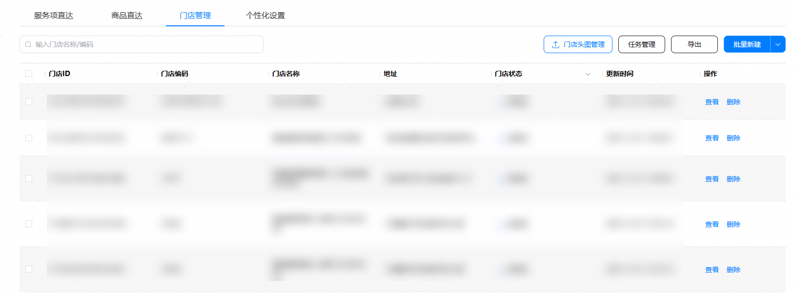
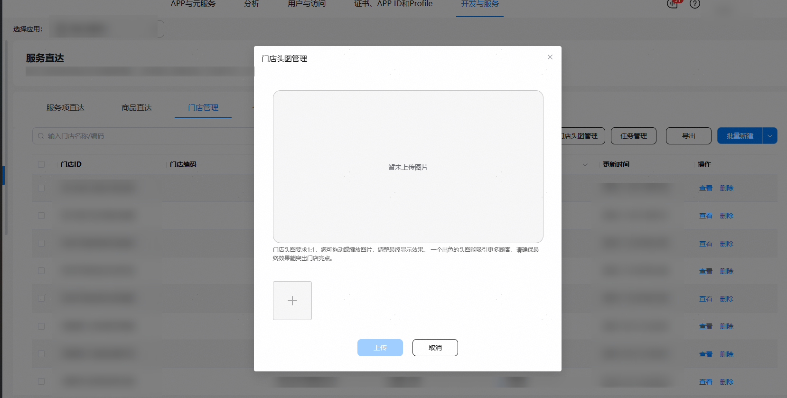
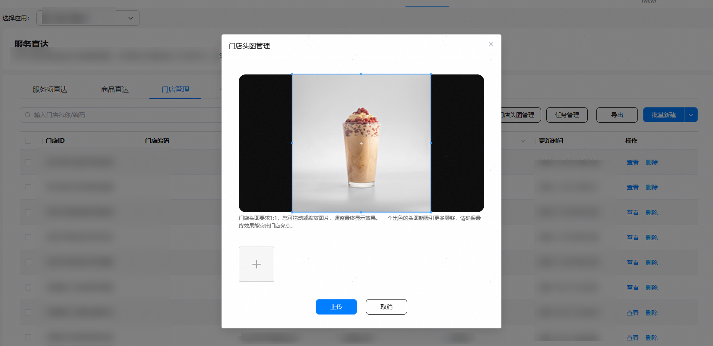
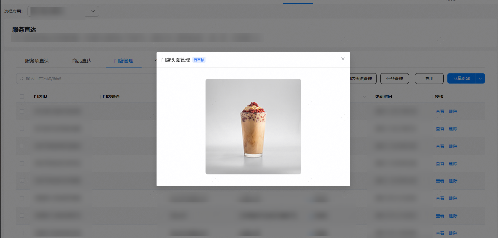
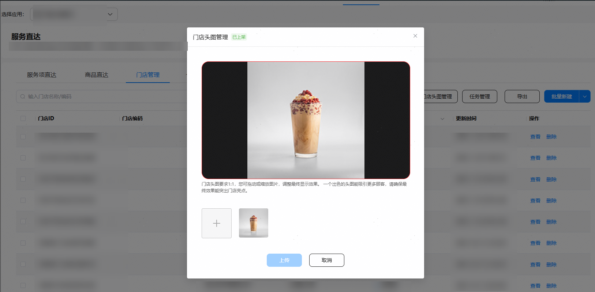

在HarmonyOS公域流量场，平台可基于用户地理位置，推荐最近的门店给用户，您需要在此配置及管理头图，用于卡片的推广。

1. 在服务直达主界面，选择 "门店管理" 页签，点击 "门店头图管理"。

   
2. 点击弹窗左下角，加号图标。

   
3. 选择门店头图，点击 "打开" ，可在上方大图预览，并可拖动拉伸，确定最终呈现效果；最后点击 "上传" 等待审核。

   
4. 上传完毕后，可再次点击 "门店头图管理" 查看图片状态。

   
5. 门店头图状态说明：

   | 门店头图状态 | 说明 |
   | --- | --- |
   | 待审核 | 商家上传门店头图后，若平台尚未完成审核，门店头图的状态变更为“待审核”。处于“待审核”状态的门店头图不能再次上传，需要平台完成审核以后，才能再次上传图片，平台再次审核，最后更新门店头图。 |
   | 审核驳回 | 商家上传的门店头图，若平台审核不通过，门店头图的状态变更为“审核驳回”。处于“审核驳回”状态的门店头图，商家可以再次上传图片，平台再次审核后更新门店头图。 |
   | 已冻结 | 平台会周期性对已上传的门店头图进行巡检，如发现门店头图存在问题，可能会导致门店头图被冻结，门店头图的状态将变更为“已冻结”。商家可以再次上传图片，更新门店头图，并需平台重新审核。 |
   | 已上架 | 商家提交审核的门店头图，若平台审核通过，门店头图的状态变更为“已上架”。处于“已上架”状态的门店头图，商家也可以再次上传图片，更新门店头图，并需平台重新审核。 |
6. 审核完毕后，可再次点击左下角加号图标，上传图片，进行门店头图更新，更新需平台再次审核。

   
