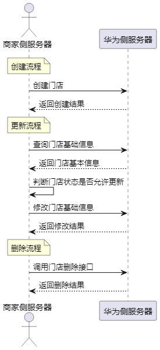

商家可通过开放接口对门店信息进行全生命周期管理，包括创建、更新和删除操作。所有变更均需经过平台审核。接口调用流程如下：

## 场景介绍

* **创建流程**

  商家通过“创建门店”接口，提交门店信息（如名称、商家门店编码、地址、经纬度、联系方式、营业时间等）。提交成功后，系统将自动生成门店记录并进入审核流程，状态标记为“审核中”。商家可通过“查询门店”接口获取当前门店状态。
* **更新流程**

  当门店信息发生变更（如名称更改、地址迁移、营业时间调整、联系方式更新等），商家可通过“更新门店”接口提交修改内容。每次更新提交后，系统将自动触发重新审核流程。审核通过后，更新内容正式生效；若审核不通过，商家可根据反馈原因修改后重新提交。
* **删除流程**

  商家可通过“删除门店”接口申请停用指定门店。提交删除请求后，系统将删除该门店信息。

## 门店状态说明

| 门店状态 | 门店状态 | 说明 |
| --- | --- | --- |
| ACTIVE | 录入成功 | 商家提交门店信息后，若平台审核通过，门店状态变更为“录入成功”。 |
| REJECTED | 录入失败 | 商家提交门店信息后，若平台审核不通过，门店状态变更为“录入失败”。 |
| PENDING\_REVIEW | 待审核 | 商家提交门店信息后，若平台尚未完成审核，门店状态变更为“待审核”。 |
