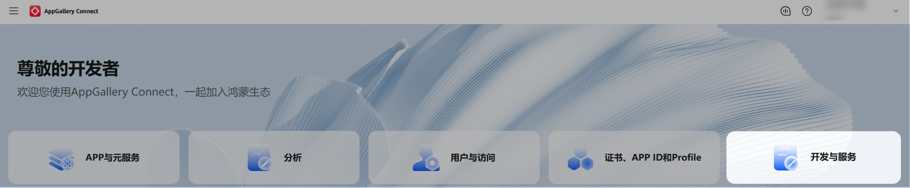
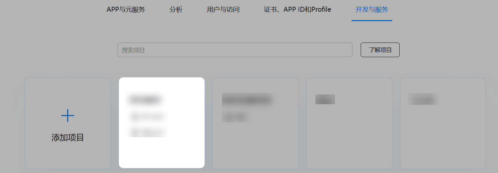
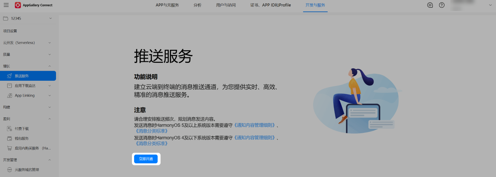

在阅读本章节前，请先参考“[元服务开发准备](/docs/dev/atomic-dev/atomic-service-development/atomic-dev-preparation)”完成基本准备工作，再继续进行以下开发活动。

从HarmonyOS NEXT Developer Beta2起，开发者无需配置公钥指纹和Client ID。

## 开通推送服务

推送服务权益为项目级，若您已有开通过推送服务的项目，当您在项目中添加新的元服务时，无需再次开通推送服务。

1. 登录[AppGallery Connect](https://developer.huawei.com/consumer/cn/service/josp/agc/index.html)网站，选择“开发与服务”。

   
2. 在项目列表中找到您的项目，在项目下的应用列表中选择需要配置推送服务参数的元服务。

   
3. 在左侧导航栏选择“增长 &gt; 推送服务”，点击“立即开通”，在弹出的提示框中点击“确定”。至此，您已开通推送服务。

   
