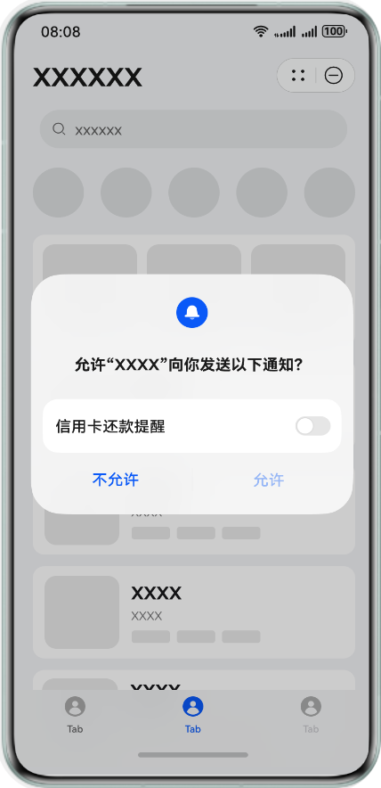

## 场景介绍

元服务领用服务通知模板后，主动向登录华为账号的用户发起订阅请求，Push Kit将向用户弹出授权弹窗。当用户在弹窗中选择后，Push Kit将返回用户的订阅选择给元服务，元服务根据用户的订阅结果处理消息下发逻辑。

## 频控规则

单设备单元服务下，发起订阅请求的次数不应大于每5分钟30次，若在5分钟内超过30次会进入频控状态，限制调用订阅接口。超过5分钟后频控重置。

## 弹窗效果

一次性订阅消息弹窗样式请参考如下示例：


一次性订阅消息弹窗中包含以下信息：

* 您的元服务名称，告知用户当前发起订阅的主体。
* 您想要发送的消息模板的名称，如上图中的“下单成功通知”、“待支付提醒”与“订单发货提醒”，详情见[选用订阅模板](/docs/dev/atomic-dev/push-as-subscription/push-as-service-noti#section880418143379)。
* 用户授权订阅按钮。

其中用户授权订阅按钮分为“允许”和“不允许”：

* 允许：代表用户允许订阅本次勾选的模板，当您成功发送模板对应的消息后，下次针对同样的模板发起消息订阅时仍弹出弹窗，请求用户授权。
* 不允许：代表用户不允许本次订阅，您无法向用户发送模板对应的消息，下次针对同样的模板发起消息订阅时仍弹出弹窗，请求用户授权。


当用户勾选“总是保持以上选择”之后，下次订阅调用 [serviceNotification.requestSubscribeNotification](https://developer.huawei.com/consumer/cn/doc/harmonyos-references/push-servicenotification#section11384539111610)()不会弹窗，保持之前的选择，修改选择需要打开元服务通知管理设置页进行修改。

长期订阅消息弹窗样式请参考如下示例：



长期订阅消息弹窗中包含以下信息：

* 您的元服务名称，告知用户当前发起订阅的主体。
* 您想要发送的消息模板的名称，如上图中的“信用卡还款提醒”，详情见[选用订阅模板](/docs/dev/atomic-dev/push-as-subscription/push-as-service-noti#section880418143379)。
* 用户授权订阅按钮。

其中用户授权订阅按钮分为“允许”和“不允许”：

* 允许：代表用户允许订阅本次勾选的模板，下次针对同样的模板发起消息订阅时不再弹出弹窗。
* 不允许：代表用户不允许订阅该模板，您本次及后续均无法向用户发送模板对应的消息，下次针对同样的模板发起消息订阅时不再弹出弹窗。

## 开发指导

1. 开始开发前，请先确保已完成[开发准备](/docs/dev/atomic-dev/atomic-push-development/push-as-prepare)中的配置，同时[开通服务通知并选用订阅模板](/docs/dev/atomic-dev/push-as-subscription/push-as-service-noti)。
2. 元服务调用[serviceNotification.requestSubscribeNotification](https://developer.huawei.com/consumer/cn/doc/harmonyos-references/push-servicenotification#section11384539111610)()方法发起消息订阅，示例如下：

   ```
   import { UIAbility } from '@kit.AbilityKit';
   import { BusinessError } from '@kit.BasicServicesKit';
   import { hilog } from '@kit.PerformanceAnalysisKit';
   import { window } from '@kit.ArkUI';
   import { serviceNotification } from '@kit.PushKit';

   export default class EntryAbility extends UIAbility {
     onWindowStageCreate(windowStage: window.WindowStage): void {
       hilog.info(0x0000, 'testTag', '%{public}s', 'Ability onWindowStageCreate');
       windowStage.loadContent('pages/Index', (err) => {
         if (err.code) {
           hilog.error(0x0000, 'testTag', 'Failed to load the page. Cause: %{public}s', JSON.stringify(err) ?? '');
           return;
         }
         hilog.info(0x0000, 'testTag', 'Succeeded in loading the content.');
       });
     }

     async requestSubscribeNotification() {
       try {
         // entityIds请替换为待订阅的模板ID
         let entityIds: string[] = ['13B6000E24008000', '13B90C82D3802680'];
         let type: serviceNotification.SubscribeNotificationType =
           serviceNotification.SubscribeNotificationType.SUBSCRIBE_WITH_HUAWEI_ID;
         const res: serviceNotification.RequestResult =
           await serviceNotification.requestSubscribeNotification(this.context, entityIds, type);
         hilog.info(0x0000, 'testTag', 'Succeeded in requesting serviceNotification: %{public}s',
           JSON.stringify(res.entityResult));
       } catch (err) {
         let e: BusinessError = err as BusinessError;
         hilog.error(0x0000, 'testTag', 'Failed to request serviceNotification: %{public}d %{public}s', e.code, e.message);
       }
     }

     async onForeground(): Promise<void> {
       hilog.info(0x0000, 'testTag', '%{public}s', 'Ability onForeground');
       try {
         // 请确保加载页面完成，可以获取UIAbilityContext后调用方法
         await this.requestSubscribeNotification();
       } catch (err) {
         let e: BusinessError = err as BusinessError;
         hilog.error(0x0000, 'testTag', 'Request subscribe notification failed: %{public}d %{public}s', e.code, e.message);
       }
     }
   }
   ```

   * entityIds：订阅模板的id，请使用在服务通知中领用的模板ID。单次可订阅模板最多不超过3个。

     

     + 一个订阅请求中不可以使用相同模板标题的模板ID。若一个订阅请求中包含多个相同模板标题的模板ID，订阅弹窗面板仅保留第一个模板ID，被过滤的模板ID订阅结果为FILTERED。
     + 一次性订阅消息模板ID和长期订阅消息模板ID不可同时使用。若一个订阅请求中同时使用一次性订阅消息和长期订阅消息的模板ID，订阅弹窗面板不会弹出。
   * type：订阅类型，元服务仅支持基于账号订阅，固定类型为SUBSCRIBE\_WITH\_HUAWEI\_ID。详情见[SubscribeNotificationType](https://developer.huawei.com/consumer/cn/doc/harmonyos-references/push-servicenotification#section3556183619491)。
   * res：订阅操作返回的结果。值包括'ACCEPTED'、'REJECTED'、'FILTERED'、'BANNED'、'UNKNOWN'。

     'ACCEPTED'表示用户同意订阅该条模板ID对应的通知模板。

     'REJECTED'表示用户拒绝订阅该条模板ID对应的通知模板。

     'FILTERED'表示该模板因为模板标题同名被后台过滤。

     'BANNED'表示模板已被后台封禁。

     详情见[RequestResult](https://developer.huawei.com/consumer/cn/doc/harmonyos-references/push-servicenotification#section185441313151716)。
3. 当用户同意订阅（[ResultCode](https://developer.huawei.com/consumer/cn/doc/harmonyos-references/push-servicenotification#section5698135841715)的值为0），元服务可基于账号推送消息，详情见[推送基于账号的订阅消息](/docs/dev/atomic-dev/push-as-subscription/push-as-send-sub-noti)。

## 示例代码

可参考[基于账号的服务通知订阅请求示例代码](https://gitee.com/harmonyos_samples/push-kit-sample-code-client-atomic-arkts)进行开发接入。
