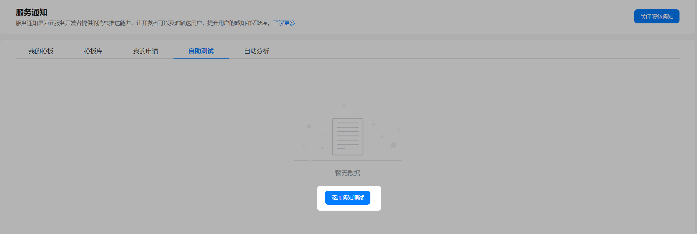
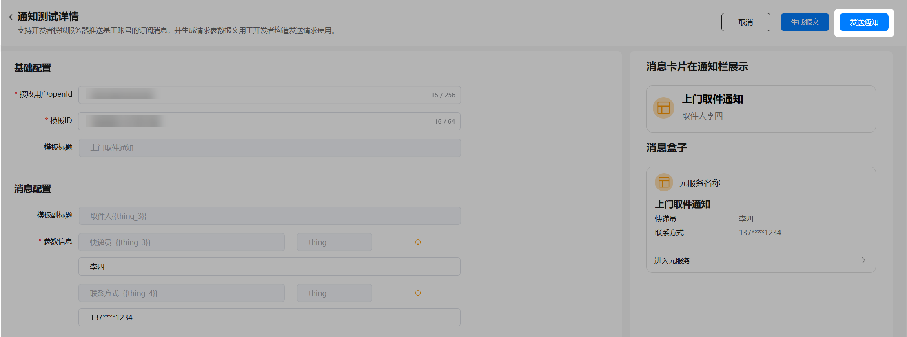
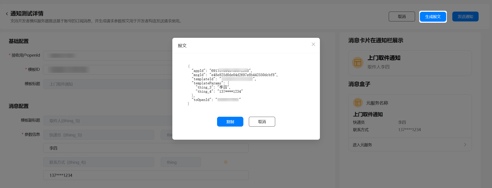
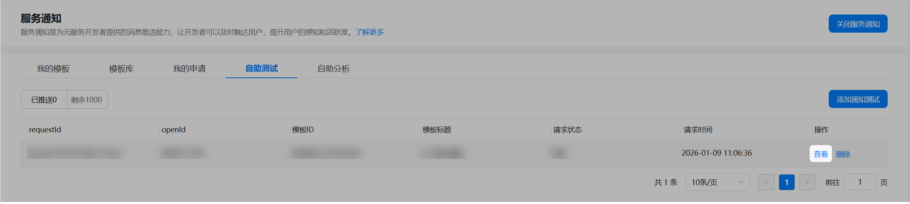
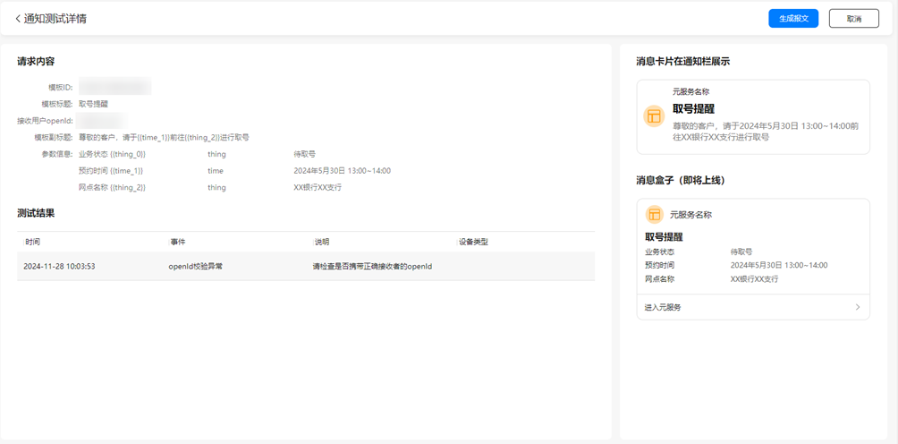
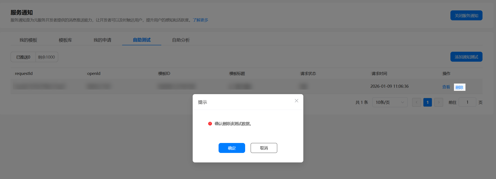
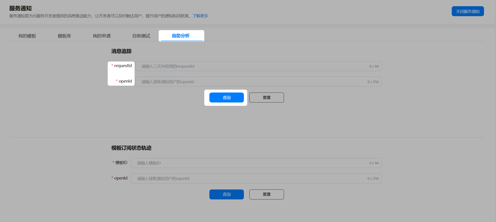
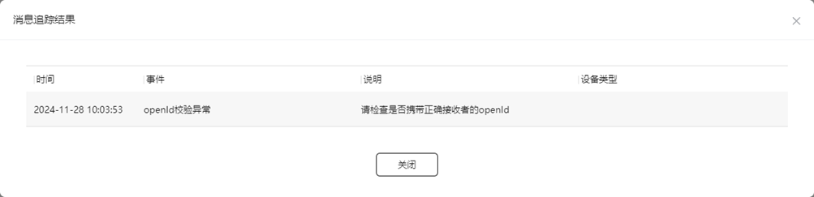
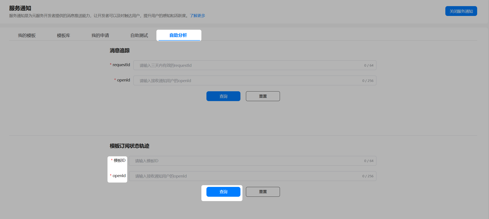
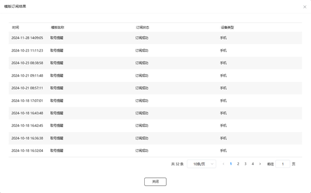

## 自助测试

自助测试支持开发者模拟服务器推送基于账号的订阅消息，并且生成请求参数报文用于开发者构造发送请求使用。

每个元服务每日至多可推送1000条测试通知，次日刷新可推送次数；包括元服务未上架前调用接口发送的通知以及在自助测试可视化界面发送成功的测试消息。

1. 登录AGC平台，点击"服务通知"菜单入口，进入“自助测试”页，点击“添加通知测试”按钮。

   
2. 进入通知测试详情页，输入正确的模板ID，即可查询对应模板消息配置区。填写完对应的信息，点击“发送通知”按钮，即可将消息下发至对应接收用户设备上。

   
3. 点击“生成报文”按钮，弹出报文内容弹窗，点击“复制”按钮，可全文复制。

   

   1. 基础配置
      * 接收用户openId：接收测试通知消息的用户的openId
      * 模板ID：成功选用模板对应的模板ID
      * 模板标题 ：选用模板对应的模板标题，自动关联模板ID显示
   2. 消息配置
      * 模板副标题：开发者在选用模板时配置的副标题
      * 参数信息：包括参数名，参数类型以及具体值，支持根据格式要求修改不同参数值
4. 点击“查看”按钮跳转至对应详情页，查看通知测试详情及测试结果。

   

   
5. 如不需要测试记录，可点击“删除”按钮，删除对应的测试记录。

   

## 自助分析

自助分析可帮助开发者追踪某通知消息推送情况以及通知模板的用户订阅情况。

### 消息追踪

登录AGC平台，点击"服务通知"菜单入口，进入“自助分析”页面。

输入三天内的有效requestId及正确的openId，点击“查询”按钮即可看到查询结果。

### 模板订阅状态轨迹

输入成功选用的模板ID和正确的openId，点击“查询“，即可看到指定模板在对应用户多个设备上的订阅状态。

