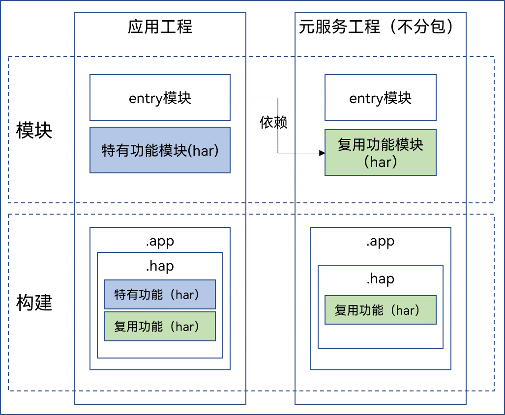
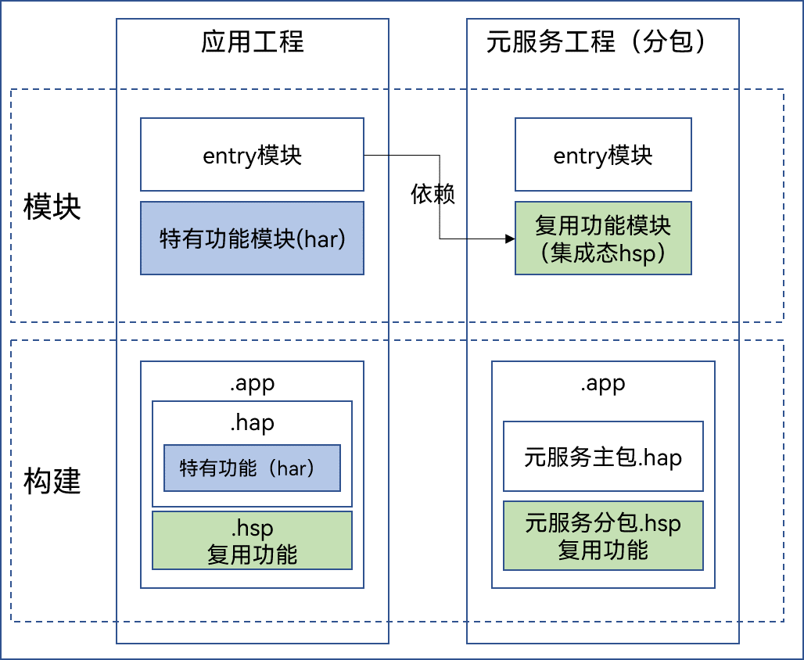
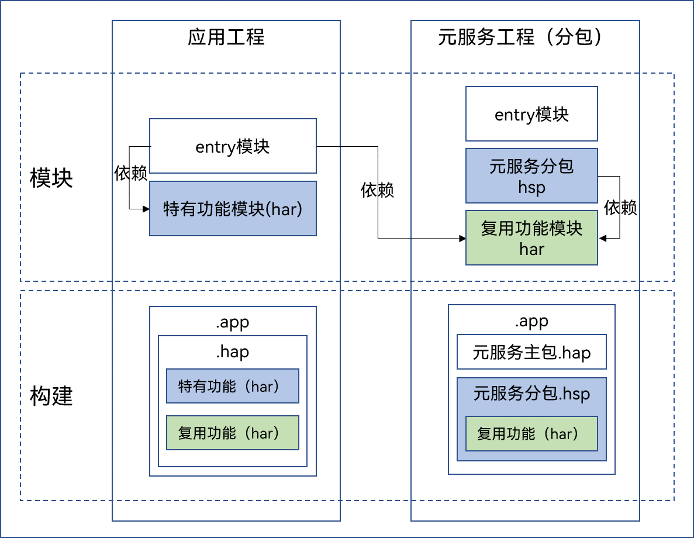
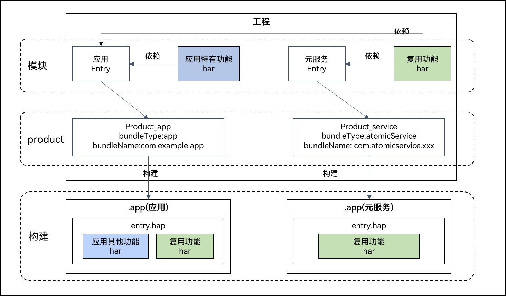
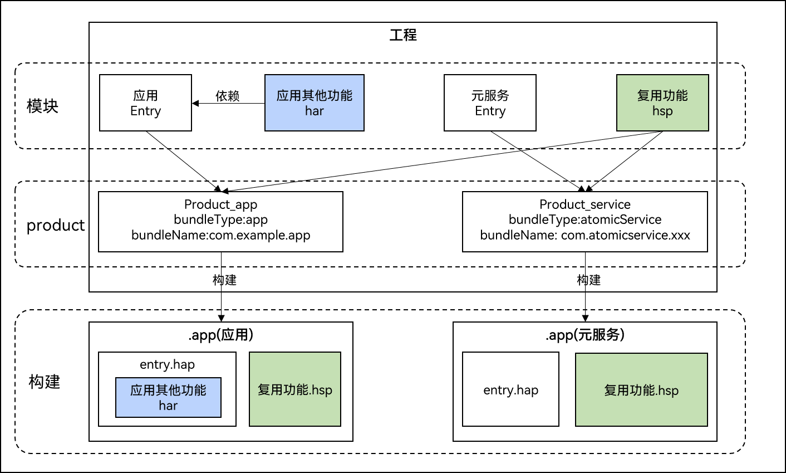
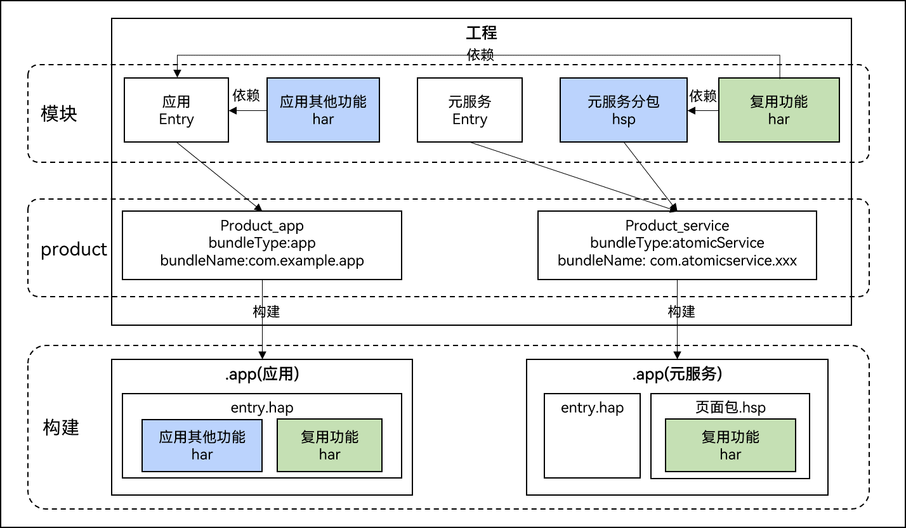

## 多团队开发场景

应用和元服务由不同的团队开发，建议应用和元服务通过不同的工程开发，并实现代码复用。

* [元服务不分包建议的代码复用方案](#section73071752202511)

* [元服务分包建议的代码复用方案](#section1869814422611)

### 元服务不分包

当元服务不分包时，建议开发者采用此方案复用代码。

通过[HAR](/docs/dev/app-dev/getting-started/dev-fundamentals/har-package)实现代码复用。在元服务工程中通过HAR实现需要复用的功能模块，应用工程通过依赖元服务提供的HAR复用元服务的代码，具体方案设计请参考下图：

### 元服务分包

元服务分包场景代码复用有两个方案，方案选择取决于应用是否支持按需加载，如果支持按需加载建议采用方案1；如果不支持按需加载建议采用方案2。

* **方案1：通过[集成态HSP](/docs/dev/app-dev/getting-started/dev-fundamentals/in-app-hsp)实现代码复用。**

  在元服务工程中通过集成态HSP实现可复用的功能模块，应用工程通过依赖集成态HSP复用元服务的代码，具体方案设计请参考下图：

  
* **方案2：通过[HAR](/docs/dev/app-dev/getting-started/dev-fundamentals/har-package)实现代码复用。**

  在元服务工程中通过HAR实现可复用的功能模块，应用工程通过依赖元服务提供的HAR复用元服务的代码，具体方案设计请参考下图：

  

## 单团队开发场景

应用和元服务由相同的团队开发，建议通过IDE提供的[多产物构建](https://developer.huawei.com/consumer/cn/doc/harmonyos-guides/ide-customized-multi-targets-and-products)的能力实现一个工程同时开发应用和元服务。

* [元服务不分包建议的代码复用方案](#section171185216275)

* [元服务分包建议的代码复用方案](#section7849124411280)

### 元服务不分包

当元服务不分包时，建议开发者采用此方案复用代码。

通过[HAR](/docs/dev/app-dev/getting-started/dev-fundamentals/har-package)实现代码复用。在工程中通过HAR实现需要复用的功能模块，应用和元服务依赖相同的HAR模块实现代码复用，具体方案设计请参考下图：

### 元服务分包

元服务分包场景代码复用有两个方案，方案选择取决于应用是否支持按需加载，如果支持按需加载建议采用方案1；如果不支持按需加载建议采用方案2。

* **方案1：通过[HSP](/docs/dev/app-dev/getting-started/dev-fundamentals/in-app-hsp)实现代码复用。**

  在工程中通过HSP实现可复用的功能模块，应用和元服务通过依赖相同的HSP实现代码复用，具体方案设计请参考下图：

  
* **方案2：通过[HAR](/docs/dev/app-dev/getting-started/dev-fundamentals/har-package)实现代码复用。**

  在工程中通过HAR实现可复用的功能模块，应用和元服务通过依赖相同的HAR实现代码复用，具体方案设计请参考下图：

  
