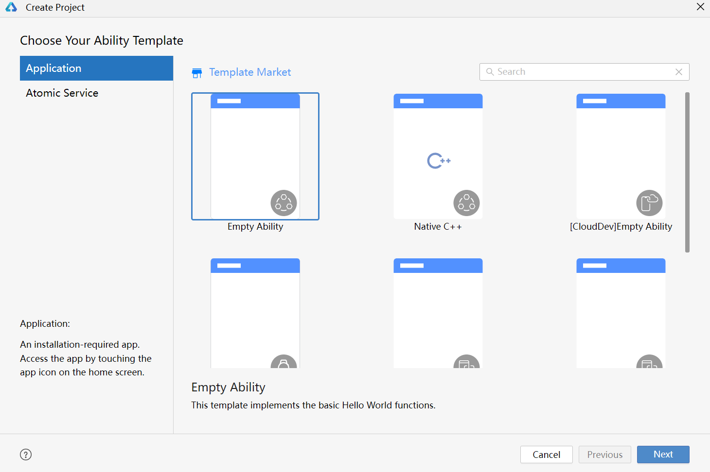
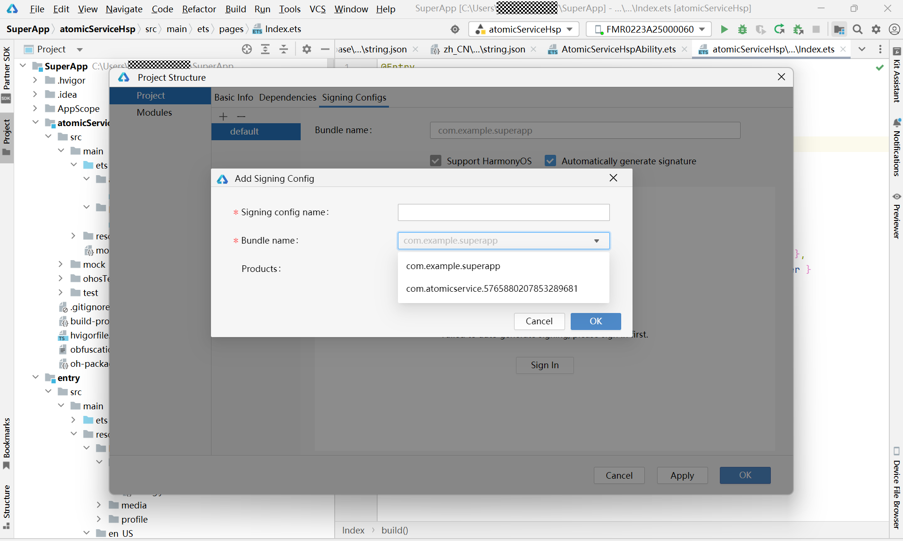
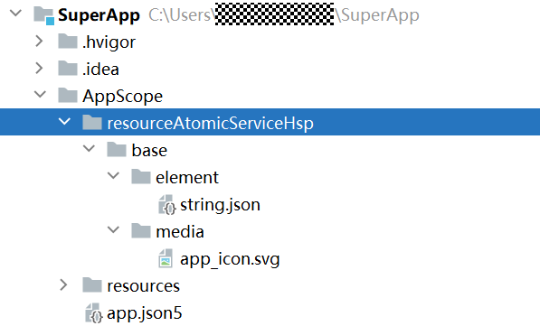
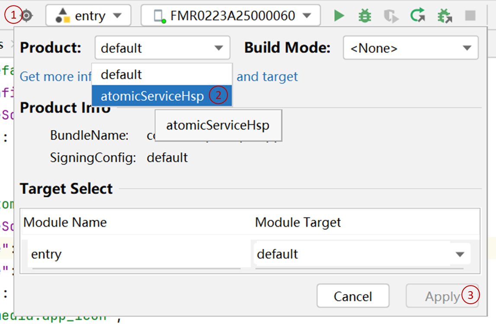
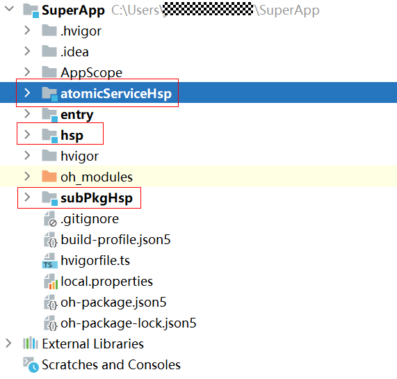
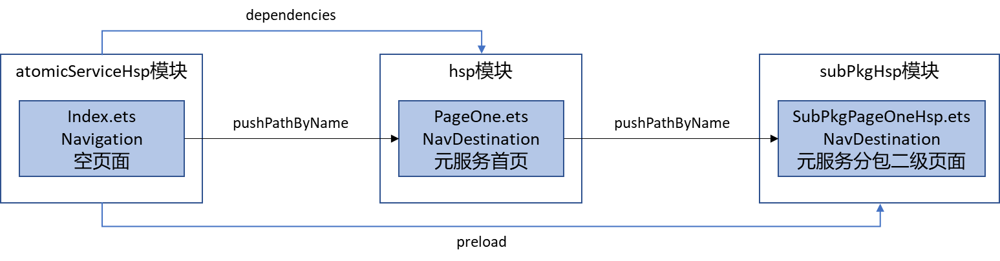

下面通过单团队、元服务分包和应用支持按需加载开发场景详细介绍一下开发态代码复用的开发流程：

1. 创建应用工程。

   

2. 在工程根目录的build-profile.json5文件中新增一个元服务的product。

   ```
   {
       "name": "atomicServiceHsp",
       "compatibleSdkVersion": "5.0.0(12)",
       "bundleName": "com.atomicservice.5765880207853289681",
       "bundleType": "atomicService",
       "runtimeOS": "HarmonyOS"
   }
   ```

   

   需要将元服务product的bundleName替换成开发者自己在AGC申请的元服务的bundleName。

3. 创建元服务product的签名文件。

   

4. 配置元服务product的签名文件。

   ```
   {
       "name": "atomicServiceHsp",
       "signingConfig": "atomicServiceHsp",
       "compatibleSdkVersion": "5.0.0(12)",
       "bundleName": "com.atomicservice.5765880207853289681",
       "bundleType": "atomicService",
       "runtimeOS": "HarmonyOS",
       "icon": "$media:app_icon"
   }
   ```

5. 在工程的AppScope目录右键新建元服务product的资源目录resourceAtomicServiceHsp，以及新增元服务product的label和icon对应的资源文件。

   

6. 在工程根目录的build-profile.json5文件中配置元服务product产物的资源目录、label、icon和version。

   ```
   {
       "name": "atomicServiceHsp",
       "signingConfig": "atomicServiceHsp",
       "compatibleSdkVersion": "5.0.0(12)",
       "bundleName": "com.atomicservice.5765880207853289681",
       "bundleType": "atomicService",
       "runtimeOS": "HarmonyOS",
       "icon": "$media:app_icon",
       "label": "$string:app_name",
       "versionCode": 1000000,
       "versionName": "1.0.0",
       "resource": {
         "directories": [
           "./AppScope/resourceAtomicServiceHsp"
         ]
       }
   }
   ```

7. 切换当前工程选择的product为元服务的product

   

8. 创建元服务的相关模块。

   atomicServiceHsp模块：entry类型模块，作为元服务的入口，模块包含UIAbility。

   hsp模块：shared类型模块，承载元服务首页的实现，并可以作为共享模块被应用复用。

   subPkgHsp模块：shared类型模块，承载元服务分包页面（元服务二级页面），并可以作为共享模块被应用复用。

   

9. 实现元服务的所有页面。

   在atomicServiceHsp模块中实现空页面：

   ```
   // src/main/ets/pages/Index.ets
   @Entry
   @Component
   struct Index {
     pageStack : NavPathStack = new NavPathStack();

     build() {
       Navigation(this.pageStack){
       }
       .hideNavBar(true)
     }
   }
   ```

   在hsp模块中实现元服务首页：

   ```
   // src/main/ets/components/PageOneHsp.ets
   @Builder
   export function PageOneHspBuilder() {
     PageOneHsp()
   }
   @Component
   struct PageOneHsp {
     pathStack: NavPathStack = new NavPathStack()
     build() {
       NavDestination() {
         Column() {
           Button('元服务hsp分包页面').margin({ top: 20 })
         }
       }
       .title('元服务hsp首页')
       .margin({ top: 100 })
       .onReady((context: NavDestinationContext) => {
         this.pathStack = context.pathStack
       })
     }
   }
   ```

   在hsp模块的resources/base/profile/router\_map.json配置[系统路由表](/docs/dev/app-dev/application-framework/arkui/arkts-ui-development/arkts-set-navigation-routing/arkts-navigation-navigation#系统路由表)信息：

   ```
   {
     "routerMap": [
       {
         "name": "PageOneHsp",
         "pageSourceFile": "src/main/ets/components/PageOneHsp.ets",
         "buildFunction": "PageOneHspBuilder",
         "data": {
           "description" : "this is PageOne"
         }
       }
     ]
   }
   ```

   在hsp模块的module.json5文件中配置系统路由表：

   ```
   {
     "module": {
       "name": "hsp",
       "type": "shared",
       "description": "$string:shared_desc",
       "routerMap": "$profile:route_map",
       "deviceTypes": [
         "phone",
         "tablet"
       ],
       "deliveryWithInstall": true,
     }
   }
   ```

   在subPkgHsp模块中实现元服务二级页面：

   ```
   // src/main/ets/components/SubPkgPageOneHsp.ets
   @Builder
   export function SubPkgPageOneHspBuilder() {
     SubPkgPageOneHsp()
   }
   @Component
   struct SubPkgPageOneHsp {
     pathStack: NavPathStack = new NavPathStack()
     build() {
       NavDestination() {
         Column(){
           Text('这是元服务hsp分包页面').margin({ top: 100 })
         }.width('100%').height('100%')
       }
       .title('元服务hsp分包页面')
       .margin({ top: 100 })
       .onReady((context: NavDestinationContext) => {
         this.pathStack = context.pathStack
       })
     }
   }
   ```

   在subPkgHsp模块的resources/base/profile/router\_map.json配置系统路由表信息：

   ```
   {
     "routerMap": [
       {
         "name": "SubPkgPageOneHsp",
         "pageSourceFile": "src/main/ets/components/SubPkgPageOneHsp.ets",
         "buildFunction": "SubPkgPageOneHspBuilder",
         "data": {
           "description" : "this is SubPkgPageOneHsp"
         }
       }
     ]
   }
   ```

   在subPkgHsp模块的module.json5文件中配置系统路由表：

   ```
   {
     "module": {
       "name": "subPkgHsp",
       "type": "shared",
       "description": "$string:shared_desc",
       "routerMap": "$profile:route_map",
       "deviceTypes": [
         "phone",
         "tablet"
       ],
       "deliveryWithInstall": true,
     }
   }
   ```

10. 配置元服务分包依赖关系和预加载关系，并实现跨模块页面路由。

    

    

    * atomicServiceHsp模块是首页空页面，首页的加载依赖hsp模块，所以需要在atomicServiceHsp模块的oh-package.json5页面中配置dependencies依赖关系，在分发阶段atomicServiceHsp模块构建的hap包和依赖的hsp模块构建的hsp包会同时下载安装。
    * [元服务分包](/docs/dev/atomic-dev/atomic-subpackage-loading/atomic-subpackage-loading)的目的是为了减小元服务包大小，并且subPkgHsp模块和其他模块不存在强依赖关系，所以subPkgHsp模块和其他两个模块之间不需要配置dependencies依赖关系，分发阶段subPkgHsp模块构建的hsp包可以单独下载安装。
    * 为了避免出现元服务首页首次路由到元服务分包页面会有1-2秒的分包加载等待时长问题，需要在atomicServiceHsp模块的module.json5文件中配置[预加载](/docs/dev/atomic-dev/atomic-subpackage-loading/atomic-preparing-for-loading)subPkgHsp模块。

    在atomicServiceHsp模块的oh-package.json5页面中配置依赖关系：

    ```
    {
      "name": "atomicservicehsp",
      "version": "1.0.0",
      "description": "Please describe the basic information.",
      "main": "",
      "author": "",
      "license": "",
      "dependencies": {
        "hsp": "file:../hsp"
      }
    }
    ```

    在atomicServiceHsp模块的Index.ets页面中增加自动路由到hsp模块的PageOneHsp.ets页面的逻辑代码：

    ```
    // src/main/ets/pages/Index.ets
    @Entry
    @Component
    struct Index {
      pageStack : NavPathStack = new NavPathStack();

      build() {
        Navigation(this.pageStack){
        }.onAppear(() => {
          this.pathStack.pushPathByName("PageOneHsp", null, false);
        })
        .hideNavBar(true)
      }
    }
    ```

    在hsp模块的PageOneHsp.ets页面，增加点击按钮路由到subPkgHsp模块的SubPkgPageOneHsp页面的逻辑代码：

    ```
    @Builder
    export function PageOneHspBuilder() {
      PageOneHsp()
    }
    @Component
    struct PageOneHsp {
      pathStack: NavPathStack = new NavPathStack()
      build() {
        NavDestination() {
          Column() {
            Button('元服务hsp分包页面').onClick(() => {
              this.pathStack.pushPathByName("SubPkgPageOneHsp", null, false);
            }).margin({ top: 20 })
          }
        }
        .title('元服务hsp首页')
        .margin({ top: 100 })
        .onReady((context: NavDestinationContext) => {
          this.pathStack = context.pathStack
        })
      }
    }
    ```

    在atomicServiceHsp模块的module.json5文件中配置预加载subPkgHsp模块：

    ```
    "atomicService": {
      "preloads": [
        {
          "moduleName": "subPkgHsp"
        }
      ]
    },
    ```

    到此为止，我们的元服务就已经完成开发了，下面我们看一下如何将元服务的代码复用到应用中。

11. 编辑工程根目录的build-profile.json5文件，将元服务hsp模块和subPkgHsp模块applyToProducts到应用的product（default），实现代码复用。

    ```
    {
        "name": "hsp",
        "srcPath": "./hsp",
        "targets": [
            {
                "name": "default",
                "applyToProducts": [
                    "default",
                    "atomicServiceHsp"
                ]
            }
        ]
    },
    {
        "name": "subPkgHsp",
        "srcPath": "./subPkgHsp",
        "targets": [
            {
                "name": "default",
                "applyToProducts": [
                    "default",
                    "atomicServiceHsp"
              ]
            }
        ]
    }
    ```

12. 在entry模块的Index.ets页面实现点击按钮跳转到元服务首页的功能：

    ```
    // Index.ets
    @Entry
    @Component
    struct Index {
      pageStack: NavPathStack = new NavPathStack();
      build() {
        Navigation(this.pageStack) {
          Column() {
            Button('应用通过hsp复用元服务代码').onClick(() => {
              this.pathStack.pushPathByName("PageOneHsp", null, false);
            })
              .margin({ top: 20 })
          }
        }
        .title('应用首页')
      }
    }
    ```

    这样就完成了应用和元服务开发态代码复用开发。
