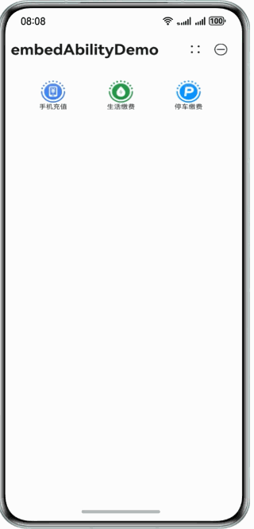
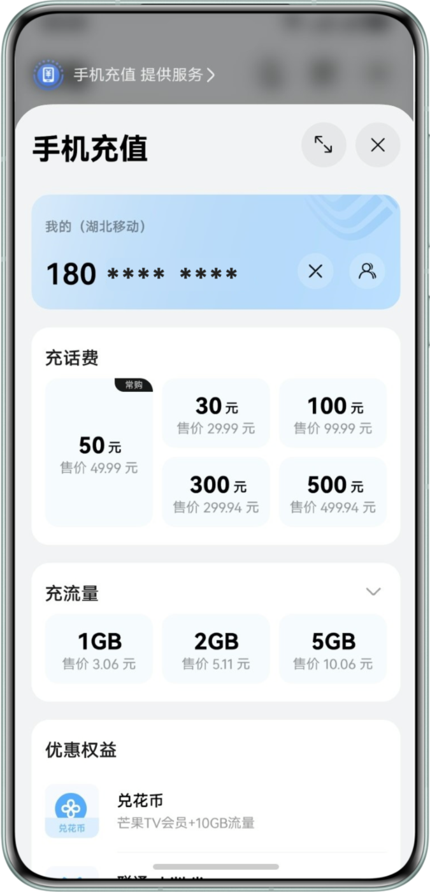
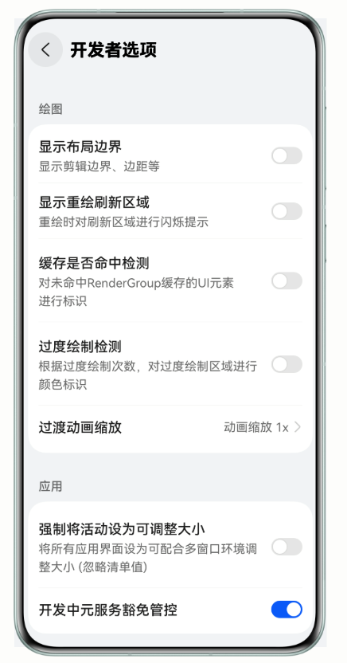

在用户实际使用应用的过程中，可能会遇到需要通过另外一个元服务承载服务的情况。考虑到跳转打开新的元服务对用户使用体验的影响，可以使用嵌入式拉起元服务的方式来实现这种效果。


应用/元服务嵌入式运行元服务的能力需与被嵌入方建立契约授权。目前处于Beta阶段，如需使用嵌入式能力，请通过邮件（atomicservice@huawei.com）与我们联系以获取授权。

| 嵌入效果 | 适用范围 | 使用组件 | 限制约束 |
| --- | --- | --- | --- |
| 全屏嵌入式 | 适用于需要完全沉浸式体验提供方元服务功能的场景。拉起时宿主应用功能暂时弱化，聚焦于提供方元服务操作。 | [FullScreenLaunchComponent](https://developer.huawei.com/consumer/cn/doc/harmonyos-guides/arkts-fullscreencomponent) | * 只有元服务支持被嵌入式运行，应用不允许被嵌入式运行。提供方未授权时，将跳出式运行元服务。 * 宿主应用支持全屏或半屏嵌入式运行元服务，宿主元服务仅能半屏嵌入式运行元服务。 * 宿主方支持嵌入式运行元服务的个数是受限的，一个宿主方最多嵌入式运行12个不同的元服务。  * 不支持嵌套运行嵌入式元服务，例如从A应用嵌入启动B元服务，再从B元服务嵌入启动C元服务，此时嵌入启动C元服务是不支持的。 |
| 半屏嵌入式 | 当需要在当前页面保留部分信息展示，同时让用户便捷使用提供方元服务功能时，可选用半屏组件。 | [HalfScreenLaunchComponent](https://developer.huawei.com/consumer/cn/doc/harmonyos-references/ohos-atomicservice-halfscreenlaunchcomponent#halfscreenlaunchcomponent-1) |

|  |  |  |  |  |  |
| --- | --- | --- | --- | --- | --- |
| **全屏嵌入式** | | **提供方** | | | |
| **ArkUI开发** | **H5****开发** | **ASCF****框架开发** | **ASCF框架开发 + H5****开发** |
| **宿主应用** | **ArkUI开发** | √ | √ | √ | √ |
| **H5开发** | 不推荐场景 | 不推荐场景 | 不推荐场景 | 不推荐场景 |

|  |  |  |  |  |  |
| --- | --- | --- | --- | --- | --- |
| **半屏嵌入式** | | **提供方 （需要提供方元服务适配半屏布局UI）** | | | |
| **ArkUI开发** | **H5****开发** | **ASCF****框架开发** | **ASCF框架开发 + H5****开发** |
| **宿主方**  **应用/元服务** | **ArkUI开发** | √ | √ | √ | √ |
| **H5开发** | 不推荐场景 | 不推荐场景 | 不推荐场景 | 不推荐场景 |
| **宿主方**  **元服务** | **ASCF****框架开发** | 已规划，后续提供能力 | 已规划，后续提供能力 | 已规划，后续提供能力 | 已规划，后续提供能力 |
| **ASCF框架开发 + H5****开发** | 不推荐场景 | 不推荐场景 | 不推荐场景 | 不推荐场景 |

|  |  |
| --- | --- |
| 全屏嵌入式 | 半屏嵌入式 |
|  |  |

嵌入式运行元服务和跳出式运行元服务的主要区别请参考下表：

| 跳转模式 | 体验对比 | 总结 |
| --- | --- | --- |
| 嵌入式运行元服务 | * 转场动效：应用内上下转场。 * 任务窗口：只能看到应用的任务窗口，看不到元服务的任务窗口。 * 元服务启动之前不需要用户弹框确认。 | 嵌入式运行元服务相比较跳出式运行元服务有更沉浸式、更友好的使用体验。 |
| 跳出式运行元服务 | * 转场动效：应用间左右转场动效。 * 任务窗口：同时看到应用和元服务的任务窗口。 * 元服务启动之前需要用户弹框确认。 |

## 宿主方应用/元服务开发指导

应用可通过全屏[FullScreenLaunchComponent](https://developer.huawei.com/consumer/cn/doc/harmonyos-references/ohos-arkui-advanced-fullscreenlaunchcomponent)组件实现嵌入式运行元服务。应用/元服务可通过半屏[HalfScreenLaunchComponent](https://developer.huawei.com/consumer/cn/doc/harmonyos-references/ohos-atomicservice-halfscreenlaunchcomponent#halfscreenlaunchcomponent-1)组件实现嵌入式运行元服务。

### 规格约束

* 开发者需要在应用的界面显示一个用户可见的入口组件，用户在应用的界面点击该入口才能触发嵌入式运行元服务，不支持通过API的方式触发嵌入式运行元服务。
* 真实用户使用场景，应用嵌入式运行元服务支持元服务免安装，无需元服务提前安装就可以嵌入式运行元服务。不支持调试阶段嵌入式运行触发元服务免安装。

### 接入指导

1. 通过[FullScreenLaunchComponent](https://developer.huawei.com/consumer/cn/doc/harmonyos-references/ohos-arkui-advanced-fullscreenlaunchcomponent)实现嵌入式运行元服务的示例代码。

   ```
   import { FullScreenLaunchComponent } from '@ohos.arkui.advanced.FullScreenLaunchComponent';
   import { common } from '@kit.AbilityKit';
   @Entry
   @Component
   struct Index {
     pageStack: NavPathStack = new NavPathStack();
     private context = this.getUIContext().getHostContext() as common.UIAbilityContext;
     appId = '5765880207854520769'
     build() {
       Navigation(this.pageStack) {
         Column() {
           FullScreenLaunchComponent({
             content: ColumChild,
             appId: this.appId,
             options: {}
           })
             .margin({ top: 20 })
           Button('跳出式运行元服务').onClick(() => {
             this.context.openAtomicService(this.appId)
           })
             .margin({ top: 20 })
         }
       }
       .title('可分可合应用')
     }
   }
   @Builder
   function ColumChild() {
     Column() {
       Button('嵌入式运行元服务')
     }
   }
   ```
2. 应用给嵌入式运行的元服务传递自定义参数。

   在应用的页面增加参数传递：

   ```
   FullScreenLaunchComponent({
     content: ColumChildHsp,
     appId: this.hspAppId,
     options: {
       parameters: {
         page: 'SubPkgPageOneHsp',
       }
     }
   })
     .margin({ top: 20 })
   ```

   在元服务的UIAbility的onCreate中通过want获取应用传给元服务的参数：

   ```
   export default class AtomicServiceHspAbility extends UIAbility {
     onCreate(want: Want, launchParam: AbilityConstant.LaunchParam): void {
       console.log(`onCreate, want parameters: ${want.parameters?.page}`);
     }
   }
   ```
3. 被拉起的嵌入式运行元服务通过调用[terminateSelfWithResult](https://developer.huawei.com/consumer/cn/doc/harmonyos-references/js-apis-inner-application-uiabilitycontext#terminateselfwithresult)返回结果给宿主应用。宿主应用通过[FullScreenLaunchComponent](https://developer.huawei.com/consumer/cn/doc/harmonyos-references/ohos-arkui-advanced-fullscreenlaunchcomponent)或者[HalfScreenLaunchComponent](https://developer.huawei.com/consumer/cn/doc/harmonyos-references/ohos-atomicservice-halfscreenlaunchcomponent#halfscreenlaunchcomponent-1)的onTerminated接收提供方元服务返回的数据。
4. 调试嵌入式运行元服务。

   嵌入式运行元服务能力默认是受限的，需要开发者申请权限，才能使用。如果开发者在申请权限之前开发调试阶段想临时开启权限，可以通过打开开发者选项中的“开发中元服务豁免管控”开关来获取调试嵌入式元服务的权限。

   

   

   开发者选项中的“开发中元服务豁免管控”开关具体放通规格说明：

   * 拉起方应用和被拉方元服务，至少有一方的签名必须是调试签名，才可以通过打开该开关放通权限管控。
   * 如果拉起方应用需要调试嵌入式运行的元服务已经上架发布，需要先在负一屏手动搜索并下载安装该元服务，再测试嵌入式运行该元服务，目前版本不支持调试阶段嵌入式运行触发元服务免安装。

## 提供方元服务开发指导

### 规格约束

* 开发者需要注意在实现被嵌入式运行时，提供方元服务存在一些API无法使用。
* 仅在API 20及以上版本，开发者无需对提供方元服务做状态栏避让适配。如果需要在API 20以下版本支持嵌入式运行元服务，请参考[状态栏避让适配](https://developer.huawei.com/consumer/cn/doc/harmonyos-releases/changelogs-ux-6001#ch2025050666880)。

* 在已嵌入式拉起元服务的状态下，不允许创建任何子窗口覆盖到提供方窗口上。
* 在已嵌入式拉起元服务的状态下，不允许宿主方应用切换提供方元服务UIAbility。

### 接入指导

判断元服务是否被嵌入式运行。

通过want的[wantConstant.Params.SHOW\_MODE\_KEY](https://developer.huawei.com/consumer/cn/doc/harmonyos-references/js-apis-app-ability-wantconstant)参数判断元服务是否为嵌入式运行，want.parameters[wantConstant.Params.SHOW\_MODE\_KEY]的值为[wantConstant.ShowMode.EMBEDDED\_FULL](https://developer.huawei.com/consumer/cn/doc/harmonyos-references/js-apis-app-ability-wantconstant#showmode12)表示元服务是被全屏嵌入式运行。

```
export default class AtomicServiceAbility extends UIAbility {
  onCreate(want: Want, launchParam: AbilityConstant.LaunchParam): void {
    hilog.info(0x0000, 'testTag', '%{public}s', 'Ability onCreate');
    if (want.parameters) {
      hilog.debug(0x0000, 'testTag', '%{public}s',
        'Ability onCreate:' + want.parameters[wantConstant.Params.SHOW_MODE_KEY])
    }
  }
}
```

### ArkUI能力约束

由于嵌入式拉起元服务组件实现了跨应用的能力共享，存在较开放的灵活性，因此为了保障元服务的提供服务的安全稳定，针对提供方元服务能够使用的属性，组件，接口，事件等有着范围限制。

**属性**

提供方元服务不支持通用属性。

**组件**

提供方元服务使用组件时，需要和宿主方的组件、应用进程上下文交互的场景，默认不支持。主要包括如下组件：

| 组件 | 是否支持 | 描述 | 原因 |
| --- | --- | --- | --- |
| [FullScreenLaunchComponent (全屏启动元服务组件)](https://developer.huawei.com/consumer/cn/doc/harmonyos-references/ohos-arkui-advanced-fullscreenlaunchcomponent) | 不支持 | 全屏启动元服务组件，当被拉起方授权使用方可以嵌入式运行元服务时，使用方全屏嵌入式运行元服务；未授权时，使用方跳出式拉起元服务。 | 由于是一种跨应用调度的能力，FullScreenLaunchComponent中暂不支持嵌套拉起。 |
| [EmbeddedComponent](https://developer.huawei.com/consumer/cn/doc/harmonyos-references/ts-container-embedded-component) | 不支持 | EmbeddedComponent用于支持在当前页面嵌入本应用内其他[EmbeddedUIExtensionAbility](https://developer.huawei.com/consumer/cn/doc/harmonyos-references/js-apis-app-ability-embeddeduiextensionability)提供的UI。EmbeddedUIExtensionAbility在独立进程中运行，完成页面布局和渲染。 | 由于是一种跨应用调度的能力，FullScreenLaunchComponent中暂不支持嵌套拉起。 |
| [FolderStack](https://developer.huawei.com/consumer/cn/doc/harmonyos-references/ts-container-folderstack) | 不支持 | 通常用于有Abc热更新诉求的模块化开发场景。FolderStack继承于Stack(层叠布局)控件，新增了折叠屏悬停能力，通过识别upperItems自动避让折叠屏折痕区后移到上半屏。 | 折叠屏划分组件能力，需要和宿主方窗口形成联动，从而需要在提供方内获取宿主主窗的信息，目前无法支持。 |
| [XComponent](https://developer.huawei.com/consumer/cn/doc/harmonyos-references/ts-basic-components-xcomponent) | 不支持 | 可用于EGL/OpenGLES和媒体数据写入，并显示在XComponent组件。 | - |
| [ContextMenu](https://developer.huawei.com/consumer/cn/doc/harmonyos-references/ts-methods-menu) | API 20及以上版本支持 | 在页面范围内关闭通过[bindContextMenu](https://developer.huawei.com/consumer/cn/doc/harmonyos-references/ts-universal-attributes-menu#bindcontextmenu12)属性绑定的菜单。 | - |
| [警告弹窗](https://developer.huawei.com/consumer/cn/doc/harmonyos-references/ts-methods-alert-dialog-box) | 部分支持 | 显示警告弹窗组件，可设置文本内容与响应回调。若在FullScreenLaunchComponent中设置showInSubWindow为true, 弹窗将基于FullScreenLaunchComponent的宿主窗口对齐。 | 需要依赖主窗的信息实现弹窗对齐，弹窗组件基于FullScreenLaunchComponent提供的信息获取宿主应用的窗口信息实现了对齐应用窗口的能力。仅限于窗口对齐。 |
| [列表选择弹窗](https://developer.huawei.com/consumer/cn/doc/harmonyos-references/ts-methods-action-sheet) | 部分支持 | 列表弹窗。若在FullScreenLaunchComponent中设置showInSubWindow为true, 弹窗将基于FullScreenLaunchComponent的宿主窗口对齐。 | 需要依赖主窗的信息实现弹窗对齐，弹窗组件基于FullScreenLaunchComponent提供的信息获取宿主应用的窗口信息实现了对齐应用窗口的能力。仅限于窗口对齐。 |
| [自定义弹窗](https://developer.huawei.com/consumer/cn/doc/harmonyos-references/ts-methods-custom-dialog-box) | 部分支持 | 通过CustomDialogController类显示自定义弹窗。使用弹窗组件时，可优先考虑自定义弹窗，便于自定义弹窗的样式与内容。若在FullScreenLaunchComponent中设置showInSubWindow为true, 弹窗将基于FullScreenLaunchComponent的宿主窗口对齐。 | 需要依赖主窗的信息实现弹窗对齐，弹窗组件基于FullScreenLaunchComponent提供的信息获取宿主应用的窗口信息实现了对齐应用窗口的能力。仅限于窗口对齐。 |
| [Navigation](https://developer.huawei.com/consumer/cn/doc/harmonyos-references/ts-basic-components-navigation) | 部分支持 | 该组件从API Version 11开始默认支持安全区避让特性(默认值为：expandSafeArea([SafeAreaType.SYSTEM], [SafeAreaEdge.TOP, SafeAreaEdge.BOTTOM]))，开发者可以重写该属性覆盖默认行为。 | 1. 如果FullScreenLaunchComponent未设置模态或沉浸式，Navigation无法扩展到安全区。 2. 无法路由到宿主方的页面中。 |

**接口**

ArkTS API接口提供能力，在嵌入式拉起元服务场景下也需要考虑提供方元服务是否具备跨出当前组件的能力，以及和宿主方组件、应用进程上下文交互的场景。主要包括如下接口模块：

| 接口 | 是否支持 | 描述 | 原因 |
| --- | --- | --- | --- |
| [页面间转场](https://developer.huawei.com/consumer/cn/doc/harmonyos-references/ts-page-transition-animation) | 不支持 | 当路由进行切换时，可以通过在pageTransition函数中自定义页面入场和页面退场的转场动效。 | - |
| [组件内隐式共享元素转场](https://developer.huawei.com/consumer/cn/doc/harmonyos-references/ts-transition-animation-geometrytransition) | 不支持 | 在视图切换过程中提供丝滑的上下文传承过渡。通用transition机制提供了opacity、scale等转场效果，geometryTransition通过安排绑定的in/out组件(in指新视图、out指旧视图)的frame、position使得原本独立的transition动画在空间位置上发生联系，将视觉焦点由旧视图位置引导到新视图位置。 | - |
| [componentUtils](https://developer.huawei.com/consumer/cn/doc/harmonyos-references/js-apis-arkui-componentutils) | 不支持 | 提供获取组件绘制区域坐标和大小的能力。 | 获取信息来自于窗口，默认情况下直接获取到的位置信息是EmbeddableUIAbility的WindowProxy的信息，非宿主应用的主窗口信息。 |
| [UIContext](https://developer.huawei.com/consumer/cn/doc/harmonyos-references/js-apis-arkui-uicontext) | 不支持 | @ohos.window在API version 10 新增[getUIContext](https://developer.huawei.com/consumer/cn/doc/harmonyos-references/arkts-apis-window-window#getuicontext10)接口，获取UI上下文实例UIContext对象，使用UIContext对象提供的替代方法，可以直接作用在对应的UI实例上。 | 基于window获取，但FullScreenLaunchComponent内部默认方式下，提供方无真正的窗口承载，无法使用该接口获取到正确的UIContext。 |
| [DragController](https://developer.huawei.com/consumer/cn/doc/harmonyos-references/js-apis-arkui-dragcontroller) | 不支持 | 本模块提供发起主动拖拽的能力，当应用接收到触摸或长按等事件时可以主动发起拖拽的动作，并在其中携带拖拽信息。  本模块功能依赖UI的执行上下文，不可在[UI上下文不明确](https://developer.huawei.com/consumer/cn/doc/harmonyos-guides/arkts-global-interface)的地方使用，参见UIContext说明。 | 拖拽时通过UIContext上下文传递组件间的事件传递，使用方应用和提供方应用不共享UIContext内容，默认能力下无法支持拖拽事件的传递。 |
| [布局回调](https://developer.huawei.com/consumer/cn/doc/harmonyos-references/js-apis-arkui-inspector) | 部分支持 | 提供注册组件布局和绘制完成回调通知的能力。 | 如果指定FullScreenLaunchComponent组件，预期是获得所有FullScreenLaunchComponent中的组件信息，尚未支持该能力；提供方内部可以正常使用。 |
| [注册自定义字体](https://developer.huawei.com/consumer/cn/doc/harmonyos-references/js-apis-font) | 不支持 | 本模块提供注册自定义字体。 | 注册字体存在影响范围的问题，提供方侧无法影响使用方应用的字体。 |
| [PluginComponentManager](https://developer.huawei.com/consumer/cn/doc/harmonyos-references/js-apis-plugincomponent) | 不支持 | 用于给插件组件的使用者请求组件与数据，使用者发送组件模板和数据。 | 依赖获取其他组件的数据，提供方组件在另一个进程中，无法提供访问宿主组件的能力。 |

**事件**

FullScreenLaunchComponent/HalfScreenLaunchComponent不支持通用事件，会将事件经过坐标转换后传递给提供方EmbeddableUIAbility处理。

对事件传递处理方式进行区分，针对不同事件使用场景确定同步或异步方式：

* 宿主进程与提供方进程的交互默认均是异步处理：优先考虑从默认机制上避免性能（影响整体交互体验）和死锁问题。
* 同步事件处理原则：能够支持同步的事件，触发频率较低，性能影响较小；尽量满足应用实际场景。

开发者使用嵌入式拉起元服务能力时，需要遵守如下设计场景约束：

异步处理的事件场景：FullScreenLaunchComponent/HalfScreenLaunchComponent组件以及宿主应用侧组件可以同时收到事件。需要应用开发者结合应用场景进行处理，如宿主应用侧组件不做事件处理。如果无法避免，建议替换FullScreenLaunchComponent组件来保障交互体验。

| 分类 | 事件 | 是否支持 | 调用方式 | 是否支持超时等待 |
| --- | --- | --- | --- | --- |
| 通用事件 | 点击事件（Click） | 支持 | 异步 | - |
| 通用事件 | 触摸事件（Touch） | 支持 | 异步 | - |
| 通用事件 | 拖拽事件（onDragXXX） | 支持 | 异步 | - |
| 通用事件 | 按键事件（KeyEvent） | 支持 | 同步 | 支持超时等待机制，超时后会结束等待，对上层来说相当于事件未处理。 |
| 通用事件 | 焦点事件（onFocus/onBlur） | 支持 | 同步 | 支持超时等待机制，超时后会结束等待，对上层来说相当于事件未处理。 |
| 通用事件 | 鼠标事件（onHover/onMouse） | 支持 | 异步 | - |
| 手势处理 | - | 支持 | 异步 | - |
| 无障碍 | - | 支持 | 同步 | 支持超时等待机制，超时后会结束等待，对上层来说相当于事件未处理。 |

## 其他Window窗口、元能力和多媒体等能力约束

### API 20及以上版本

在API 20及以上版本时，被嵌入式的元服务无法使用的API列表如下：

| Kit分类 | API声明 | 接口功能 |
| --- | --- | --- |
| AbilityKit | backToCallerAbilityWithResult(abilityResult: AbilityResult, requestCode: string): Promise\&lt;void\&gt; | 当通过startAbilityForResult或openLink拉起目标方UIAbility，且需要目标方返回结果时，目标方可以通过该接口将结果返回并拉起调用方。与terminateSelfWithResult不同的是，本接口在返回时不会销毁当前UIAbility。使用Promise异步回调。 |
| AbilityKit | setMissionContinueState(state: AbilityConstant.ContinueState, callback: AsyncCallback\&lt;void\&gt;): void | 设置UIAbility任务的流转状态。使用callback异步回调。 |
| AbilityKit | setMissionContinueState(state: AbilityConstant.ContinueState): Promise\&lt;void\&gt; | 设置UIAbility任务的流转状态。使用Promise异步回调。 |
| AbilityKit | restoreWindowStage(localStorage: LocalStorage): void | 恢复UIAbility中的WindowStage数据。仅支持在主线程调用。 |
| AbilityKit | moveAbilityToBackground(): Promise\&lt;void\&gt; | 将处于前台的UIAbility移动到后台。使用Promise异步回调。仅支持在主线程调用。 |
| AbilityKit | setRestoreEnabled(enabled: boolean): void | 设置UIAbility是否启用备份恢复。 |
| Media Library Kit | PhotoPickerComponent(&#123;  pickerOptions?: PickerOptions,  onSelect?: (uri: string) =\&gt; void,  onDeselect?: (uri: string) =\&gt; void,  onItemClicked?: (itemInfo: ItemInfo, clickType: ClickType) =\&gt; boolean,  onEnterPhotoBrowser?: (photoBrowserInfo: PhotoBrowserInfo) =\&gt; boolean,  onExitPhotoBrowser?: (photoBrowserInfo: PhotoBrowserInfo) =\&gt; boolean,  onPickerControllerReady?: () =\&gt; void,  onPhotoBrowserChanged?: (browserItemInfo: BaseItemInfo) =\&gt; boolean,  onSelectedItemsDeleted?: ItemsDeletedCallback,  onExceedMaxSelected?: ExceedMaxSelectedCallback,  onCurrentAlbumDeleted?: CurrentAlbumDeletedCallback,  pickerController: PickerController  &#125;) | 应用可以在布局中嵌入PhotoPicker组件，通过此组件，应用无需申请权限，即可访问公共目录中的图片或视频文件。仅包含读权限。应用嵌入组件后，用户可直接在PhotoPicker组件中选择图片或视频文件。 |
| Media Library Kit | AlbumPickerComponent(&#123;  albumPickerOptions?: AlbumPickerOptions,  onAlbumClick?: (albumInfo: AlbumInfo) =\&gt; boolean,  onEmptyAreaClick?: EmptyAreaClickCallback  &#125;) | 应用可以在布局中嵌入AlbumPickerComponent组件，通过此组件，应用无需申请权限，即可访问公共目录中的相册列表。需配合PhotoPickerComponent一起使用，用户通过AlbumPickerComponent组件选择对应相册并通知PhotoPickerComponent组件刷新成对应相册的图片和视频。 |
| Media Library Kit | RecentPhotoComponent(&#123;  recentPhotoOptions?: RecentPhotoOptions,  onRecentPhotoCheckResult?: RecentPhotoCheckResultCallback,  onRecentPhotoClick: RecentPhotoClickCallback,  onRecentPhotoCheckInfo?: RecentPhotoCheckInfoCallback,  &#125;) | 应用可以在布局中嵌入最近图片组件，通过此组件，应用无需申请权限，即可指定配置访问公共目录中最近的一个图片或视频文件。授予的权限仅包含只读权限。 |
| ArkUI-window | showWindow(callback: AsyncCallback\&lt;void\&gt;): void; | 显示当前窗口 |
| ArkUI-window | showWindow(): Promise\&lt;void\&gt;; | 显示当前窗口 |
| ArkUI-window | destroyWindow(callback: AsyncCallback\&lt;void\&gt;): void; | 销毁当前窗口 |
| ArkUI-window | destroyWindow(): Promise\&lt;void\&gt;; | 销毁当前窗口 |
| ArkUI-window | moveWindowTo(x: number, y: number): Promise\&lt;void\&gt;; | 移动窗口位置 |
| ArkUI-window | moveWindowTo(x: number, y: number, callback: AsyncCallback\&lt;void\&gt;): void; | 移动窗口位置 |
| ArkUI-window | moveWindowToAsync(x: number, y: number): Promise\&lt;void\&gt;; | 移动窗口位置 |
| ArkUI-window | moveWindowToAsync(x: number, y: number, moveConfiguration?: MoveConfiguration): Promise\&lt;void\&gt;; | 移动窗口位置 |
| ArkUI-window | moveWindowToGlobal(x: number, y: number): Promise\&lt;void\&gt;; | 移动窗口位置 |
| ArkUI-window | moveWindowToGlobal(x: number, y: number, moveConfiguration?: MoveConfiguration): Promise\&lt;void\&gt;; | 移动窗口位置 |
| ArkUI-window | resize(width: number, height: number): Promise\&lt;void\&gt;; | 窗口大小缩放 |
| ArkUI-window | resize(width: number, height: number, callback: AsyncCallback\&lt;void\&gt;): void; | 窗口大小缩放 |
| ArkUI-window | resizeAsync(width: number, height: number): Promise\&lt;void\&gt;; | 窗口大小缩放 |
| ArkUI-window | setFollowParentWindowLayoutEnabled(enabled: boolean): Promise\&lt;void\&gt;; | 子窗布局跟随父窗变化 |
| ArkUI-window | setSystemAvoidAreaEnabled(enabled: boolean): Promise\&lt;void\&gt;; | 开启窗口避让区获取能力 |
| ArkUI-window | isSystemAvoidAreaEnabled(): boolean; | 当前窗口是否可以获取避让区 |
| ArkUI-window | setPreferredOrientation(orientation: Orientation): Promise\&lt;void\&gt;; | 设置主窗口显示方向 |
| ArkUI-window | setPreferredOrientation(orientation: Orientation, callback: AsyncCallback\&lt;void\&gt;): void; | 设置主窗口显示方向 |
| ArkUI-window | getPreferredOrientation(): Orientation; | 获取主窗口显示方向属性 |
| ArkUI-window | on(type: 'windowVisibilityChange', callback: Callback\&lt;boolean\&gt;): void; | 监听窗口可见状态变化 |
| ArkUI-window | off(type: 'windowVisibilityChange', callback?: Callback\&lt;boolean\&gt;): void; | 取消监听窗口可见状态变化 |
| ArkUI-window | on(type: 'noInteractionDetected', timeout: number, callback: Callback\&lt;void\&gt;): void; | 监听窗口一段时间内没有事件交互 |
| ArkUI-window | off(type: 'noInteractionDetected', callback?: Callback\&lt;void\&gt;): void; | 取消监听窗口一段时间内没有事件交互 |
| ArkUI-window | on(type: 'dialogTargetTouch', callback: Callback\&lt;void\&gt;): void; | 开启模态窗所遮挡窗口的事件监听 |
| ArkUI-window | off(type: 'dialogTargetTouch', callback?: Callback\&lt;void\&gt;): void; | 关闭模态窗所遮挡窗口的事件监听 |
| ArkUI-window | on(type: 'windowEvent', callback: Callback\&lt;WindowEventType\&gt;): void; | 开启窗口生命周期变化监听 |
| ArkUI-window | off(type: 'windowEvent', callback?: Callback\&lt;WindowEventType\&gt;): void; | 关闭窗口声明周期变化监听 |
| ArkUI-window | on(type: 'windowStatusChange', callback: Callback\&lt;WindowStatusType\&gt;): void; | 开启窗口模式变化的监听 |
| ArkUI-window | off(type: 'windowStatusChange', callback?: Callback\&lt;WindowStatusType\&gt;): void; | 关闭窗口模式变化的监听 |
| ArkUI-window | on(type: 'subWindowClose', callback: Callback\&lt;void\&gt;): void; | 开启子窗口关闭事件的监听 |
| ArkUI-window | off(type: 'subWindowClose', callback?: Callback\&lt;void\&gt;): void; | 关闭子窗口关闭事件的监听 |
| ArkUI-window | on(type: 'windowWillClose', callback: Callback\&lt;void, Promise\&lt;boolean\\&gt;\&gt;): void; | 开启主窗口或子窗口关闭事件的监听 |
| ArkUI-window | off(type: 'windowWillClose', callback?: Callback\&lt;void, Promise\&lt;boolean\\&gt;\&gt;): void; | 关闭主窗口或子窗口关闭事件的监听 |
| ArkUI-window | on(type: 'windowHighlightChange', callback: Callback\&lt;boolean\&gt;): void; | 开启窗口激活态变化事件的监 |
| ArkUI-window | off(type: 'windowHighlightChange', callback?: Callback\&lt;boolean\&gt;): void; | 关闭窗口激活态变化事件的监 |
| ArkUI-window | setDialogBackGestureEnabled(enabled: boolean): Promise\&lt;void\&gt;; | 设置模态窗口是否响应手势返回事件 |
| ArkUI-window | isWindowSupportWideGamut(): Promise\&lt;boolean\&gt;; | 判断当前窗口是否支持广色域模式 |
| ArkUI-window | isWindowSupportWideGamut(callback: AsyncCallback\&lt;boolean\&gt;): void; | 判断当前窗口是否支持广色域模式 |
| ArkUI-window | setWindowBackgroundColor(color: string | ColorMetrics): void; | 设置窗口的背景色 |
| ArkUI-window | setWindowTopmost(isWindowTopmost: boolean): Promise\&lt;void\&gt;; | 设置主窗口层级置顶 |
| ArkUI-window | setWindowFocusable(isFocusable: boolean): Promise\&lt;void\&gt;; | 设置窗口在点击时获焦 |
| ArkUI-window | setWindowFocusable(isFocusable: boolean, callback: AsyncCallback\&lt;void\&gt;): void; | 设置窗口在点击时获焦 |
| ArkUI-window | setExclusivelyHighlighted(exclusivelyHighlighted: boolean): Promise\&lt;void\&gt;; | 设置窗口独占激活态属性 |
| ArkUI-window | isWindowHighlighted(): boolean; | 获取当前窗口是否为激活态 |
| ArkUI-window | setWindowTouchable(isTouchable: boolean): Promise\&lt;void\&gt;; | 设置窗口不可触摸 |
| ArkUI-window | setWindowTouchable(isTouchable: boolean, callback: AsyncCallback\&lt;void\&gt;): void; | 设置窗口不可触摸 |
| ArkUI-window | snapshot(callback: AsyncCallback\&lt;image.PixelMap\&gt;): void; | 获取窗口截图 |
| ArkUI-window | snapshot(): Promise\&lt;image.PixelMap\&gt;; | 获取窗口截图 |
| ArkUI-window | snapshotIgnorePrivacy(): Promise\&lt;image.PixelMap\&gt;; | 获取窗口截图 |
| ArkUI-window | setWindowShadowRadius(radius: number): void; | 设置子窗或悬浮窗窗口边缘阴影的模糊半径， |
| ArkUI-window | setWindowCornerRadius(cornerRadius: number): Promise\&lt;void\&gt;; | 设置子窗或悬浮窗的圆角半径值 |
| ArkUI-window | getWindowCornerRadius(): number; | 获取子窗或悬浮窗的圆角半径值 |
| ArkUI-window | setAspectRatio(ratio: number, callback: AsyncCallback\&lt;void\&gt;): void; | 设置窗口内容布局的比例 |
| ArkUI-window | setAspectRatio(ratio: number): Promise\&lt;void\&gt;; | 设置窗口内容布局的比例 |
| ArkUI-window | resetAspectRatio(callback: AsyncCallback\&lt;void\&gt;): void; | 取消设置窗口内容布局的比例 |
| ArkUI-window | resetAspectRatio(): Promise\&lt;void\&gt;; | 取消设置窗口内容布局的比例 |
| ArkUI-window | minimize(callback: AsyncCallback\&lt;void\&gt;): void; | 窗口最小化或隐藏 |
| ArkUI-window | minimize(): Promise\&lt;void\&gt;; | 窗口最小化或隐藏 |
| ArkUI-window | maximize(presentation?: MaximizePresentation): Promise\&lt;void\&gt;; | 窗口最大化 |
| ArkUI-window | setResizeByDragEnabled(enable: boolean, callback: AsyncCallback\&lt;void\&gt;): void; | 设置允许通过拖拽方式缩放窗口 |
| ArkUI-window | setResizeByDragEnabled(enable: boolean): Promise\&lt;void\&gt;; | 设置允许通过拖拽方式缩放窗口 |
| ArkUI-window | getWindowLimits(): WindowLimits; | 获取当前应用窗口的尺寸限制 |
| ArkUI-window | setWindowLimits(windowLimits: WindowLimits): Promise\&lt;WindowLimits\&gt;; | 设置当前应用窗口的尺寸限制 |
| ArkUI-window | setWindowLimits(windowLimits: WindowLimits, isForcible: boolean): Promise\&lt;WindowLimits\&gt;; | 设置当前应用窗口的尺寸限制 |
| ArkUI-window | keepKeyboardOnFocus(keepKeyboardFlag: boolean): void; | 窗口获焦时保留由其他窗口创建的软键盘 |
| ArkUI-window | recover(): Promise\&lt;void\&gt;; | 全屏窗口变为浮动窗口 |
| ArkUI-window | restore(): Promise\&lt;void\&gt;; | 最小化窗口恢复前台显示 |
| ArkUI-window | setWindowDecorVisible(isVisible: boolean): void; | 设置窗口标题栏是否可见 |
| ArkUI-window | getWindowDecorVisible(): boolean; | 查询窗口标题栏是否可见 |
| ArkUI-window | setWindowTitleMoveEnabled(enabled: boolean): void; | 设置窗口标题栏双击最大化和拖动窗口能力 |
| ArkUI-window | setWindowTitle(titleName: string): Promise\&lt;void\&gt;; | 设置窗口标题 |
| ArkUI-window | setSubWindowModal(isModal: boolean): Promise\&lt;void\&gt;; | 设置子窗的模态属性是否启用 |
| ArkUI-window | setSubWindowModal(isModal: boolean, modalityType: ModalityType): Promise\&lt;void\&gt;; | 设置子窗的模态属性是否启用 |
| ArkUI-window | setWindowDecorHeight(height: number): void; | 设置窗口的标题栏高度 |
| ArkUI-window | getWindowDecorHeight(): number; | 设置窗口的标题栏高度 |
| ArkUI-window | setDecorButtonStyle(dectorStyle: DecorButtonStyle): void; | 设置装饰栏按钮样式 |
| ArkUI-window | getDecorButtonStyle(): DecorButtonStyle; | 设置装饰栏按钮样式 |
| ArkUI-window | getTitleButtonRect(): TitleButtonRect; | 获取窗口标题栏三键的矩形区域 |
| ArkUI-window | setWindowTitleButtonVisible(isMaximizeButtonVisible: boolean, isMinimizeButtonVisible: boolean, isCloseButtonVisible?: boolean): void; | 设置窗口三键可见性 |
| ArkUI-window | enableLandscapeMultiWindow(): Promise\&lt;void\&gt;; | 设置窗口支持横向多窗布局 |
| ArkUI-window | startMoving(): Promise\&lt;void\&gt;; | 设置窗口跟随鼠标移动 |
| ArkUI-window | startMoving(offsetX: number, offsetY: number): Promise\&lt;void\&gt;; | 设置窗口跟随鼠标移动 |
| ArkUI-window | stopMoving(): Promise\&lt;void\&gt;; | 设置窗口跟随鼠标移动 |
| ArkUI-window | disableLandscapeMultiWindow(): Promise\&lt;void\&gt;; | 禁止窗口进入横向多窗模式 |
| ArkUI-window | on(type: 'windowTitleButtonRectChange', callback: Callback\&lt;TitleButtonRect\&gt;): void; | 设置窗口三键区域变化的监听 |
| ArkUI-window | off(type: 'windowTitleButtonRectChange', callback?: Callback\&lt;TitleButtonRect\&gt;): void; | 取消窗口三键区域变化的监听 |
| ArkUI-window | setWindowMask(windowMask: Array\&lt;Array\&lt;number\&gt;\&gt;): Promise\&lt;void\&gt;; | 设置窗口异形形状 |
| ArkUI-window | on(type: 'windowRectChange', callback: Callback\&lt;RectChangeOptions\&gt;): void; | 监听窗口布局变化 |
| ArkUI-window | off(type: 'windowRectChange', callback?: Callback\&lt;RectChangeOptions\&gt;): void; | 取消监听窗口布局变化 |
| ArkUI-window | on(type: 'rotationChange', callback: RotationChangeCallback\&lt;RotationChangeInfo, RotationChangeResult | void\&gt;): void; | 设置窗口旋转监听 |
| ArkUI-window | off(type: 'rotationChange', callback?: RotationChangeCallback\&lt;RotationChangeInfo, RotationChangeResult | void\&gt;): void; | 取消窗口旋转监听 |
| ArkUI-window | setWindowGrayScale(grayScale: number): Promise\&lt;void\&gt;; | 设置窗口灰阶 |
| ArkUI-window | getWindowStatus(): WindowStatusType; | 获取窗口模式 |
| ArkUI-window | setParentWindow(windowId: number): Promise\&lt;void\&gt;; | 更改子窗口的父窗口 |
| ArkUI-window | getParentWindow(): Window; | 获取子窗口的父窗口 |
| ArkUI-window | setFollowParentMultiScreenPolicy(enabled: boolean): Promise\&lt;void\&gt;; | 设置子窗口是否支持跨多个屏幕同时显示 |
| ArkUI-window | setTitleAndDockHoverShown(isTitleHoverShown?: boolean, isDockHoverShown?: boolean): Promise\&lt;void\&gt;; | 设置主窗口标题栏和dock栏是否显示 |
| ArkUI-window | setWindowDelayRaiseOnDrag(isEnabled: boolean): void; | 设置窗口是否使能延迟抬升 |
| ArkUI-window | setSubWindowZLevel(zLevel: number): Promise\&lt;void\&gt;; | 设置当前子窗口层级级别 |
| ArkUI-window | getSubWindowZLevel(): number; | 获取当前子窗口层级级别 |
| ArkUI-window | createSubWindow(name: string): Promise\&lt;Window\&gt;; | 创建该WindowStage实例下的子窗口 |
| ArkUI-window | createSubWindow(name: string, callback: AsyncCallback\&lt;Window\&gt;): void; | 创建该WindowStage实例下的子窗口 |
| ArkUI-window | getSubWindow(): Promise\&lt;Array\&lt;Window\&gt;\&gt;; | 获取该WindowStage实例下的所有子窗口 |
| ArkUI-window | getSubWindow(callback: AsyncCallback\&lt;Array\&lt;Window\&gt;\&gt;): void; | 获取该WindowStage实例下的所有子窗口 |
| ArkUI-window | on(eventType: 'windowStageClose', callback: Callback\&lt;void\&gt;): void; | 开启点击主窗三键区的关闭按钮监听事件 |
| ArkUI-window | off(eventType: 'windowStageClose', callback?: Callback\&lt;void\&gt;): void; | 关闭点击主窗三键区的关闭按钮监听事件 |
| ArkUI-window | setDefaultDensityEnabled(enabled: boolean): void; | 设置应用是否使用系统默认Density |
| ArkUI-window | setCustomDensity(density: number): void; | 设置自定义DPI |
| ArkUI-window | removeStartingWindow(): Promise\&lt;void\&gt;; | 控制应用启动页消失 |
| ArkUI-window | setWindowModal(isModal: boolean): Promise\&lt;void\&gt;; | 设置主窗的模态属性 |
| ArkUI-window | setWindowRectAutoSave(enabled: boolean): Promise\&lt;void\&gt;; | 设置是否启用最后关闭的主窗尺寸的记忆功 |
| ArkUI-window | setWindowRectAutoSave(enabled: boolean, isSaveBySpecifiedFlag: boolean): Promise\&lt;void\&gt;; | 设置是否启用最后关闭的主窗尺寸的记忆功 |
| ArkUI-window | isWindowRectAutoSave(): Promise\&lt;boolean\&gt;; | 判断当前主窗口是否已经启用尺寸记忆 |
| ArkUI-window | setSupportedWindowModes(supportedWindowModes: Array\&lt;bundleManager.SupportWindowMode\&gt;): Promise\&lt;void\&gt;; | 设置主窗的窗口支持模式 |
| ArkUI-window | getWindowDensityInfo(): WindowDensityInfo; | 获取窗口所在屏幕的DPI |
| ArkUI-window | setWindowSystemBarProperties(systemBarProperties: SystemBarProperties): Promise\&lt;void\&gt;; | 设置系统导航栏、状态栏是否显示 |
| ArkUI-window | getWindowSystemBarProperties(): SystemBarProperties; | 获取系统导航栏、状态栏的属性 |
| ArkUI-window | setStatusBarColor(color: ColorMetrics): Promise\&lt;void\&gt;; | 设置系统状态栏文字颜色 |
| ArkUI-window | on(type: 'touchOutside', callback: Callback\&lt;void\&gt;): void; | 开启窗口区域范围外的点击事件的监听 |
| ArkUI-window | off(type: 'touchOutside', callback?: Callback\&lt;void\&gt;): void; | 关闭窗口区域范围外的点击事件的监听 |

### API 19及以下版本

在API 20以下版本时，被嵌入式的元服务无法使用的API列表如下：

| Kit分类 | API声明 | 接口功能 |
| --- | --- | --- |
| AbilityKit | backToCallerAbilityWithResult(abilityResult: AbilityResult, requestCode: string): Promise\&lt;void\&gt; | 当通过startAbilityForResult或openLink拉起目标方UIAbility，且需要目标方返回结果时，目标方可以通过该接口将结果返回并拉起调用方。与terminateSelfWithResult不同的是，本接口在返回时不会销毁当前UIAbility。使用Promise异步回调。 |
| AbilityKit | setMissionLabel(label: string, callback: AsyncCallback\&lt;void\&gt;): void | 设置UIAbility在多任务界面中显示的名称。使用callback异步回调。 |
| AbilityKit | setMissionLabel(label: string): Promise\&lt;void\&gt; | 设置UIAbility在多任务界面中显示的名称。使用Promise异步回调。 |
| AbilityKit | setMissionContinueState(state: AbilityConstant.ContinueState, callback: AsyncCallback\&lt;void\&gt;): void | 设置UIAbility任务的流转状态。使用callback异步回调。 |
| AbilityKit | setMissionContinueState(state: AbilityConstant.ContinueState): Promise\&lt;void\&gt; | 设置UIAbility任务的流转状态。使用Promise异步回调。 |
| AbilityKit | restoreWindowStage(localStorage: LocalStorage): void | 恢复UIAbility中的WindowStage数据。仅支持在主线程调用。 |
| AbilityKit | isTerminating(): boolean | 查询UIAbility是否处于消亡中状态。 |
| AbilityKit | startAbilityByType(type: string, wantParam: Record\&lt;string, Object\&gt;,  abilityStartCallback: AbilityStartCallback, callback: AsyncCallback\&lt;void\&gt;) : void | 通过type隐式启动UIExtensionAbility。使用callback异步回调。仅支持在主线程调用，仅支持处于前台的应用调用。 |
| AbilityKit | startAbilityByType(type: string, wantParam: Record\&lt;string, Object\&gt;,  abilityStartCallback: AbilityStartCallback) : Promise\&lt;void\&gt; | 通过type隐式启动UIExtensionAbility。使用Promise异步回调。仅支持在主线程调用，仅支持处于前台的应用调用。 |
| AbilityKit | moveAbilityToBackground(): Promise\&lt;void\&gt; | 将处于前台的UIAbility移动到后台。使用Promise异步回调。仅支持在主线程调用。 |
| AbilityKit | setRestoreEnabled(enabled: boolean): void | 设置UIAbility是否启用备份恢复。 |
| AbilityKit | startUIServiceExtensionAbility(want: Want): Promise\&lt;void\&gt; | 启动一个UIServiceExtensionAbility。使用Promise异步回调。 |
| AbilityKit | connectUIServiceExtensionAbility(want: Want, callback: UIServiceExtensionConnectCallback) : Promise\&lt;UIServiceProxy\&gt; | 连接一个UIServiceExtensionAbility。使用Promise异步回调。 |
| AbilityKit | disconnectUIServiceExtensionAbility(proxy: UIServiceProxy): Promise\&lt;void\&gt; | 断开与UIServiceExtensionAbility的连接。使用Promise异步回调。 |
| AbilityKit | setColorMode(colorMode: ConfigurationConstant.ColorMode): void | 设置UIAbility的深浅色模式。调用该接口前需要保证该UIAbility对应页面已完成加载。仅支持主线程调用。 |
| Media Library Kit | PhotoPickerComponent(&#123;  pickerOptions?: PickerOptions,  onSelect?: (uri: string) =\&gt; void,  onDeselect?: (uri: string) =\&gt; void,  onItemClicked?: (itemInfo: ItemInfo, clickType: ClickType) =\&gt; boolean,  onEnterPhotoBrowser?: (photoBrowserInfo: PhotoBrowserInfo) =\&gt; boolean,  onExitPhotoBrowser?: (photoBrowserInfo: PhotoBrowserInfo) =\&gt; boolean,  onPickerControllerReady?: () =\&gt; void,  onPhotoBrowserChanged?: (browserItemInfo: BaseItemInfo) =\&gt; boolean,  onSelectedItemsDeleted?: ItemsDeletedCallback,  onExceedMaxSelected?: ExceedMaxSelectedCallback,  onCurrentAlbumDeleted?: CurrentAlbumDeletedCallback,  pickerController: PickerController  &#125;) | 应用可以在布局中嵌入PhotoPicker组件，通过此组件，应用无需申请权限，即可访问公共目录中的图片或视频文件。仅包含读权限。应用嵌入组件后，用户可直接在PhotoPicker组件中选择图片或视频文件。 |
| Media Library Kit | AlbumPickerComponent(&#123;  albumPickerOptions?: AlbumPickerOptions,  onAlbumClick?: (albumInfo: AlbumInfo) =\&gt; boolean,  onEmptyAreaClick?: EmptyAreaClickCallback  &#125;) | 应用可以在布局中嵌入AlbumPickerComponent组件，通过此组件，应用无需申请权限，即可访问公共目录中的相册列表。需配合PhotoPickerComponent一起使用，用户通过AlbumPickerComponent组件选择对应相册并通知PhotoPickerComponent组件刷新成对应相册的图片和视频。 |
| Media Library Kit | RecentPhotoComponent(&#123;  recentPhotoOptions?: RecentPhotoOptions,  onRecentPhotoCheckResult?: RecentPhotoCheckResultCallback,  onRecentPhotoClick: RecentPhotoClickCallback,  onRecentPhotoCheckInfo?: RecentPhotoCheckInfoCallback,  &#125;) | 应用可以在布局中嵌入最近图片组件，通过此组件，应用无需申请权限，即可指定配置访问公共目录中最近的一个图片或视频文件。授予的权限仅包含只读权限。 |
| ArkUI-window | showWindow(callback: AsyncCallback\&lt;void\&gt;): void; | 显示当前窗口 |
| ArkUI-window | showWindow(): Promise\&lt;void\&gt;; | 显示当前窗口 |
| ArkUI-window | destroyWindow(callback: AsyncCallback\&lt;void\&gt;): void; | 销毁当前窗口 |
| ArkUI-window | destroyWindow(): Promise\&lt;void\&gt;; | 销毁当前窗口 |
| ArkUI-window | moveWindowTo(x: number, y: number): Promise\&lt;void\&gt;; | 移动窗口位置 |
| ArkUI-window | moveWindowTo(x: number, y: number, callback: AsyncCallback\&lt;void\&gt;): void; | 移动窗口位置 |
| ArkUI-window | moveWindowToAsync(x: number, y: number): Promise\&lt;void\&gt;; | 移动窗口位置 |
| ArkUI-window | moveWindowToAsync(x: number, y: number, moveConfiguration?: MoveConfiguration): Promise\&lt;void\&gt;; | 移动窗口位置 |
| ArkUI-window | moveWindowToGlobal(x: number, y: number): Promise\&lt;void\&gt;; | 移动窗口位置 |
| ArkUI-window | moveWindowToGlobal(x: number, y: number, moveConfiguration?: MoveConfiguration): Promise\&lt;void\&gt;; | 移动窗口位置 |
| ArkUI-window | resize(width: number, height: number): Promise\&lt;void\&gt;; | 窗口大小缩放 |
| ArkUI-window | resize(width: number, height: number, callback: AsyncCallback\&lt;void\&gt;): void; | 窗口大小缩放 |
| ArkUI-window | resizeAsync(width: number, height: number): Promise\&lt;void\&gt;; | 窗口大小缩放 |
| ArkUI-window | setFollowParentWindowLayoutEnabled(enabled: boolean): Promise\&lt;void\&gt;; | 子窗布局跟随父窗变化 |
| ArkUI-window | getGlobalRect(): Rect; | 获取窗口的显示区域 |
| ArkUI-window | getWindowDensityInfo(): WindowDensityInfo; | 获取窗口所在屏幕的DPI |
| ArkUI-window | setSystemAvoidAreaEnabled(enabled: boolean): Promise\&lt;void\&gt;; | 开启窗口避让区获取能力 |
| ArkUI-window | isSystemAvoidAreaEnabled(): boolean; | 当前窗口是否可以获取避让区 |
| ArkUI-window | setWindowLayoutFullScreen(isLayoutFullScreen: boolean): Promise\&lt;void\&gt;; | 设置窗口沉浸式 |
| ArkUI-window | setWindowSystemBarEnable(names: Array\&lt;'status' | 'navigation'\&gt;): Promise\&lt;void\&gt;; | 设置系统导航栏、状态栏是否显示 |
| ArkUI-window | setSpecificSystemBarEnabled(name: SpecificSystemBar, enable: boolean, enableAnimation?: boolean): Promise\&lt;void\&gt;; | 设置系统导航栏、状态栏是否显示 |
| ArkUI-window | setWindowSystemBarProperties(systemBarProperties: SystemBarProperties): Promise\&lt;void\&gt;; | 设置系统导航栏、状态栏是否显示 |
| ArkUI-window | getWindowSystemBarProperties(): SystemBarProperties; | 获取系统导航栏、状态栏的属性 |
| ArkUI-window | setStatusBarColor(color: ColorMetrics): Promise\&lt;void\&gt;; | 设置系统状态栏文字颜色 |
| ArkUI-window | getStatusBarProperty(): StatusBarProperty; | 获取系统状态栏属性 |
| ArkUI-window | setGestureBackEnabled(enabled: boolean): Promise\&lt;void\&gt;; | 禁用返回手势功能 |
| ArkUI-window | isGestureBackEnabled(): boolean; | 获取当前窗口是否禁用返回手势 |
| ArkUI-window | setPreferredOrientation(orientation: Orientation): Promise\&lt;void\&gt;; | 设置主窗口显示方向 |
| ArkUI-window | setPreferredOrientation(orientation: Orientation, callback: AsyncCallback\&lt;void\&gt;): void; | 设置主窗口显示方向 |
| ArkUI-window | getPreferredOrientation(): Orientation; | 获取主窗口显示方向属性 |
| ArkUI-window | getUIContext() : UIContext; | 获取UIContext实例 |
| ArkUI-window | setUIContent(path: string, callback: AsyncCallback\&lt;void\&gt;): void; | 根据页面路径加载页面 |
| ArkUI-window | setUIContent(path: string): Promise\&lt;void\&gt;; | 根据页面路径加载页面 |
| ArkUI-window | off(type: 'keyboardHeightChange', callback?: Callback\&lt;number\&gt;): void; | 关闭固定态软键盘高度变化的监听 |
| ArkUI-window | on(type: 'keyboardDidShow', callback: Callback\&lt;KeyboardInfo\&gt;): void; | 开启固定态软键盘显示动画完成的监听。 |
| ArkUI-window | off(type: 'keyboardDidShow', callback?: Callback\&lt;KeyboardInfo\&gt;): void; | 关闭固定态软键盘显示动画完成的监听。 |
| ArkUI-window | on(type: 'keyboardDidHide', callback: Callback\&lt;KeyboardInfo\&gt;): void; | 开启固定态软键盘隐藏动画完成的监听。 |
| ArkUI-window | off(type: 'keyboardDidHide', callback?: Callback\&lt;KeyboardInfo\&gt;): void; | 关闭固定态软键盘隐藏动画完成的监听。 |
| ArkUI-window | on(type: 'touchOutside', callback: Callback\&lt;void\&gt;): void; | 开启窗口区域范围外的点击事件的监听 |
| ArkUI-window | off(type: 'touchOutside', callback?: Callback\&lt;void\&gt;): void; | 关闭窗口区域范围外的点击事件的监听 |
| ArkUI-window | on(type: 'displayIdChange', callback: Callback\&lt;number\&gt;): void; | 监听窗口所在屏幕变化 |
| ArkUI-window | off(type: 'displayIdChange', callback?: Callback\&lt;number\&gt;): void; | 取消监听窗口所在的屏幕变化 |
| ArkUI-window | on(type: 'windowVisibilityChange', callback: Callback\&lt;boolean\&gt;): void; | 监听窗口可见状态变化 |
| ArkUI-window | off(type: 'windowVisibilityChange', callback?: Callback\&lt;boolean\&gt;): void; | 取消监听窗口可见状态变化 |
| ArkUI-window | on(type: 'systemDensityChange', callback: Callback\&lt;number\&gt;): void; | 监听系统DPI变化 |
| ArkUI-window | off(type: 'systemDensityChange', callback?: Callback\&lt;number\&gt;): void; | 取消监听系统DPI变化 |
| ArkUI-window | on(type: 'noInteractionDetected', timeout: number, callback: Callback\&lt;void\&gt;): void; | 监听窗口一段时间内没有事件交互 |
| ArkUI-window | off(type: 'noInteractionDetected', callback?: Callback\&lt;void\&gt;): void; | 取消监听窗口一段时间内没有事件交互 |
| ArkUI-window | on(type: 'screenshot', callback: Callback\&lt;void\&gt;): void; | 开启截屏事件监听 |
| ArkUI-window | off(type: 'screenshot', callback?: Callback\&lt;void\&gt;): void; | 关闭截屏事件监听 |
| ArkUI-window | on(type: 'dialogTargetTouch', callback: Callback\&lt;void\&gt;): void; | 开启模态窗所遮挡窗口的事件监听 |
| ArkUI-window | off(type: 'dialogTargetTouch', callback?: Callback\&lt;void\&gt;): void; | 关闭模态窗所遮挡窗口的事件监听 |
| ArkUI-window | on(type: 'windowEvent', callback: Callback\&lt;WindowEventType\&gt;): void; | 开启窗口生命周期变化监听 |
| ArkUI-window | off(type: 'windowEvent', callback?: Callback\&lt;WindowEventType\&gt;): void; | 关闭窗口声明周期变化监听 |
| ArkUI-window | on(type: 'windowStatusChange', callback: Callback\&lt;WindowStatusType\&gt;): void; | 开启窗口模式变化的监听 |
| ArkUI-window | off(type: 'windowStatusChange', callback?: Callback\&lt;WindowStatusType\&gt;): void; | 关闭窗口模式变化的监听 |
| ArkUI-window | on(type: 'subWindowClose', callback: Callback\&lt;void\&gt;): void; | 开启子窗口关闭事件的监听 |
| ArkUI-window | off(type: 'subWindowClose', callback?: Callback\&lt;void\&gt;): void; | 关闭子窗口关闭事件的监听 |
| ArkUI-window | on(type: 'windowWillClose', callback: Callback\&lt;void, Promise\&lt;boolean\\&gt;\&gt;): void; | 开启主窗口或子窗口关闭事件的监听 |
| ArkUI-window | off(type: 'windowWillClose', callback?: Callback\&lt;void, Promise\&lt;boolean\\&gt;\&gt;): void; | 关闭主窗口或子窗口关闭事件的监听 |
| ArkUI-window | on(type: 'windowHighlightChange', callback: Callback\&lt;boolean\&gt;): void; | 开启窗口激活态变化事件的监 |
| ArkUI-window | off(type: 'windowHighlightChange', callback?: Callback\&lt;boolean\&gt;): void; | 关闭窗口激活态变化事件的监 |
| ArkUI-window | setDialogBackGestureEnabled(enabled: boolean): Promise\&lt;void\&gt;; | 设置模态窗口是否响应手势返回事件 |
| ArkUI-window | isWindowSupportWideGamut(): Promise\&lt;boolean\&gt;; | 判断当前窗口是否支持广色域模式 |
| ArkUI-window | isWindowSupportWideGamut(callback: AsyncCallback\&lt;boolean\&gt;): void; | 判断当前窗口是否支持广色域模式 |
| ArkUI-window | setWindowColorSpace(colorSpace: ColorSpace): Promise\&lt;void\&gt;; | 设置当前窗口为广色域模式或默认色域模式 |
| ArkUI-window | setWindowColorSpace(colorSpace: ColorSpace, callback: AsyncCallback\&lt;void\&gt;): void; | 设置当前窗口为广色域模式或默认色域模式 |
| ArkUI-window | getWindowColorSpace(): ColorSpace; | 获取当前窗口色域模式 |
| ArkUI-window | setWindowBackgroundColor(color: string | ColorMetrics): void; | 设置窗口的背景色 |
| ArkUI-window | setWindowTopmost(isWindowTopmost: boolean): Promise\&lt;void\&gt;; | 设置主窗口层级置顶 |
| ArkUI-window | setWindowBrightness(brightness: number): Promise\&lt;void\&gt;; | 设置屏幕亮度 |
| ArkUI-window | setWindowBrightness(brightness: number, callback: AsyncCallback\&lt;void\&gt;): void; | 设置屏幕亮度 |
| ArkUI-window | setWindowFocusable(isFocusable: boolean): Promise\&lt;void\&gt;; | 设置窗口在点击时获焦 |
| ArkUI-window | setWindowFocusable(isFocusable: boolean, callback: AsyncCallback\&lt;void\&gt;): void; | 设置窗口在点击时获焦 |
| ArkUI-window | setExclusivelyHighlighted(exclusivelyHighlighted: boolean): Promise\&lt;void\&gt;; | 设置窗口独占激活态属性 |
| ArkUI-window | isWindowHighlighted(): boolean; | 获取当前窗口是否为激活态 |
| ArkUI-window | setWindowKeepScreenOn(isKeepScreenOn: boolean): Promise\&lt;void\&gt;; | 设置屏幕是否为常亮状态 |
| ArkUI-window | setWindowKeepScreenOn(isKeepScreenOn: boolean, callback: AsyncCallback\&lt;void\&gt;): void; | 设置屏幕是否为常亮状态 |
| ArkUI-window | setWindowPrivacyMode(isPrivacyMode: boolean): Promise\&lt;void\&gt;; | 设置窗口是否为隐私模式 |
| ArkUI-window | setWindowPrivacyMode(isPrivacyMode: boolean, callback: AsyncCallback\&lt;void\&gt;): void; | 设置窗口是否为隐私模式 |
| ArkUI-window | setWindowTouchable(isTouchable: boolean): Promise\&lt;void\&gt;; | 设置窗口不可触摸 |
| ArkUI-window | setWindowTouchable(isTouchable: boolean, callback: AsyncCallback\&lt;void\&gt;): void; | 设置窗口不可触摸 |
| ArkUI-window | snapshot(callback: AsyncCallback\&lt;image.PixelMap\&gt;): void; | 获取窗口截图 |
| ArkUI-window | snapshot(): Promise\&lt;image.PixelMap\&gt;; | 获取窗口截图 |
| ArkUI-window | snapshotIgnorePrivacy(): Promise\&lt;image.PixelMap\&gt;; | 获取窗口截图 |
| ArkUI-window | setWindowShadowRadius(radius: number): void; | 设置子窗或悬浮窗窗口边缘阴影的模糊半径， |
| ArkUI-window | setWindowCornerRadius(cornerRadius: number): Promise\&lt;void\&gt;; | 设置子窗或悬浮窗的圆角半径值 |
| ArkUI-window | getWindowCornerRadius(): number; | 获取子窗或悬浮窗的圆角半径值 |
| ArkUI-window | setAspectRatio(ratio: number, callback: AsyncCallback\&lt;void\&gt;): void; | 设置窗口内容布局的比例 |
| ArkUI-window | setAspectRatio(ratio: number): Promise\&lt;void\&gt;; | 设置窗口内容布局的比例 |
| ArkUI-window | resetAspectRatio(callback: AsyncCallback\&lt;void\&gt;): void; | 取消设置窗口内容布局的比例 |
| ArkUI-window | resetAspectRatio(): Promise\&lt;void\&gt;; | 取消设置窗口内容布局的比例 |
| ArkUI-window | minimize(callback: AsyncCallback\&lt;void\&gt;): void; | 窗口最小化或隐藏 |
| ArkUI-window | minimize(): Promise\&lt;void\&gt;; | 窗口最小化或隐藏 |
| ArkUI-window | maximize(presentation?: MaximizePresentation): Promise\&lt;void\&gt;; | 窗口最大化 |
| ArkUI-window | setResizeByDragEnabled(enable: boolean, callback: AsyncCallback\&lt;void\&gt;): void; | 设置允许通过拖拽方式缩放窗口 |
| ArkUI-window | setResizeByDragEnabled(enable: boolean): Promise\&lt;void\&gt;; | 设置允许通过拖拽方式缩放窗口 |
| ArkUI-window | getWindowLimits(): WindowLimits; | 获取当前应用窗口的尺寸限制 |
| ArkUI-window | setWindowLimits(windowLimits: WindowLimits): Promise\&lt;WindowLimits\&gt;; | 设置当前应用窗口的尺寸限制 |
| ArkUI-window | setWindowLimits(windowLimits: WindowLimits, isForcible: boolean): Promise\&lt;WindowLimits\&gt;; | 设置当前应用窗口的尺寸限制 |
| ArkUI-window | keepKeyboardOnFocus(keepKeyboardFlag: boolean): void; | 窗口获焦时保留由其他窗口创建的软键盘 |
| ArkUI-window | recover(): Promise\&lt;void\&gt;; | 全屏窗口变为浮动窗口 |
| ArkUI-window | restore(): Promise\&lt;void\&gt;; | 最小化窗口恢复前台显示 |
| ArkUI-window | setWindowDecorVisible(isVisible: boolean): void; | 设置窗口标题栏是否可见 |
| ArkUI-window | getWindowDecorVisible(): boolean; | 查询窗口标题栏是否可见 |
| ArkUI-window | setWindowTitleMoveEnabled(enabled: boolean): void; | 设置窗口标题栏双击最大化和拖动窗口能力 |
| ArkUI-window | setWindowTitle(titleName: string): Promise\&lt;void\&gt;; | 设置窗口标题 |
| ArkUI-window | setSubWindowModal(isModal: boolean): Promise\&lt;void\&gt;; | 设置子窗的模态属性是否启用 |
| ArkUI-window | setSubWindowModal(isModal: boolean, modalityType: ModalityType): Promise\&lt;void\&gt;; | 设置子窗的模态属性是否启用 |
| ArkUI-window | setWindowDecorHeight(height: number): void; | 设置窗口的标题栏高度 |
| ArkUI-window | getWindowDecorHeight(): number; | 设置窗口的标题栏高度 |
| ArkUI-window | setDecorButtonStyle(dectorStyle: DecorButtonStyle): void; | 设置装饰栏按钮样式 |
| ArkUI-window | getDecorButtonStyle(): DecorButtonStyle; | 设置装饰栏按钮样式 |
| ArkUI-window | getTitleButtonRect(): TitleButtonRect; | 获取窗口标题栏三键的矩形区域 |
| ArkUI-window | setWindowTitleButtonVisible(isMaximizeButtonVisible: boolean, isMinimizeButtonVisible: boolean, isCloseButtonVisible?: boolean): void; | 设置窗口三键可见性 |
| ArkUI-window | enableLandscapeMultiWindow(): Promise\&lt;void\&gt;; | 设置窗口支持横向多窗布局 |
| ArkUI-window | startMoving(): Promise\&lt;void\&gt;; | 设置窗口跟随鼠标移动 |
| ArkUI-window | startMoving(offsetX: number, offsetY: number): Promise\&lt;void\&gt;; | 设置窗口跟随鼠标移动 |
| ArkUI-window | stopMoving(): Promise\&lt;void\&gt;; | 设置窗口跟随鼠标移动 |
| ArkUI-window | disableLandscapeMultiWindow(): Promise\&lt;void\&gt;; | 禁止窗口进入横向多窗模式 |
| ArkUI-window | on(type: 'windowTitleButtonRectChange', callback: Callback\&lt;TitleButtonRect\&gt;): void; | 设置窗口三键区域变化的监听 |
| ArkUI-window | off(type: 'windowTitleButtonRectChange', callback?: Callback\&lt;TitleButtonRect\&gt;): void; | 取消窗口三键区域变化的监听 |
| ArkUI-window | setWindowMask(windowMask: Array\&lt;Array\&lt;number\&gt;\&gt;): Promise\&lt;void\&gt;; | 设置窗口异形形状 |
| ArkUI-window | on(type: 'windowRectChange', callback: Callback\&lt;RectChangeOptions\&gt;): void; | 监听窗口布局变化 |
| ArkUI-window | off(type: 'windowRectChange', callback?: Callback\&lt;RectChangeOptions\&gt;): void; | 取消监听窗口布局变化 |
| ArkUI-window | on(type: 'rotationChange', callback: RotationChangeCallback\&lt;RotationChangeInfo, RotationChangeResult | void\&gt;): void; | 设置窗口旋转监听 |
| ArkUI-window | off(type: 'rotationChange', callback?: RotationChangeCallback\&lt;RotationChangeInfo, RotationChangeResult | void\&gt;): void; | 取消窗口旋转监听 |
| ArkUI-window | setWindowGrayScale(grayScale: number): Promise\&lt;void\&gt;; | 设置窗口灰阶 |
| ArkUI-window | setImmersiveModeEnabledState(enabled: boolean): void; | 设置窗口沉浸式 |
| ArkUI-window | getImmersiveModeEnabledState(): boolean; | 获取窗口沉浸式 |
| ArkUI-window | getWindowStatus(): WindowStatusType; | 获取窗口模式 |
| ArkUI-window | isFocused(): boolean; | 获取窗口焦点状态 |
| ArkUI-window | setParentWindow(windowId: number): Promise\&lt;void\&gt;; | 更改子窗口的父窗口 |
| ArkUI-window | getParentWindow(): Window; | 获取子窗口的父窗口 |
| ArkUI-window | setFollowParentMultiScreenPolicy(enabled: boolean): Promise\&lt;void\&gt;; | 设置子窗口是否支持跨多个屏幕同时显示 |
| ArkUI-window | setTitleAndDockHoverShown(isTitleHoverShown?: boolean, isDockHoverShown?: boolean): Promise\&lt;void\&gt;; | 设置主窗口标题栏和dock栏是否显示 |
| ArkUI-window | setWindowDelayRaiseOnDrag(isEnabled: boolean): void; | 设置窗口是否使能延迟抬升 |
| ArkUI-window | setSubWindowZLevel(zLevel: number): Promise\&lt;void\&gt;; | 设置当前子窗口层级级别 |
| ArkUI-window | getSubWindowZLevel(): number; | 获取当前子窗口层级级别 |
| ArkUI-window | createSubWindow(name: string): Promise\&lt;Window\&gt;; | 创建该WindowStage实例下的子窗口 |
| ArkUI-window | createSubWindow(name: string, callback: AsyncCallback\&lt;Window\&gt;): void; | 创建该WindowStage实例下的子窗口 |
| ArkUI-window | createSubWindowWithOptions(name: string, options: SubWindowOptions): Promise\&lt;Window\&gt;; | 创建该WindowStage实例下的子窗口 |
| ArkUI-window | getSubWindow(): Promise\&lt;Array\&lt;Window\&gt;\&gt;; | 获取该WindowStage实例下的所有子窗口 |
| ArkUI-window | getSubWindow(callback: AsyncCallback\&lt;Array\&lt;Window\&gt;\&gt;): void; | 获取该WindowStage实例下的所有子窗口 |
| ArkUI-window | on(eventType: 'windowStageClose', callback: Callback\&lt;void\&gt;): void; | 开启点击主窗三键区的关闭按钮监听事件 |
| ArkUI-window | off(eventType: 'windowStageClose', callback?: Callback\&lt;void\&gt;): void; | 关闭点击主窗三键区的关闭按钮监听事件 |
| ArkUI-window | setDefaultDensityEnabled(enabled: boolean): void; | 设置应用是否使用系统默认Density |
| ArkUI-window | setCustomDensity(density: number): void; | 设置自定义DPI |
| ArkUI-window | removeStartingWindow(): Promise\&lt;void\&gt;; | 控制应用启动页消失 |
| ArkUI-window | setWindowModal(isModal: boolean): Promise\&lt;void\&gt;; | 设置主窗的模态属性 |
| ArkUI-window | setWindowRectAutoSave(enabled: boolean): Promise\&lt;void\&gt;; | 设置是否启用最后关闭的主窗尺寸的记忆功 |
| ArkUI-window | setWindowRectAutoSave(enabled: boolean, isSaveBySpecifiedFlag: boolean): Promise\&lt;void\&gt;; | 设置是否启用最后关闭的主窗尺寸的记忆功 |
| ArkUI-window | isWindowRectAutoSave(): Promise\&lt;boolean\&gt;; | 判断当前主窗口是否已经启用尺寸记忆 |
| ArkUI-window | setSupportedWindowModes(supportedWindowModes: Array\&lt;bundleManager.SupportWindowMode\&gt;): Promise\&lt;void\&gt;; | 设置主窗的窗口支持模式 |
