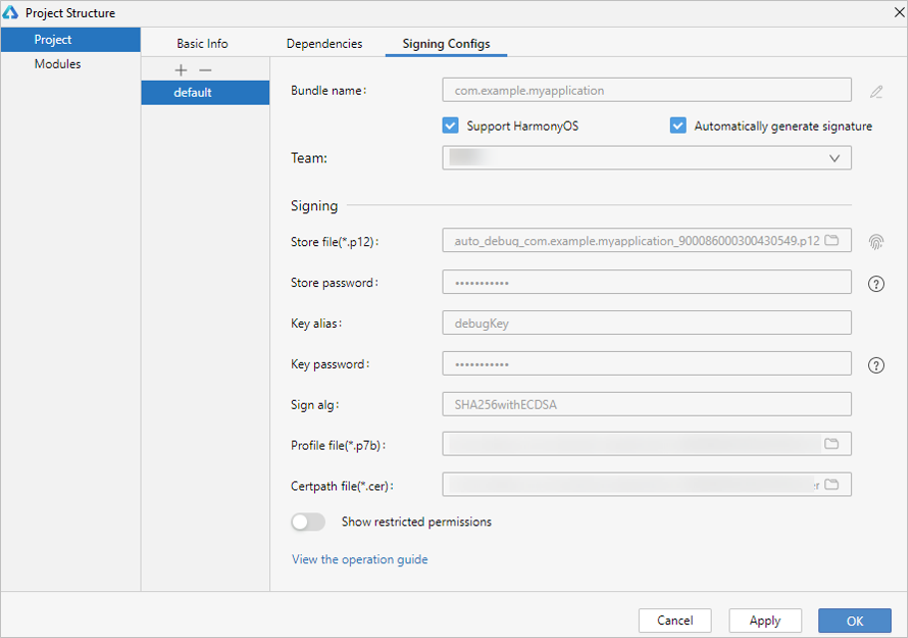
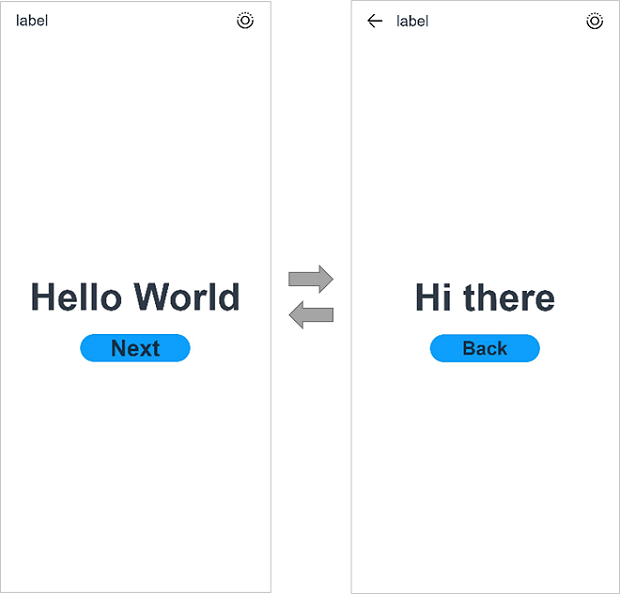

1. 将真机与电脑连接。具体指导及要求，请参见[运行应用/服务](https://developer.huawei.com/consumer/cn/doc/harmonyos-guides/ide-run-device)。
2. 选择**File** &gt; **Project Structure...** &gt; **Project** &gt; **SigningConfigs**界面，勾选“**Support HarmonyOS**”和“**Automatically generate signature**”，单击界面提示的“**Sign In**”，使用华为账号登录。等待自动签名完成后，单击“**OK**”即可。

   

   在自动签名的过程中，会校验APP ID和包名的合法性。如出现报错，请及时修改。访客模式无法使用自动签名功能。

   
3. 在编辑窗口右上角的工具栏，单击按钮运行。效果如下图所示：

   
4. 将元服务的卡片添加到桌面，以便访问元服务。
   * 在桌面上双指捏合，进入桌面的编辑模式。
   * 点击底部的“服务卡片”。
   * 在卡片添加页面，选择要添加到桌面的卡片，点击“**添加到桌面**”，完成卡片添加。

   完成卡片添加后，可以在真机上测试元服务卡片的动效，也可点击卡片空白区域测试拉起元服务页面的功能。
5. 拉起元服务页面进行测试。

   可以使用[Ability助手](https://developer.huawei.com/consumer/cn/doc/harmonyos-guides/aa-tool)拉起元服务页面。

   ```
   hdc shell aa start -a EntryAbility -b 元服务包名
   ```

恭喜您已经完成了第一个HarmonyOS元服务，快来探索更多的HarmonyOS功能吧。
