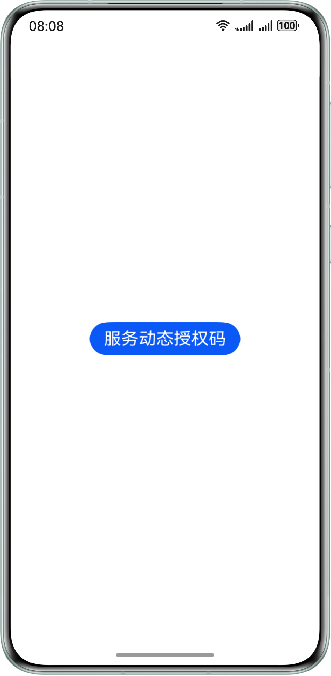

## 场景介绍

从6.0.0(20)开始，支持服务动态授权码Button功能。

服务动态授权码Button提供获取系统生成的动态授权码（code）的能力，获取的code可用于推送服务动态。在元服务中，开发者需要在前端界面将触发服务的场景化 Button 组件的OpenType 的值设置为 OpenType.REQUEST\_SUBSCRIBE\_MESSAGE。当用户点击 Button 后，可以通过onRequestSubscribeMessage事件回调可以获取code。


* 该场景在元服务中可正常使用，在其他场景中返回[10004](https://developer.huawei.com/consumer/cn/doc/harmonyos-references/scenario-fusion-error-code#section10004-系统内部异常)、[10008](https://developer.huawei.com/consumer/cn/doc/harmonyos-references/scenario-fusion-error-code#section10008-调用方非元服务)错误码。
* 通过服务动态授权码Button获取的 code 在当次服务进程中唯一，后续开发者更新用户的服务状态均通过此 code 进行。
* 平台会对相关Button组件进行检测，包括是否诱导用户点击、通过与服务动态场景无关的按钮获取 code 等。

## 前提条件

* 参见[开发准备](https://developer.huawei.com/consumer/cn/doc/harmonyos-guides/scenario-fusion-preparations)。
* 申请并[获取服务动态权益](https://developer.huawei.com/consumer/cn/doc/atomic-guides/push-as-timeline#section592010820304)。
* 开发者使用的服务动态场景支持以前端服务动态授权码Button获取code。

## 约束与限制

服务动态授权码Button支持Phone、Tablet设备，并且从对于6.1.0(23)版本开始，新增支持PC/2in1设备。

## 效果图展示

单击“服务动态授权码”按钮触发获取授权码功能。



## 开发步骤

1. 导入Scenario Fusion Kit模块以及相关公共模块。

   ```
   import { FunctionalButton, functionalButtonComponentManager } from '@kit.ScenarioFusionKit';
   import { hilog } from '@kit.PerformanceAnalysisKit';
   ```
2. 在容器中声明FunctionalButton，指定Button的openType，并设置对应的回调函数，代码如下：

   ```
   @Entry
   @Component
   struct Index {
     build() {
       Row() {
         Column() {
           // 构建FunctionalButton组件实例。
           FunctionalButton({
             params: {
               // OpenType.REQUEST_SUBSCRIBE_MESSAGE表示该按钮用于获取授权码。
               openType: functionalButtonComponentManager.OpenType.REQUEST_SUBSCRIBE_MESSAGE,
               label: '服务动态授权码',
               // 在获取服务动态授权码时，名为subSceneId的参数是必填项。
               subSceneId: '',
               // 调整按钮样式。
               styleOption: {
                 styleConfig: new functionalButtonComponentManager.ButtonConfig()
                   .fontSize(20)
               },
             },
             // 当OpenType为REQUEST_SUBSCRIBE_MESSAGE时，回调必须为onRequestSubscribeMessage。
             controller: new functionalButtonComponentManager.FunctionalButtonController()
               .onRequestSubscribeMessage((err, data) => {
                 if (err) {
                   // 错误日志处理。
                   hilog.error(0x0000, "testTag", "error: %{public}d %{public}s", err.code, err.message);
                   return;
                 }
                 // 成功日志处理。
                 hilog.info(0x0000, "testTag", "succeeded in requesting subscribe message");
                 // 处理服务代码。
                 let code = data.code;
               })
           })
         }.width('100%')
         .padding({ left: 16, right: 16 })
       }.height('100%')
     }
   }
   ```

   

   * openType参数填写"functionalButtonComponentManager.OpenType.REQUEST\_SUBSCRIBE\_MESSAGE"指定Button为服务动态授权码类型。
   * subSceneId参数在服务动态授权码场景中是必填的，参考[服务动态场景模板](https://developer.huawei.com/consumer/cn/doc/atomic-guides/push-as-timeline#section442012142311)。
   * controller参数必须对应填写"new functionalButtonComponentManager.FunctionalButtonController().onRequestSubscribeMessage"。
   * 可使用自定义Modifier设置按钮样式，参考[示例](https://developer.huawei.com/consumer/cn/doc/harmonyos-references/scenario-fusion-functionalbuttoncomponentmanager#示例一场景化button使用自定义modifier设置按钮样式)。

   其他参数请参考：[FunctionalButton（Button组件）](https://developer.huawei.com/consumer/cn/doc/harmonyos-references/scenario-fusion-functionalbutton)。
