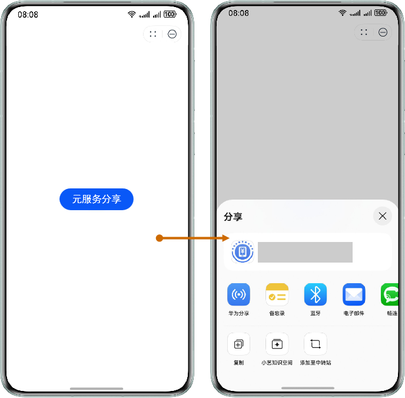

## 场景介绍

从6.0.0(20)开始，支持元服务分享Button功能。

元服务分享Button可以帮助开发者在元服务中，通过组件拉起元服务分享页面。


该场景在**元服务**中可正常使用，在其他场景中返回[10004](https://developer.huawei.com/consumer/cn/doc/harmonyos-references/scenario-fusion-error-code#section10004-系统内部异常)、[10006](https://developer.huawei.com/consumer/cn/doc/harmonyos-references/scenario-fusion-error-code#section10006-获取分享数据失败)、[10008](https://developer.huawei.com/consumer/cn/doc/harmonyos-references/scenario-fusion-error-code#section10008-调用方非元服务)错误码。

## 前提条件

参见[开发准备](https://developer.huawei.com/consumer/cn/doc/harmonyos-guides/scenario-fusion-preparations)。

## 约束与限制

元服务分享Button支持Phone、Tablet设备，并且从对于6.1.0(23)版本开始，新增支持PC/2in1设备。

## 效果图展示

单击“元服务分享”按钮，拉起分享页面，选择分享的方式。



## 开发步骤

1. 导入Scenario Fusion Kit模块以及相关公共模块。

   ```
   import { FunctionalButton, functionalButtonComponentManager } from '@kit.ScenarioFusionKit';
   import { hilog } from '@kit.PerformanceAnalysisKit';
   ```
2. 在容器中声明FunctionalButton，指定Button的openType，并设置对应的回调函数，代码如下：

   ```
   @Entry
   @Component
   struct Index {
     build() {
       Row() {
         Column() {
           // 构建FunctionalButton组件实例。
           FunctionalButton({
             params: {
               // OpenType.SHARE 表示该按钮用于调出分享页面。
               openType: functionalButtonComponentManager.OpenType.SHARE,
               label: '元服务分享',
               shareParam: {
                 previewUri: '',
                 description: ''
               },
               // 调整按钮样式。
               styleOption: {
                 styleConfig: new functionalButtonComponentManager.ButtonConfig()
                   .fontSize(20)
               },
             },
             // 当OpenType设置为SHARE时，回调函数必须是onShare。
             controller: new functionalButtonComponentManager.FunctionalButtonController()
               .onShare((err) => {
                 if (err) {
                   // 错误日志处理。
                   hilog.error(0x0000, "testTag", "error: %{public}d %{public}s", err.code, err.message);
                   return;
                 }
                 // 成功日志处理。
                 hilog.info(0x0000, "testTag", "succeeded in pulling up the sharing page");
               })
           })
         }.width('100%')
       }.height('100%')
     }
   }
   ```

   

   * openType参数填写"functionalButtonComponentManager.OpenType.SHARE"指定Button为元服务分享类型。
   * description参数为字符串格式，没有长度校验。
   * previewUri参数为字符串格式，没有长度校验。
   * controller参数必须对应填写"new functionalButtonComponentManager.FunctionalButtonController().onShare"。
   * 可使用自定义Modifier设置按钮样式，参考[示例](https://developer.huawei.com/consumer/cn/doc/harmonyos-references/scenario-fusion-functionalbuttoncomponentmanager#示例一场景化button使用自定义modifier设置按钮样式)。

   其他参数请参考：[FunctionalButton（Button组件）](https://developer.huawei.com/consumer/cn/doc/harmonyos-references/scenario-fusion-functionalbutton)。
