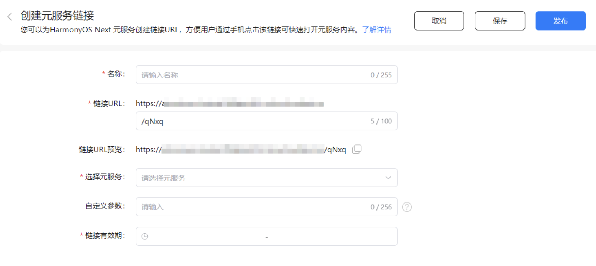
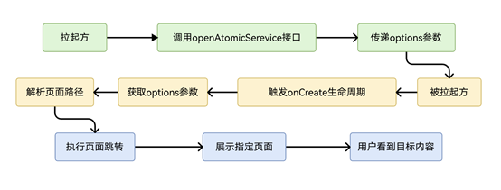

开发者可以通过不同的方式从外部拉起元服务，包括使用App Linking链接以及openAtomicService接口等。每种方法都有其独特的优势和适用场景，开发者可以根据具体需求选择合适的方式，以实现元服务的快速启动和使用。

## 拉起元服务的方式介绍

| 拉起方式 | 适用范围 | 用户跳转体验 | 开发说明 |
| --- | --- | --- | --- |
| 通过[通过App Linking](/docs/dev/atomic-dev/atomic-linking/atomic-applinking)拉起元服务 | 从服务通知、短信、邮件、网页内等场景拉起元服务。  通过应用/元服务内H5、web-view拉起元服务。 | 除部分自身管控页面跳转规则的应用外，跳转体验参照[跳转规则说明](#跳转规则说明)。 | 1. 通过链接拉起元服务，常用于通知，网页中。  2. 元服务链接的有效期最长为90天。 |
| 通过API [openAtomicService](https://developer.huawei.com/consumer/cn/doc/harmonyos-references/js-apis-inner-application-uiabilitycontext#openatomicservice12)拉起元服务 | 从应用/元服务内拉起元服务。 | - 被拉起方为系统元服务，直接跳转。  - 被拉起方为三方元服务，弹窗确认，用户同意后可拉起元服务。 | 1. 在应用/元服务内通过API拉起元服务，常用于应用的功能扩展。  2. 仅需使用目标元服务的appId，无有效期限制。 |

### 跳转规则说明

| **拉起方** | **被拉起方** | **跳转体验** |
| --- | --- | --- |
| 系统应用 | 元服务、应用 | 不弹窗，直接跳转。 |
| 三方元服务 | 系统应用、系统元服务 | 不弹窗，直接跳转。 |
| 三方元服务 | 三方元服务（非关联主体） | 每次弹窗确认，用户同意后即可跳转。 |
| 三方元服务 | 三方元服务（[关联主体账号组](https://developer.huawei.com/consumer/cn/doc/start/cag-0000001265390541)） | 首次弹窗确认，用户同意后，30 天内可免除再次弹窗。 |
| 三方元服务 | 三方应用（非关联主体） | 禁止。 |
| 三方元服务 | 三方应用（[关联主体账号组](https://developer.huawei.com/consumer/cn/doc/start/cag-0000001265390541)、[应用接入华为支付](/docs/dev/app-dev/application-services/payment-kit-guide/payment-introduction)） | 首次弹窗确认，用户同意后，30 天内可免除再次弹窗。 |
| 三方应用 | 系统应用、系统元服务 | 不弹窗，直接跳转。 |
| 三方应用 | 三方元服务 | 每次弹窗确认，用户同意后即可跳转。 |

### 不推荐的拉起方式

| **不推荐的拉起方式** | **原因** |
| --- | --- |
| [通过Deep Linking拉起元服务](/docs/dev/app-dev/application-framework/ability-kit/stage-model-development/inter-app-redirection/directional-redirection/deep-linking-startup) | Deep Linking主要用于拉起已安装的应用。在元服务领域，其应用存在局限性，如果用户设备未安装目标元服务，将无法触达新用户。 |
| 通过[FunctionalButton](https://developer.huawei.com/consumer/cn/doc/harmonyos-references/scenario-fusion-functionalbutton)拉起元服务 | 使用FunctionalButton组件访问元服务时，若需获取未开放的信息，将增加开发成本。 |
| 通过[startAbility](https://developer.huawei.com/consumer/cn/doc/harmonyos-references/js-apis-inner-application-uiabilitycontext#startability)/[startAbilityForResult](https://developer.huawei.com/consumer/cn/doc/harmonyos-references/js-apis-inner-application-uiabilitycontext#startabilityforresult)拉起元服务 | 使用该接口打开元服务需要获取未开放的信息，增加开发成本。 |

## 通过App Linking拉起元服务

元服务链接是专为开发者设计的加密URL服务，用户点击后可直接进入元服务的任意页面，实现点击即达、即点即用。作为开发者，您能够为自己的元服务生成并配置专属链接，同时设置其有效期，以便精确控制用户的访问时间和范围，在有效期内引导用户到达指定的元服务页面。

例如，当用户收到“手机充值”的元服务链接后，只需点击该链接即可直接进入相应的元服务页面，享受一步到位的便捷体验。

**前提条件**

* **版本限制：** 仅对HarmonyOS 5.0及以上版本的操作系统和HarmonyOS API 12及以上版本的元服务开放。
* 账号需为[企业开发者](https://developer.huawei.com/consumer/cn/doc/start/edrna-0000001062678489)账号。
* 已在AGC平台[创建项目](/docs/distribute/agc/agc-help-project-0000002270709469/agc-help-create-project-0000002242804048)。
* 已在AGC平台[开通App Linking服务](https://developer.huawei.com/consumer/cn/doc/AppGallery-connect-Guides/agc-applinking-enable-0000001058870473)。
* 已经为项目[创建元服务链接](/docs/dev/atomic-dev/atomic-linking/atomic-applinking#section48651523147)。

  

  链接有效期最大为90天，超出范围需要进行重新配置发布。
* 您的项目中必须存在已上架的元服务（目前仅支持HarmonyOS API 12及以上版本的元服务），具体可参见“[创建元服务](/docs/distribute/agc/agc-help-app-0000002235710234/agc-help-create-atomic-service-0000002247795706)”、“[调试元服务](https://developer.huawei.com/consumer/cn/doc/app/agc-help-debug-overview-0000001955332054)”和“[发布元服务](https://developer.huawei.com/consumer/cn/doc/app/agc-help-release-atomic-0000002327731065)”。

### 使用openLink接口跳转到元服务指定页面

拉起方应用通过[UIAbilityContext.openLink()](https://developer.huawei.com/consumer/cn/doc/harmonyos-references/js-apis-inner-application-uiabilitycontext#openlink12)接口，传入目标元服务链接，从而拉起目标元服务。开发者可根据业务需求进行编译。若有匹配的元服务，则直接打开目标元服务；否则，抛异常给开发者进行处理。

1. 在AGC上创建元服务链接。如果需要在拉起目标元服务时，跳转到指定页面，可以在此阶段配置静态自定义参数，具体请参见[创建元服务链接](/docs/dev/atomic-dev/atomic-linking/atomic-applinking#section48651523147)。

   

   例如，打开menu页面，在自定义参数中填写页面路径：

   ```
   pagePath=pages/menu
   ```

   

   * 如果需要跳转到分包的页面，则pagePath需要配置为：@bundle:包名（bundleName）/模块名（moduleName）/路径/页面所在的文件名，例如：pagePath=@bundle:com.atomicservice.123456789/library/ets/pages/menu。
   * ASCF元服务对自定义参数要求略有不同，详情请参考[获取ASCF元服务链接](/docs/dev/atomic-dev/ascf/develop-open-capabilities/ascf-applinking)。
2. 在元服务的Ability（如EntryAbility）的onCreate()生命周期回调中解析自定义参数，并通过openLink进行跳转。

   ```
   // EntryAbility.ets
   import { UIAbility, Want } from '@kit.AbilityKit';
   import { hilog } from '@kit.PerformanceAnalysisKit';
   import { window } from '@kit.ArkUI';

   export default class EntryAbility extends UIAbility {
     // 用来保存通过router方式从元服务链接跳转到指定的页面
     pagePath: string = '';

     onCreate(want: Want): void {
       this.resolvePagePath(want);
       hilog.info(0x0000, 'testTag', '%{public}s', 'Ability onCreate');
     }

       onWindowStageCreate(windowStage: window.WindowStage): void {
       // Main window is created, set main page for this ability
       hilog.info(0x0000, 'testTag', '%{public}s', 'Ability onWindowStageCreate');

       if(this.pagePath){
         windowStage.loadContent(this.pagePath, (err) => {
           if (err.code) {
             hilog.error(0x0000, 'testTag', '%{public}s', `Failed to load the content, cause: ${JSON.stringify(err)}`);
             return;
           }
           hilog.info(0x0000, 'testTag', '%{public}s', 'Succeeded in loading the content.');
         });
       }
       else{
         windowStage.loadContent('pages/Index', (err) => {
           if (err.code) {
             hilog.error(0x0000, 'testTag', '%{public}s', `Failed to load the content, cause: ${JSON.stringify(err)}`);
             return;
           }
           hilog.info(0x0000, 'testTag', '%{public}s', 'Succeeded in loading the content.');
         });
       }
     }

     resolvePagePath(want: Want){
       // 从want中获取传入的链接信息。如传入的url为：https://hoas.drcn.agconnect.link/9P7g
       let uri = want?.uri;
       hilog.info(0x0000, 'testTag', '%{public}s', `uri is: ${uri}`);
       if (uri) {
         // 解析通过router跳转的页面
         this.pagePath =  want.parameters?.['pagePath'] as string;
         hilog.info(0x0000, 'testTag', '%{public}s', `pagePath is: ${this.pagePath}`);
       }
     }
   }
   ```

   ```
   // index.ets
   Button('start link', { type: ButtonType.Capsule, stateEffect: true })
     .width('87%')
     .height('5%')
     .margin({ bottom: '12vp' })
     .onClick(() => {
       let context: common.UIAbilityContext = this.getUIContext().getHostContext() as common.UIAbilityContext;
       // link可替换成开发者自行配置的元服务链接
       let link: string = 'xxxxx';
       context.openLink(link)
         .then(() => {
           // 执行正常业务
           console.info('openAtomicService succeed');
         })
         .catch((error: BusinessError) => {
           // 处理业务逻辑错误
           console.error(`openAtomicService failed, code is ${err.code}, message is ${err.message}`);
         });
     })
   ```

## 通过API拉起元服务

开发者可通过接口[openAtomicService](https://developer.huawei.com/consumer/cn/doc/harmonyos-references/js-apis-inner-application-uiabilitycontext#openatomicservice12)拉起元服务，openAtomicService接口可用跳出式启动EmbeddableUIAbility，并返回结果。使用Promise异步回调。仅支持在主线程调用。

**前提条件**

1. 主线程中调用该接口。
2. 需要得知待拉起元服务的appId。
3. 如需直达指定元服务页面，需要配置[options参数](https://developer.huawei.com/consumer/cn/doc/harmonyos-references/js-apis-app-ability-atomicserviceoptions)。

   

**拉起方代码示例：**

```
// page/xxx.ets
let context: common.UIAbilityContext = this.getUIContext().getHostContext() as common.UIAbilityContext
// 待拉起元服务appId
let appId: string = '123456';
// 开发者自定义参数options
let options: AtomicServiceOptions = {
  displayId: 0
  path:'pages/Detail'
};
try {
  context.openAtomicService(appId, options)
    .then((result: common.AbilityResult) => {
      // 执行正常业务
      console.info('openAtomicService succeed');
    })
    .catch((err: BusinessError) => {
      // 处理业务逻辑错误
      console.error(`openAtomicService failed, code is ${err.code}, message is ${err.message}`);
    });
} catch (err) {
  // 处理入参错误异常
  let code = (err as BusinessError).code;
  let message = (err as BusinessError).message;
  console.error(`openAtomicService failed, code is ${code}, message is ${message}`);
}
```

**被拉起方代码示例：**

```
// page/xxx.ets
import { AbilityConstant, UIAbility, Want } from '@kit.AbilityKit';

export default class FuncAbilityA extends UIAbility {
  onCreate(want: Want, launchParam: AbilityConstant.LaunchParam): void {
    // 接收拉起方UIAbility传过来的参数
    let funcAbilityWant = want;
    let info = funcAbilityWant?.parameters?.info;
    router.pushUrl({
        url: funcAbilityWant?.path // 解析want中携带的地址参数
    }, router.RouterMode.Standard, (err) => {
    if (err) {
      console.error(`Invoke pushUrl failed, code is ${err.code}, message is ${err.message}`);
      return;
    }
    console.info('Invoke pushUrl succeeded.');
  });
  }
  // ...
}
```
