# 工具栏

工具栏用于展示针对当前界面的操作选项。开发相关描述请参考 [Navigation/ToolBarItem](https://developer.huawei.com/consumer/cn/doc/harmonyos-references/ts-basic-components-navigation#toolbarconfiguration10) 文档和高级组件 [ToolBar](https://developer.huawei.com/consumer/cn/doc/harmonyos-references/ohos-arkui-advanced-toolbar) 文档。

### 如何使用

当界面有多个常用操作时，考虑把操作选项放在工具栏上，底部页签和工具栏不能同时使用。从HarmonyOS 6.1之后，工具栏新增了悬浮工具栏样式，区别于之前平铺式的工具栏，悬浮工具栏具备更丰富的视觉效果和沉浸式体验。

**避免错误的显示操作选项。**平铺式工具栏中最多展示4个操作和1个更多选项，当常用操作过多时，显示不下的常用操作、非常用操作以及难用图形表示的功能，放入“更多”菜单。不允许出现工具栏只有“更多”的情况。不允许仅显示一个操作。

**避让系统导航条。**在 HarmonyOS 的系统界面底部会固定显示导航条，因此，在自定义工具栏样式的时候需要切记避让导航条区域，避免应用的文本或图标信息与导航条重叠。控件在默认情况下会避让导航条，工具栏组件整体高度会扩展至导航条区域，但工具栏的按键热区与导航条热区相互独立。工具栏默认高度为 52vp，如果开发者需要自定义工具栏的样式和结构，可以通过 [expandSafeArea](https://developer.huawei.com/consumer/cn/doc/harmonyos-references/ts-basic-components-navigation#ignorelayoutsafearea12) 了解能力规格。

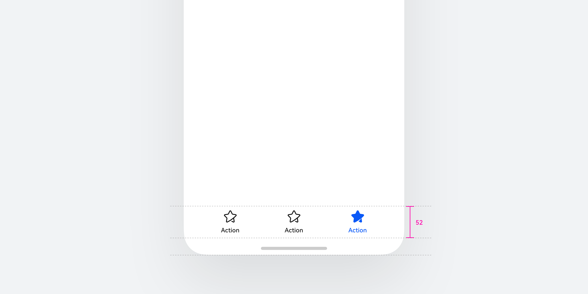

**使用悬浮工具栏用于展示其所在场景中的关键操作选项，通常位于应用程序屏幕的底部**。通过点击工具栏内容项，用户可以快捷地执行对应操作。

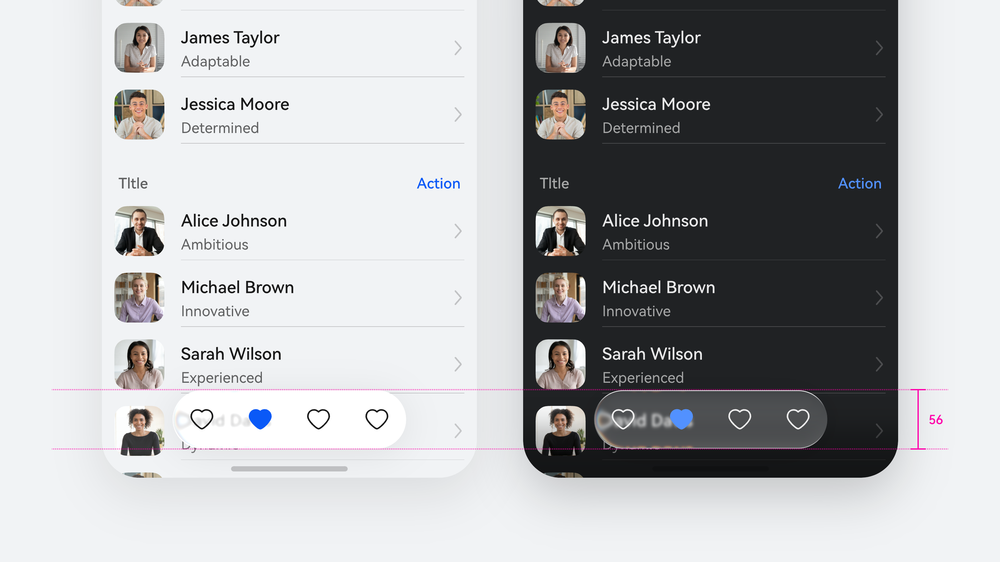

基于使用场景及设备类型，工具栏提供不同的样式与能力，可根据开发需求进行配置。

**图标样式是最简洁的呈现方式，适用于操作意图明确、无需额外文字说明的场景。**该样式下，工具栏可在有限空间内承载更多操作入口，可用作工具类应用或内容类应用的快捷操作面板。

**图标+文本样式在图标基础上增加文字标签，适用于操作意图具有较高理解成本，或用户对功能不熟悉的场景。**该样式下，文字标签提供了明确的语义描述，可用于呈现需要引导说明的操作选项。

**自定义样式允许开发者设置 2-3 个胶囊分组，或通过自定义 builder 构建系统能力所支持的界面元素，**为工具栏提供了最大程度的灵活性。该样式适用于需要呈现复杂控件组合的场景，如工具栏拆分向或工具栏加按钮的组合，承载应用特殊的交互需求。

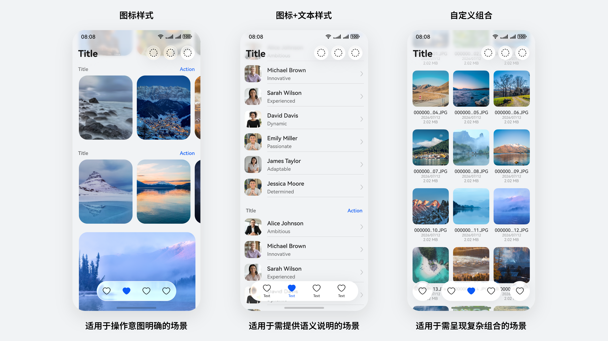

当界面有多个常用操作时，工具栏上操作选项的排序规则为：“添加”、“分享”、“收藏”、其他操作 (下载、编辑、移动等)、“删除”、“全选”、“更多”。

**工具栏通常根据优先级显示常用操作，**功能显示不下时，支持横滑扩展。不常用或难以用图形表达的功能，也可以收起在 “更多” 菜单。

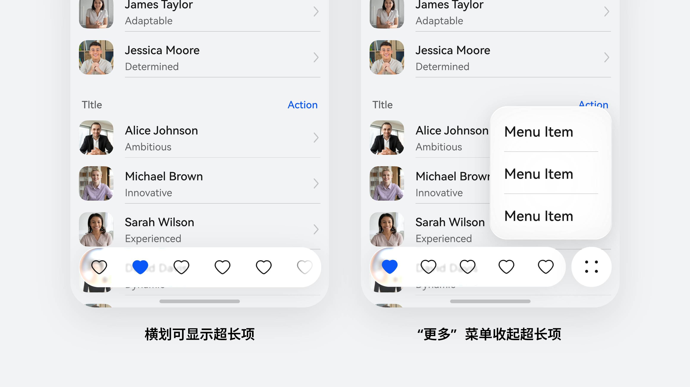

### 视觉规则

### 视觉反馈

**使用 HarmonyOS Symbol 来展示图标信息。**在工具栏中可以替换系统 [Symbol](https://developer.huawei.com/consumer/cn/doc/harmonyos-references/ts-basic-components-navigation#toolbaritem10) 样式来更灵活的展示图标信息，这种方式更匹配文本的展示效果，同时提供点击反馈，更直接的展示界面设计的细节。开发者可以在 [HarmonyOS Symbol](https://developer.huawei.com/consumer/cn/design/harmonyos-symbol/) 开源网站上查询目前已经存在的图标样式。

### 沉浸光感

悬浮工具栏组件默认带有沉浸光感材质，可释放更多界面内容的有效显示空间，并使开发者能够在保持设计语言统一的前提下，根据应用场景的差异自由配置工具栏的形态、布局、内容与交互方式。

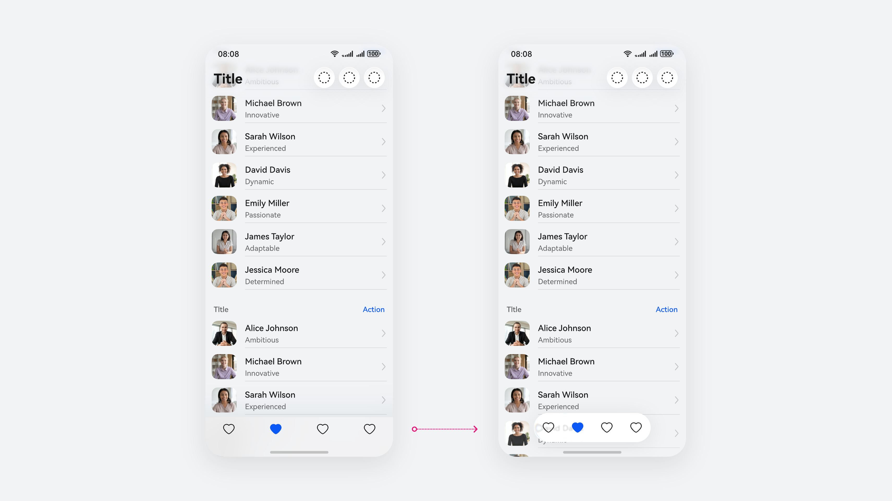

### 布局规则

### 悬浮工具栏

悬浮工具栏开放两种布局方式, 便于开发者根据不同类型的设备和实际应用场景的需求选择最优的呈现方式。

**横向布局适用于工具栏位于屏幕底部或顶部、水平空间充足的场景。**操作项从左至右依次排列。

**纵向布局适用于工具栏位于屏幕侧边、垂直空间充足的场景，常见于平板设备或宽屏应用的侧边操作区。**操作项从上至下依次排列，同样支持纵向滑动扩展。

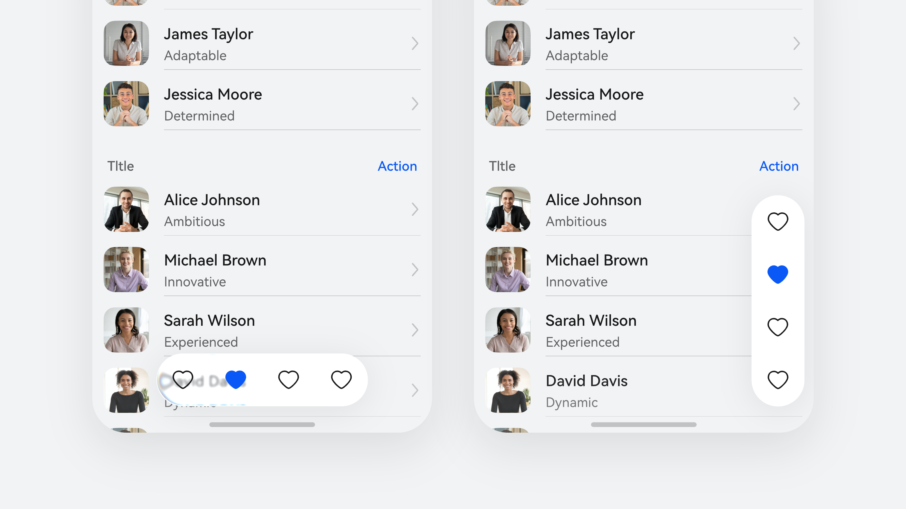

**8 栅格以上设备尺寸支持配置组件跟随交互手的体验，**以提升宽屏设备的操作效率，单手操作时悬浮工具栏会移动到操作手的一侧。

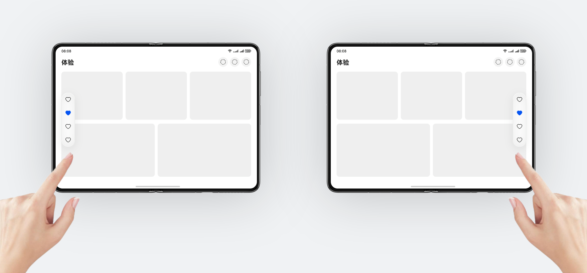

**悬浮工具栏支持配置一个自定义区域，**以满足工具栏和其他组件配合使用，并作为一个整体实现宽屏跟手或滑动隐藏跟手体验。

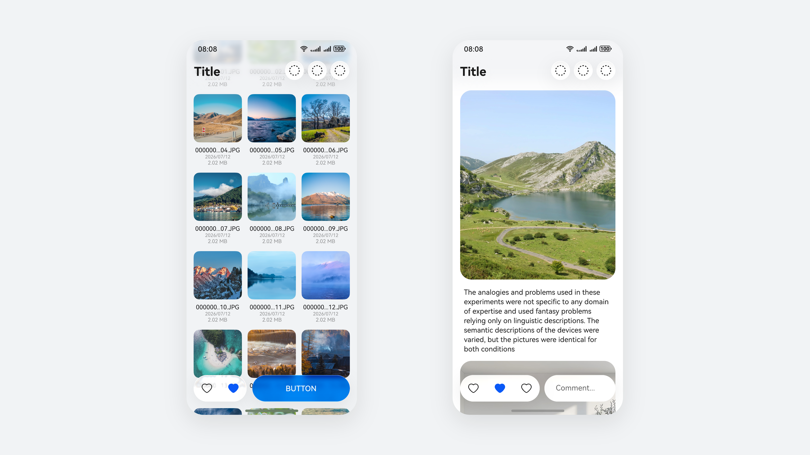

### 平铺式工具栏

**响应式布局**

|  |  |
| --- | --- |
| 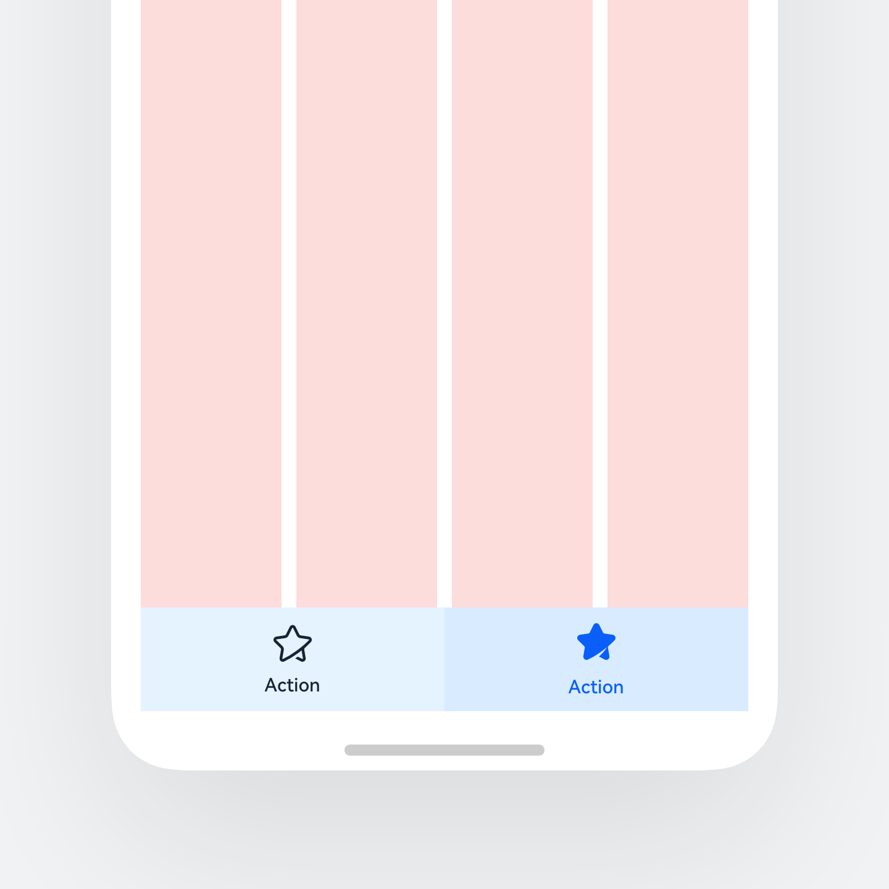 | 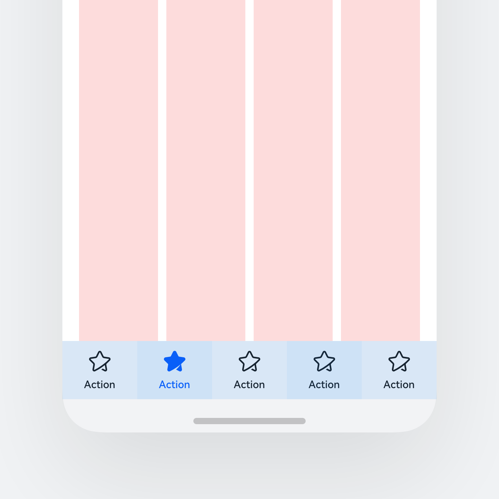 |
| **手机竖屏两个操作** | **手机竖屏多个操作** |
|  |  |
| 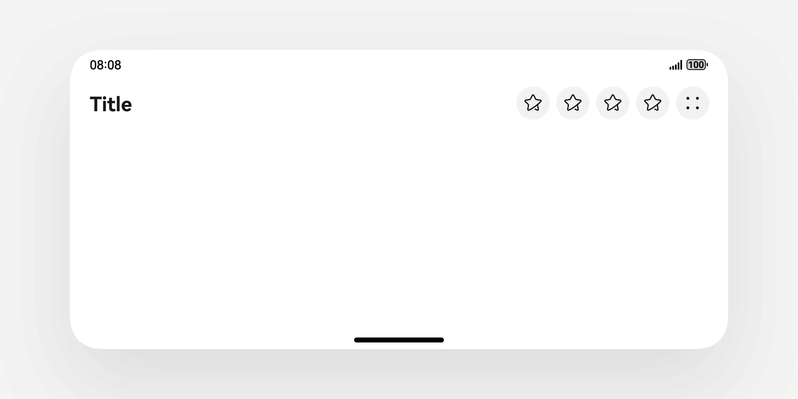 | 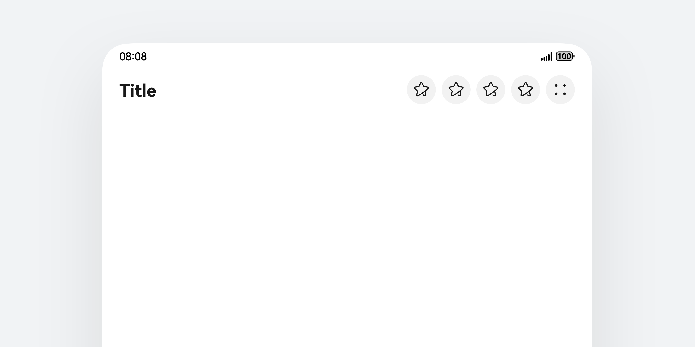 |
| **手机横屏合并入标题栏** | **折叠屏展开合并入标题栏** |
|  |  |
| 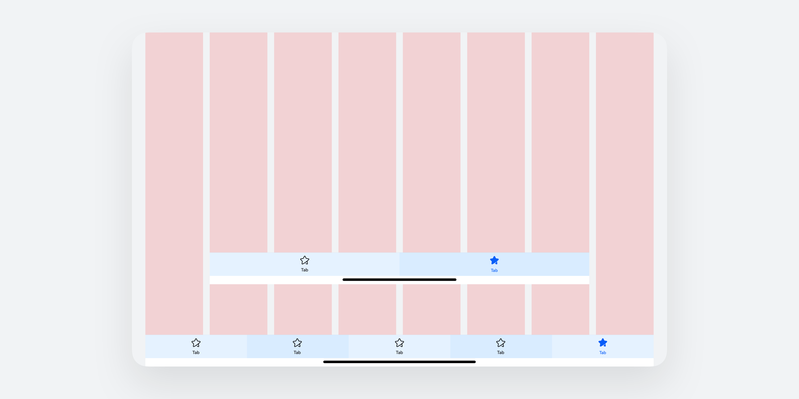 | 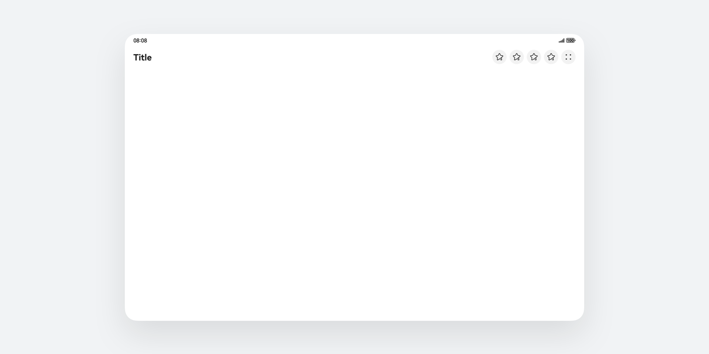 |
| **平板竖屏** | **平板横屏合并入标题栏** |

分栏和分屏情况下，工具栏在其可用区域内，按照竖屏规则布局。

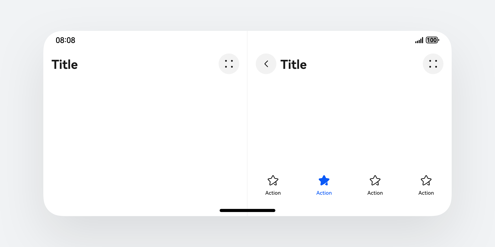

### 开发文档

[Navigation/ToolBarItem](https://developer.huawei.com/consumer/cn/doc/harmonyos-references/ts-basic-components-navigation#toolbarconfiguration10)

[Toolbar](https://developer.huawei.com/consumer/cn/doc/harmonyos-references/ohos-arkui-advanced-toolbar)