# 搜索框

提供用户搜索内容的输入区域。通过搜索，可以快速的找到并定位到想要的内容。搜索框还可以结合搜索历史记录，输入自动补全，语音输入等功能，方便用户快速输入查询。搜索框可以和业务功能放在一起使用，例如扫一扫。在搜索框有输入内容的时候，可以点击搜索框内的清除按钮，一键清除输入。开发能力相关可参考 [Search](https://developer.huawei.com/consumer/cn/doc/harmonyos-references/ts-basic-components-search) 文档。

### 如何使用

用户需要通过搜索功能来找到想要的内容，且该页面需要突出搜索功能时，使用搜索框。(该页面不需要突出搜索功能时，使用搜索图标。)

|  |  |
| --- | --- |
| 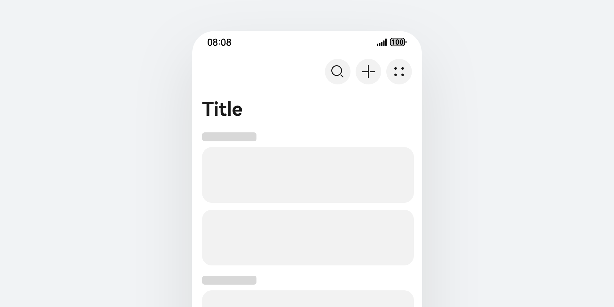 | 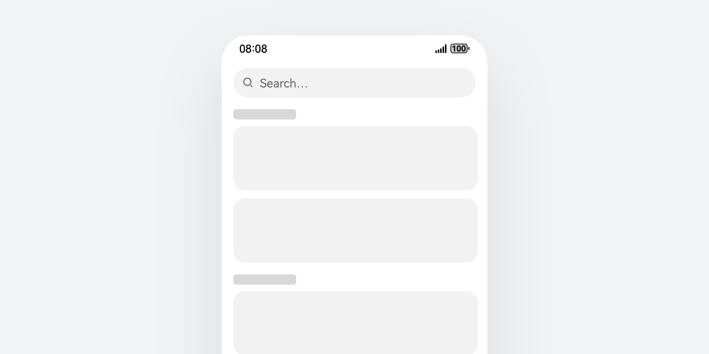 |

**根据场景需要选择合适的触发入口。**搜索入口的搜索框形式分为三种：基础搜索框、基础搜索框 + 搜索键、标题栏入口样式。基础原则：与关键词搜索相关的功能入口或信息放在搜索框内，与之无关的放在搜索框外。搜索框内右侧功能图标默认只使用语音搜索。

|  |  |  |
| --- | --- | --- |
| 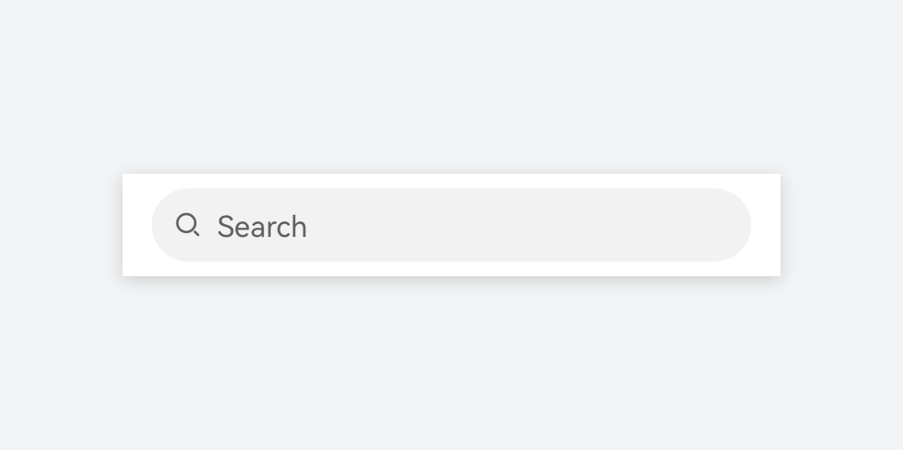 | 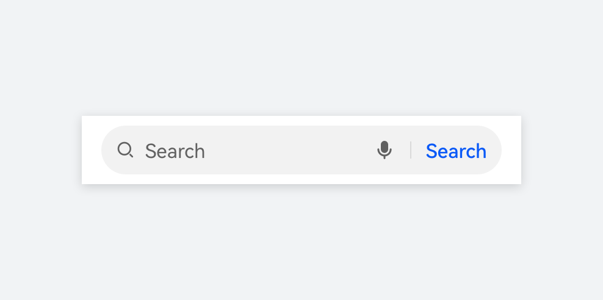 | 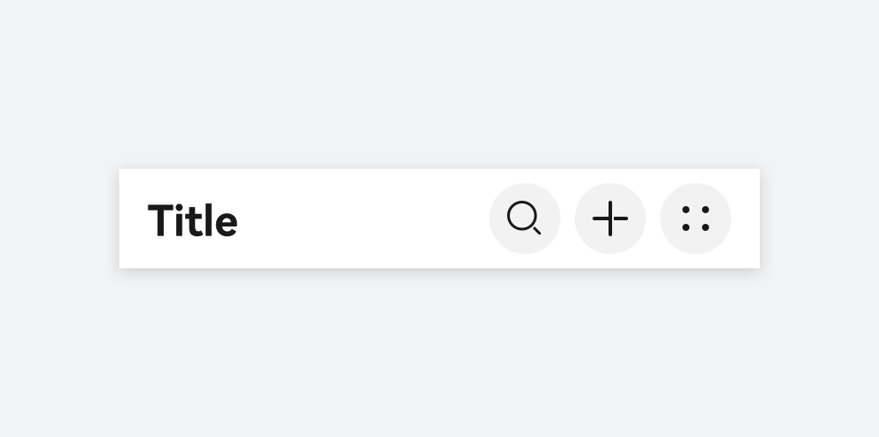 |
| **基础搜索框** | **基础搜索框 + 搜索按钮** | **标题栏入口样式** |

**辅助水印文本。**水印文本支持配置搜索类型和推荐搜索关键词。

|  |  |  |
| --- | --- | --- |
| 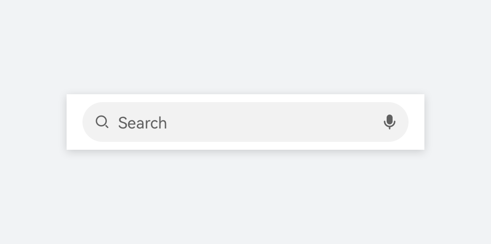 | 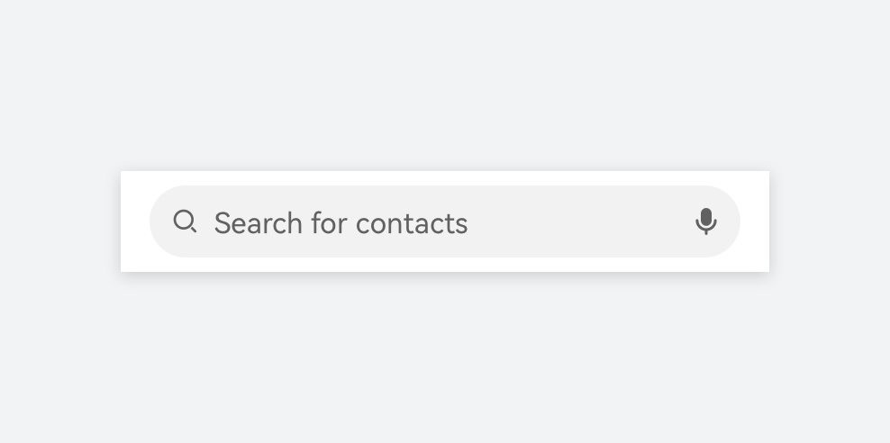 | 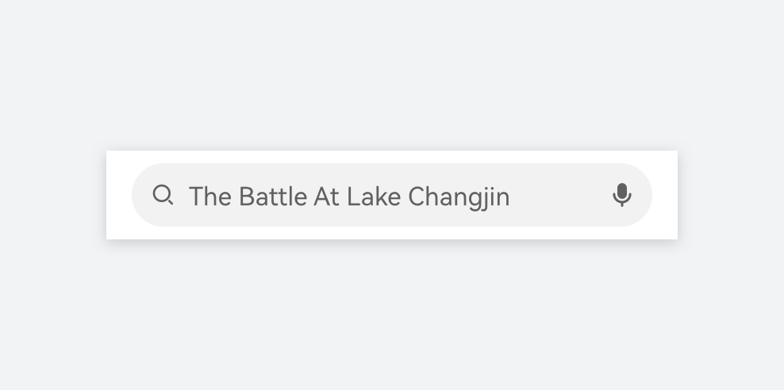 |
| **默认不配置，显示“搜索”** | **可配置搜索类型，例如：搜索联系人等** | **可配置推荐搜索关键词** |

**可在搜索前提供搜索确认按钮。**根据业务需要，可选择在输入框内展示搜索按钮，通过 [searchButton](https://developer.huawei.com/consumer/cn/doc/harmonyos-references/ts-basic-components-search#searchbuttonoptions10对象说明) 配置在搜索框尾部的按钮样式。适用于配置推荐搜索关键词的场景，点击搜索按钮可对推荐关键词进行搜索并呈现搜索结果。带有搜索确认按钮的输入框适用于强调搜索功能的应用，或输入框内有推荐关键词的场景，方便用户看到关键词后直接点击确认，确保交互行为以及视觉动线的连续性 (例如音乐、视频等内容类应用以及浏览器等强调搜索能力的应用等)

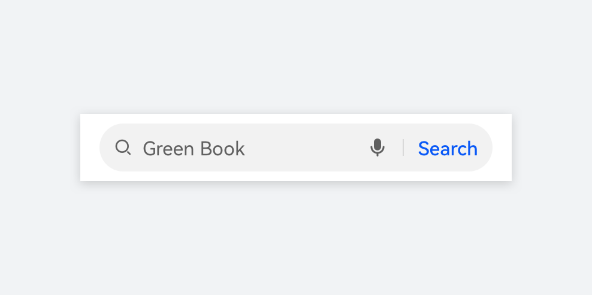

**快速清空输入内容。**当用户输入一段文本后，可以在输入框内增加快速清除的按钮操作，为用户快速清空输入内容提供快捷方式。通过配置 [cancelButton](https://developer.huawei.com/consumer/cn/doc/harmonyos-references/ts-basic-components-search#cancelbuttonstyle10枚举说明) 来展示清除按钮的图标，清空行为作为一种负向行为，不必提供明确的文字信息，展示文本不仅会影响用户的下一步操作判断，还会占用搜索框内的显示空间。当用户点击了清空后，搜索框会回到输入初始态。

|  |  |
| --- | --- |
| 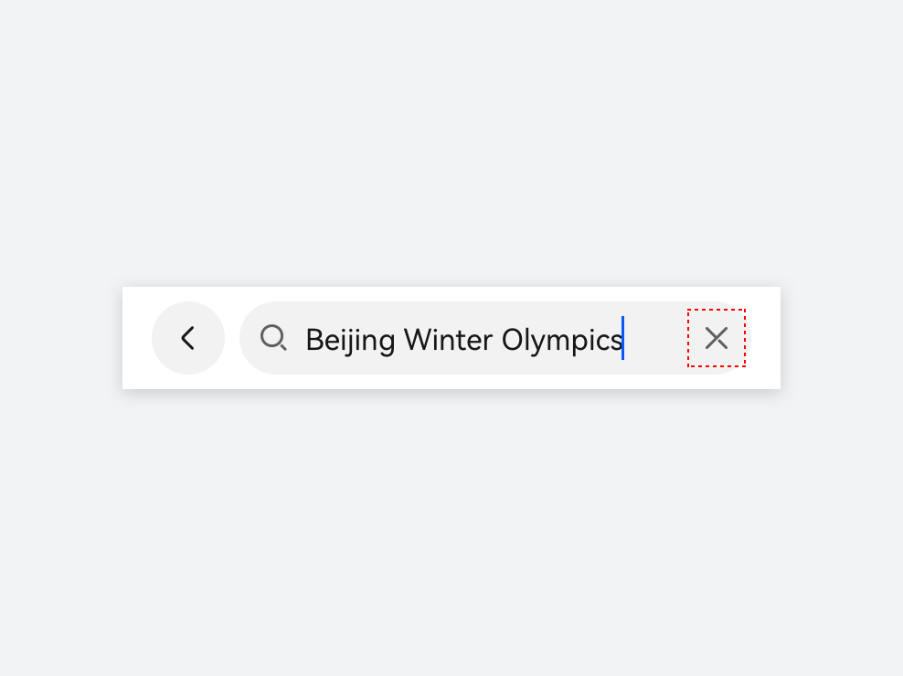 | 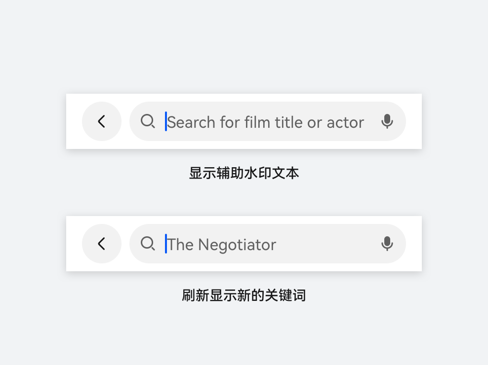 |

**确保搜索框在界面中的布局一致。**搜索框在界面中的展示布局通常与标题栏存在组合关系，当多个页面有标题和搜索框时，请合理计算两者之间的布局参数，确保各个页面之间的体验一致。搜索框通常在界面顶部使用，除浏览器、全局搜索等特殊业务除外。可以与标题栏组合使用，显性展示搜索框组件或作为单独图标入口呈现。

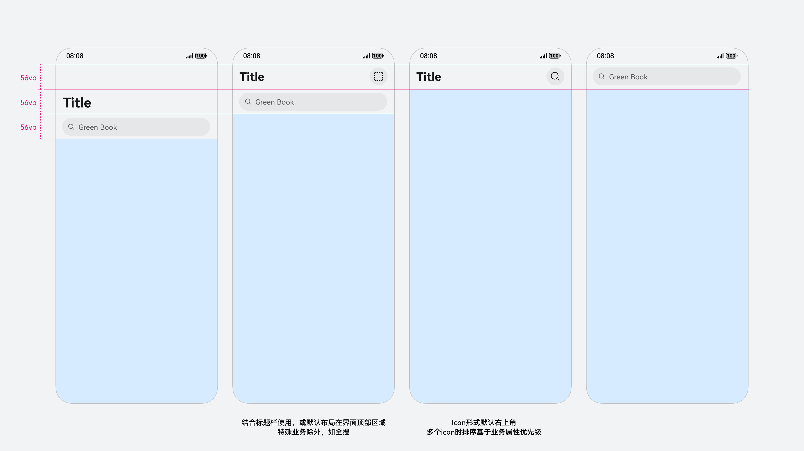

**搭配应用主题色。**在搜索框中的文本编辑场景可以触发文本选中和拖拽手柄，开发者可以通过配置 [caretStyle](https://developer.huawei.com/consumer/cn/doc/harmonyos-references/ts-basic-components-search#caretstyle10) 和 [selectedBackgroundColor](https://developer.huawei.com/consumer/cn/doc/harmonyos-references/ts-basic-components-search#selectedbackgroundcolor12) 两个接口属性的色彩来匹配应用自身的品牌色。

|  |  |
| --- | --- |
| 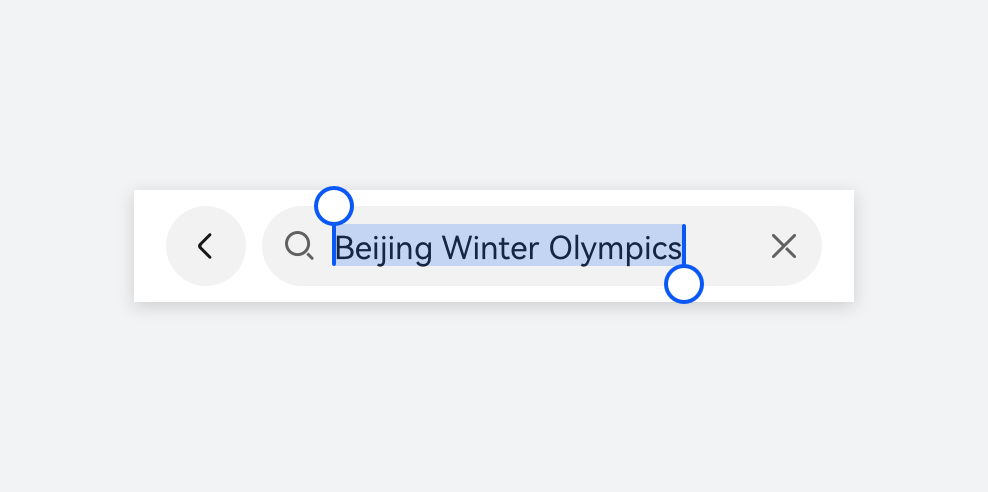 | 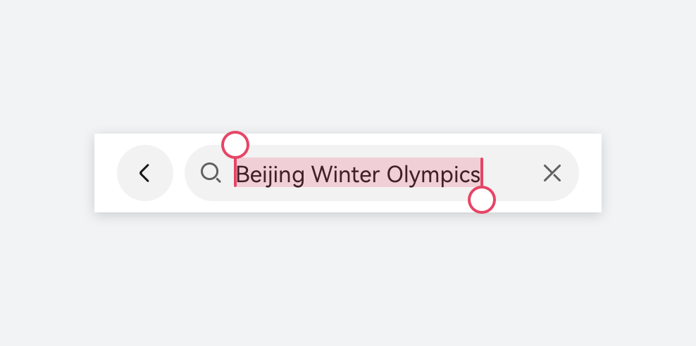 |
| **系统默认蓝色** | **自定义品牌色** |

在电脑设备上，搜索框使用小圆角样式以体现设备风格，支持多种元素配置。

|  |  |  |
| --- | --- | --- |
|  |  | 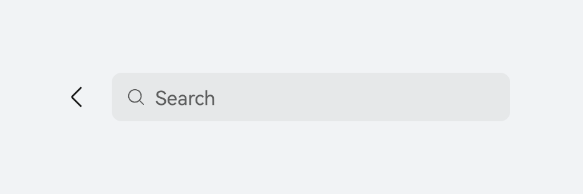 |
| 基础搜索框 | 基础搜索框 + 搜索按钮 | 基础搜索框 + 左侧操作图标 |

搜索栏位置通常放置在窗口顶部，与标题栏合一，可根据需求选择展开搜索框，或折叠为搜索图标。

### 开发文档

[Search](https://developer.huawei.com/consumer/cn/doc/harmonyos-references/ts-basic-components-search)