# 底部页签

移动设备中最常见的应用级导航控件，开发相关描述请参考 [Tabs/BottomTabBarStyle](https://developer.huawei.com/consumer/cn/doc/harmonyos-references/ts-container-tabs) 文档。

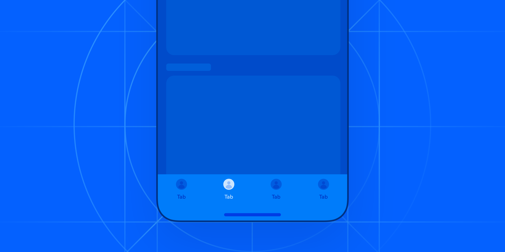

### 如何使用

**底部页签是一种常见的界面导航结构，通常位于应用程序屏幕的底部。**通过点击页签项，用户可以快捷地访问应用的不同分类界面。根据使用场景及设备类型，底部页签将会呈现为不同设计样式。在HarmonyOS 6.1版本之后，底部页签分为了两种呈现方式，平铺式和悬浮式。平铺式底部页签是撑满界面底部或侧边，适配炫彩透光模糊材质的样式，悬浮式底部页签是悬浮在页面之上，适配沉浸光感材质的样式。

**避让系统导航条。**在 HarmonyOS Next 之后的系统界面底部会固定显示导航条，因此，在自定义底部页签样式的时候需注意避让导航条区域，避免应用的文本或图标信息与导航条重叠。控件在默认情况下会避让导航条，平铺式的底部页签组件整体高度会扩展至导航条区域，但底部页签的按键热区与导航条热区互相独立。平铺式底部页签默认高度为 48vp，悬浮式底部页签默认高度为56vp，如果开发者需要自定义底部页签的样式和结构，可以通过 [expandSafeArea](https://developer.huawei.com/consumer/cn/doc/harmonyos-references/ts-universal-attributes-expand-safe-area) 了解能力规格。

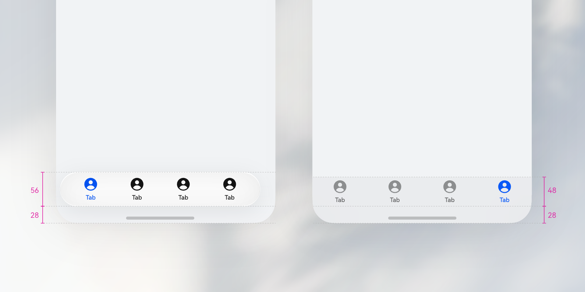

**避免大量的使用页签数量。**通常情况下一个应用程序会包含 3-5 个同等重要的功能模块，这些模块之间彼此互斥。过多页签数量会增加复杂度并缩减单个页签的可点击区域，造成基础功能上的使用障碍，同时增加用户的认知复杂度。一般情况选择 4 个以下页签数量，针对特征性的运营设计可以使用 4+1 的模式进行自定义，即四个基础功能页签和一个运营性页签。

|  |  |
| --- | --- |
| 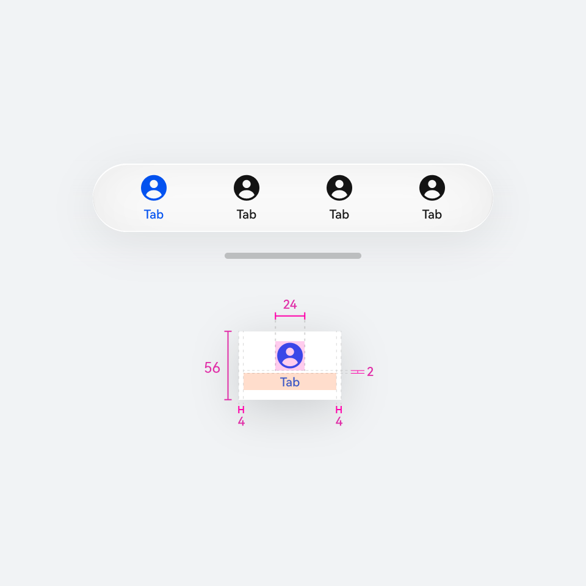 | 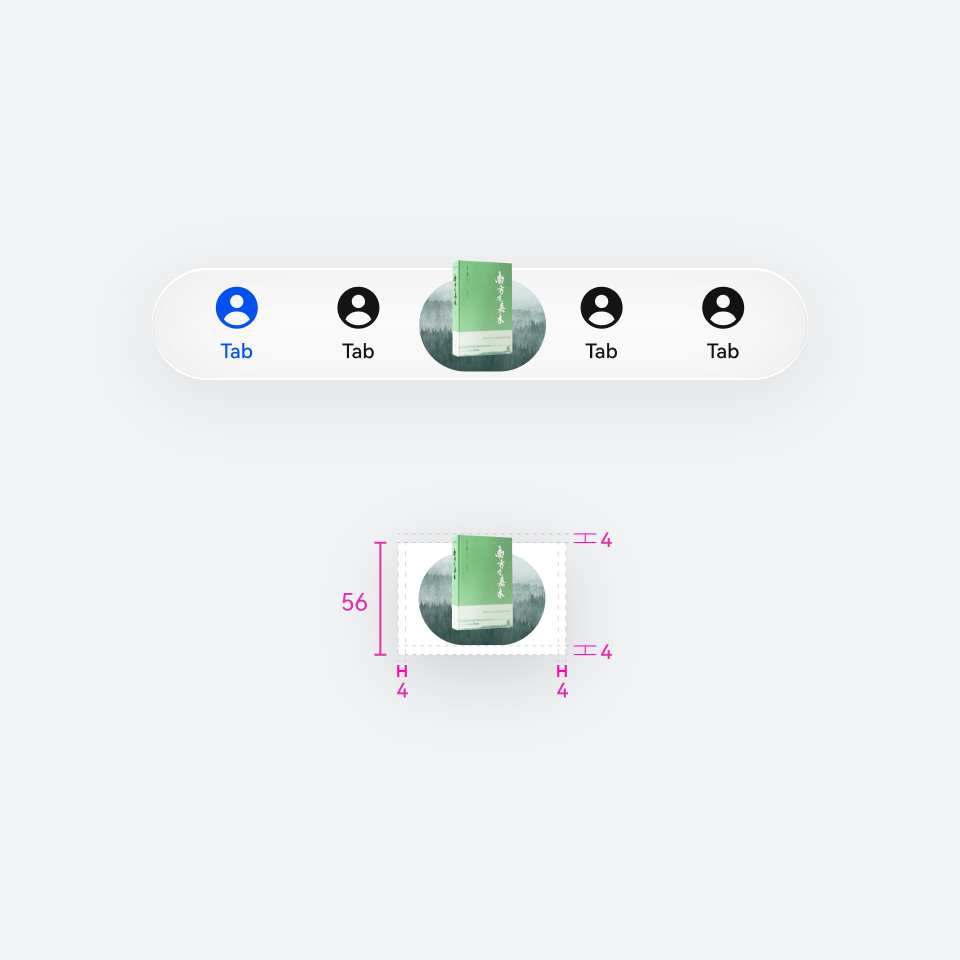 |
| **悬浮式默认页签样式**  图标大小默认为 24\*24vp | **悬浮式自定义运营页签样式**  图标居中对齐显示，运营资源可向上出血 4 vp |

|  |  |
| --- | --- |
|  | 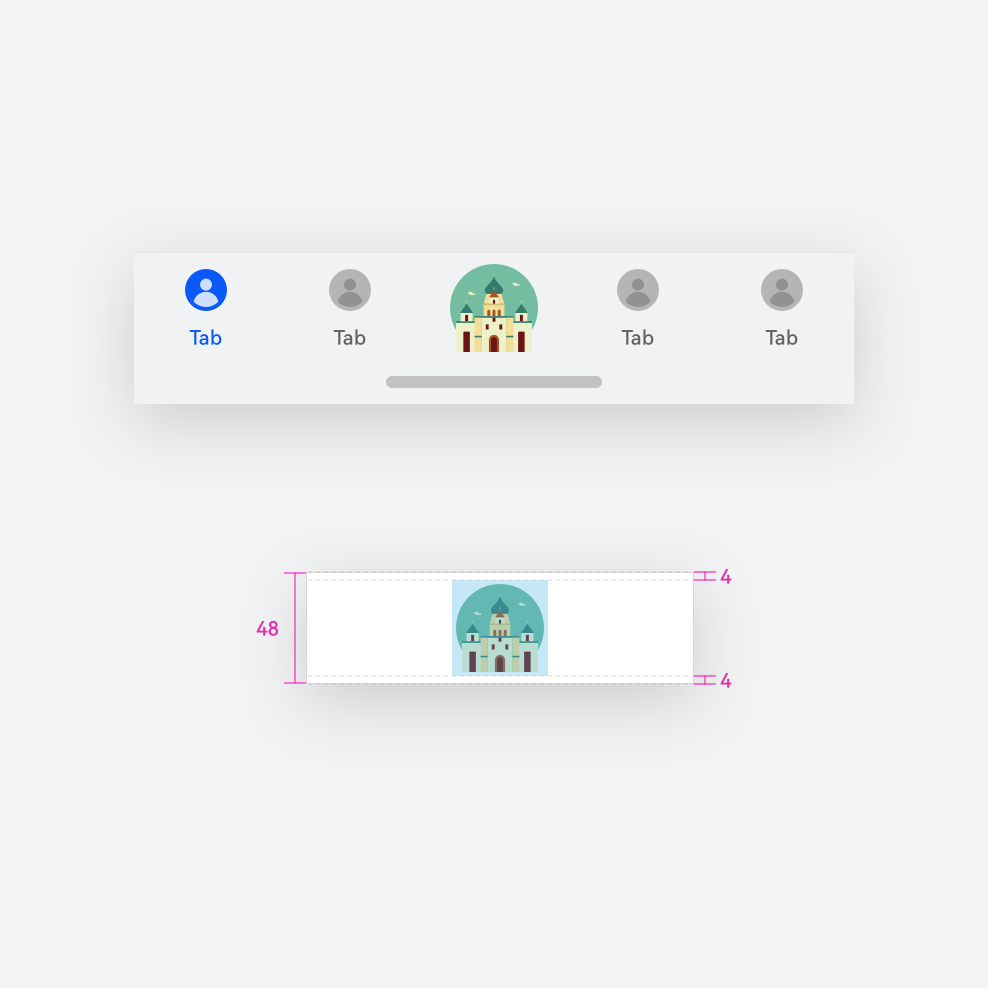 |
| **平铺式默认页签样式**  图标大小默认为 24\*24vp | **平铺式自定义运营页签样式**  图标居中对齐显示，保证上下安全间距为 4vp |

**页签标签应使用简洁的文字或图标表达，让用户一目了然。**被激活的页签应有明确的视觉反馈，如使用品牌高亮色显示，或增加激活动效提升设计细节和品质感。避免在页签中放置次要或高级功能入口，以免分散用户注意力，对于未激活的页签应当弱化展示效果，通过降低透明度或者将颜色置灰来对图标和文本进行处理。在文本的处理上要减少字符串的使用，在 2-4 个字符串以内明确概述页签的功能，英文和多语言场景下尽量使用一个单词或一个词组来展示。

**使用 HarmonyOS Symbol 来展示图标信息**。在底部页签中可以替换系统 [Symbol](https://developer.huawei.com/consumer/cn/doc/harmonyos-references/ts-basic-components-symbolglyph) 样式来更灵活的展示图标信息，这种方式更匹配文本的展示效果，同时提供点击反馈，更直接的展示界面设计的细节。开发者可以在 [HarmonyOS Symbol](https://developer.huawei.com/consumer/cn/design/harmonyos-symbol/) 开源网站上查询目前已经存在的图标样式。

### 视觉规则

### 视觉反馈

点击切换页签时需要明确的切换行为告知，若点击当前页签，界面会回滚至页面顶部或指定位置。页签在切换时，选中态有细微的点击弹跳动效，推荐使用[Symbol（BounceSymbolEffect-EffectDirection.DOWN）](https://developer.huawei.com/consumer/cn/doc/harmonyos-references/ts-basic-components-symbolglyph#bouncesymboleffect12)。有关底部页签展示 Symbol 能力接口和动效能力可查阅 [TabBarSymbol](https://developer.huawei.com/consumer/cn/doc/harmonyos-references/ts-container-tabcontent#tabbarsymbol12对象说明) 开发文档。

在悬浮底部页签区域滑动切换页签，为避免手势冲突，不支持通过横滑内容切换底部页签。

### 沉浸光感

在移动应用的用户体验中，用户启动应用后第一时间感知到的首眼体验，承载着确立产品调性、建立操作预期、引导用户路径的多重职能。[沉浸光感](https://developer.huawei.com/consumer/cn/doc/design-guides/immersivelight-0000002612101053)为底部页签组件提供更加沉浸的应用首眼体验。

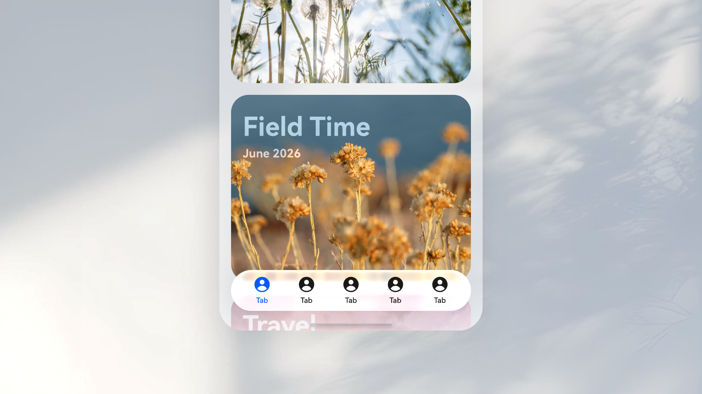本节中沉浸光感图示效果部分为强档效果，并非组件的默认效果。更多沉浸光感效果请参阅：[沉浸光感](https://developer.huawei.com/consumer/cn/doc/design-guides/immersivelight-0000002612101053)。

在之前的设计中，控件通常以不透明或高对比的方式覆盖于内容之上，形成明确的视觉截断；而沉浸光感材质通过对背景内容的折射、模糊与透射，使控件层在保持可识别性的前提下，与内容层建立视觉上的连续性。用户感知到的不再是内容与组件的割裂感，而是内容穿过控件介质的空间纵深感受，这种空间连续性显著增强了界面的整体沉浸感。

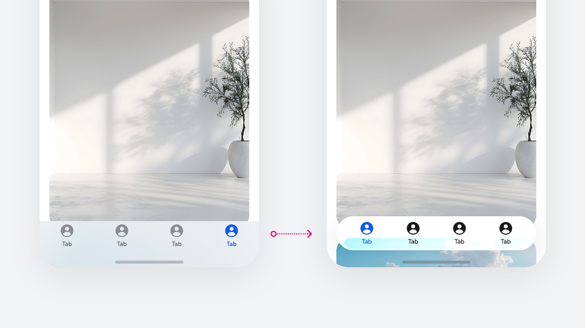

**在内容滚动与界面交互过程中，通过渐变蒙层强化控件层与内容层的空间关系。**当内容区域与底部页签区域产生重叠时，过渡区域采用颜色渐变的方式，使内容向控件的过渡呈现自然的衰减而非生硬的截断，增加沉浸感的同时，减少内容区对底部页签的干扰。

与标题栏不同，底部页签的主要信息由容器承载，而标题栏存在无容器承载的重要信息内容，所以顶部采用渐变模糊增强标题信息可读，底部采用渐变颜色增强界面空间感。

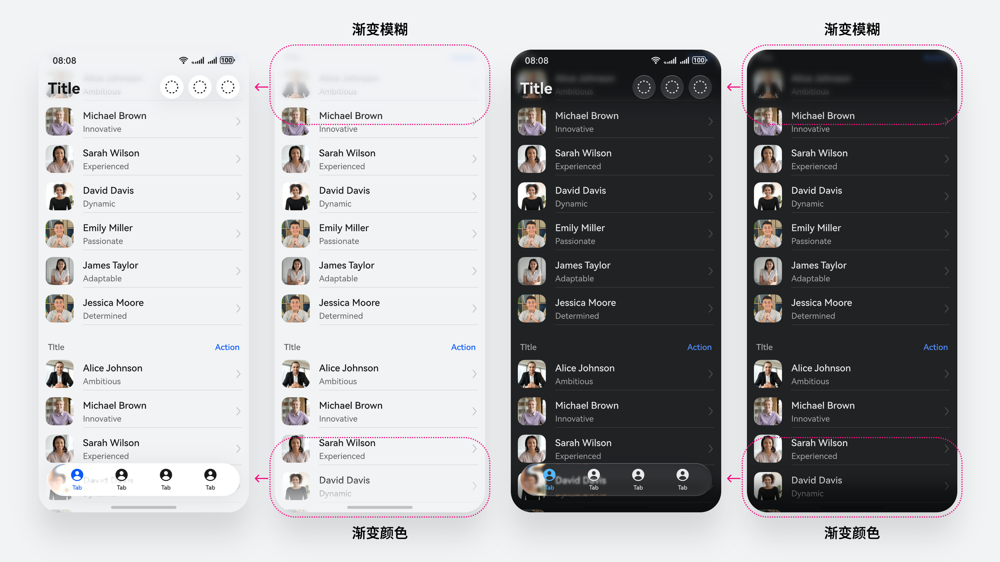

渐变颜色层建议较底部内容最顶边高 16 vp，渐变颜色需与页面背景色保持一致。

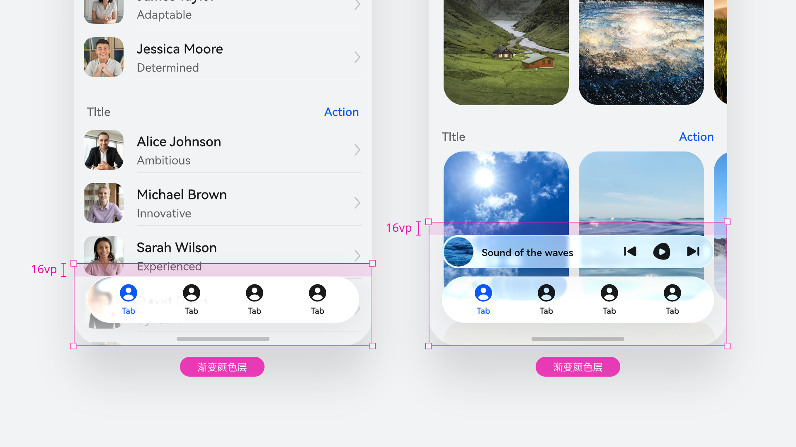

**为了进一步保障标题内容可读性，建议在内容复杂、色彩丰富的页面使用动态反色能力。**通常底部页签中的颜色属性有浅色模式和深色模式两种色彩配置方案，动态反色是指在底部页签下方内容与标题栏重叠情况下出现可读性问题时，底部页签中的容器材质、图标、文本等内容颜色在深浅色模式两种色彩方案中进行动态切换，以提高复杂场景中底部页签内容的可读性。

**光感形变交互**

光感交互是手指触控位置与视觉效果相结合，模拟真实物理界面中触摸可发光变形事物的视觉反馈。当用户与底部页签中的按钮产生交互时，指尖位置被定义为动态光源和材质受力点，向周围材质表面投射光晕，照亮容器边缘，光照强度随距离衰减，同时使容器向手指位置形变。这一交互反馈使操作行为本身成为界面光学环境的变化源，用户通过视觉即可感知交互的进程与状态。

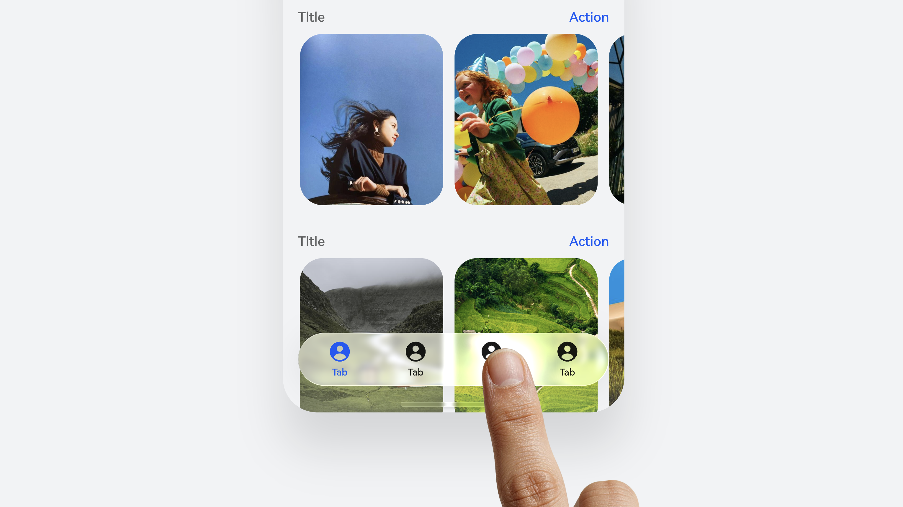不同颜色的光感效果不一致，建议使用组件提供的默认光效属性。如需修改光效颜色，建议使用低透明度，高亮度的色彩。

### 模糊材质

使用平铺式底部页签样式时，可以通过模糊材质实现更高级的视觉效果。

使用 Ark UI 的底部页签控件，实现模糊效果之前需要配置底部页签 [barOverlap](https://developer.huawei.com/consumer/cn/doc/harmonyos-references/ts-container-tabs#baroverlap10) 属性为 true，将底部页签覆盖在内容区之上，再通过 [barBackgroundColor](https://developer.huawei.com/consumer/cn/doc/harmonyos-references/ts-container-tabs#barbackgroundcolor10) 和 [barBackgroundBlurStyle](https://developer.huawei.com/consumer/cn/doc/harmonyos-references/ts-container-tabs#barbackgroundblurstyle11) 属性结合实现，模糊材质本身已经包含一层背景色，因此 barBackgroundColor 需要设置为透明度模式，否则也会被模糊材质影响。如果你希望自定义模糊效果，可以通过 [BackgroundEffectOptions](https://developer.huawei.com/consumer/cn/doc/harmonyos-references/ts-universal-attributes-background#backgroundeffectoptions11) 进行对容器背景效果的自定义。

使用 HDS 底部页签控件，默认带有模糊背板属性。同时，HDS 的底部页签控件，提供了两种模糊类型：

* 背板模糊：对底部页签的背景进行均匀的模糊处理，模糊强度一致，边界清晰，用于强调控件与内容的层级分隔。
* 渐变模糊：模糊效果在空间维度上呈现渐强/渐弱的变化，模糊边界柔和，用于增强页面沉浸感。

HDS 底部页签控件开发相关描述请参阅 [HDS Tabs](https://developer.huawei.com/consumer/cn/doc/harmonyos-references/ui-design-hdstabs) 文档。

**背板模糊**

在底部页签中，背板模糊作为独立视觉层级存在，与内容层形成悬浮空间关系，适用于页面内容与底部页签产生交叠的场景。

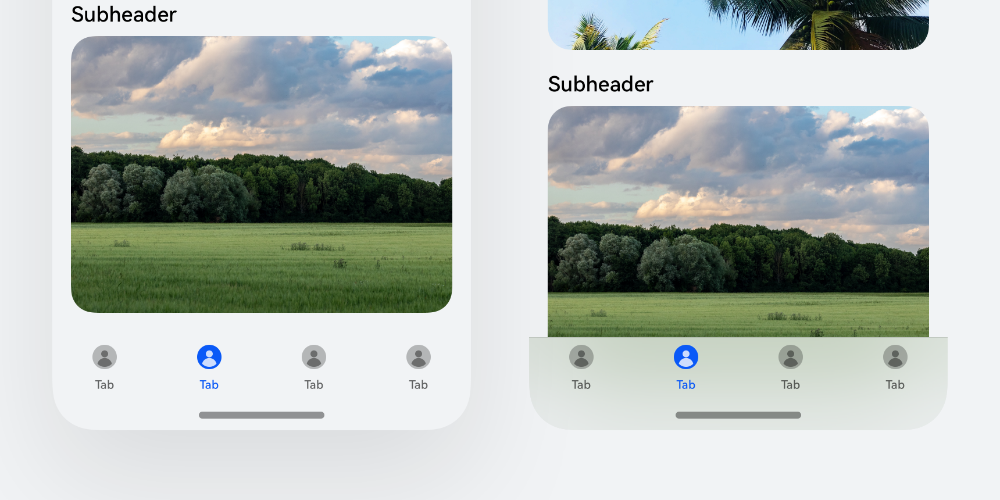

**通过提亮压暗增强色彩活力。**底部页签的背板模糊默认带有提亮压暗属性，能够激发色彩活力，提高背板通透度。

**通过分割线提高内容边界可识别性。**为避免视觉认知障碍问题，默认情况下，模糊背板上边缘带有一条 1 px 的分割线。

**通过微动效增强内容触底的暗示。**当页面内容离开底部页签区域后，默认触发模糊 & 分割线渐变隐藏，增强触底操作的心理暗示。

**渐变模糊**

渐变模糊与页面内容的融合度更高，通过弱化视觉边界，以延展页面空间，但渐变模糊会增高页签占用面积、降低页签内容可读性，因此仅适用于部分特定场景。

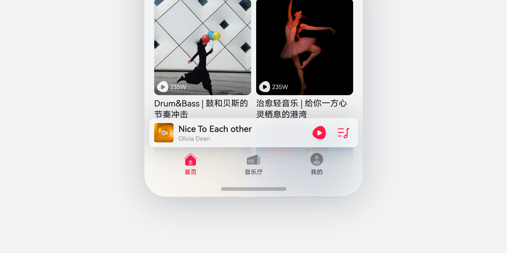

### 布局规则

### 悬浮式页签

**样式类型**

沉浸光感底部页签组件提供多种适配样式类型，包含居中布局、左右布局、上下布局形式，满足更多场景的定制化需要。左右布局和上下布局中的 MiniBar 可用于放置页面常驻且可交互的操作功能组，与 Tabs 相互结合为用户带来全新的底部页签交互体验。

|  |  |
| --- | --- |
| 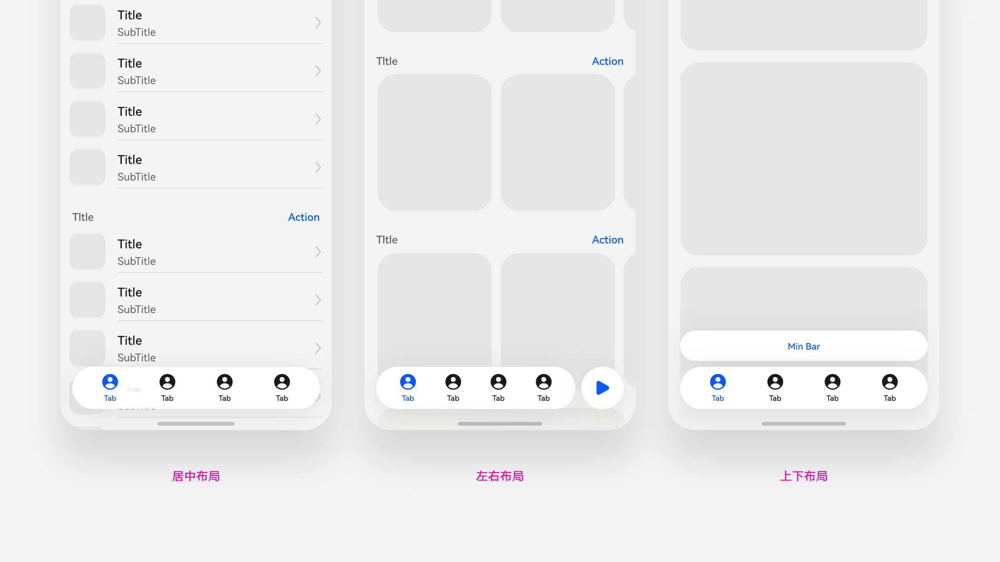    布局样式 | |
|  | |
| 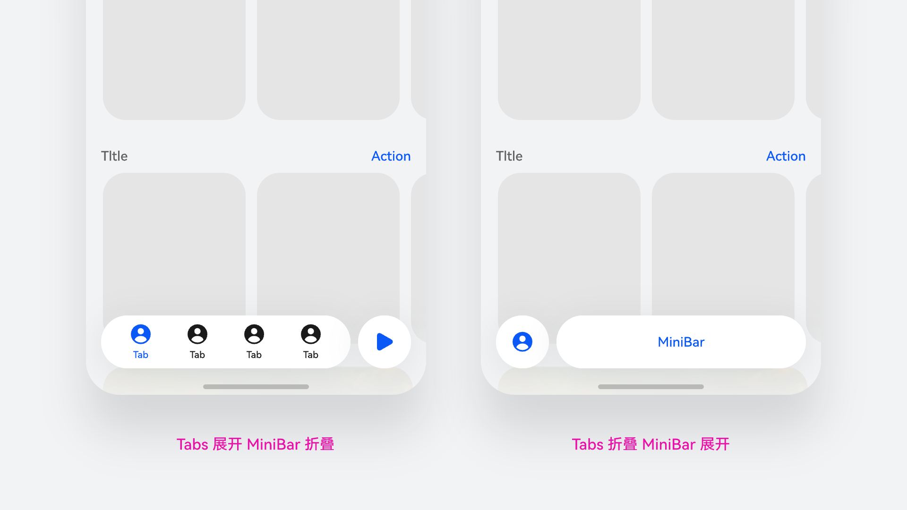  左右布局变体 | 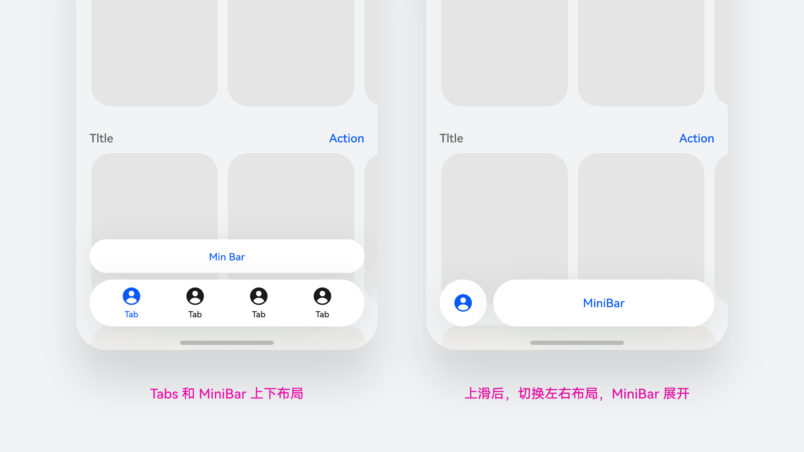  上下布局变体 |

**居中布局**

底部页签由胶囊型矩形容器承载，高度统一为 56 vp。容器的宽度对内容布局的舒适度产生重要影响，所以不同的 Tabs 数量需要采用不同的宽度。由于设备众多，为适配不同的设备大小，容器宽度需要基于断点规则计算得出，不推荐设置固定的底部页签宽度，易导致部分设备或场景的体验问题。

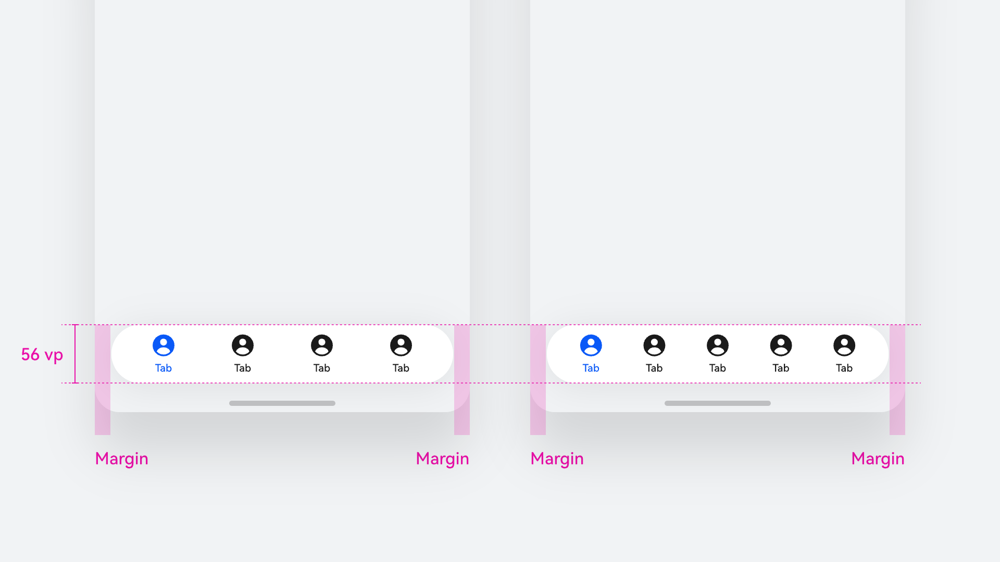

宽度由计算得出，使用 [HdsTabs](https://developer.huawei.com/consumer/cn/doc/harmonyos-references/ui-design-hdstabs#hdsbarwidthrangeoptions) 组件，宽度默认基于不同断点进行自适应计算，具体断点规则请参阅开发接口 [HdsBarWidthRangeOptions](https://developer.huawei.com/consumer/cn/doc/harmonyos-references/ui-design-hdstabs#hdsbarwidthrangeoptions) 。

Tabs 容器宽度有最大值限制。当配置 Tabs 数量大于等于 5 个时，最大值限制为 360 vp，即在宽屏设备上显示的最大宽度为 360 vp；当配置 Tabs 数量为 4 个时，最大值限制为 328 vp。

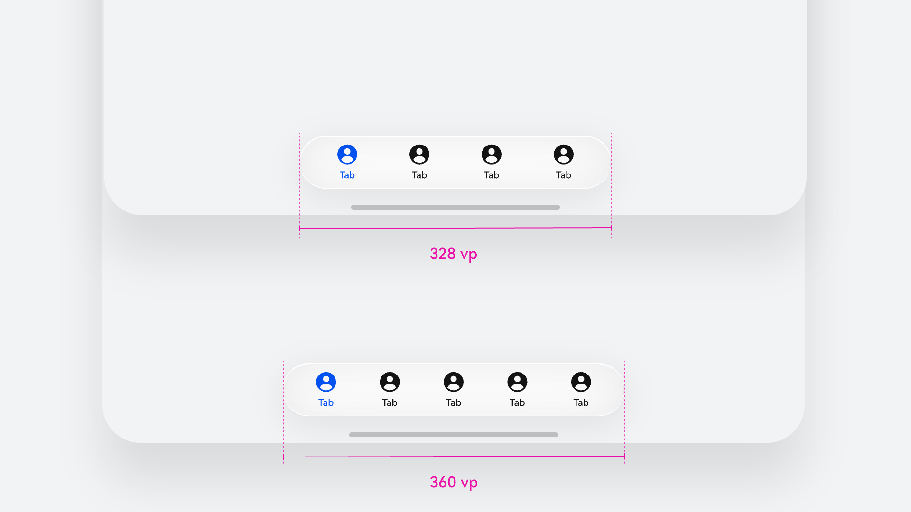

在平板设备上，建议整体放大1.15倍，在宽屏设备上提高易读性和易用性。

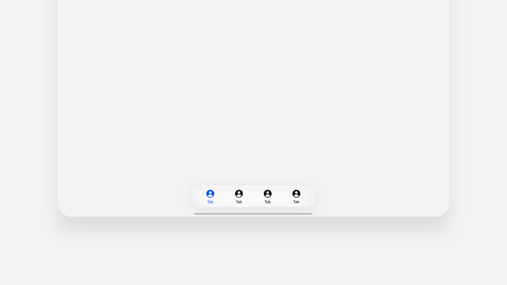

若 Tabs 配置个数为 2 个或 3 个时，则采用固定宽度，根据窗口宽度断点采用不同的宽度。

|  |  |
| --- | --- |
| 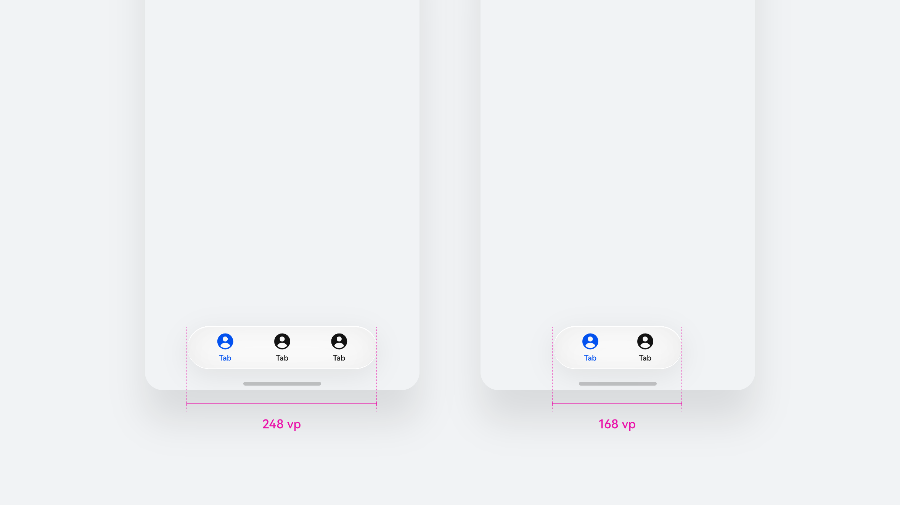  窗口宽度小于 600 断点时，3 个 Tabs 固定宽度 248 vp；2 个 Tabs 固定宽度 168 vp | 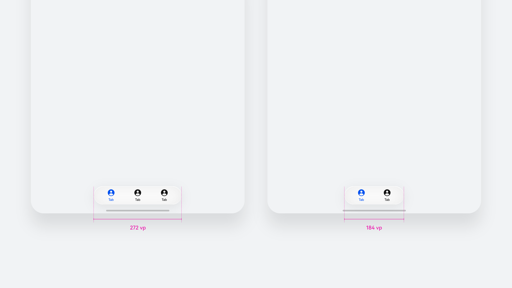  窗口宽度大于等于 600 断点时，3 个 Tabs 固定宽度 272 vp；2 个 Tabs 固定宽度 184 vp |
| 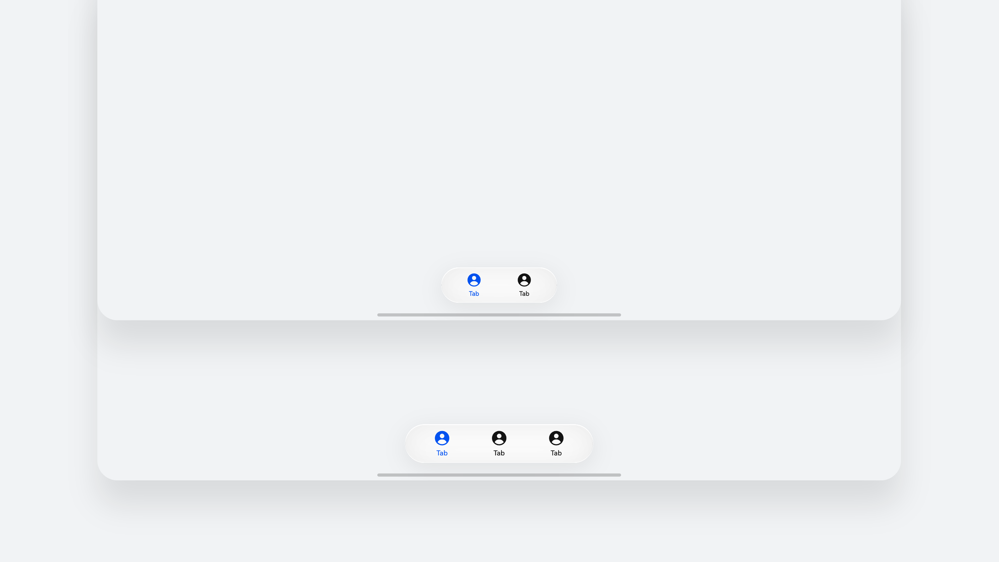 | |
| 不推荐：窗口宽度大于等于 1440 断点时，2～3 个 Tabs 视觉体量过小，交互可操作性差，不建议使用底部页签形式。 | |

**左右布局**

左右布局是在底部页签右侧增加一个 MiniBar 形式容器，与底部页签存在联动关系。该 MiniBar 可折叠展开，当底部页签展开时，MiniBar 折叠为圆形按钮，当 MiniBar 展开时，Tabs 折叠为圆形按钮。在多设备布局中，MiniBar 存在三种不同的布局方式。

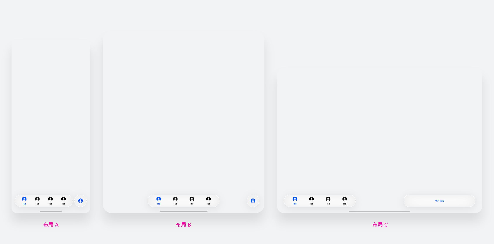

布局 A ：Tabs 和 MiniBar 整体在窗口内居中

布局 B ：展开的 Tabs 或 MiniBar 在窗口内居中，折叠后的圆形按钮位于左右两侧，距离窗口边缘 Margin 数值基于栅格断点规则

布局 C ：Tabs 和 MiniBar 分布在左右两侧，距离窗口边缘 Margin 数值。

三种不同布局形式适用的窗口断点区间不同。建议在宽度断点区间为 320～440 vp 区间使用 A 布局；440～600 vp 区间和 600～840 vp 且宽高比小于 0.8 区间使用 B 布局，600～840 且宽高比大于 0.8 区间和 840～1440 vp 宽度断点区间使用 C 布局。

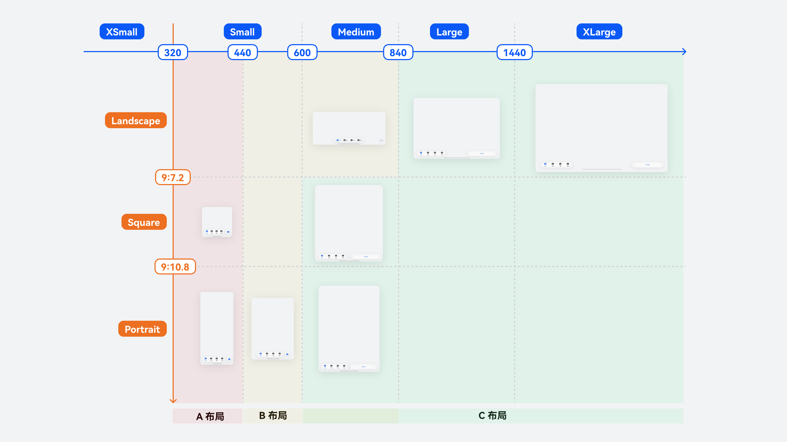

MiniBar 的宽度应与 TabsBar 宽度保持一致。

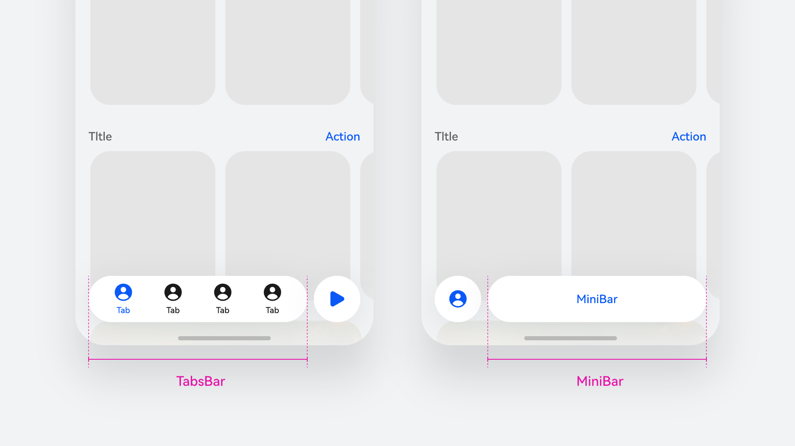

**上下布局**

上下布局是结合左右布局的一种适配类型，旨在设备宽度较窄、左右布局较为拥挤的情况下使布局更加合理。建议宽度断点在 320～440 vp 区间，根据业务场景需要使用。

上下布局分为滑动前和滑动后两种状态，滑动前 MiniBar 在 TabsBar 上方，距离 TabsBar 顶部 8 vp，滑动后 切换为左右布局，此时 TabsBar 收起成为圆形按钮，MiniBar 展开。若点击 折叠后的 TabsBar 圆形按钮，则会切换回滑动前上下布局的样式。

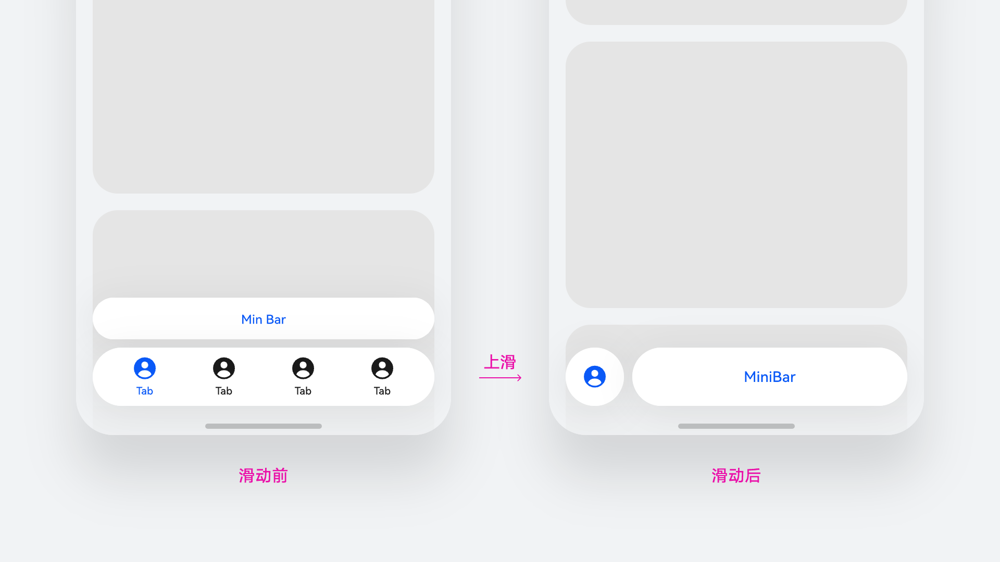

采用上下布局时，为保障滑动前后 TabsBar 总宽度一致，在默认情况下，滑动后的 MiniBar 有最大宽度限制，当 Tabs 配置个数为 5 个时，最大宽度限制为 264 vp，当 Tabs 配置个数为 4 个时，最大宽度限制为 296 vp

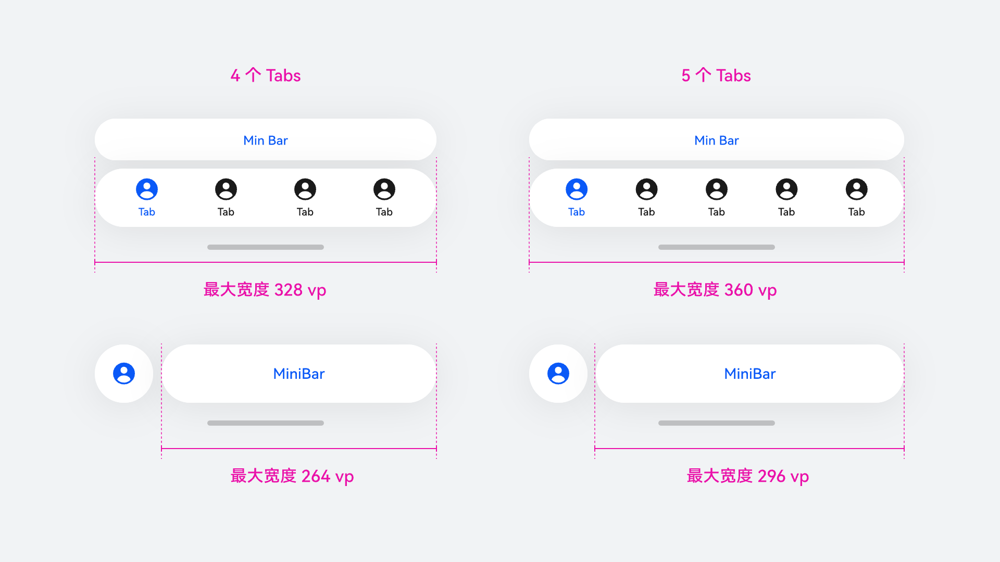

**宽屏跟手**

8 栅格以上尺寸支持配置组件跟随交互手的体验，以提升宽屏设备的操作效率，单手操作时底部页签会移动到操作手的一侧。

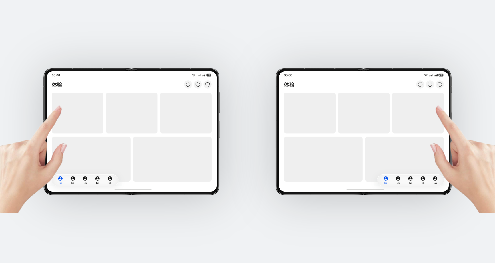

**滑动跟手隐藏**

在沉浸浏览和屏幕高度较小的设备商，为了提供更大的内容显示空间，悬浮底部页签支持设置为跟手滑动隐藏。

### 平铺式页签

**手机设备 - 布局结构**

该布局适用于直板机竖屏、折叠机展开态横竖屏和平板竖屏，默认单个组件宽度根据个数在内容宽度内水平均分，最多允许放 5 个。文字范围在单个页签范围内两边保持安全间隔。

|  |  |
| --- | --- |
|  |  |

**手机设备 - 左右结构**

在一些特殊场景下，例如手机进入横屏状态，此时的屏幕显示区域处于高度较矮、宽度较宽的场景时，为了更有效的利用可展示区域，底部页签可以修改为左右布局来进行展示。可以查阅底部页签的 [LayoutMode](https://developer.huawei.com/consumer/cn/doc/harmonyos-references/ts-container-tabcontent#layoutmode10) 接口进行了解，配置其样式为 HORIZONTAL。需要注意，当布局修改为左右布局时，文本会从默认的 10vp 放大为 12vp，从而达到文本与图标视觉上的协调性。

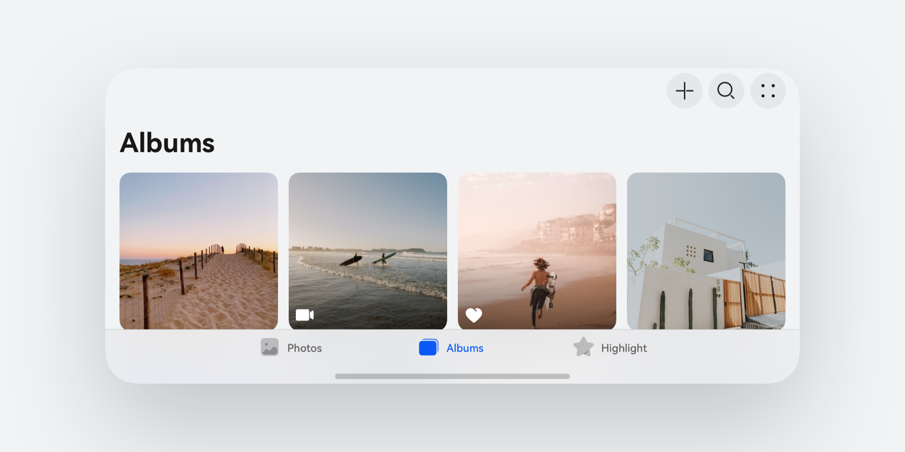

**手机设备 - 分栏布局跟随导航结构**

在业务的实际使用场景下会出现应用使用分栏布局进行适配，此时底部页签需要跟随应用导航结构明确展示层级，使用跟随应用的一级分栏，避免底部页签的展示始终凌驾于全量界面之上。

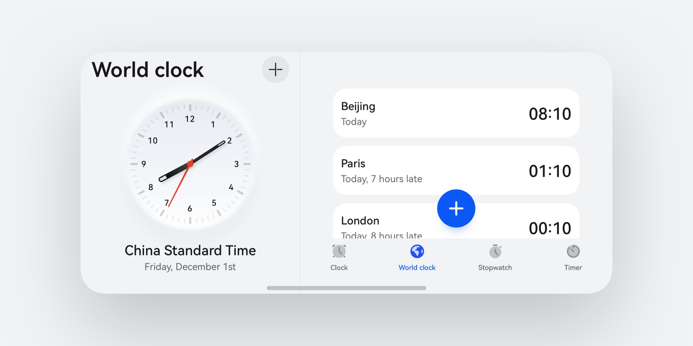

**平板设备 - 横屏布局**

平板横屏情况下，底部页签可以通过 Tabs 组件的 [Vertical](https://developer.huawei.com/consumer/cn/doc/harmonyos-references/ts-container-tabs#vertical) 属性配置为竖状侧边导航，侧边导航固定在页面左侧。也可以通过动态配置规则，基于屏幕断点规则，当断点属于 840vp 以下时使用底部页签，在 840vp 以上时使用侧边页签。

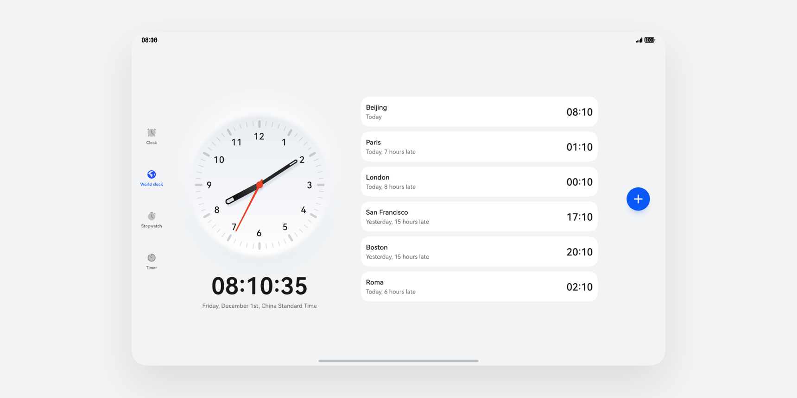

**使用分割线区隔内容**

基于应用的场景和规则，如果需要明确区分页签与内容区的边界时，可以使用分割线来进行区分，通过 [divider](https://developer.huawei.com/consumer/cn/doc/harmonyos-references/ts-container-tabs#divider10) 接口进行配置。

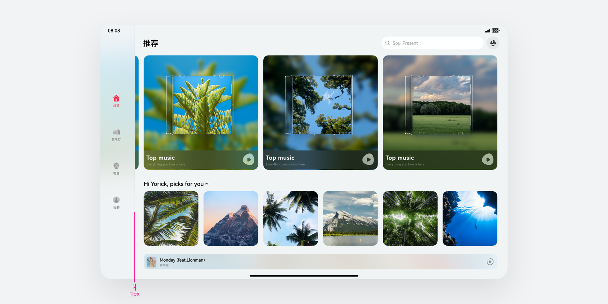

### 开发文档

[Tabs](https://developer.huawei.com/consumer/cn/doc/harmonyos-references/ts-container-tabs)

[HdsTabs](https://developer.huawei.com/consumer/cn/doc/harmonyos-references/ui-design-hdstabs)

[TabContent](https://developer.huawei.com/consumer/cn/doc/harmonyos-references/ts-container-tabcontent)

[Navigation](https://developer.huawei.com/consumer/cn/doc/harmonyos-references/ts-basic-components-navigation)

[HdsNavigation](https://developer.huawei.com/consumer/cn/doc/harmonyos-references/ui-design-hdsnavigation)

[ExpandSafeArea](https://developer.huawei.com/consumer/cn/doc/harmonyos-references/ts-universal-attributes-expand-safe-area)

[HdsSideBar](https://developer.huawei.com/consumer/cn/doc/harmonyos-references/ui-design-hdssidebar)