# 色彩选择器

色彩选择器支持用户通过多种方式精确选取、调整并实时预览颜色。

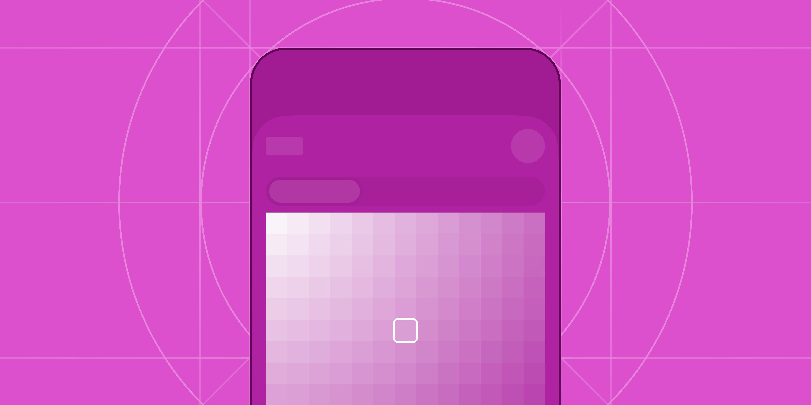

### 如何使用

色彩选择器支持网格、光谱、滑块等主要选色方式，不透明度调整，屏幕取色与色值输入等次要选色方式，以及收藏常用颜色的功能，从而提高选色效率，常用于个性化配置颜色的场景，如画笔颜色、壁纸主题颜色等。

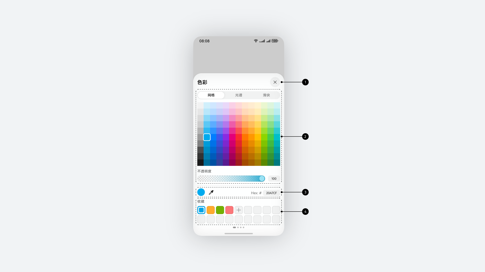

|  |  |  |
| --- | --- | --- |
| **序号** | **元素名称** | 描述 |
| **1** | **标题行** | 标题为色彩。 |
| **2** | **主要选色工具区** | 可选网格、光谱、滑块工具，支持不透明度调节。 |
| **3** | **次要选色工具区** | 展示当前颜色，支持屏幕取色、色值编辑功能。 |
| **4** | **颜色集** | 允许用户保存和管理颜色。 |

**确保色彩选择器实时更新颜色的同时，业务场景也同步反馈新颜色的视觉效果，**以允许用户能够实时确认颜色选择的结果。

**根据业务场景需要为用户提供合适的选色工具。**色彩选择器提供网格、光谱和滑块三种主要选色工具，可选择三种工具中的一个、两个或全部。

* **网格**工具提供离散的标准颜色选项，适用于快速选择且不需要精细颜色控制的场景，如PDF标注等场景。网格工具不能细致地调节颜色，不建议在绘画、修图等场景中使用。
* **光谱**工具提供连续颜色空间的展示，适用于精细探索不同颜色在业务场景中的直观视觉效果，如主题、装扮等场景。光谱工具难以在多次选色中选择到完全一致的颜色，不建议用于图表系列、分类标签管理等需复用相同色值的场景。
* **滑块**工具提供HSB颜色空间的维度滑块，允许用户在完整的颜色空间中选色，适用于专业用户对颜色精细控制的场景，如绘画、建模等专业工具。滑块工具对于普通用户理解有难度，选择颜色需要多次操作组合，不能直观看到颜色变化，可考虑配置。

|  |  |  |
| --- | --- | --- |
| 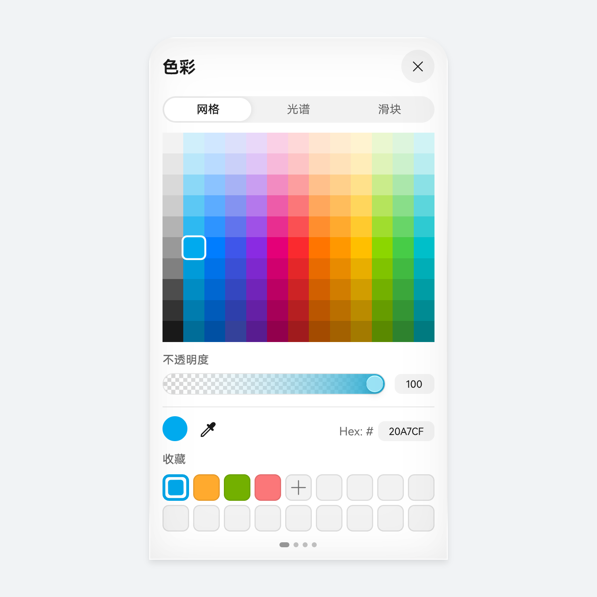 | 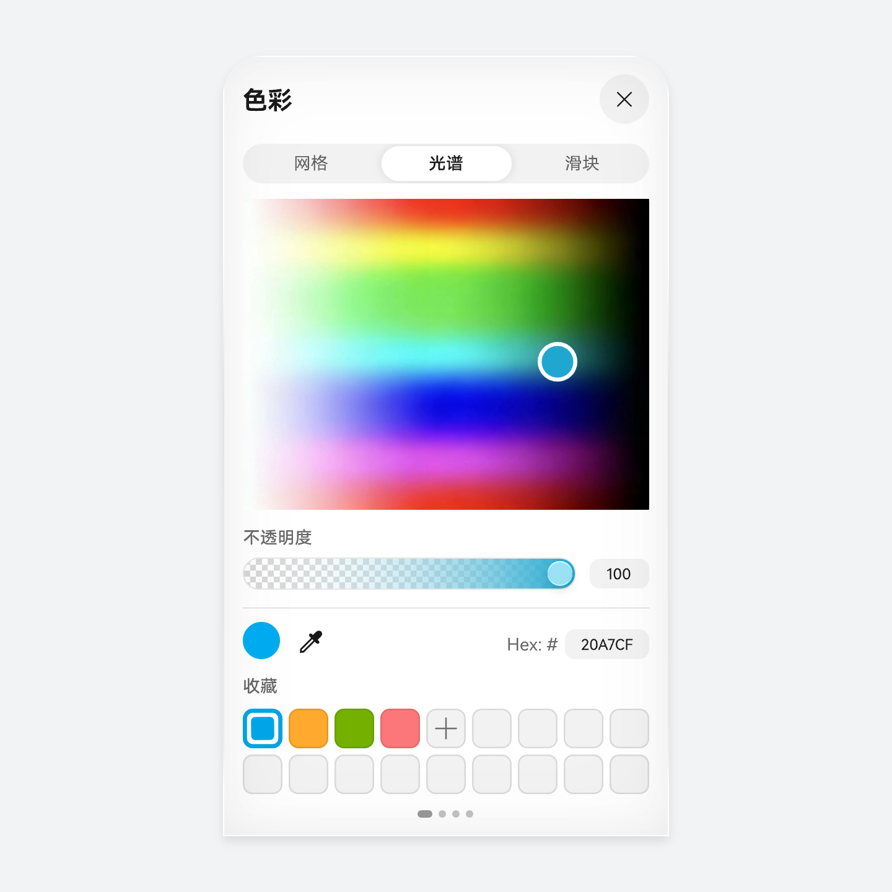 | 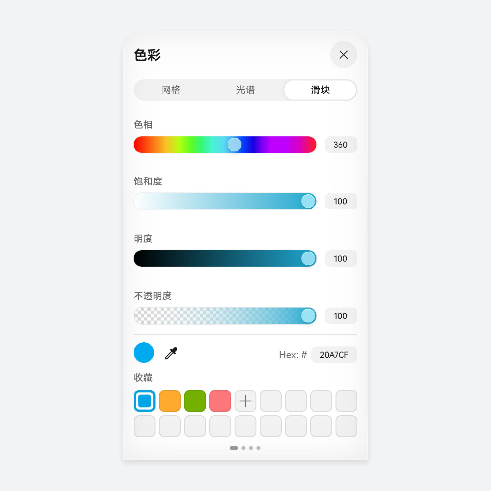 |
| **网格选色** | **光谱选色** | **滑块选色** |

### 最佳实践

**笔记效率类**

**笔记效率类场景**的主要目的是让用户可以个性化地完成信息的记录、整理和阅读，通常包含文字编辑、纸张背景、画笔绘制等核心功能，围绕此核心场景，此类应用有如下特点：

* 色彩以少量常用色为主要高频选项。使用独立色盘提供预设颜色，不用进入色彩面板即可快速换色。
* 色彩选择器作为有限常用颜色的补充。通过点击全量色彩入口进入，为用户提供更多颜色选择。

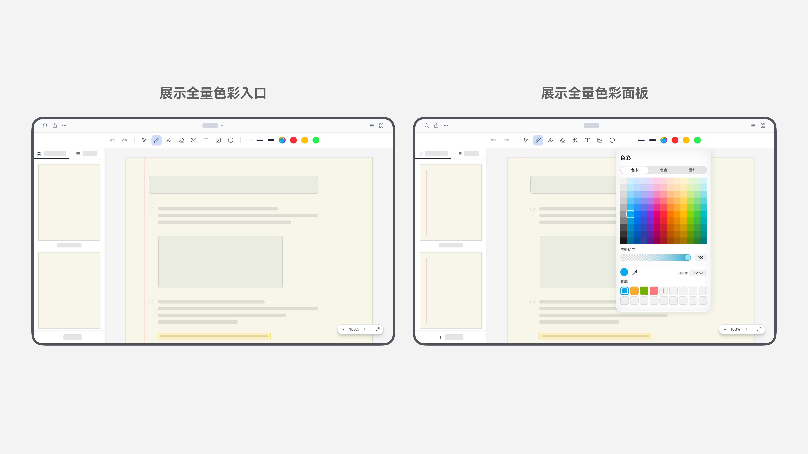

**外观配色类**

**外观配色类场景**的主要目的是让用户可以个性化地调整界面颜色，符合个人偏好的界面视觉风格，通常包括主题色选择、自定义颜色核心功能，围绕此核心场景，此类应用有如下特点：

* 便捷的风格切换和直观明显的实时视觉风格预览。提供全量色彩入口在独立色盘中，允许用户个性化调整自己想要的颜色，并同步更新色彩。
* 提供一组可直接选择的主题色，允许用户快速获取推荐的色彩效果。

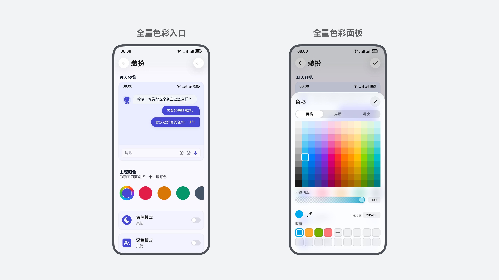

### 布局规则

色彩选择器跟随[半模态面板](https://developer.huawei.com/consumer/cn/doc/design-guides/bindsheet-0000001956852753)规范，在断点 600 以下区间使用半模态容器承载；在断点 600 以上且 9:7.2 以下区间的设备中，使用指向性 PopUp 承载。

**手机**

手机横屏与竖屏分别采用不同的布局方案。

|  |  |
| --- | --- |
| 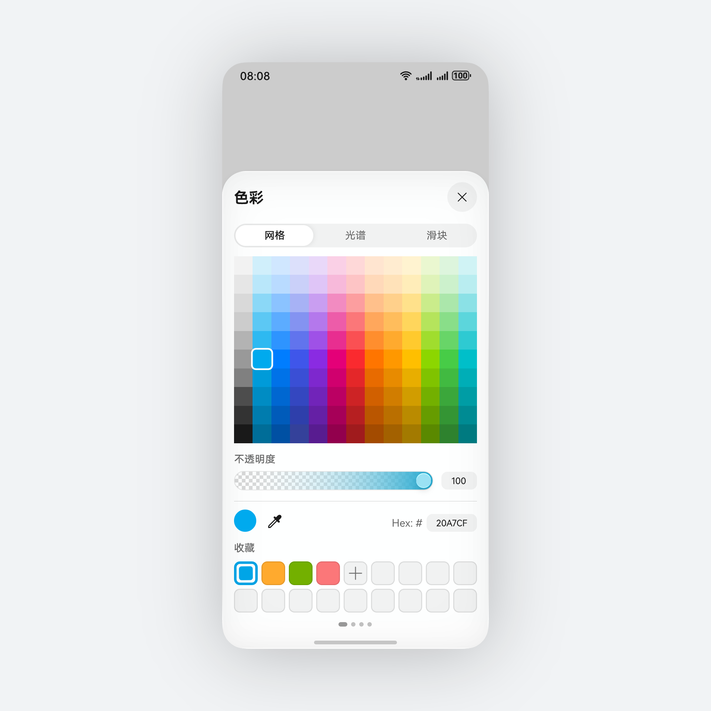 | 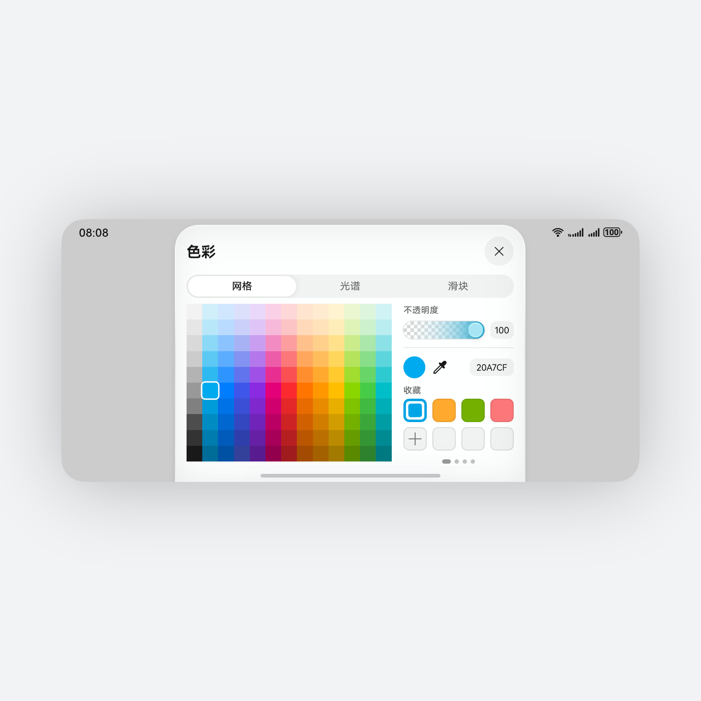 |
| **手机竖屏**  半模态容器高度根据色彩选择器中的内容高度自适应。 | **手机横屏**  跟随半模态规范，保持宽度 480vp 最大宽度，高度距离屏幕顶部 8vp 安全间距。 |

**折叠屏及平板**

指向性 Popup 容器承载色彩选择器，容器宽度保持默认 400vp，指向箭头跟随入口位置，并始终与指向目标保持 8vp 间距。

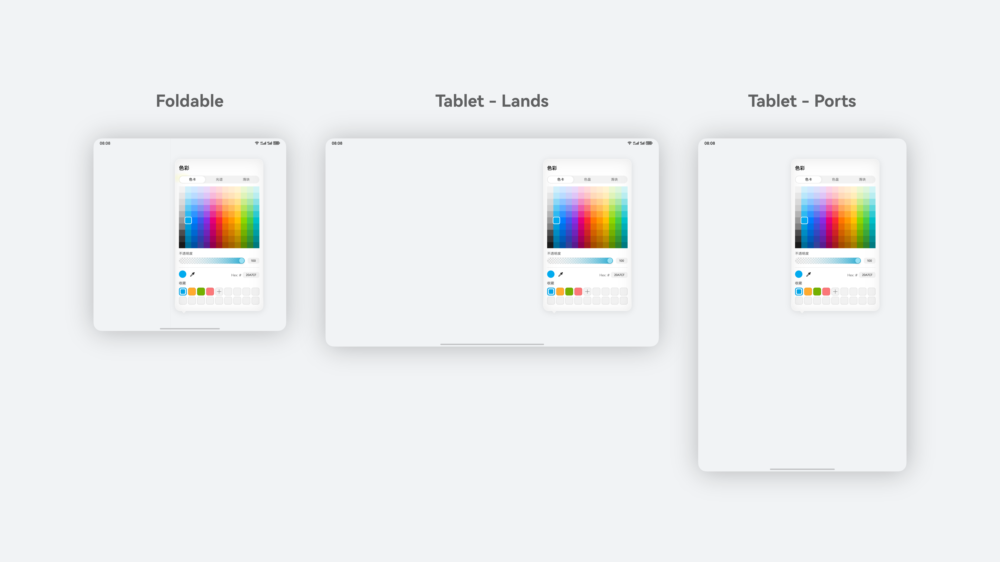

**电脑设备**

在电脑设备场景下同样使用指向性Popup容器承载。

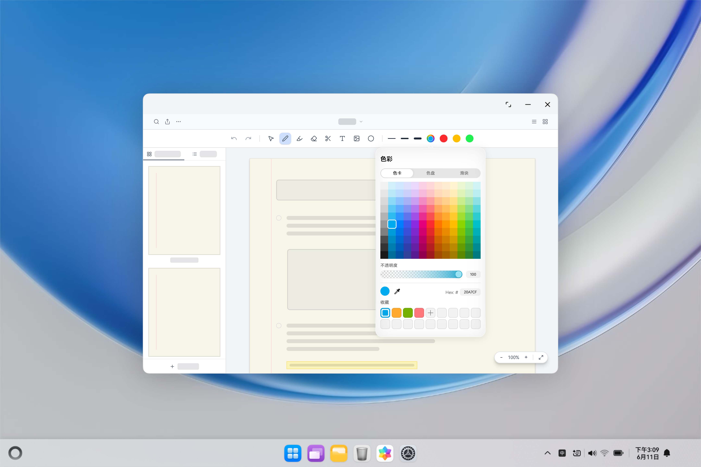