# 选择器

当需要从单个维度或多个维度进行组合选择时使用。滚轮选择器开发相关描述请参阅 [UIPickerComponent](https://developer.huawei.com/consumer/cn/doc/harmonyos-references/ts-container-ui-picker-component)。月历视图选择器开发相关描述请参阅 [CalendarPicker](https://developer.huawei.com/consumer/cn/doc/harmonyos-references/ts-basic-components-calendarpicker) 文档。

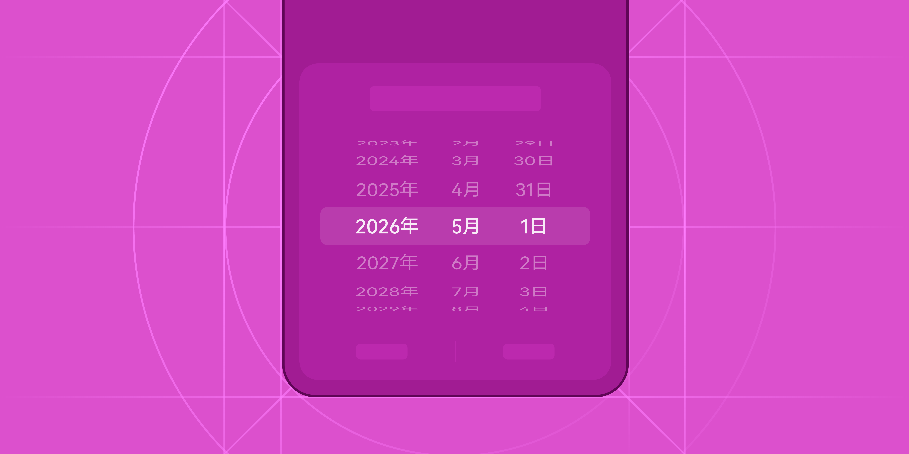

### 类型

选择器按交互形式分为滚轮选择器和月历视图选择器。

* 滚轮选择器支持自定义数据和时间日期的选择；
  + 自定义选择器可自定义维度和选项，用于展示自定义的可选内容；
  + 时间日期选择器提供常用的时间和日期的维度与选项；
* 月历视图选择器支持在月历视图下选择日期，能较为直观地看出日期和星期的关系。

|  |  |  |
| --- | --- | --- |
| 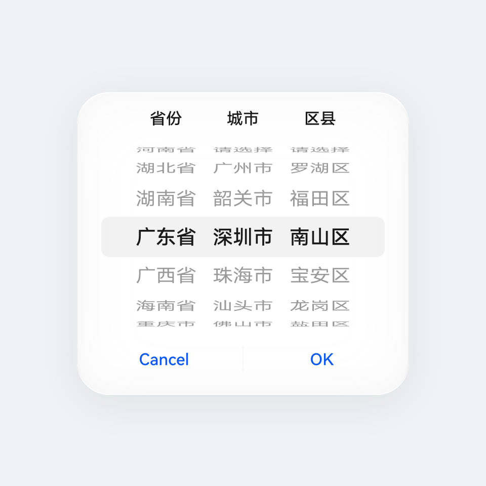 | 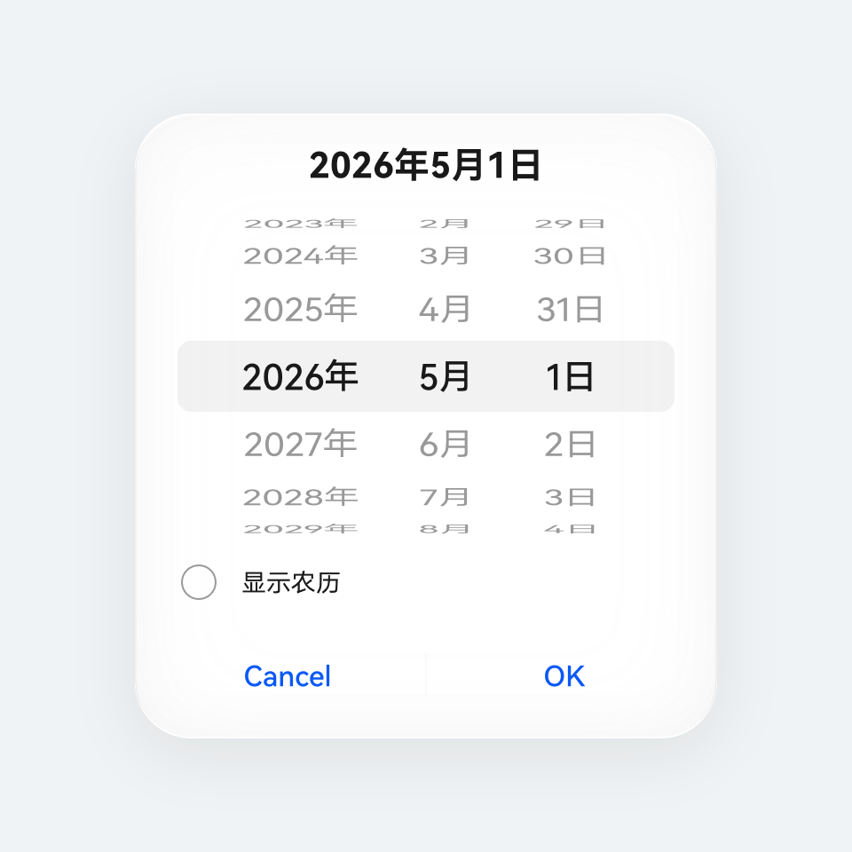 | 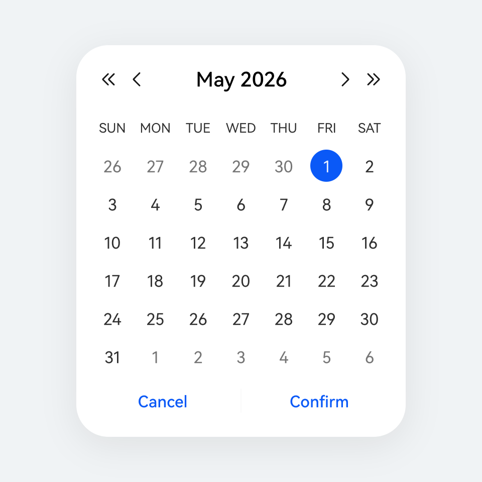 |
| **自定义选择****器** | **时间日期选择****器** | **月历视图选择****器** |

### 如何使用

通过组合选择器组件和容器组件，实现不同的选择交互效果。

* **根据业务场景选择合适的组件。**特殊内容选择可通过 [UIPickerComponent](https://developer.huawei.com/consumer/cn/doc/harmonyos-references/ts-container-ui-picker-component) 自定义实现；日期、时间选择可通过 DatePickerComponent 实现；选择日期场景也可通过 [CalendarPicker](https://developer.huawei.com/consumer/cn/doc/harmonyos-references/ts-basic-components-calendarpicker) 实现。
* **选择合适的选择器呈现方式。**自定义选择器和时间日期选择器组件可与弹出框等多种容器组件组合使用，以适配不同的选择场景。弹出框组件详细指导请参阅 [CustomDialog](https://developer.huawei.com/consumer/cn/doc/harmonyos-references/ts-methods-custom-dialog-box) 。
* 月历视图选择器以独立组件形式提供日期选择能力。

### 自定义选择器

当需要从大量单选项中做组合多个维度的单选条件时，可使用自定义选择器。用户通过滚动滚轮，从列表中选择所需信息。

* **合理配置滚轮选项的内容与尺寸，避免内容被截断或折行，确保选项易读性。**组合图像与文本时，建议将图像高度设为40vp及以下，避免图片过大被裁剪。若字符超长，可调整字号、启用文本截断或自动滚动以适配展示。
* **预设高频使用的默认选项，和易于理解的排列顺序。**默认选项应贴合多数用户的实际场景，以减少大多数用户的操作；当选项为数字时，建议选项按从小到大排序。
* **根据业务场景需求，配置滚轮选项的循环滚动。**循环滚动适用于周期性数据，如生肖、季节等，符合用户生活常识；关闭循环滚动则使数据边界更清晰，适用于年龄、体重、国家选择等场景。
* **合理选择滚轮选择器的展示形式。**滚轮选项支持自定义文本、数字、图像、Symbol 及 Row 组件；其中 Row 组件可灵活组合文本、数字与图像，以满足多样化的内容排版需求。

|  |  |
| --- | --- |
|  | 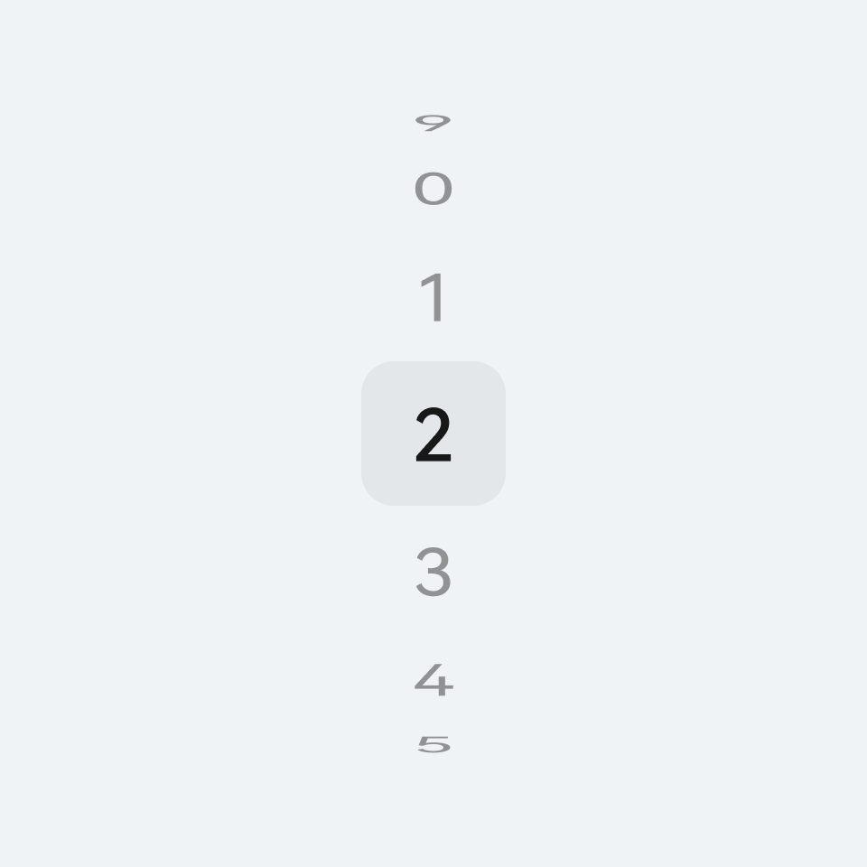 |
| **文本** | **数字** |
|  |  |
| **Symbol** | **图片** |

* 支持自定义选项高度和可见选项数量，适配不同布局需求。

|  |  |
| --- | --- |
| 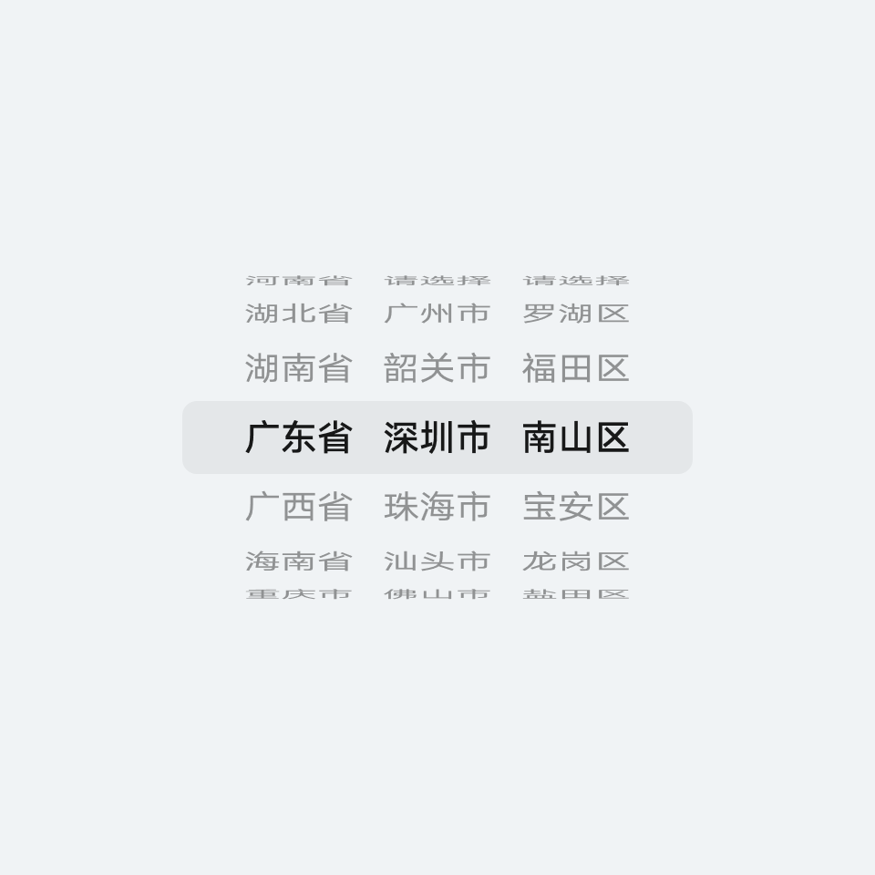 | 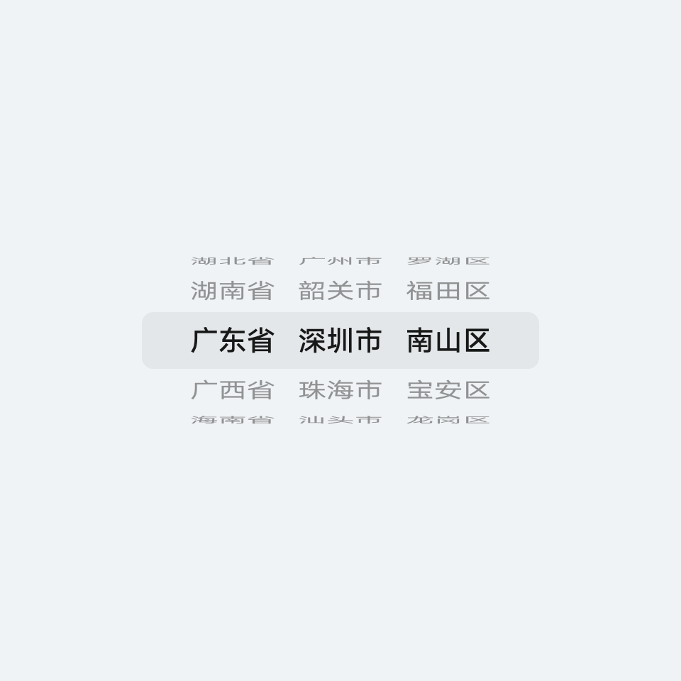 |
| **行数7行** | **行数5行** |

### 时间日期选择器

时间日期选择器基于滚轮选择器实现，提供时间和日期两种初始模式，并支持开发者根据实际需求选择时间日期选择器的包含列。同时，时间和日期的显示格式可根据用户的系统设置自动适配。

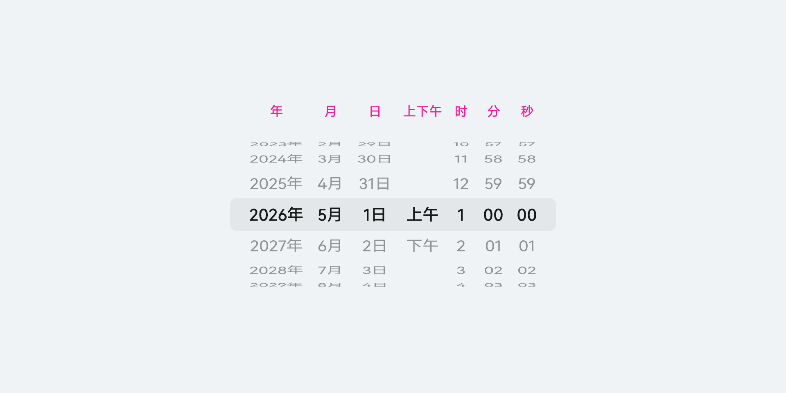

**日期**可选年、月、日列，支持中国农历。

* **可组合勾选组件以便用户切换农历与公历。**勾选组件详细指导可参阅 [Checkbox](https://developer.huawei.com/consumer/cn/doc/harmonyos-references/ts-basic-components-checkbox) 文档。

|  |  |
| --- | --- |
|  | 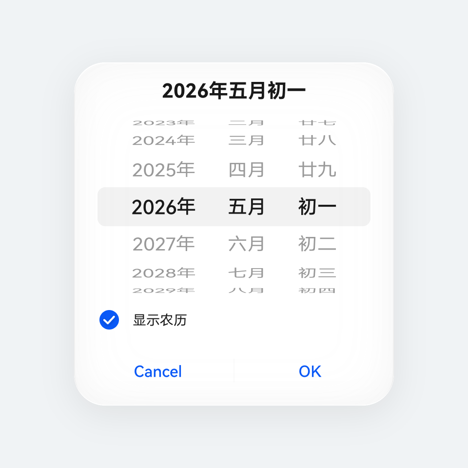 |
| **公历** | **农历** |

**时间**可选上下午、时、分、秒列，支持24小时制和12小时制。

* **根据业务需求、用户场景和地区习惯****，选择时间制式和格式。**若采用24小时制，保留时、分列；当使用12小时制时，新增上下午列。根据语言习惯灵活配置各时间维度的展示顺序、数值补零规则，并支持上下午标识随小时列循环滚动自动切换。

|  |  |
| --- | --- |
| 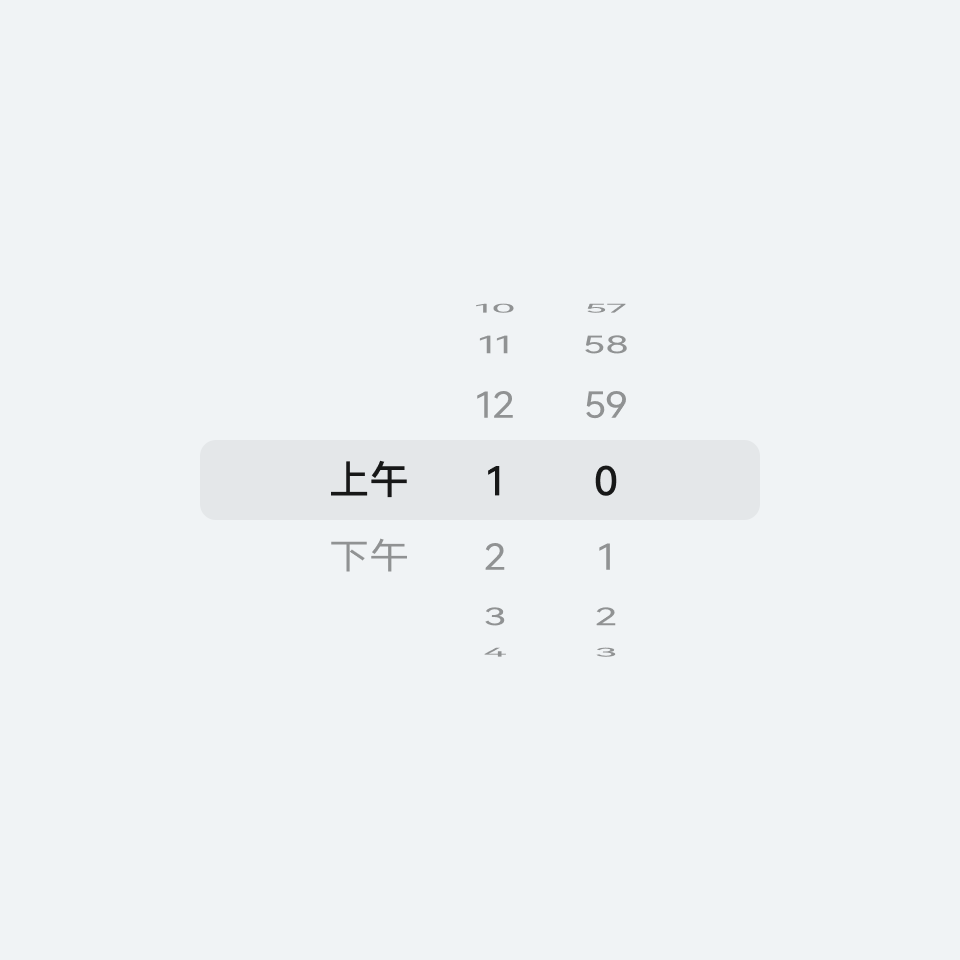 | 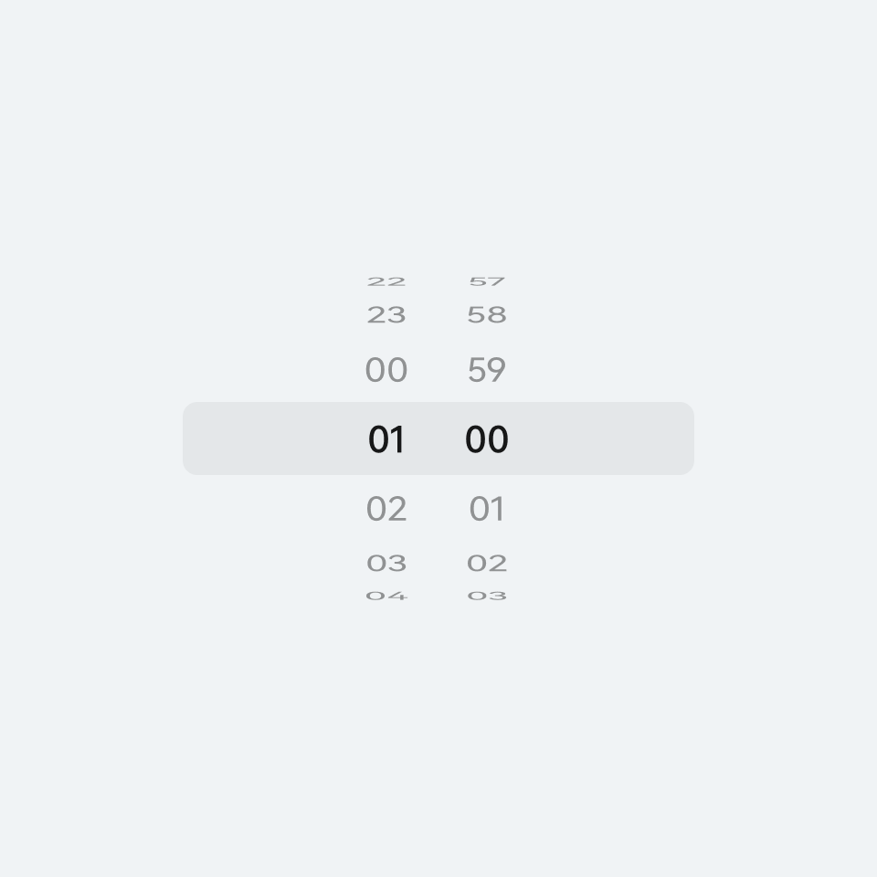 |
| **12小时制** | **24小时制** |

### 月历视图选择器

月历视图可直观呈现星期与日期的对应关系，适用于日程管理、日历查看、住宿预订等场景，用户可直接在月历视图中选择所需日期。

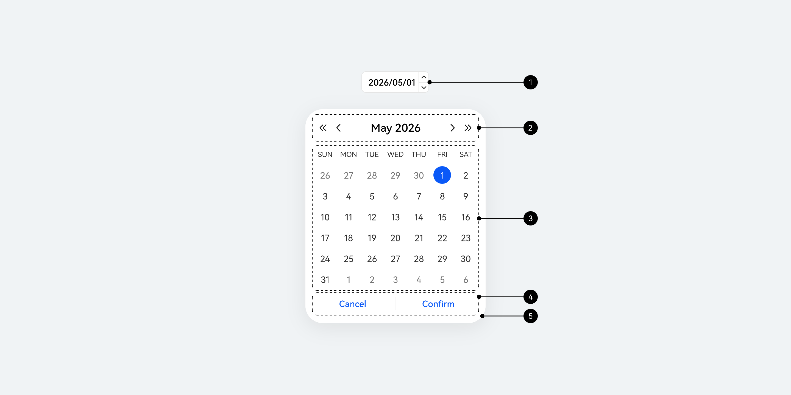

|  |  |  |
| --- | --- | --- |
| **序号** | **元素名称** | 描述 |
| **1** | **选择器入口** | 电脑必选，手机端可自定选择器入口。 |
| **2** | **标题区** | 显示选中的年月，单箭头切换月份，双箭头切换年。 |
| **3** | **内容区** | 显示日期选项，可左右滑动，可配置显示农历。 |
| **4** | **操作区** | 操作为“取消”，“确定”，电脑可选。 |
| **5** | **容器** | 弹出框。 |

月历视图选择器需包含选择器入口与选择器面板。点击选择器入口唤起月历日期选择器。

* **根据业务需求，自定义月历的选择区间。**可设定不同的时间范围，例如：生日日期不能晚于当前日期，预订车票不能选择过去的日期。

|  |  |
| --- | --- |
| 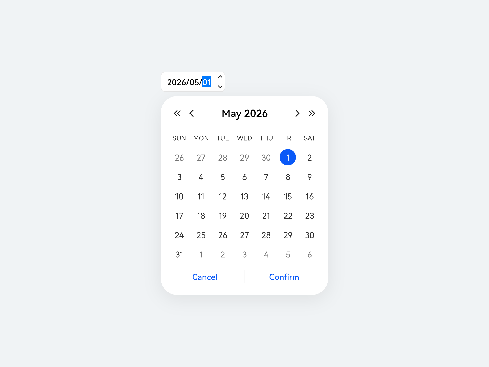 | 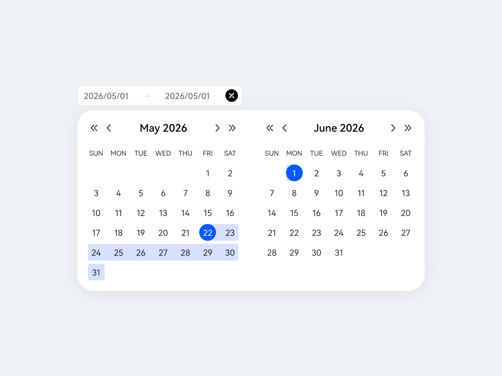 |
| **单个月历日期面板，用于选择日期。** | **连月历日期面板，在选择日期段时使用。** |

### 布局规则

**电脑****月历视图选择****器**

月历视图选择器电脑端必选月历选择入口，手机可选月历日期选择弹窗。

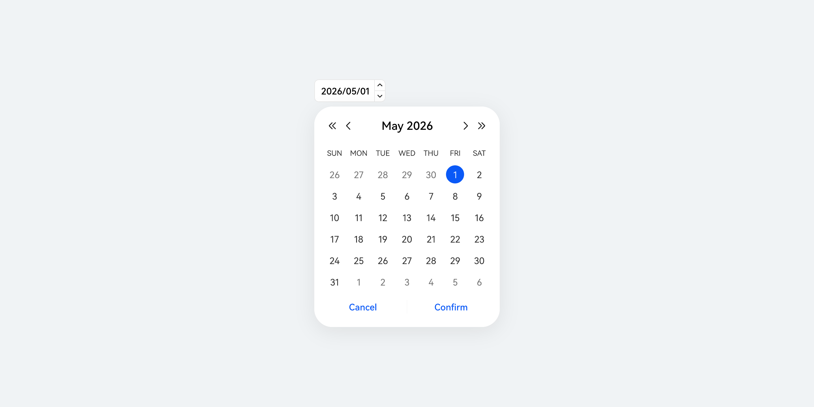

**智能穿戴滑动选择器**

当需要从单维度或多个维度单选进行组合做选择时使用。

**时间选择器**

时间选择器使用弹出框或者内嵌的方式，在智能穿戴上选择单个时间 (时 : 分 : 秒的格式) 。

例如设置闹钟/计时器

**其他选择器**

通常有两种：数字选择器，文本选择器。

* 数字选择器默认按从小到大排序。
* 根据选择项的属性选择合适的默认选项，以减少大多数用户的操作。

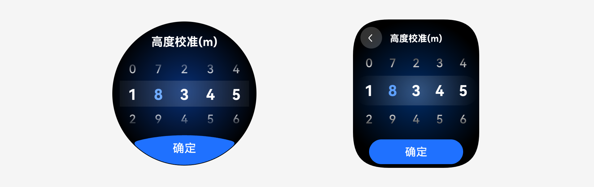

例如设置熄屏时间/高度校准

### 开发文档

[UIPickerComponent](https://developer.huawei.com/consumer/cn/doc/harmonyos-references/ts-container-ui-picker-component)

[CalendarPicker](https://developer.huawei.com/consumer/cn/doc/harmonyos-references/ts-basic-components-calendarpicker)