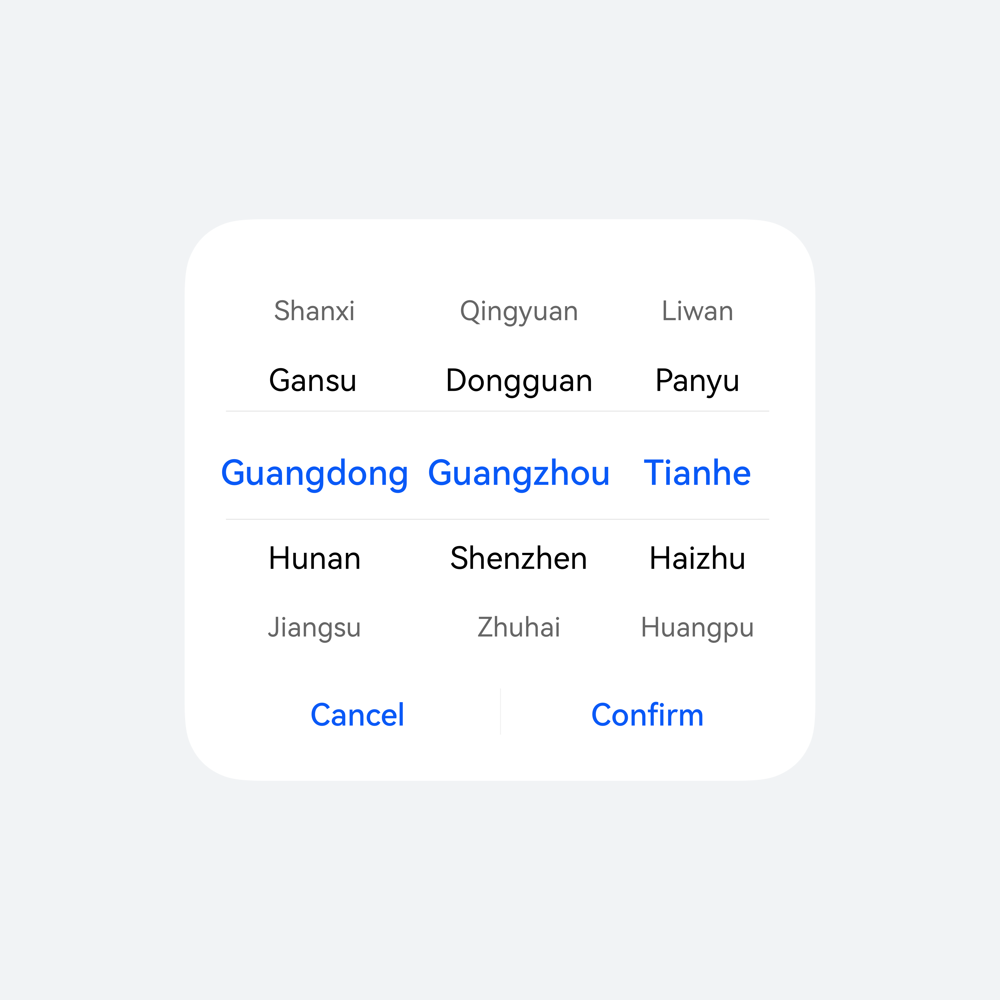
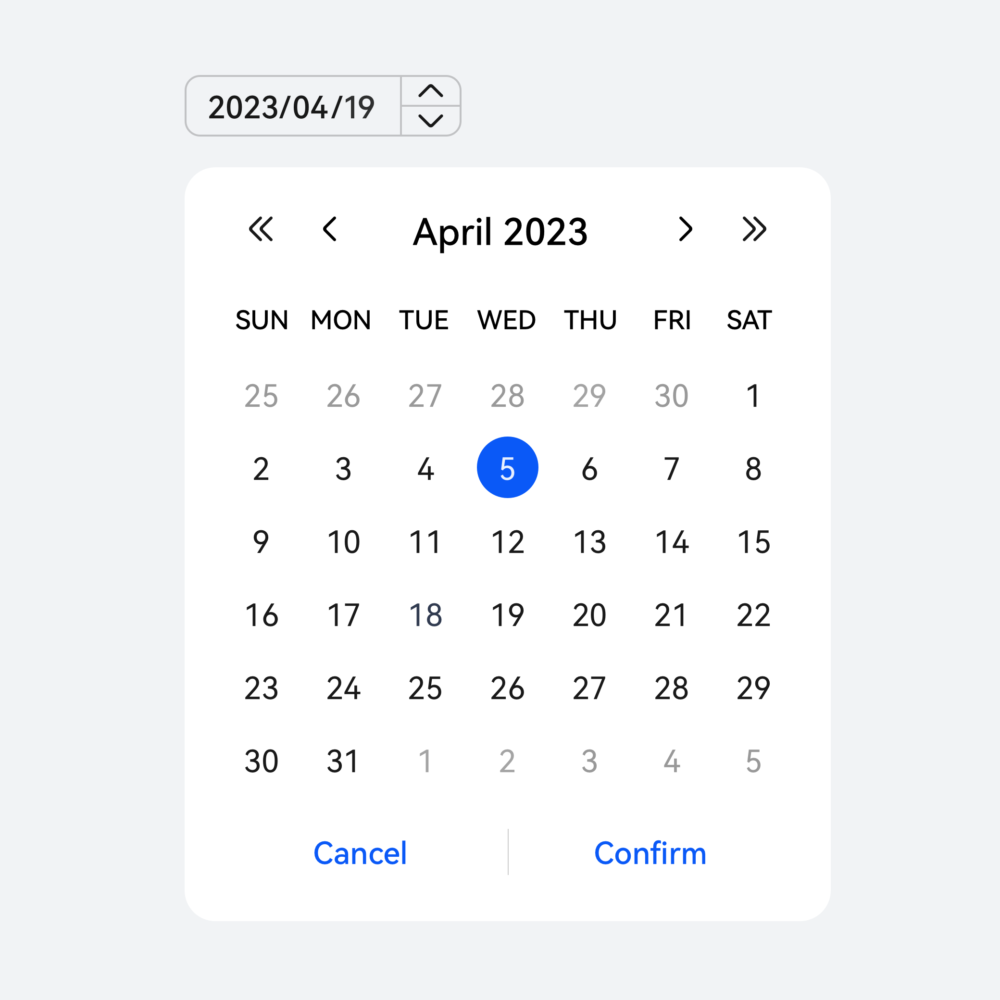
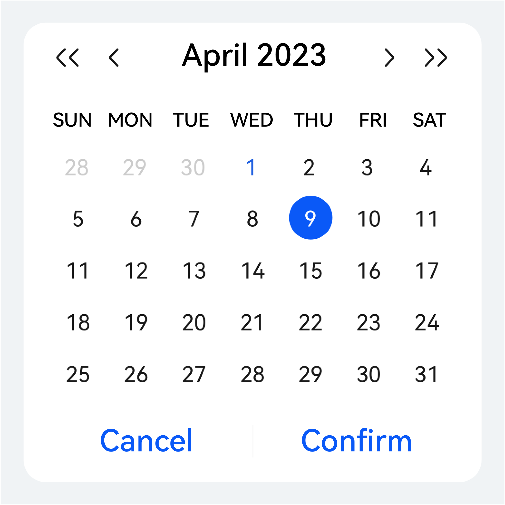
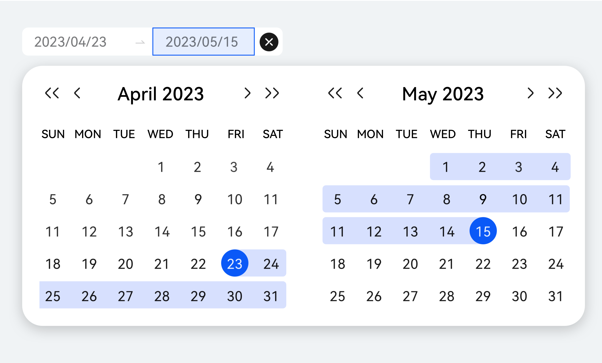
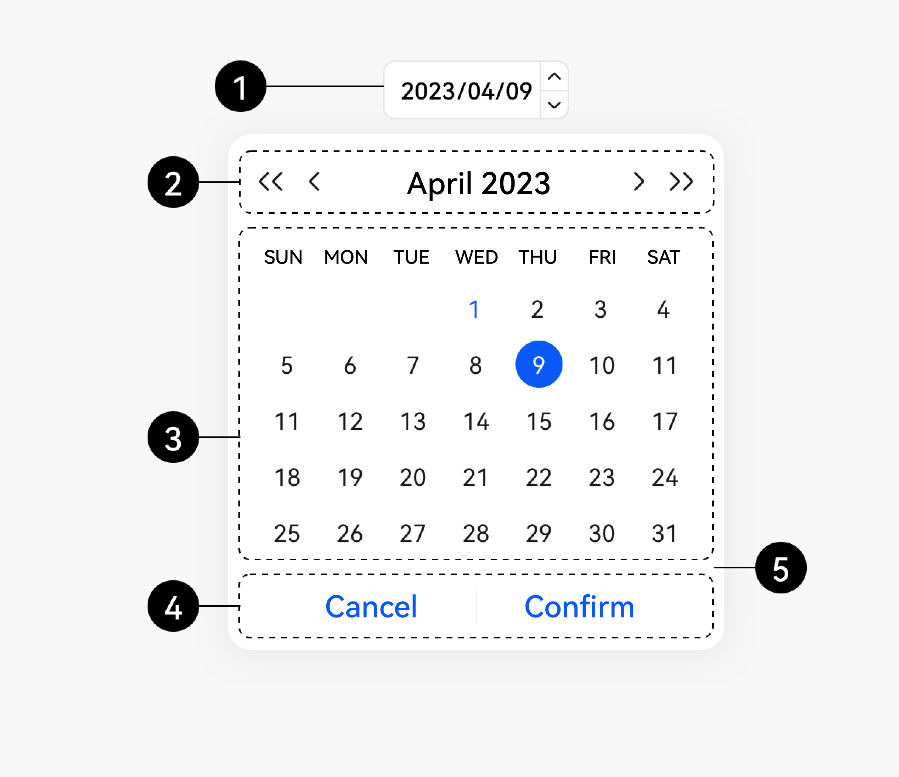

# 选择器

当需要从单个维度或多个维度进行组合做选择时使用。月历视图日期选择器开发相关描述请参考 [CalendarPicker](https://developer.huawei.com/consumer/cn/doc/harmonyos-references/ts-basic-components-calendarpicker) 文档。滚动选择器开发相关描述请参考 [DatePicker](https://developer.huawei.com/consumer/cn/doc/harmonyos-references/ts-basic-components-datepicker)、[TimePicker](https://developer.huawei.com/consumer/cn/doc/harmonyos-references/ts-basic-components-timepicker)、[TextPicker](https://developer.huawei.com/consumer/cn/doc/harmonyos-references/ts-basic-components-textpicker)文档。

### 如何使用

**通过选择不同的 Picker 组件实现对应效果。**组件提供 TimePicker、DatePicker、TextPicker 三种组件类型，特殊的 Picker 内容可以通过 TextPicker 自定义实现。

**在 CustomContentDialog 内添加 Picker 组件以实现与弹出框的组合。**弹出框组件详细指导见 [Dialog](https://developer.huawei.com/consumer/cn/doc/harmonyos-references/ts-methods-custom-dialog-box) 。

|  |  |  |
| --- | --- | --- |
|  |  |  |
| **TimePicker** | **DatePicker** | **TextPicker** |

### 类型

|  |  |
| --- | --- |
|  |  |
| **滚动选择器** | **月历视图日期选择器** |

**电脑设备**

月历选择

月历时间段选择

|  |  |
| --- | --- |
|  |  |
| **单个月历日期面板，用于选择日期。** | **连月历日期面板，在选择日期段时使用。** |

**月历选择**

|  |  |
| --- | --- |
|  |  |
| **电脑必选月历日期选择入口** |  |

|  |  |  |
| --- | --- | --- |
| **序号** | **元素名称** | 描述 |
| **1** | **入口触发方式** | 电脑必选，手机端可自定入口触发方式 |
| **2** | **标题区** | 显示选中的年月，单箭头切换月份，双箭头切换年。 |
| **3** | **内容区** | 显示日期选项，可左右滑动，可配置显示农历。 |
| **4** | **操作区** | 操作为“取消”，“确定”，电脑可选。 |
| **5** | **容器** | 弹出框。 |

**智能穿戴滑动选择器**

当需要从单维度或多个维度单选进行组合做选择时使用。

**时间选择器**

时间选择器使用弹出框或者内嵌的方式，在智能穿戴上选择单个时间（小时:分钟:秒的格式）。

例如设置闹钟/计时器

**其他选择器**

· 通常有两种：数字选择器，文本选择器。

· 数字选择器默认按从小到大排序。

· 根据选择项的属性选择合适的默认选项，以减少大多数用户的操作。

例如设置熄屏时间/高度校准

### 开发文档

[DatePicker](https://developer.huawei.com/consumer/cn/doc/harmonyos-references/ts-basic-components-datepicker)

[TimePicker](https://developer.huawei.com/consumer/cn/doc/harmonyos-references/ts-basic-components-timepicker)

[TextPicker](https://developer.huawei.com/consumer/cn/doc/harmonyos-references/ts-basic-components-textpicker)

[CalendarPicker](https://developer.huawei.com/consumer/cn/doc/harmonyos-references/ts-basic-components-calendarpicker)