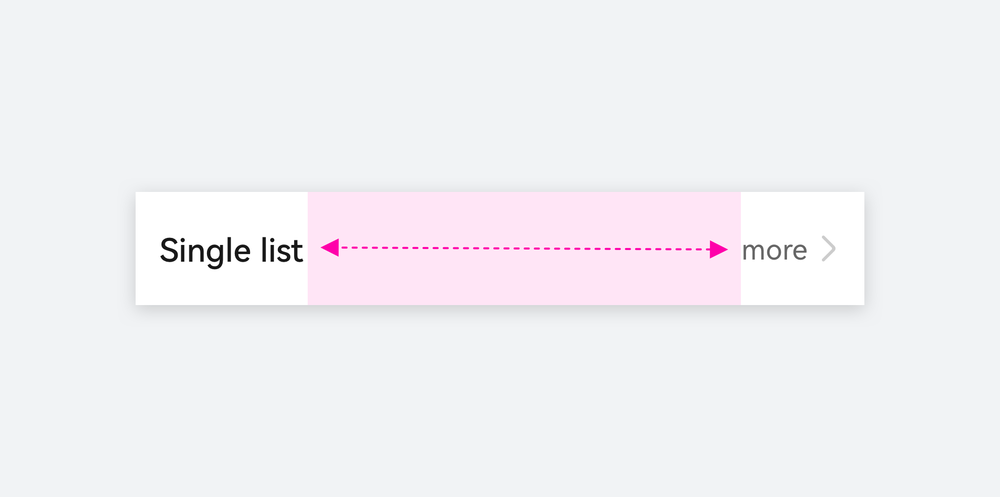
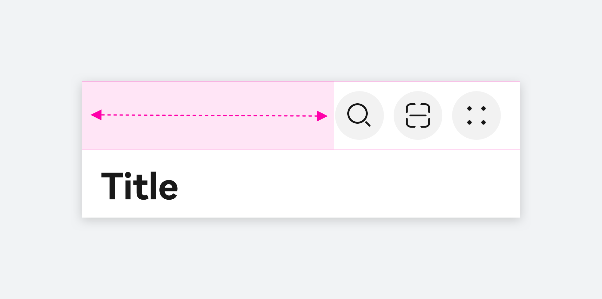
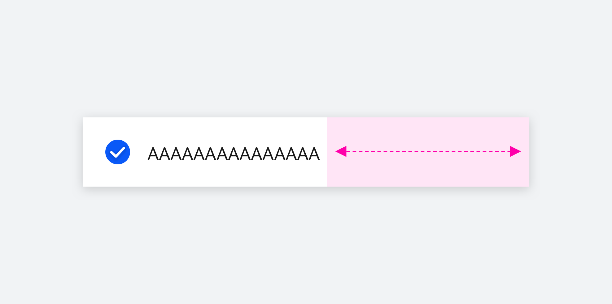

# 空白

空白填充组件，在容器主轴方向上，空白填充组件具有自动填充容器空余部分的能力。仅当父组件为 Row/Column/Flex 时生效。开发相关能力请参考 [Blank](https://developer.huawei.com/consumer/cn/doc/harmonyos-references/ts-basic-components-blank) 文档。

### 如何使用

**空白组件本身不包含任何内容，仅用于辅助布局。**当在一个父组件中添加元素时，使用空白可以在父组件的主轴方向自动计算并返回合适的元素间距，能减少设计过程中针对不同设备的反复计算，提高效率，并保证可扩展性。

**结合行布局/列布局在不同的主轴方向实现灵活布局。**在想要对齐的另一侧插入“空白”组件，它会自动计算元素间距，无需再单独标注。

|  |  |
| --- | --- |
|  |  |
| **左右元素分别对齐** | **元素居中显示** |
|  |  |
|  |  |
| **元素居右显示** | **元素居左显示** |

### 开发文档

[Blank](https://developer.huawei.com/consumer/cn/doc/harmonyos-references/ts-basic-components-blank)