# 应用图标

应用图标设计的核心是简洁、高效和品牌识别度。一个好的图标可以准确传达应用相关信息，也可以帮助用户快速定位你的应用。HarmonyOS NEXT图标设计旨在回归本源，通过现代化的语义表达，准确传达功能、服务和品牌。视觉上兼顾美观性和识别性；形式上兼收并蓄，和而不同。如果你需要一些图标设计的帮助，我们提供了相关的设计模版资源，请参阅[设计模板和资源](#section152211481332)。

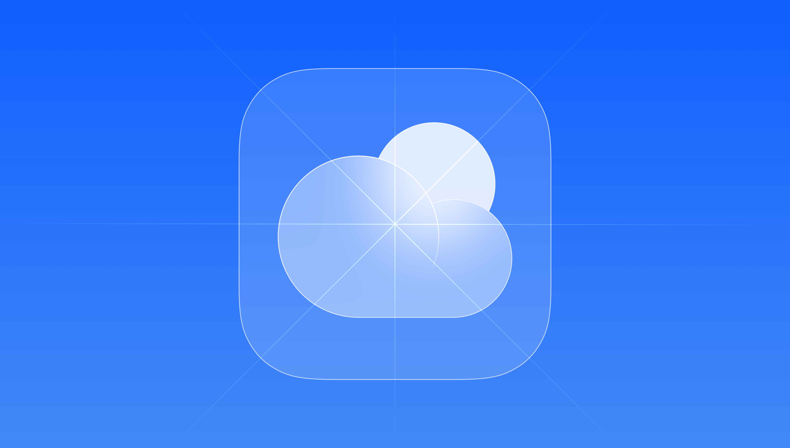

### 概述

HarmonyOS 应用图标遵循以下设计原则：

|  |  |  |
| --- | --- | --- |
| 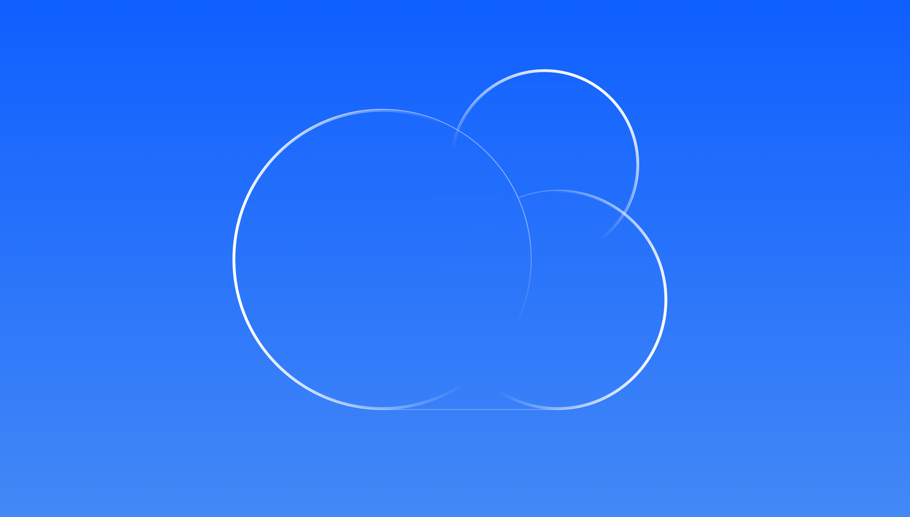 |  | 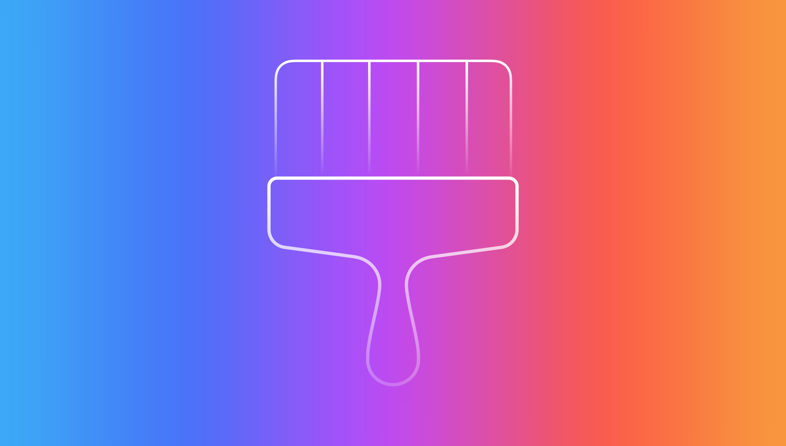 |
| 简洁优雅  元素图标简洁，线条表现优雅，传递设计美学。 | 极速达意  图标图形准确传达其功能、服务和品牌。具有易读性和识别性。 | 情感表达  通过图形和色彩概括表达情感，传达品牌视觉形象。 |

### 图形设计

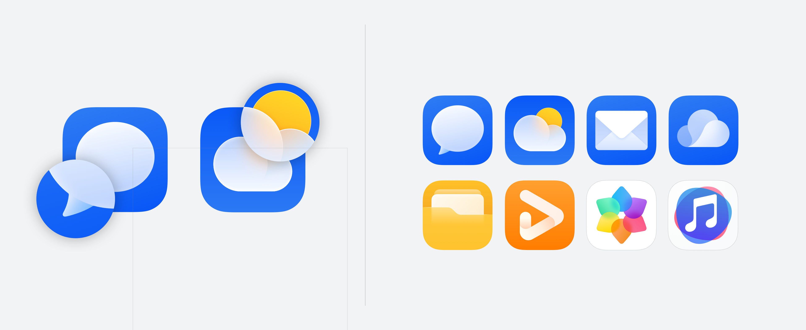

应用图标延续了轻拟物的美学设计风格。运用了半透模糊和具有层次感的设计手法，强调轻量感和空间感；加强图形边缘的高光处理，强化了图形的质感，提升清晰度。

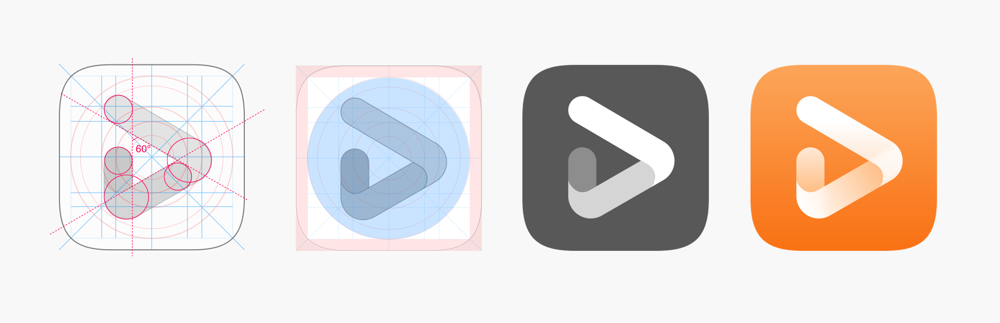

图标的主体应该是一个完整的元素，其图形能够隐喻并涵盖该应用的功能或业务。整体图形线条过渡平滑，比例自然和谐，色彩运用恰当。

## 网格布局

应用图标的图形元素占据了更大的比例，图标整体更饱满，元素图形分布需注意视觉均衡，使其体量感保持一致，伙伴可参考标准网格布局进行图标设计，可满足图标体量的一致性。

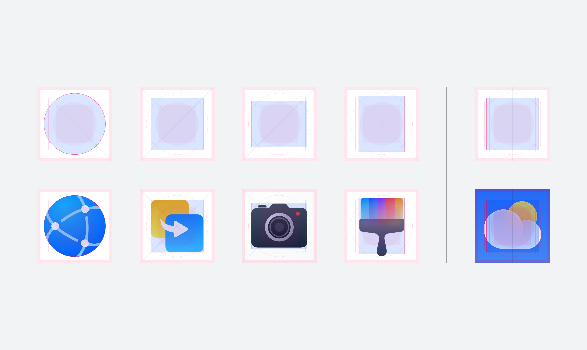

网格布局主要作用为体量参考，部分图标可根据图形体量感突破网格界限。

### 色彩规则

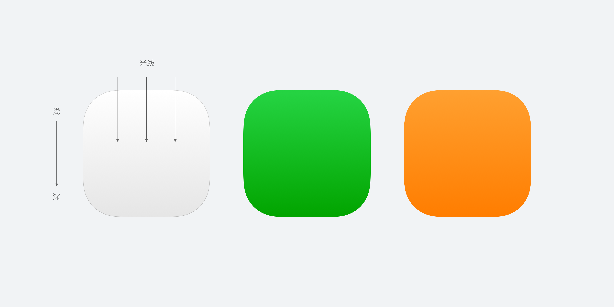

对人眼来说，自上而下的照明描绘的物体看起来最为自然。图标底板光源保持自上而下，颜色上浅下深，渐变色应保持在合理范围内，不应出现对比强烈的颜色渐变。

|  |  |
| --- | --- |
|     Do | 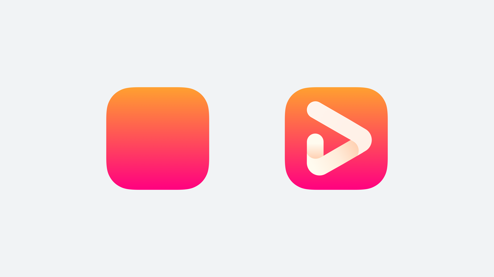    Don't |
| 柔和的颜色渐变 | 强烈的颜色渐变 |

### 多设备图标适配

## 手机、折叠屏、平板

作为最具代表性的使用场景，泛手机端的图标应捕捉应用最核心的品牌故事，使用简洁、扁平的视觉语言为其一系列的衍生设计以及多设备表现打下基础。扁平风图标应包含清晰可辨的前后景，并避免过于复杂的图层堆叠。在典型的桌面场景中，建议巧用应用主题色，提炼高辨识度的前景图像以最大化品牌视觉在较小屏幕上的可触达性。

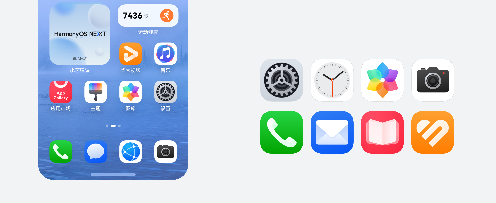

## 电脑

便于更好地与电脑视觉语言作融合，应用图标应作为其扁平设计在更真实物理环境中的投射，使用更具象化，渲染精度更高的微立体风格来打造具有微妙差异的首眼感知。在电脑较大的屏幕上，系统默认预置微立体风格的图标，因此可以考虑基于应用的拟物表象进行设计；参考真实肌理与体量感，建议在原设计扁平风的基础上加入更通透的质感、细致的光影、和分明的三维层次以打造更丰富的首眼体验。当鼠标滑入dock栏图标，系统在鼠标对角线位置生成图标前景下的图层动态阴影，伴随前景上方和图标周边的点光晕染，突出多层级的光影体验与动态变化。

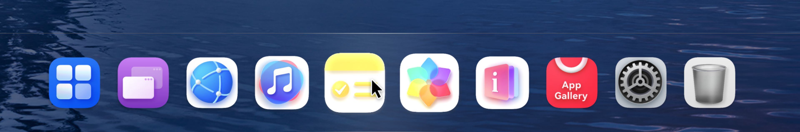

## 智慧屏

为了更好地发挥屏幕尺寸上的优势，并为用户打造如身临其境般的沉浸式体验，智慧屏上默认预置微立体风格的应用图标。强调轻拟物感的微立体图标通过其柔和的光影效果和鲜亮的色彩，映照在深色的沉浸式场景中，渲染观影氛围感。分层后的应用图标在智慧屏Launcher上适配追光动效，使每一次光标的移动都伴随精妙的光学协奏，将简单的功能选择升级成微妙的情感化体验。

## 智能穿戴

穿戴产品上的应用图标通过其圆形的画框以呼应表盘的外轮廓。在布局前景图像时，应注意水平及垂直居中，并预留适当的安全区，以避免截断现象，但同时确保前景在圆形蒙版中保留显性的大画幅。大小各异，色彩饱满的圆形图标在表盘上星罗棋布，既保留视觉韵律，又赋予用户探索的乐趣。

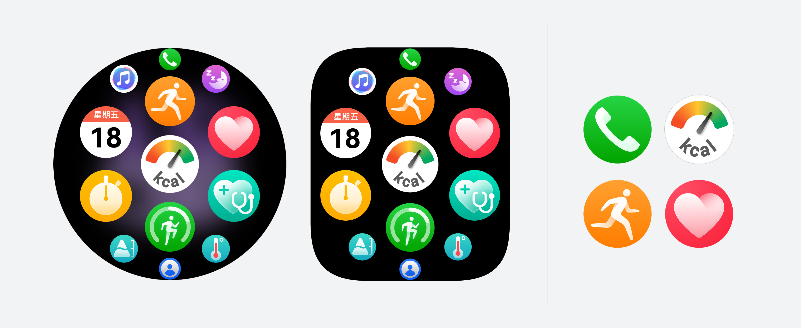

### 图标资源规范

为保证图标在系统内显示的一致性，应用预置的图标资源应满足以下要素：

* 图标资源必须为分层资源
* 图标资源尺寸必须为1024\*1024px
* **图标资源必须为正方形图像**，无需圆角，系统会为对应场景自动生成遮罩裁切
* 图标资源使用PNG格式

|  |  |
| --- | --- |
| 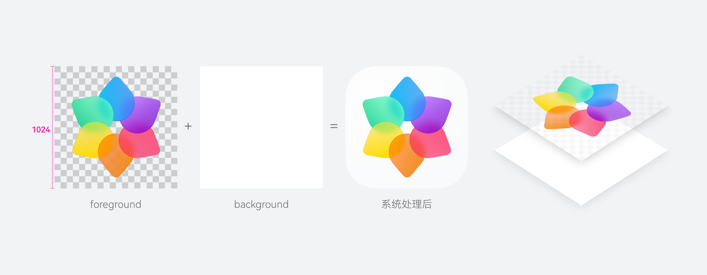  Do | 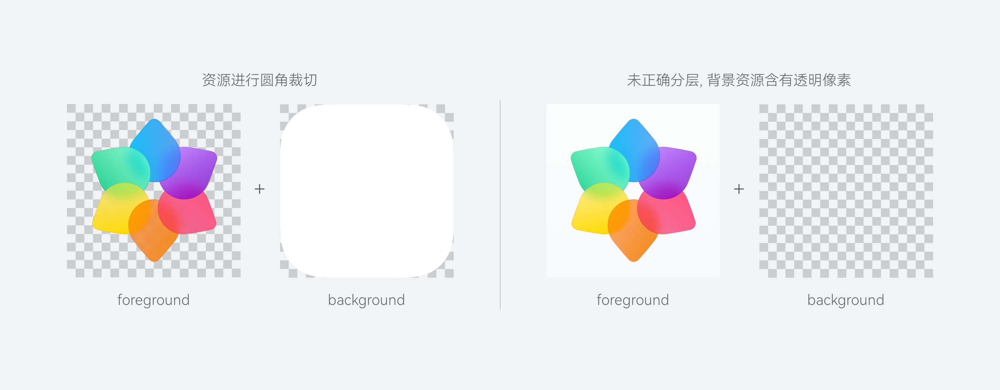  Don't |
| 上传尺寸为1024\*1024px的正方形分层资源，分为前景与背景两层 | 未正确分层，背景含有透明像素（包含圆角裁切或带有透明内边距的情况） |

## 多平台图标资源规格

| **平台** | **资源分层** | **资源形状** | **资源尺寸** | 资源格式 | 默认风格 | 典型使用场景 |
| --- | --- | --- | --- | --- | --- | --- |
| 手机、折叠屏、平板 | 双层 | 正方形 | 1024\*1024px | PNG | 扁平风 | 桌面，启动页等 |
| 电脑 | 双层 | 正方形 | 1024\*1024px | PNG | 微立体 | 桌面，启动页，应用中心等 |
| 智慧屏 | 双层 | 正方形 | 1024\*1024px | PNG | 微立体 | Launcher，应用中心等 |
| 智能穿戴 | 单层 | 圆形 | 152\*152px | PNG | 扁平风 | Launcher，启动页，消息通知等 |

请在Hap包中正确预置图标资源，否则将无法通过上架检查。

## 设计模板和资源

请根据需要选择以下格式的设计模板和资源。

[HarmonyOS AppIcon Design](https://alliance-communityfile-drcn.dbankcdn.com/FileServer/getFile/cmtyManage/011/111/111/0000000000011111111.20250923104446.99069930286504364917048884543987%3A50001231000000%3A2800%3AC0D02F6FA8FC2E0695B7317DDEE58757A326884B61519C19B6E0A59AED8296E0.zip?needInitFileName=true)（.zip）