{/* TODO: 含合并单元格的表格已降级为标准Markdown表格，建议使用<MergedTable>组件还原 */}

# 色彩

在 HarmonyOS NEXT的色彩设计中，强调品牌色的特征性展示以及系统色彩的对比关系，通过色彩的层次结构传递视觉的连续性和界面的关联性。HarmonyOS NEXT 的色彩系统的体验目标是为所有人群而设计，体现更加包容性的设计，以不同用户群体的视角思考问题。

HarmonyOS NEXT 的系统色调继承了“鸿蒙宇宙”世界观中回归本源的主旨思想，结合宇宙宏观之势与回归自然本源之力，吸收并呈现纯净与和谐的虚拟世界色彩空间体验。宇宙蓝与雪域灰作为 HarmonyOS NEXT 系统中色彩的构成基础，奠定了整体色系的体验趋势，象征着苍穹与大地，两者相配合，使得整个用户界面更加干净、和谐。

|  |  |
| --- | --- |
|  |  |
| **宇宙蓝**  我们选择更为深邃广阔的宇宙蓝，无边无垠的蓝深邃如宇宙，为系统带来宇宙初开的纯净与宁静。 | **雪域灰**  自然里面，没有绝对的黑也没有绝对的白，以带有淡蓝色相的雪域灰作为卡片界面的背景颜色来烘托界面的纯净感。 |

创建属于应用自身的品牌色，可以让用户时刻注意并了解当前所属的应用进程，便于用户理解和发现关键性事件。一套舒适有特征的配色方案，结合层次分明的参数信息和组件结构，可以更加高效的帮助开发者与设计师投入到应用开发与设计中。

### 如何分层构建色彩

色彩分层的核心在于构建不同使用场景下的对比关系，每一个颜色都有属于自己的 ID，用于处理不同层级之间的对比差异和保持同层级色彩一致的关键作用。

**映射正确的色彩关系**

系统组件会默认对应一套分层参数，这些参数在默认情况下满足使用场景。如果应用需要自定义组件规格，则需要重新梳理正确的映射关系到这些组件的背景、文本等色彩。

**保障色彩的可阅读性**

色彩的搭配使用需要满足常规阅读对比度，系统默认颜色保障了最小 3:1 对比度，在深色模式下色彩的映射关系会发生部分变化，这些变化在情理之中。

**最小化的色彩管理**

在 HarmonyOS 的色彩体系中，可以最小化的管理系统色彩数量，基于常规色四件套便可搭建系统整体的色彩风格。

### 如何运作 Token 参数

在系统参数中可以找到名称前缀包括 “primary”、“on\_primary”、“brand”、“container”的颜色，在浅色与深色模式中均使用相同的 Token 名称，但他们可能对应不同的数值。

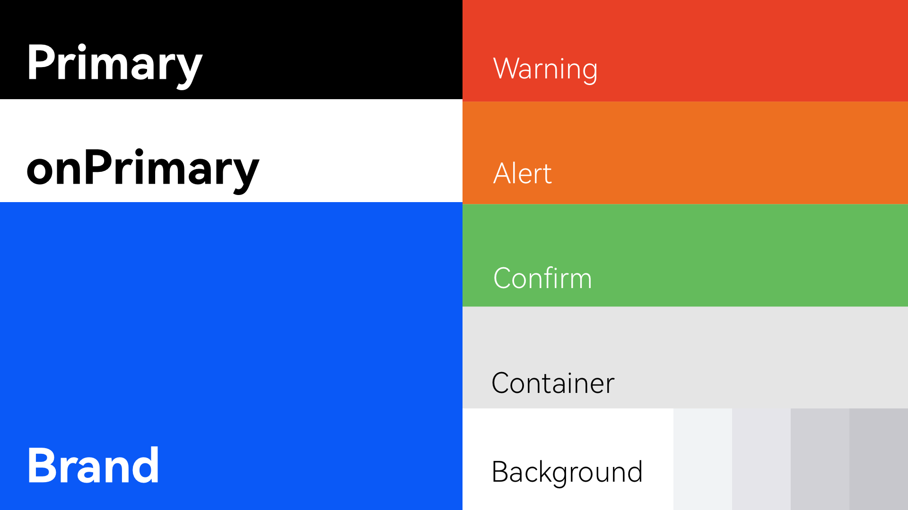

在系统参数设计中，会将参数类型划分为三个层级关系，自上而下为控件私有参数、通用语义参数和通用基础参数。

* **基础 Token**：基础色彩包含 primary、on\_primary、brand、container、background 等色彩，基础色会通过一定的计算方式延伸成一定数量的对比度色彩，用于展示在用户界面的不同元素中，通过对比度关系构建界面效果。基础色可以被直接引用，或是被引用后重新定义语义，用于界面中同类型和显示层级的元素中。
* **语义 Token**：语义色彩有用于固定场景 Token 名称，这些名称定义了自身的使用场景且不可随意更改。语义 Token 分为文本类、图标类、组件类和交互事件类。这些类别定义了系统中大部分的使用场景，每个 Token 参数都与基础 Token 具备一定的引用关系，应用自定义的参数也可基于使用场景自定义引用链路。
* **控件 Token**：用于指定控件内某一元素所对应的参数信息，具有唯一性且不可复用。控件 Token 属于组件内部的元素名称，应用自定义控件可以参考这类 Token 的使用关系。

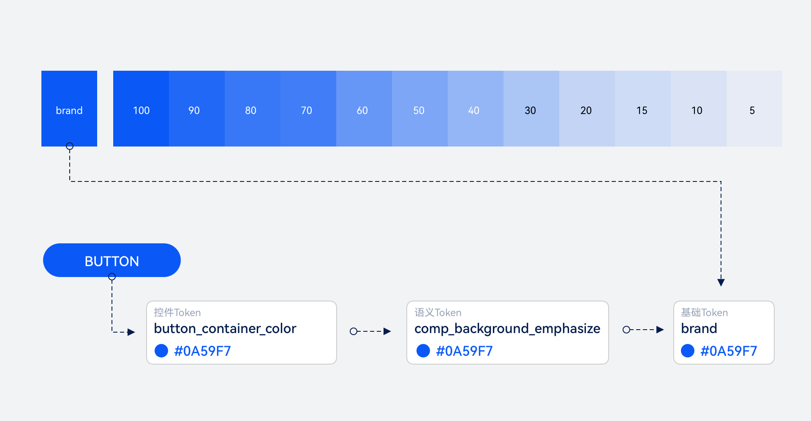

|  |  |
| --- | --- |
| * **Primary**   用于最上层文本、图标的填充和显示，低对比度可用于其他层级显示，例如二级文本色、三级文本色等。   * **onPrimary**   用于显示在强调色、图片之上显示的文本、图标，不可在常规界面中使用。例如，不可在一级背景色 backgroundColorPrimary 基础上直接使用 onPrimary 颜色。   * **Brand**   系统主题色、高亮色，用于突出核心组件信息。应用可定制主题色，主题色影响系统默认组件，同时可用于应用自定义组件。所有引用 brand 色彩的组件都会受到此影响。   * **Container**   系统组件容器色，用于展示组件背景填充色。例如普通按钮背景色、搜索框组件背景色等。 | 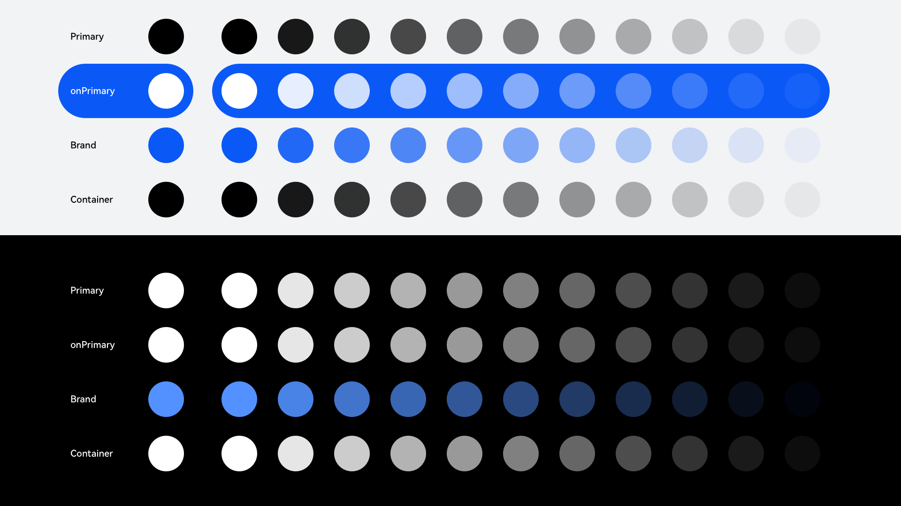 |
| 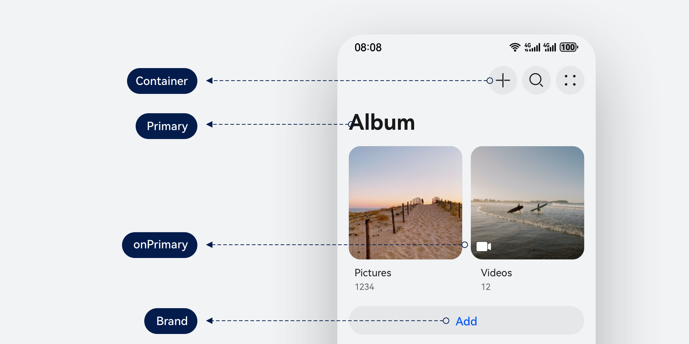 |
|  |  |
| **定制主题及色彩**  基础色中的 Primary、onPrimary、Brand 以及 Container 均可单独定义色彩，系统默认色彩中 Primary 和 Container 使用同级配色，设计师可以通过配置不同明暗对比的色彩丰富界面视觉效果。  如何自定义应用品牌色，可以参阅[主题换肤](https://gitee.com/openharmony/docs/blob/master/zh-cn/application-dev/ui/theme_skinning.md#%25E8%25AE%25BE%25E7%25BD%25AE%25E5%25BA%2594%25E7%2594%25A8%25E7%25BA%25A7%25E8%2587%25AA%25E5%25AE%259A%25E4%25B9%2589%25E5%2593%2581%25E7%2589%258C%25E8%2589%25B2)中的相关能力。 | 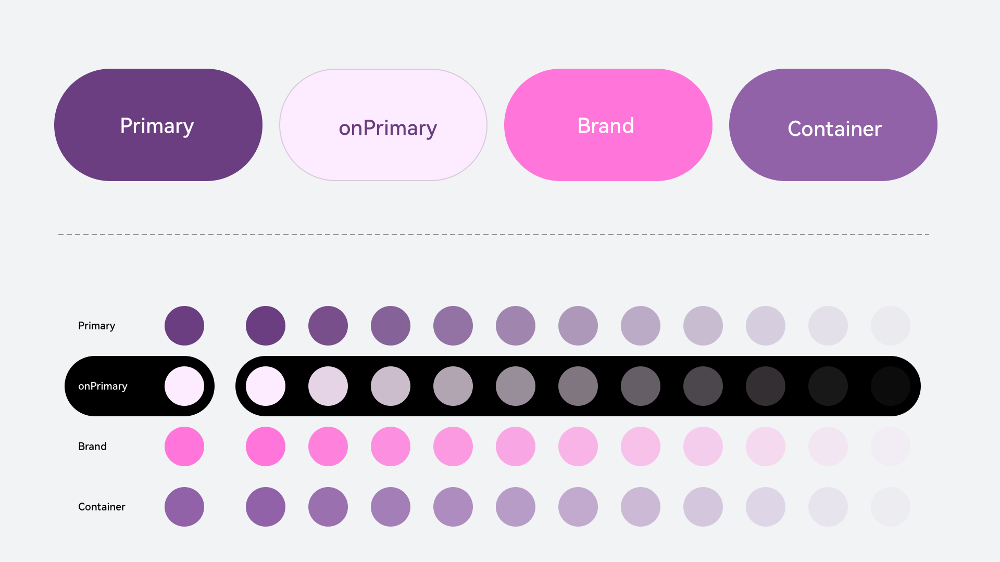 |
|  |  |
| 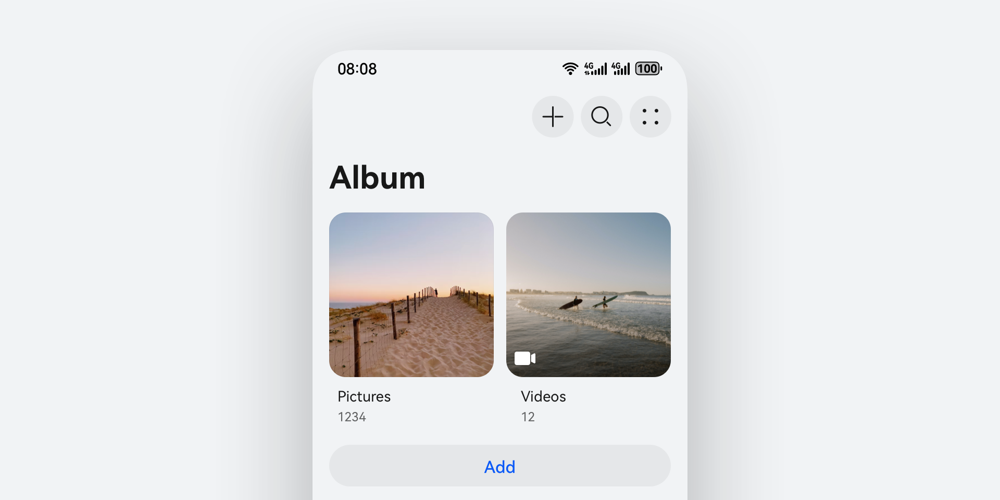 | 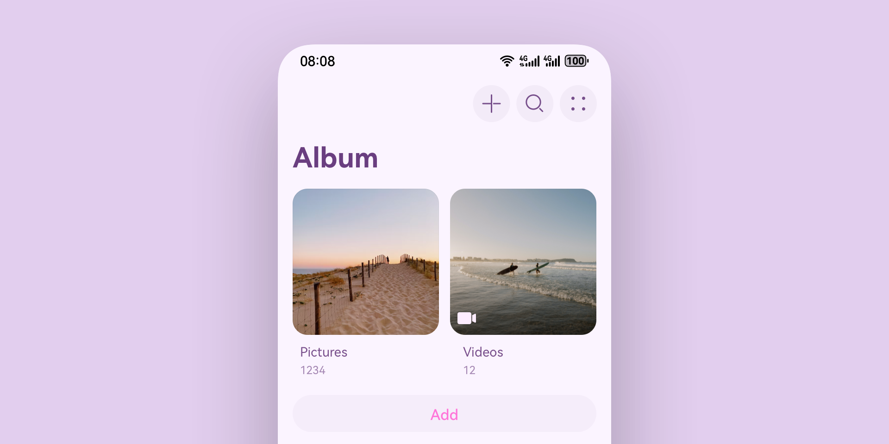 |
| **系统默认主题色**  系统默认色以宇宙蓝为高亮色，雪域灰为基础背景搭建 | **应用定制主题色**  应用可定制属于自己品牌色色调，并应用于整个界面 |

### 如何使用 Token 参数

**计算与理解基础 Token 参数关系**

基础 Token 中的颜色会基于透明度系数分别映射出 12 个不同的色彩参数，默认规则直接将透明度与色彩参数值叠加使用。设计师与开发者只需指定基础色的原色参数，通过带入不同透明度值实现整体映射。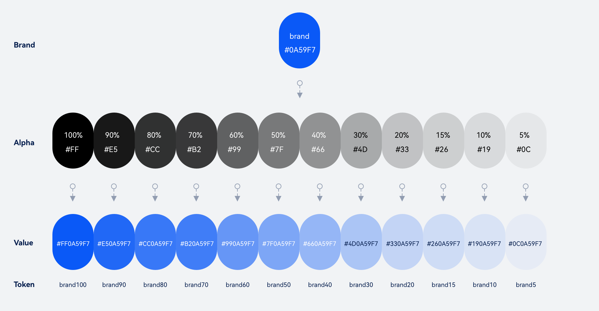

开发者也可以将主题色指定为其他的颜色。系统通用的基础色彩数量是不变的，修改映射关系可能带来控件默认引用 Token 链路发生变化，开发者需要同步考虑控件的默认参数引用逻辑和关系。

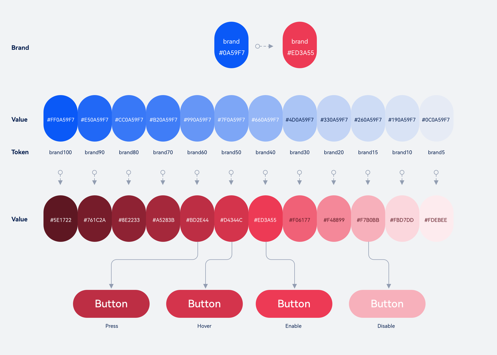

**正确使用 Token 进行界面搭配**

为了保障在应用中所有的图层色彩信息保持一定对比度和色彩关系，请参考左侧进行合理的搭配关系。

不正确地组合颜色可能会破坏组件和界面的对比关系和美观度，特别是在自定义场景下，错误的组合可能会对应用界面带来极大的异常体验。

|  |  |
| --- | --- |
| 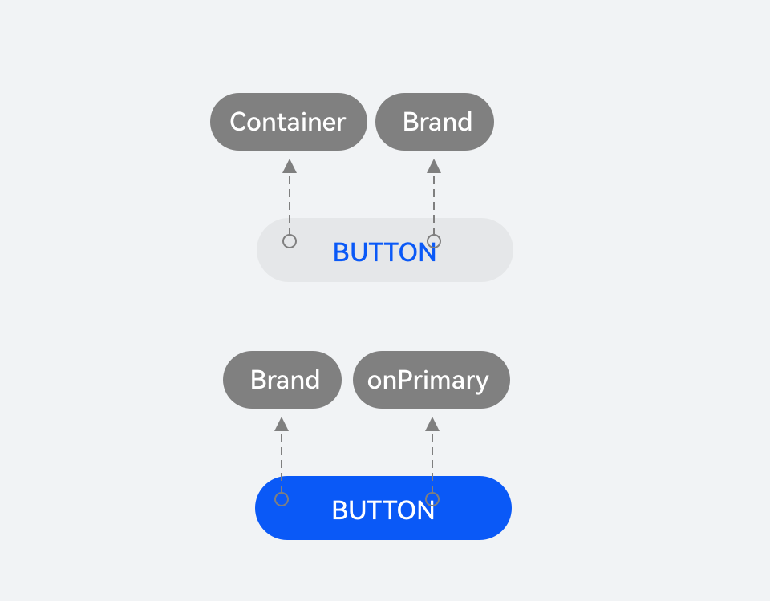 | 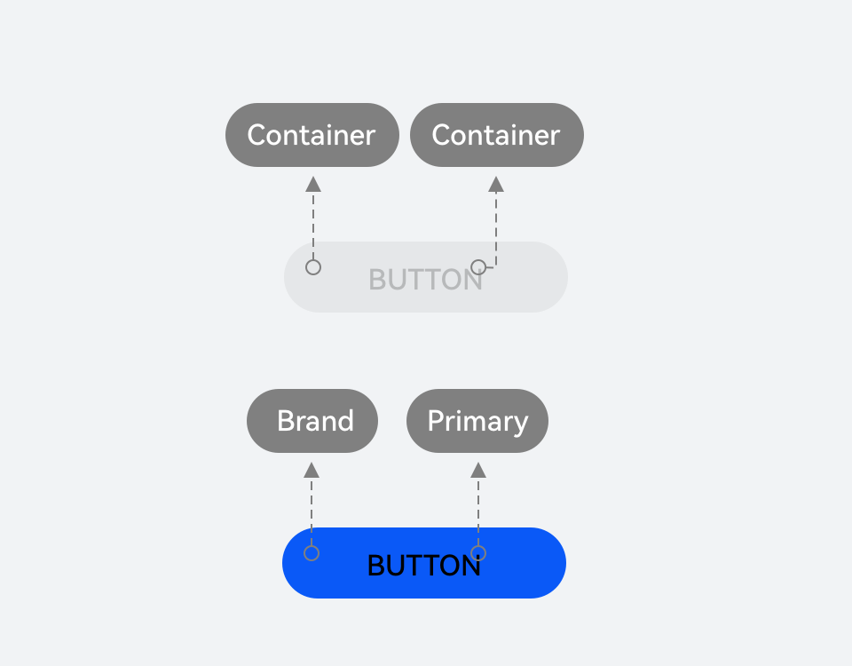 |

### 文本色与图标色

|  |  |
| --- | --- |
| **色彩分级**  文本与图标在界面使用中要根据信息优先级选择合适的色彩透明度使用，在 HarmonyOS 中我们划分默认四个基础层级和一个高亮色层级进行展示文本和图标。 | 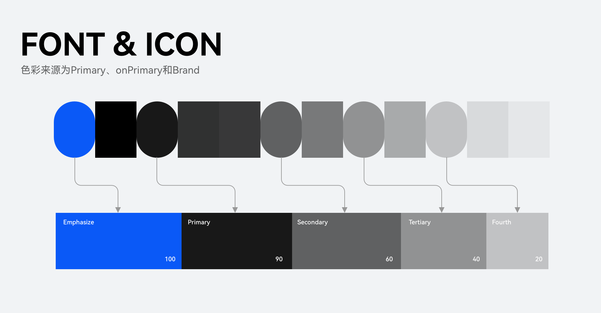 |

文本与图标基于基础 Token-Primary 引用，常规使用分为四个层级，font\_primary、font\_secondary、font\_tertiary 和 font\_fourth，这四个层级依照由高到低依次透明度变化，用于表达界面中核心内容与辅助内容的区别。除此以外文本与图标还有对应反色场景，在 Token name 的表达上使用 font\_on 和 icon\_on 为开头展示，这些内容通常用于展示高亮色容器之上或图片之上的文本与图标，反色内容无论深浅色模式都是用高亮度色彩。

文本与图标的高亮色场景默认引用系统 Brand 颜色，当主题中的 Brand 颜色发生变化，或应用自定义了主题色后，与之对应关联的高亮文本与图标都会发生对应变化。

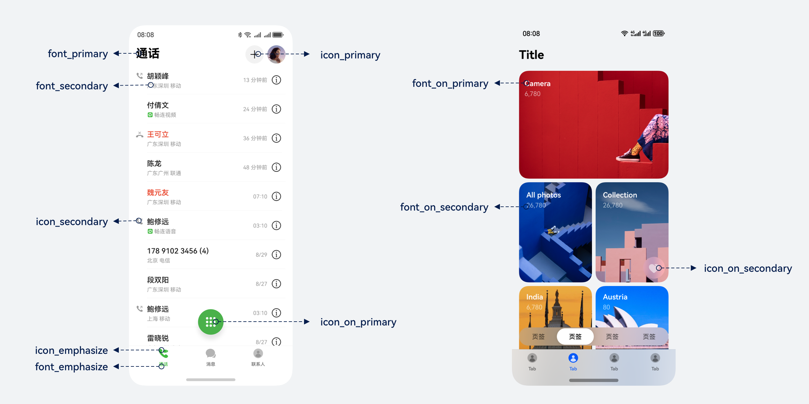

### **组件容器色**

|  |  |
| --- | --- |
| **区分组件背景层级**  用于区分组件背景色的层级关系，在系统组件中存在诸多通用背景色，例如普通按钮、搜索框、文本框等组件。同时，部分组件的背景有特殊含义，例如强调按钮使用系统品牌色，子页签有中性高亮色等。 | 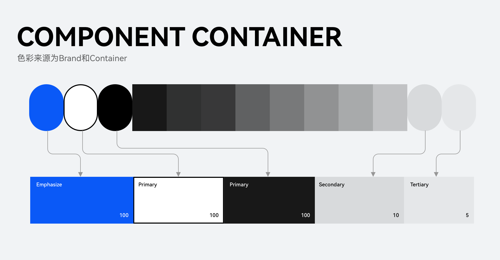 |

控件容器色以 comp 开头的控件专用色主要用于各类控件容器背景色，容器背景基于组件的布局层级分为容器类和展示类，容器类组件的色彩通常跟随系统深浅模式变化，例如：列表背景色、弹出框背景色、半模态背景色；展示类一般为基础功能组件，主要是用品牌色或低透明度背景色，例如：按钮背景色、搜索框背景色、索引条选中色等等。

|  |  |
| --- | --- |
| **控件高亮背景色**   1. comp\_background\_emphasize，控件高亮背景色 2. comp\_emphasize\_secondary，控件高亮二级背景色 3. comp\_emphasize\_tertiary，控件高亮三级背景色 | 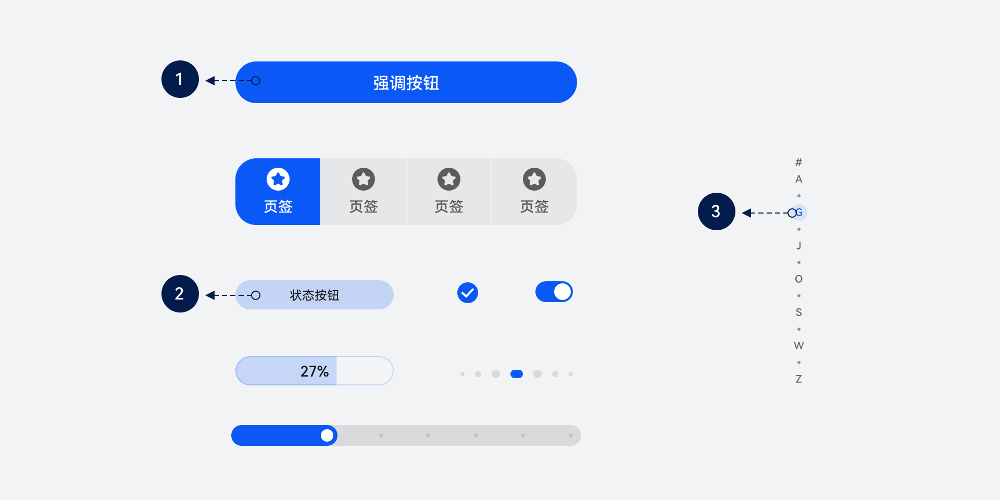 |
|  |  |
| **控件基础背景色**   1. comp\_background\_primary，控件一级背景色 2. comp\_background\_primary\_contrary，控件一级背景色反色 3. comp\_background\_secondary，控件二级背景色 4. comp\_background\_tertiary，控件三级背景色 5. comp\_background\_list\_card，控件列表卡片色 | 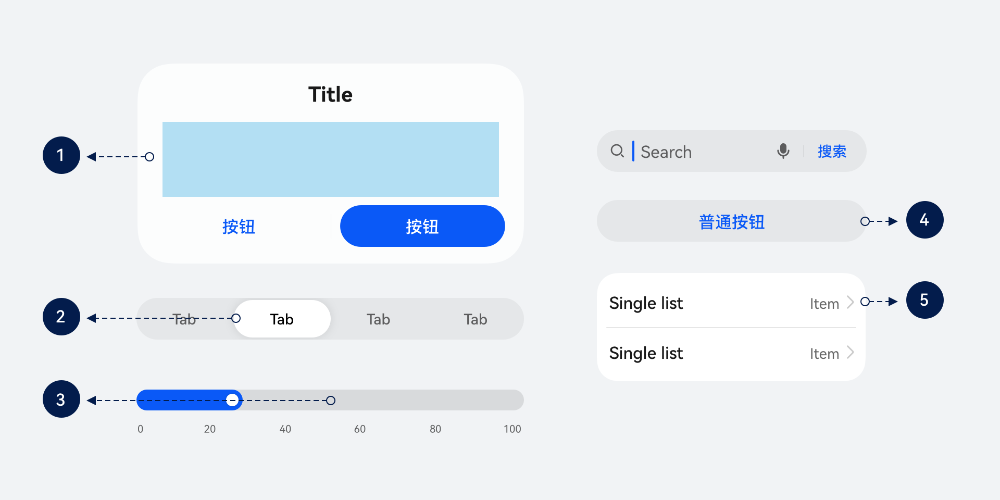 |
|  |  |
| **控件交互事件色**   1. interactive\_hover，悬浮事件色 2. interactive\_pressed，点击事件色 3. interactive\_focus，获焦事件色 4. interactive\_disable，禁用事件色 5. interactive\_select，选中事件色 6. interactive\_active，激活事件色 | 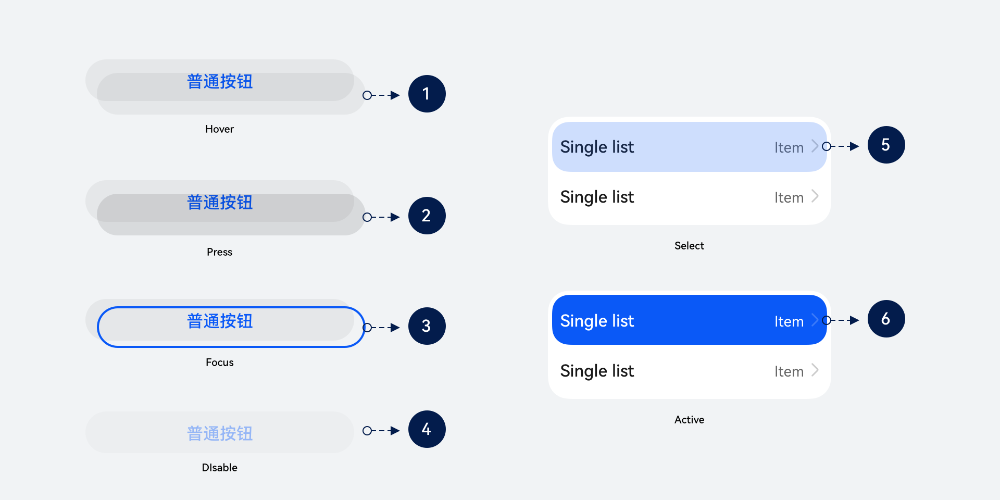 |

### 界面背景色

|  |  |
| --- | --- |
| **背景色原理**  界面背景色主要用于窗口分层处理使用，在多屏及悬浮窗场景下，动态替换背景色的灰阶层级，避免相同背景在不同窗口层级下出现色彩融合的情况。 | 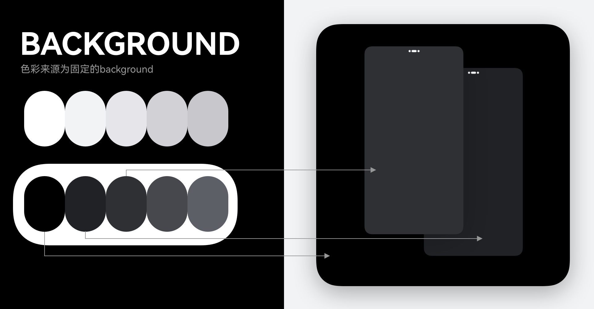 |
|  |  |
| **背景色分层**  在通用界面背景下，浅色模式的通用白色背景和雪域灰对应的深色模式都是黑色，这两种背景色作为浅色模式下的基础色，对应深色模式不区分界面色彩的差异化。  从 gray\_02 灰阶色开始，无论深色还是浅色，都对应现显示层级逐级提高或降低灰阶对比度。  界面背景色不可为透明度颜色，在某些特殊情况可作为其他组件背景色使用，跟界面的层级关系依照灰阶对比度逐级选择使用。 | 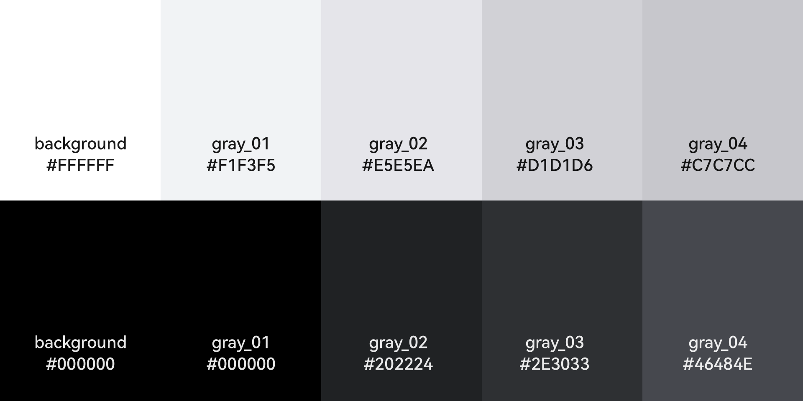 |
|  |  |
| 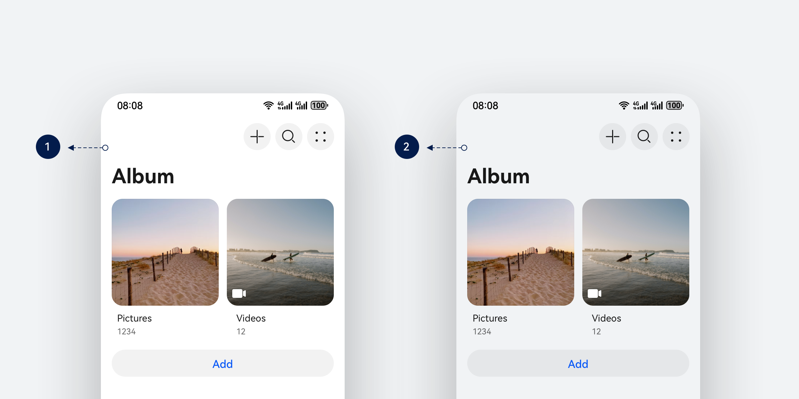 | 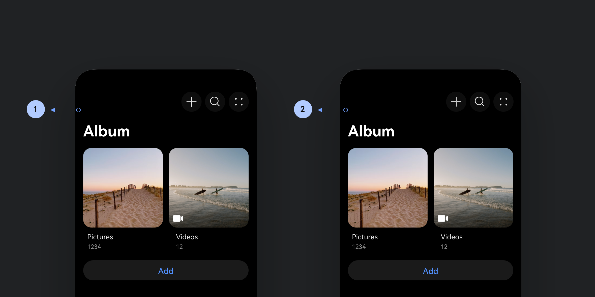 |
| **界面通用背景色**   1. background\_primary，界面一级背景色 2. background\_secondary，界面二级背景色   深色模式下，Primary 与 Secondary 对应的背景色默认都为黑色（background\_primary的Dark资源）。 | |

### **系统基础与语义 Token 全量表**

以下颜色参数为ARGB格式呈现，前两位为透明度参数。

| Token | 场景类别 | Light |  | Dark |  |
| --- | --- | --- | --- | --- | --- |
| brand | 品牌色 | #ff0a59f7 |  | #ff317af7 |  |
| warning | 一级警示色 | #ffe84026 |  | #ffd94838 |  |
| alert | 二级警示色 | #ffed6f21 |  | #ffdb6b42 |  |
| confirm | 确认色 | #ff64bb5c |  | #ff5ba854 |  |
| font\_primary | 一级文本 | #e5000000 |  | #e5ffffff |  |
| font\_secondary | 二级文本 | #99000000 |  | #99ffffff |  |
| font\_tertiary | 三级文本 | #66000000 |  | #66ffffff |  |
| font\_fourth | 四级文本 | #33000000 |  | #33ffffff |  |
| font\_emphasize | 高亮文本 | #ff0a59f7 |  | #ff317af7 |  |
| font\_on\_primary | 一级文本反色 | #ffffffff |  | #ffffffff |  |
| font\_on\_secondary | 二级文本反色 | #99ffffff |  | #99ffffff |  |
| font\_on\_tertiary | 三级文本反色 | #66ffffff |  | #66ffffff |  |
| font\_on\_fourth | 四级文本反色 | #33ffffff |  | #33ffffff |  |
| icon\_primary | 一级图标 | #e5000000 |  | #e5ffffff |  |
| icon\_secondary | 二级图标 | #99000000 |  | #99ffffff |  |
| icon\_tertiary | 三级图标 | #66000000 |  | #66ffffff |  |
| icon\_fourth | 四级图标 | #33000000 |  | #33ffffff |  |
| icon\_emphasize | 高亮图标 | #ff0a59f7 |  | #ff317af7 |  |
| icon\_sub\_emphasize | 高亮辅助图标 | #660a59f7 |  | #66317af7 |  |
| icon\_on\_primary | 一级图标反色 | #ffffffff |  | #ffffffff |  |
| icon\_on\_secondary | 二级图标反色 | #99ffffff |  | #99ffffff |  |
| icon\_on\_tertiary | 三级图标反色 | #66ffffff |  | #66ffffff |  |
| icon\_on\_fourth | 四级图标反色 | #33ffffff |  | #33ffffff |  |
| background\_primary | 一级背景（实色/不透明色） | #ffffffff |  | #ffe5e5e5 |  |
| background\_secondary | 二级背景（实色/不透明色） | #fff1f3f5 |  | #ff191a1c |  |
| background\_tertiary | 三级背景（实色/不透明色） | #ffe5e5ea |  | #ff202224 |  |
| background\_fourth | 四级背景（实色/不透明色） | #ffd1d1d6 |  | #ff2e3033 |  |
| background\_emphasize | 高亮背景（实色/不透明色） | #ff0a59f7 |  | #ff317af7 |  |
| comp\_foreground\_primary | 前背景 | #ff000000 |  | #ffe5e5e5 |  |
| comp\_background\_primary | 白色背景 | #ffffffff |  | #ff202224 |  |
| comp\_background\_primary\_contrary | 常亮背景 | #ffffffff |  | #ffe5e5e5 |  |
| comp\_background\_gray | 灰色背景 | #fff1f3f5 |  | #ffe5e5ea |  |
| comp\_background\_secondary | 二级背景 | #19000000 |  | #19ffffff |  |
| comp\_background\_tertiary | 三级背景 | #0c000000 |  | #0cffffff |  |
| comp\_background\_emphasize | 高亮背景 | #ff0a59f7 |  | #ff317af7 |  |
| comp\_background\_neutral | 黑色中性高亮背景 | #ff000000 |  | #ffffffff |  |
| comp\_emphasize\_secondary | 20%高亮背景 | #330a59f7 |  | #33317af7 |  |
| comp\_emphasize\_tertiary | 10%高亮背景 | #190a59f7 |  | #19317af7 |  |
| comp\_divider | 分割线颜色 | #33000000 |  | #33ffffff |  |
| comp\_common\_contrary | 通用反色 | #ffffffff |  | #ff000000 |  |
| comp\_background\_focus | 获焦态背景色 | #fff1f3f5 |  | #ff000000 |  |
| comp\_focused\_primary | 获焦态一级反色 | #e5000000 |  | #e5ffffff |  |
| comp\_focused\_secondary | 获焦态二级反色 | #99000000 |  | #99ffffff |  |
| comp\_focused\_tertiary | 获焦态三级反色 | #66000000 |  | #66ffffff |  |
| interactive\_hover | 通用悬停交互式颜色 | #0c000000 |  | #0cffffff |  |
| interactive\_pressed | 通用按压交互式颜色 | #19000000 |  | #19ffffff |  |
| interactive\_focus | 通用获焦交互式颜色 | #ff0a59f7 |  | #ff317af7 |  |
| interactive\_active | 通用激活交互式颜色 | #ff0a59f7 |  | #ff317af7 |  |
| interactive\_select | 通用选择交互式颜色 | #330A59F7 |  | #33317AF7 |  |
| interactive\_click | 通用点击交互式颜色 | #19000000 |  | #19ffffff |  |

### 智能穿戴 Token 全量表

|  |  |  |  |  |  |
| --- | --- | --- | --- | --- | --- |
| **Token** | **场景类别** | **Light** |  | **Dark** |  |
| brand | 品牌色 | #ff0a59f7 |  | #ff1f71ff |  |
| warning | 一级警示色 | #ffe84026 |  | #ffe84026 |  |
| alert | 二级警示色 | #ffed6f21 |  | #ffed6f21 |  |
| confirm | 确认色 | #ff64bb5c |  | #ff64bb5c |  |
| font\_primary | 一级文本 | #E5000000 |  | #ffffffff |  |
| font\_secondary | 二级文本 | #99000000 |  | #A9ffffff |  |
| font\_tertiary | 三级文本 | #66000000 |  | #66ffffff |  |
| font\_fourth | 四级文本 | #33000000 |  | #33ffffff |  |
| font\_emphasize | 高亮文本 | #ff0a59f7 |  | #ff5ea1ff |  |
| font\_on\_primary | 一级文本反色 | #ffffffff |  | #ffffffff |  |
| font\_on\_secondary | 二级文本反色 | #99ffffff |  | #A9ffffff |  |
| font\_on\_tertiary | 三级文本反色 | #66ffffff |  | #66ffffff |  |
| font\_on\_fourth | 四级文本反色 | #33ffffff |  | #33ffffff |  |
| icon\_primary | 一级图标 | #e5000000 |  | #ffffffff |  |
| icon\_secondary | 二级图标 | #a9000000 |  | #a9ffffff |  |
| icon\_tertiary | 三级图标 | #66000000 |  | #66ffffff |  |
| icon\_fourth | 四级图标 | #33000000 |  | #33ffffff |  |
| icon\_emphasize | 高亮图标 | #ff0a59f7 |  | #ff5ea1ff |  |
| icon\_sub\_emphasize | 高亮辅助图标 | #660a597f |  | #665ea1ff |  |
| icon\_on\_primary | 一级图标反色 | #ffffffff |  | #ffffffff |  |
| icon\_on\_secondary | 二级图标反色 | #a9ffffff |  | #a9ffffff |  |
| icon\_on\_tertiary | 三级图标反色 | #66ffffff |  | #66ffffff |  |
| icon\_on\_fourth | 四级图标反色 | #33ffffff |  | #33ffffff |  |
| background\_emphasize | 高亮背景（实色/不透明色） | #ff0a59f7 |  | #ff1f71ff |  |
| comp\_background\_emphasize | 高亮背景 | #ff0a59f7 |  | #ff1f71ff |  |
| comp\_emphasize\_secondary | 20%高亮背景 | #330a59f7 |  | #331f71ff |  |
| comp\_emphasize\_tertiary | 10%高亮背景 | #190a59f7 |  | #191f71ff |  |
| comp\_divider | 分割线颜色 | #33000000 |  | #33ffffff |  |