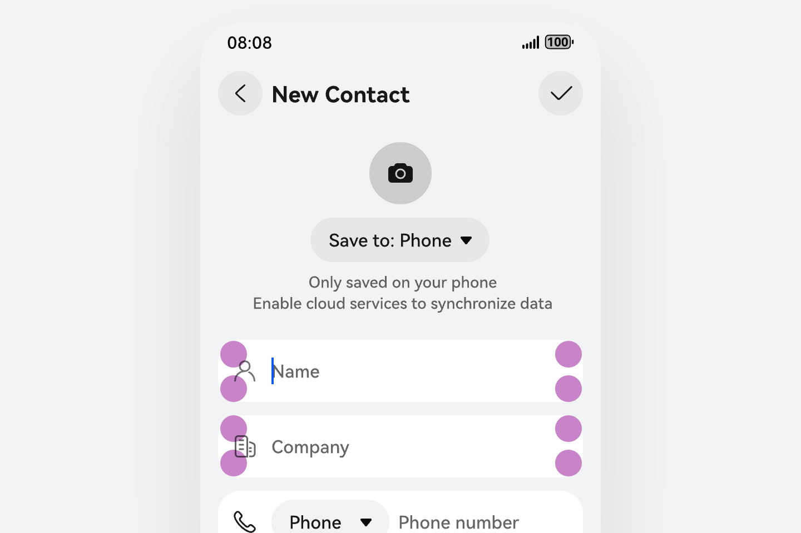
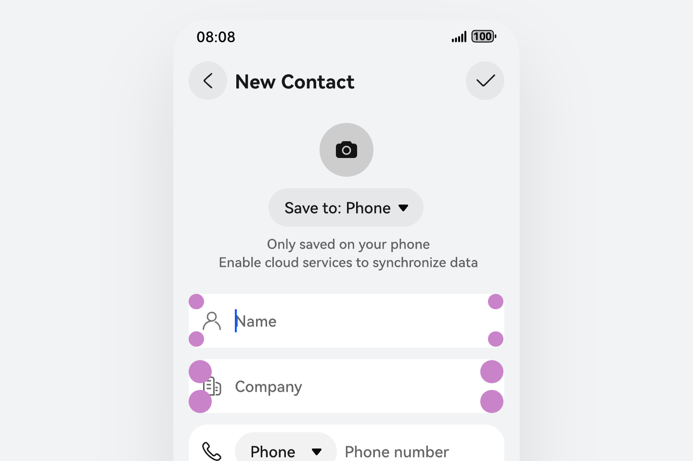
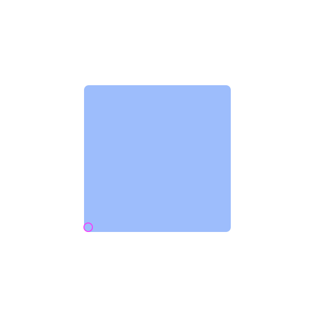
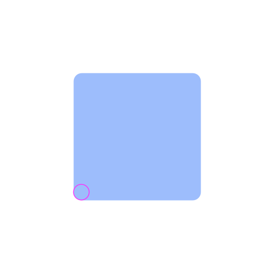
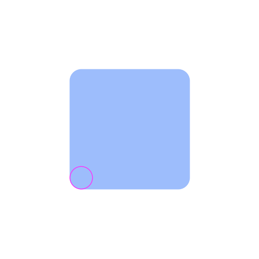
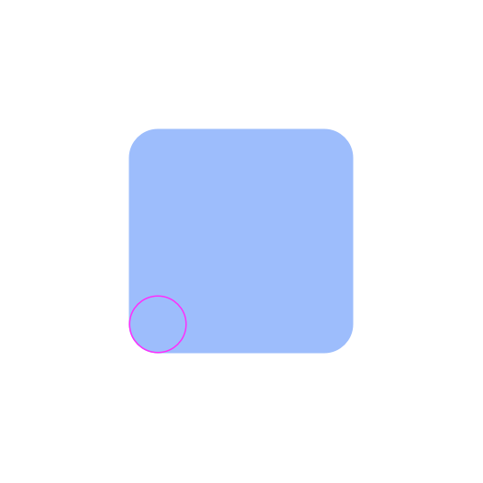
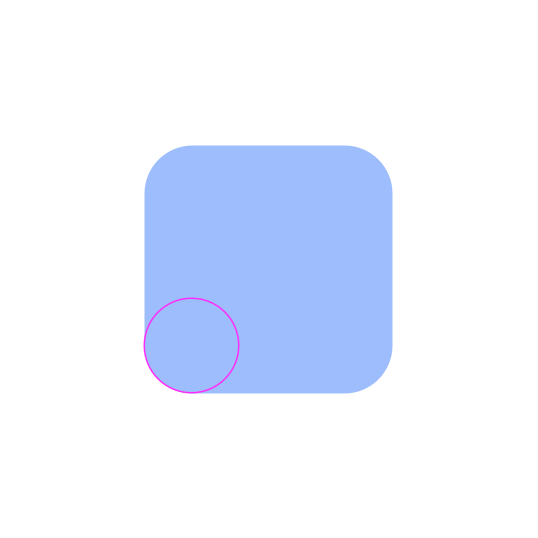
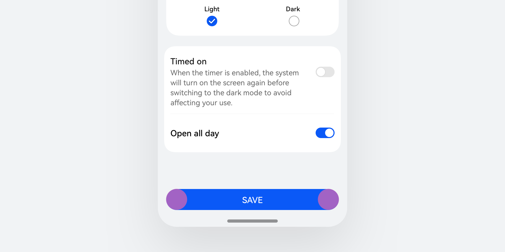

# 圆角参数

圆角是UI设计中对矩形的直角边缘进行圆弧化处理的视觉规范，用于定义容器或控件的边角样式。

在视觉效果上，圆角能够带来一定的活力，并可以起到多种核心作用，包括软化界面锐利感、降低视觉压迫感，明确控件层级与边界，优化触控区域识别性，提升操作舒适度与可访问性，传递产品友好、专业、现代的品牌调性等。

通过设定圆角半径控制圆弧曲率，按控件层级设定固定半径，可以统一界面风格、提升视觉亲和力与触控体验，是现代设计系统的基础视觉属性。

### 圆角使用原则

圆角的分层构建与使用，核心是建立不同视觉层级间的有序关联，同时确保同一层级的圆角保持统一。

### 同层统一

为保障界面视觉秩序，同一功能层级、同一类型的控件或容器，需采用一致的圆角半径，避免视觉混乱。

|  |  |
| --- | --- |
|     Do |     Don't |
| 同一类型控件圆角相同 | 同一类型控件圆角不同 |

### 层级正相关

圆角半径与界面元素的视觉、功能层级呈正相关，层级越高，圆角半径越大，例如半模态、弹出框等顶层元素圆角 > 图片、标签、角标等小控件，以此明确界面层级关系，提升视觉辨识度。

### 通用圆角尺寸

HarmonyOS 视觉系统目前最常使用的圆角参数，广泛应用于图标、卡片、按钮、菜单、半模态、弹出框等场景。

|  |  |  |
| --- | --- | --- |
| **圆角示意图** | **数值** | **场景** |
|  | 4vp | 系统通用超小圆角，适用于标签和角标等 |
|  | 8vp | 系统通用小圆角，适用于各类图片和图标等 |
|  | 16vp | 系统通用圆角，适用于通知卡片和内容容器等 |
|  | 20vp | 系统通用大圆角，适用于按钮和菜单等 |
|  | 32vp | 系统通用超大圆角，适用于半模态和弹出框等 |

### 通用圆角使用场景示例

### 系统通用超小圆角

4vp，适用于界面中尺寸较小、起到辅助标识作用的元素，用于弱化边缘锐利感，保持整体精致、紧凑的视觉效果。

典型场景：标签、角标、小型状态标识、迷你图标背景、细小型控件等。

### 系统通用小圆角

8vp，作为系统基础圆角，适用于各类常规展示类元素，保证视觉柔和、统一，是界面中使用频率较高的基础规格。

典型场景：各类图片、图标、小尺寸容器、列表内模块、基础功能控件等。

### 系统通用圆角

16vp，适用于需要突出信息、具备一定独立性的中层级容器与提示类组件，增强界面层次与可读性。

典型场景：通知卡片、普通卡片、内容容器、中型功能面板等。

### 系统通用大圆角

20vp，适用于高频交互、需要清晰可点击感知的功能型元素，提升操作辨识度与友好度。

典型场景：按钮、菜单、选项卡、功能入口、常用交互控件等。

### 系统通用超大圆角

32vp，适用于高层级、强聚焦、占据较大视觉比重的弹出与半浮层类组件，强化层级感与现代感。

典型场景：半模态弹窗、大型弹出框、顶层浮层、重点展示容器等。

### 系统圆角Token全量表

|  |  |
| --- | --- |
| **Token** | **数值** |
| corner\_radius\_none | 0 |
| corner\_radius\_level1 | 2 |
| corner\_radius\_level2 | 4 |
| corner\_radius\_level3 | 6 |
| corner\_radius\_level4 | 8 |
| corner\_radius\_level5 | 10 |
| corner\_radius\_level6 | 12 |
| corner\_radius\_level7 | 14 |
| corner\_radius\_level8 | 16 |
| corner\_radius\_level9 | 18 |
| corner\_radius\_level10 | 20 |
| corner\_radius\_level11 | 22 |
| corner\_radius\_level12 | 24 |
| corner\_radius\_level13 | 26 |
| corner\_radius\_level16 | 32 |
| corner\_radius\_level18 | 36 |