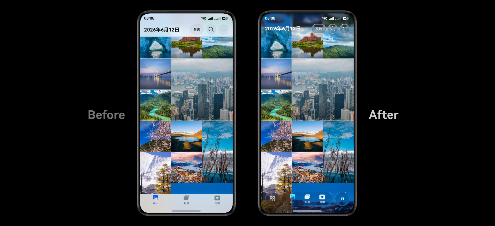
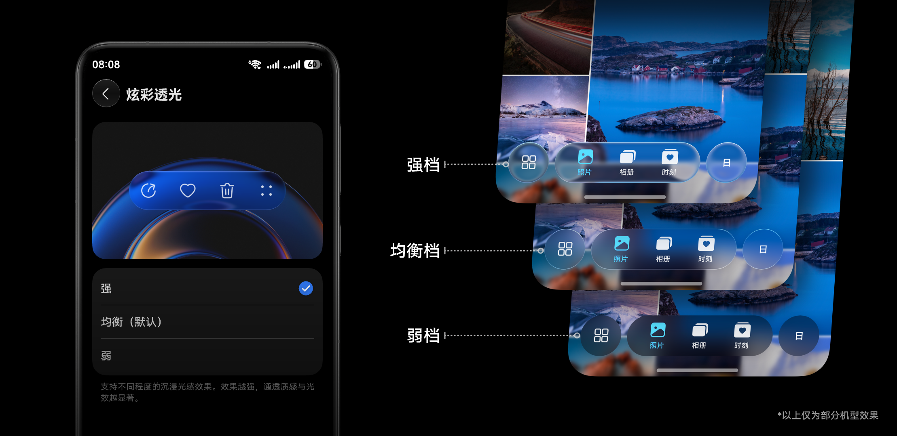
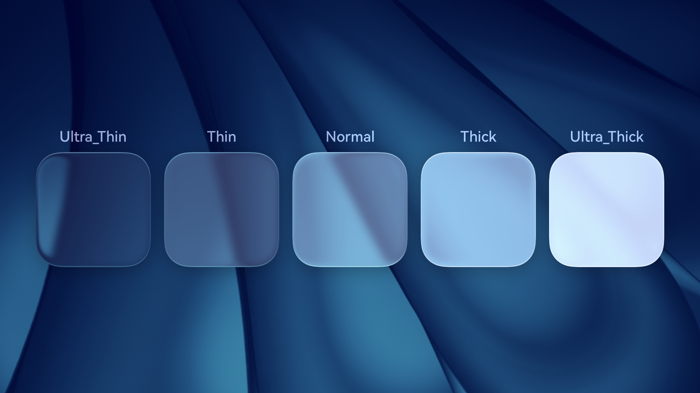
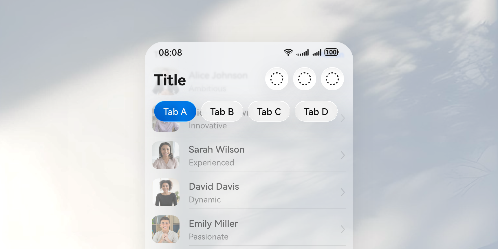
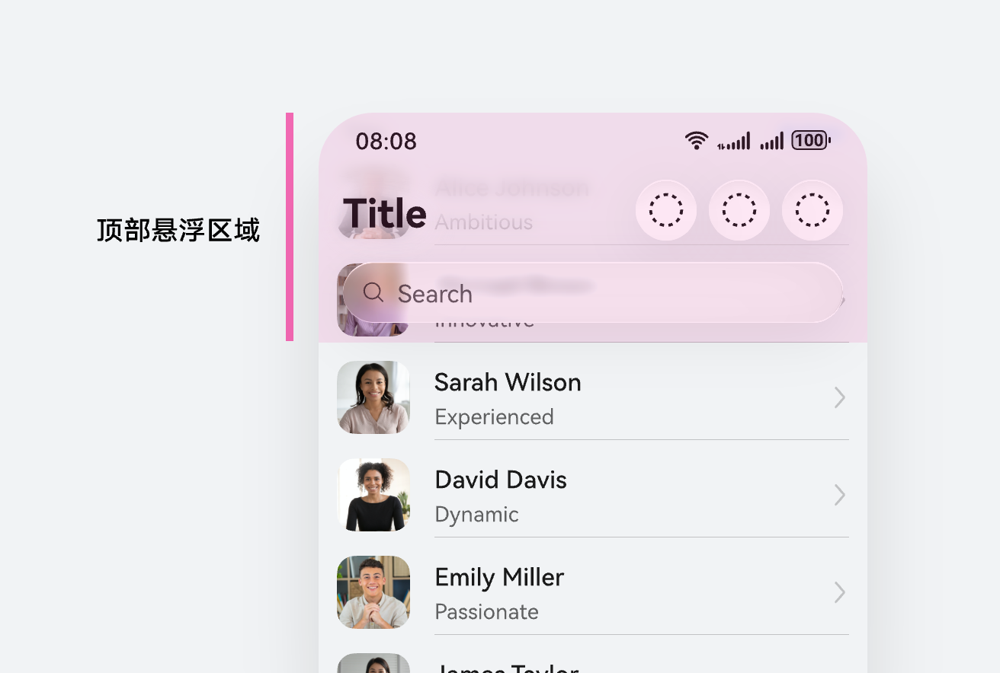
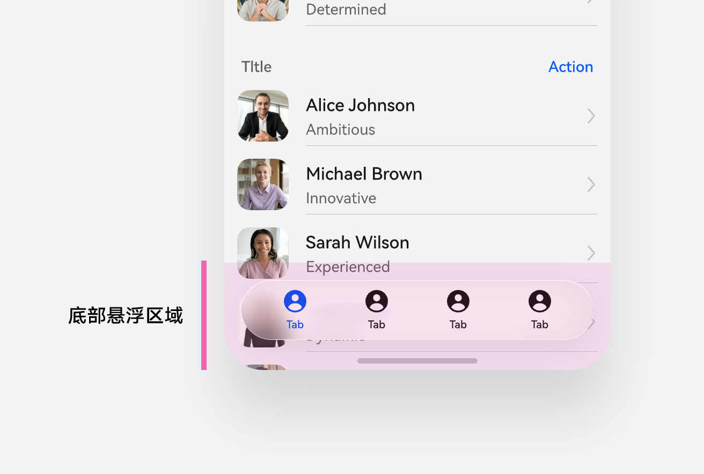
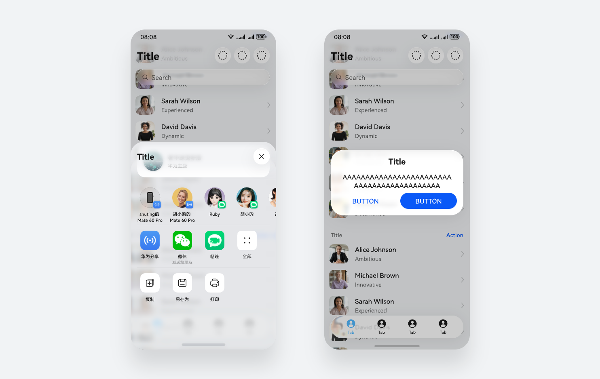

# 沉浸光感

### 光设计语言

在数字界面中，光不仅是照明的工具，更是塑造空间、传递反馈、引导注意力的核心语言。HarmonyOS 沉浸光感（Immersive Light）并非单纯的光影特效升级，而是一次从“视觉层”向“感知层”的体验跃迁。

“沉浸”的本质，是消除界面与内容之间的视觉割裂，将这一理念落地为可感知的设计语言：界面元素不再是实色填充或阴影层叠的平面图层，而是具备光学扩散与动态透光特性的数字介质。光线在介质表面发生折射与漫反射，使界面背板如薄雾般轻盈悬浮于内容之上。光感穿越层级，亦在层级间柔和漫溢，让前景与背景信息自然交融、和谐共生。

当光影材质与交互动效深度契合，指尖的每一次触碰与滑动都将牵引光场视效流转与质感变幻，营造出赏心悦目的空间交互体验。这一设计在保障信息清晰可读的同时，有效释放屏幕空间，大幅提升内容显示的屏占比与整体视觉沉浸感。

### 用户体验与个性定义

沉浸光感充分尊重不同用户的偏好，提供三档强度供自由调节。系统默认档位为均衡档，在通透度与对比度之间取得最佳平衡。三档调节本质上是对透明度、反色率、折射强度与环境交互程度的精细调控。无论是追求轻盈克制的高对比度，还是偏爱光影交织的沉浸氛围，用户均可按需选择。三档效果的详细差异如下图像所示：

|  |  |  |
| --- | --- | --- |
|  |  |  |
| 强档  强化光影交织与折射层次，叠加粒子流转与空间光效等丰富特效，营造浓郁深邃的沉浸氛围，赋予界面更强的视觉张力与立体纵深感。 | 均衡档（默认）  在通透感与对比度间取得精妙平衡，呈现轻盈薄透的视觉质感。环境光沿边缘柔和流转，自然勾勒层次，兼顾日常使用的清晰度与界面精致度。 | 弱档  在延续沉浸光感基调的同时，侧重轻盈克制与高对比度呈现。适度收敛光彩，确保核心信息在任何背景下均清晰锐利，让用户上手即觉熟悉，一见如故。 |

### 设计与开发

为契合不同信息层级与交互场景，沉浸光感配备了从Ultra\_Thin 到 Ultra\_Thick 共5个层级枚举值，供设计与开发灵活调用。在实际开发中，无需针对用户的三档自定义强度选项分别进行代码适配——系统底层将自动完成参数映射与动态渲染。只需一次定义，界面即可随用户设置平滑过渡。

### 场景规范

在页面中使用沉浸光感，提升页面的精致度和空间感。原则上，我们建议，当某些界面操作元素在交互过程中可能存在与内容区产生重叠情况时，使用沉浸光感效果能够大幅度提高页面的视觉体验，强化页面 Z 轴空间感，从纵向空间分离开内容与交互组件，使内容更沉浸，交互操作更易读、易用、易感知。

不同位置或存在方式的交互组件推荐使用不同的材质档位，保障在应用界面中呈现出最佳的视觉效果。

|  |  |
| --- | --- |
|   当组件在顶部悬浮时，推荐使用 ULTRA\_THIN 枚举参数，并结合渐变模糊效果延展顶部内容展示空间，增强沉浸感和精致感。 |   当组件在底部悬浮时，推荐使用 THIN 枚举参数，并结合渐变颜色蒙层延展底部内容展示空间，增强沉浸感和精致度。 |
|   当组件非常驻在页面之上，且可能会在任意位置弹出时，建议适配 THICK 枚举参数，以确保复杂场景下内容的可读性。 |   半模态、弹出框组件通常占据面积较大，内容丰富度更强，推荐使用 ULTRA\_THICK 枚举参数，以确保在复杂场景下内容的可读性。 |