# 间隔参数

间隔是 UI 设计中用于控制界面元素与元素、元素与容器之间空白距离的布局规范，用于定义界面的疏密关系、呼吸空间与视觉层次。

在视觉与体验上，合理的间隔能够塑造清晰有序的界面结构，核心作用包括梳理模块边界、避免视觉杂乱，引导自然顺畅的视觉流，明确信息阅读优先级，提升内容可读性与视觉舒适度。

通过统一间距数值规范，可以保证多页面、多组件风格高度一致，强化整体设计的秩序感与专业度，是构建规整、易用界面的基础布局属性。

### 间隔使用规则

**遵循统一栅格体系**：界面内所有间距优先使用固定基数的倍数（如 4vp、8vp 体系），避免随意数值，以保证全平台、全页面视觉统一。

**按照层级区分间距**：大小信息层级越高、独立性越强，间距越大；同级元素间距保持一致，上下级内容间距逐级区分，让视觉层次自然清晰。

**同类元素间距一致**：相同类型组件、相同场景的间距保持统一，如按钮组间距、列表间距、卡片间距等，减少用户认知负担。

**屏幕边缘间距固定**：规范界面内容与屏幕边缘、保留固定安全边距，避免内容贴边，提升握持与阅读舒适度，同时适配不同设备尺寸。

### 常用间隔类型

**屏幕边缘间隔**：指界面元素与屏幕四周边缘的留白距离，即外边距（margin），可结合产品定位与使用场景，统一调整界面整体留白尺度。

**元素间间隔**：指界面内各类视觉控件、功能组件、图标按钮、卡片模块等元素之间的留白距离，是平衡页面布局层级、区分功能模块、优化视觉节奏的核心基础规范。

**文本间间隔**：指界面内不同文本内容（如多行文字、功能说明文字、标题与正文等）之间的留白距离，合理设置可提升文字阅读舒适度与页面整洁度。

### 多设备屏幕边缘间隔尺寸

HarmonyOS 针对手机、平板、折叠设备、PC 等不同终端，分别定义标准化屏幕四边外边距（margin）数值，图例请参阅[系统安全区](https://developer.huawei.com/consumer/cn/doc/design-guides/design-layout-basics-0000001795579413#section167383215015)

|  |  |  |  |  |  |  |  |  |
| --- | --- | --- | --- | --- | --- | --- | --- | --- |
| **间隔类型** | **手机** | **折叠屏** | **平板** | **智慧屏** | **穿戴** | **PC** | **智能座舱** | **场景** |
| 屏幕边缘间隔/margin | 16vp | 24vp | 32vp | 48vp | 26vp | 40vp | 48vp | 屏幕左右两侧边距 |
| 屏幕边缘间隔/margin | 36vp | 36vp | 36vp | 27vp | 20vp | / | / | 屏幕顶部边距 |
| 屏幕边缘间隔/margin | 28vp | 28vp | 28vp | 27vp | 20vp | / | / | 屏幕底部边距 |

### 多设备间隔使用场景示例

结合泛手机、智慧屏、穿戴设备等多类终端设备，抽取系统中常用的几个间隔，分别展示不同使用场景下的元素间间隔与文本间间隔应用示例，直观呈现跨设备间距规范的落地效果。

### 泛手机

**元素间间隔**

卡片之间的间隔，12vp。

控件间上下方向较大间隔，一般用于有明显边界元素间间隔，16vp。

控件间上下方向普通间隔，一般用于无明显边界元素间间隔，8vp。

控件间左右方向较大间隔，一般用于有明显边界元素间间隔，16vp。

控件间左右方向普通间隔，一般用于无明显边界元素间间隔，8vp。

|  |  |
| --- | --- |
| 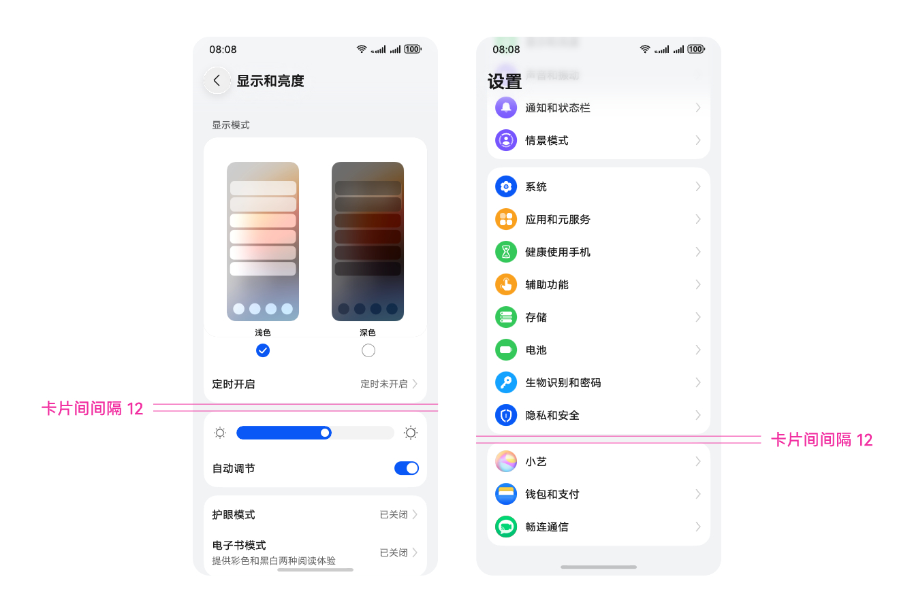 | 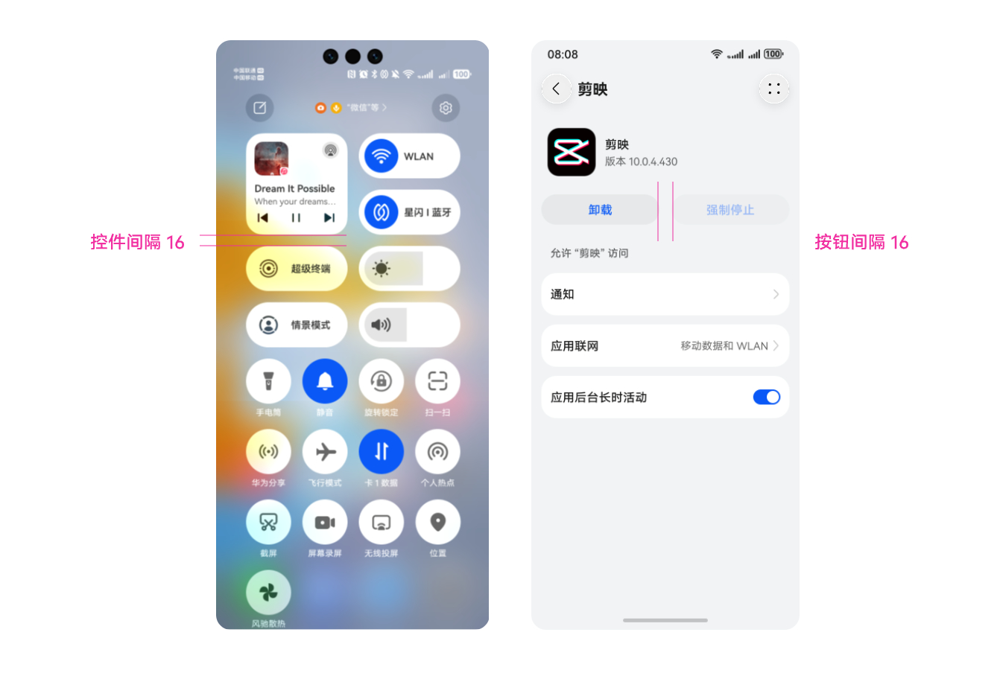 |
| 卡片间间隔，12vp | 控件间较大间隔，16vp |

**文本间间隔**

主次文本上下间隔 ，2vp。

主次文本左右间隔，8vp。

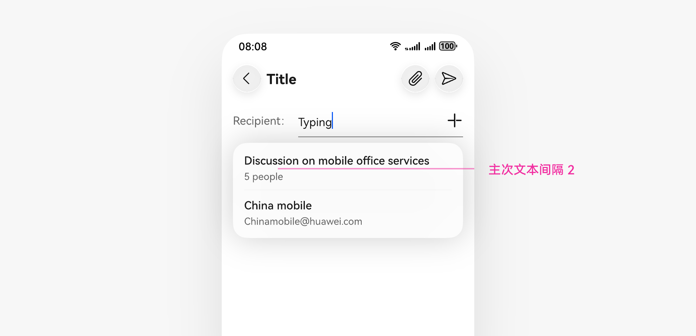

### 智慧屏

**元素间间隔**

控件间上下方向较大间隔，一般用于有明显边界元素间间隔 ，24vp。

控件间上下方向普通间隔，一般用于无明显边界元素间间隔，12vp。

控件间上下方向较小间隔，一般用于无明显边界元素间间隔，8vp。

控件间左右方向较大间隔，一般用于有明显边界元素间间隔，24vp。

控件间左右方向普通间隔，一般用于无明显边界元素间间隔，12vp。

|  |  |
| --- | --- |
| 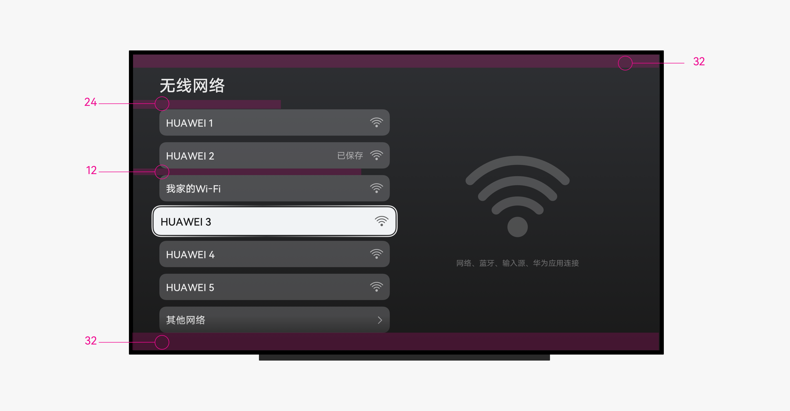 | 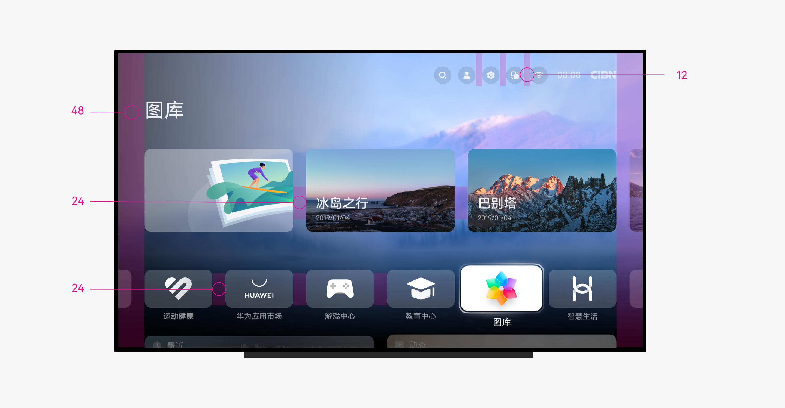 |
| 控件间上下间隔 | 控件间左右间隔 |

**文本间间隔**

第一层级文本段落间隔，32vp。

第二层级文本段落间隔，24vp。

第三层级文本段落间隔，16vp。

第四层级文本段落间隔，8vp。

第五层级文本段落间隔，4vp。

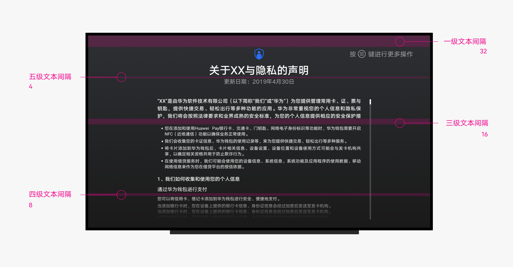

### 穿戴

**元素间间隔**

|  |  |
| --- | --- |
| 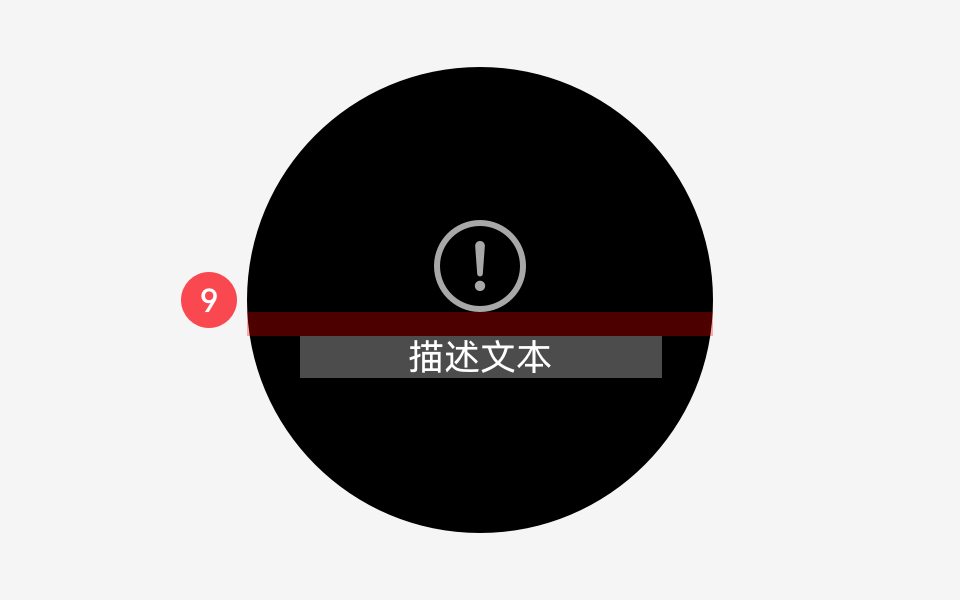 | 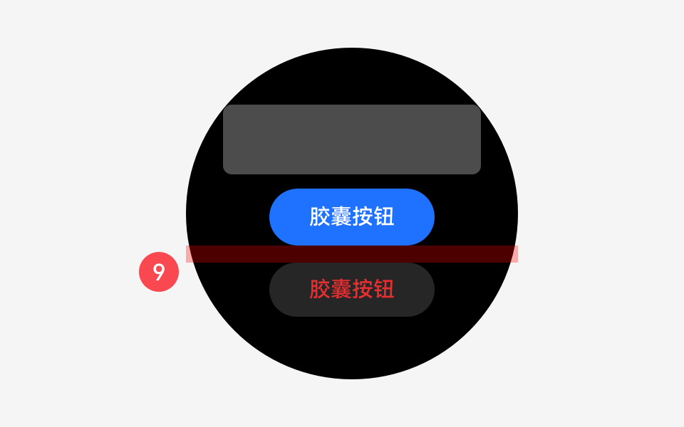 |
| 间距 9（12vp） | 间距 9（12vp） |
| 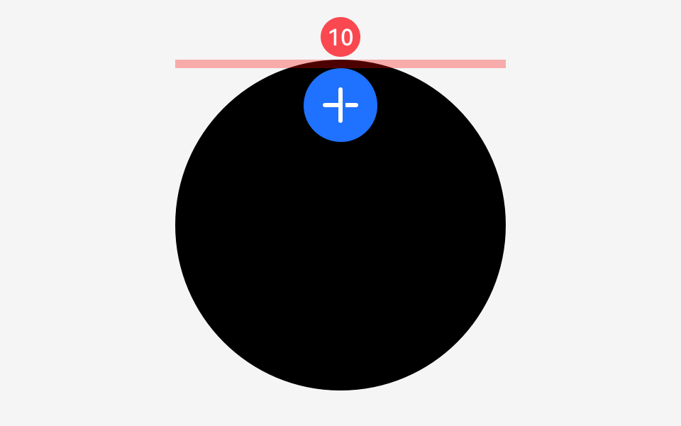 | 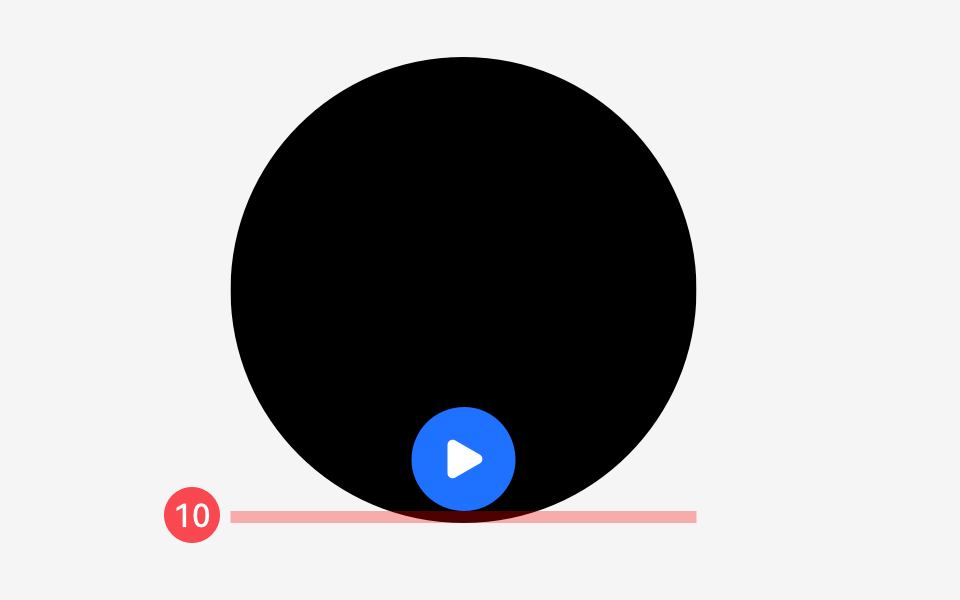 |
| 间距10（6vp） | 间距 10（6vp） |
| 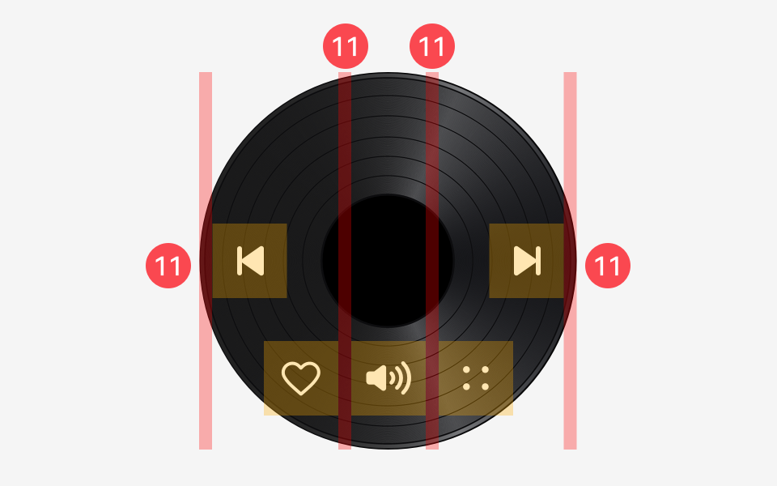 | 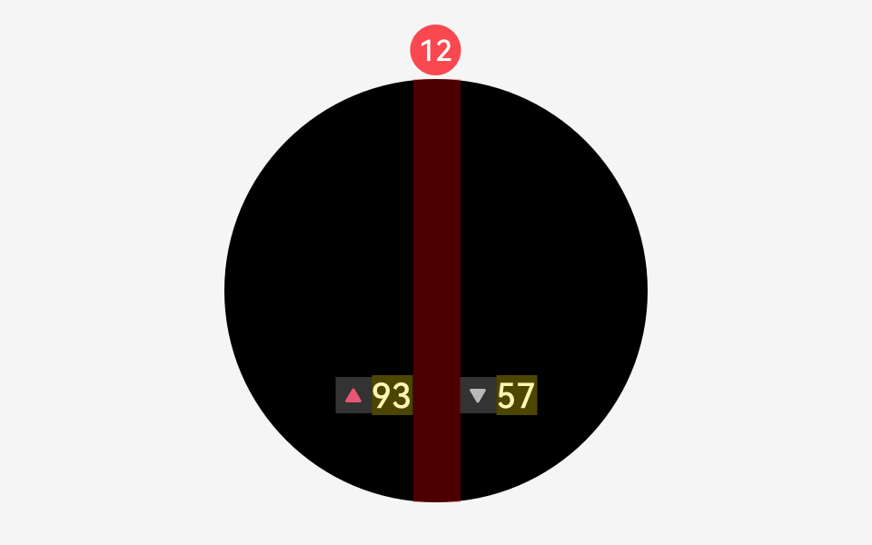 |
| 间距 11（8vp） | 间距 12（26vp） |

**文本间间隔**

|  |  |
| --- | --- |
| 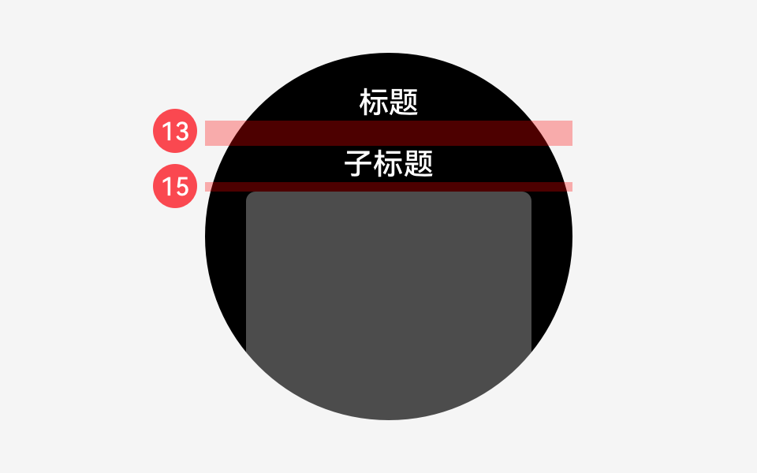 | 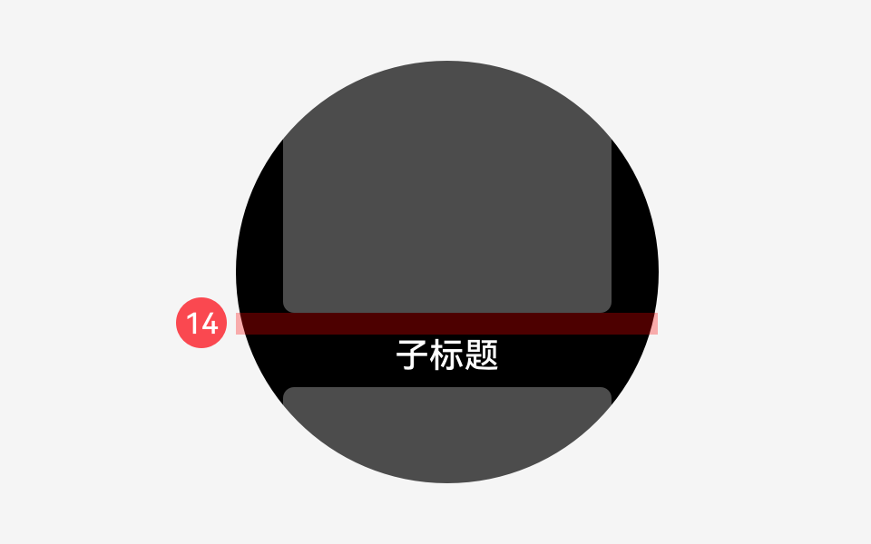 |
| 间距 13（16vp），间距 15（6vp） | 间距 14（12vp） |
| 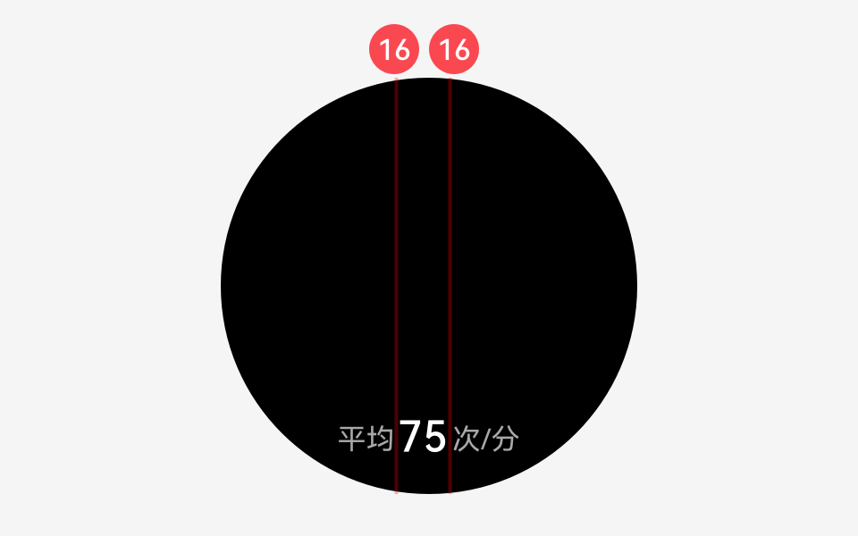 | 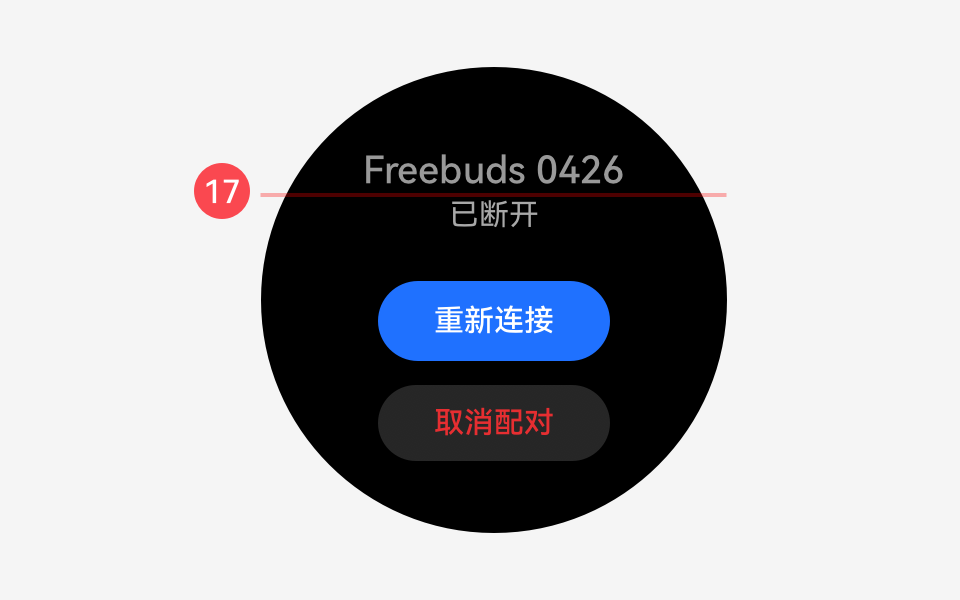 |
| 间距 16（2vp） | 间距 17（2vp） |

### 系统间隔Token全量表

|  |  |
| --- | --- |
| **Token** | **数值** |
| Padding\_level0 | 0 |
| Padding\_level1 | 2 |
| Padding\_level2 | 4 |
| Padding\_level3 | 6 |
| Padding\_level4 | 8 |
| Padding\_level5 | 10 |
| Padding\_level6 | 12 |
| Padding\_level7 | 14 |
| Padding\_level8 | 16 |
| Padding\_level9 | 18 |
| Padding\_level10 | 20 |
| Padding\_level11 | 22 |
| Padding\_level12 | 24 |
| Padding\_level13 | 26 |
| Padding\_level16 | 32 |
| Padding\_level17 | 34 |
| Padding\_level18 | 36 |
| Padding\_level19 | 38 |
| Padding\_level20 | 40 |
| Padding\_level21 | 42 |
| Padding\_level22 | 44 |
| Padding\_level23 | 46 |
| Padding\_level25 | 50 |
| Padding\_level26 | 52 |
| Padding\_level27 | 54 |
| Padding\_level28 | 56 |
| Padding\_level29 | 58 |
| Padding\_level30 | 60 |
| Padding\_level32 | 64 |
| Padding\_level33 | 66 |
| Padding\_level34 | 68 |
| Padding\_level35 | 70 |
| Padding\_level36 | 72 |