# 文本排版

### 字体排印

字体排印指的是在操作系统中对文字的布局和呈现方式的定义。在 UI 设计中，字体排印起着关键的作用，包括字体的大小、样式、行间距等，这些因素直接影响用户界面的可读性和整体美观性。通过合适的字体排印，设计师可以确保用户能够轻松阅读和理解应用的内容，提升用户体验。除了确保文本清晰易读外，您选择的字体排印方式还可协助您阐明信息层级结构、传达重要内容并宣传您的品牌。

### 排版体验要求

| 最小可读字号 | 色彩和对比度 | 一致的字体风格 | 简洁的样式表达信息 | 支持系统大字体 |
| --- | --- | --- | --- | --- |
| UI 排版中使用的字号应大于用户可阅读的最小字号，以确保在各种设备上都能提供清晰可读的文本。 | 选择适当的颜色并确保足够的对比度，以确保文本在各种背景下清晰可辨，提升可读性。 | 保持字体的一致性，包括字重和字体风格，以创造整体协调的用户界面，增强品牌一致性。 | 避免过度使用字号、粗细和颜色等样式，以确保信息层级清晰，提升用户理解文本内容的效果，同时应避免过多的层级导致界面过于复杂。 | 确保字体能够适应系统无障碍设置中的大字体模式，以提供对视觉障碍用户的友好支持。 |

### 文本应用

文字比例是一种规定了不同字体大小的系统，旨在确保在用户界面中保持一致的视觉层次结构。这包括主标题、子标题、正文等不同文本元素的字号选择，以及它们之间的比例关系，以提高设计的一致性、可读性和美观性。在 UI 界面的字体排版中，我们将排版字体的类型分为“展示、标题、子标题、正文、说明”五大类，并根据使用场景使用推荐的样式，以达到与系统一致的阅读体验。

| 场景类别 | 层级 Token | 字重 Weight | 尺寸 Size (phone) | 尺寸 Size (PC) | 尺寸 Size (watch) |
| --- | --- | --- | --- | --- | --- |
| 展示性文本  Display | Display\_L | Light | 56 vp | 54 vp | 56 vp |
| 展示性文本  Display | Display\_M | Light | 48 vp | 46 vp | 48 vp |
| 展示性文本  Display | Display\_S | Light | 38 vp | 36 vp | 38 vp |
| 标题文本  Title | Title\_L | Bold | 30 vp | 28 vp | 30 vp |
| 标题文本  Title | Title\_M | Bold | 24 vp | 22 vp | 24 vp |
| 标题文本  Title | Title\_S | Bold | 20 vp | 18 vp | 20 vp |
| 副标题文本  Subtitle | Subtitle\_L | Medium | 18 vp | 16 vp | 18 vp |
| 副标题文本  Subtitle | Subtitle\_M | Medium | 16 vp | 14 vp | 16 vp |
| 副标题文本  Subtitle | Subtitle\_S | Medium | 14 vp | 12 vp | 14 vp |
| 正文文本  Body | Body\_L | Medium | 16 vp | 14 vp | 16 vp |
| 正文文本  Body | Body\_M | Regular | 14 vp | 14 vp | 14 vp |
| 正文文本  Body | Body\_S | Regular | 12 vp | 14 vp | 12 vp |
| 说明文本  Caption | Caption\_L | Medium | 12 vp | 12 vp | 12 vp |
| 说明文本  Caption | Caption\_M | Medium | 10 vp | 9 vp | 10 vp |
| 说明文本  Caption | Caption\_S | Medium | - | - | 8 vp |

|  | 展示性文本    展示文本是用于吸引用户注意力的大标题或短语，通常具有较大的字号和鲜明的样式。展示文本用于突出显示关键信息，例如天气应用里达到“温度数值”、计算器应用里的“计算结果”。 |  | 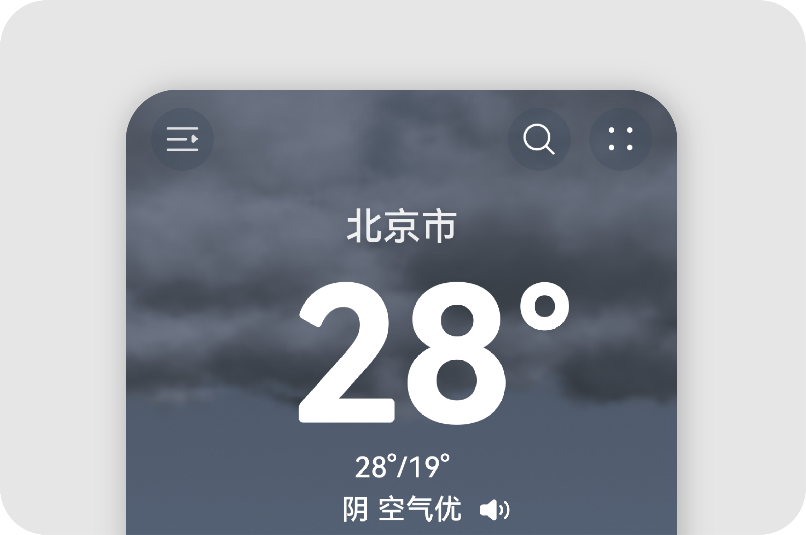 |
| --- | --- | --- | --- |
|  |  |  |  |

|  |  |
| --- | --- |
| 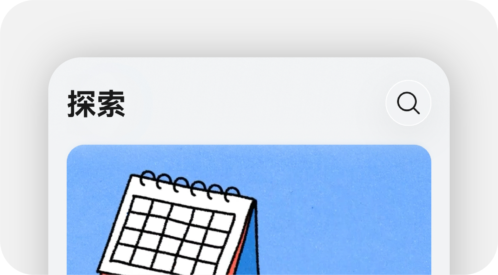 | 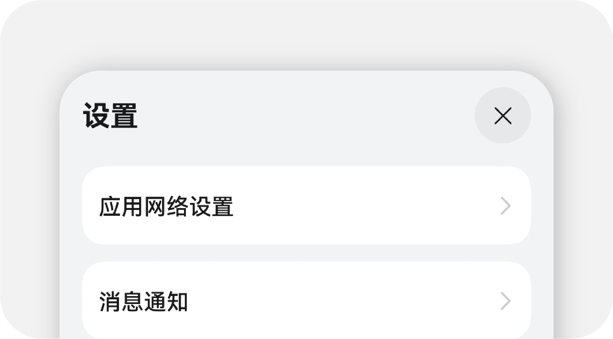 |
| **标题文本**    主标题文本是用于标识页面或区域的主要标题，通常具有较大的字号和明显的样式，但不如展示文本那么突出。主标题文本应用于页面的顶部或板块的开头，用于引导用户关注重要内容，如页面的标题，文章的标题或弹窗的标题。 | **子标题文本**    小标题是相对于主标题或大标题而言的次要标题，用于划分内容，引导读者在更详细的层次中理解信息。它通常比主标题略小，但比正文文本略大。小标题帮助组织信息、引导读者关注特定段落或主题，提供更好的阅读导向。 |
| 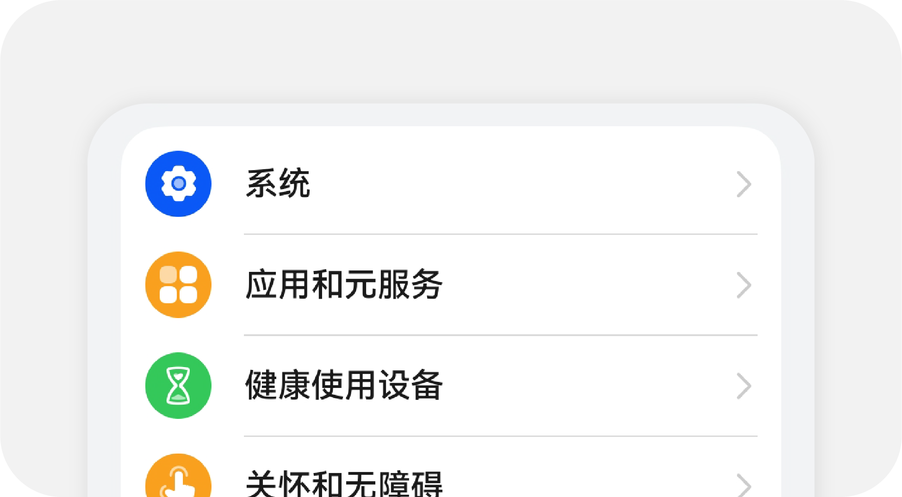 | 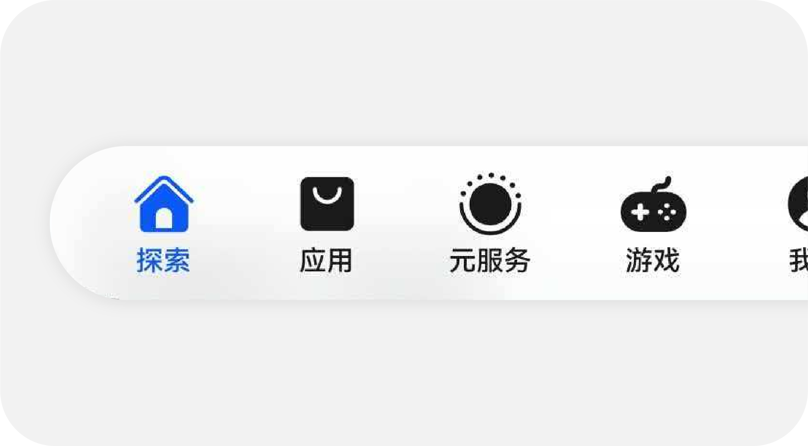 |
| **正文文本**    正文文本用于呈现长篇幅的正文内容，字号适中，样式清晰，以提供良好的阅读体验。正文文本在应用或网页的主要内容区域，用于展示文章详情、列表内容。 | **说明文本**    说明文本用于短小的标签或其他需要简明扼要表达的信息，通常字号较小，样式简洁。说明文本通常应用于图片的简要提示，以及图标的说明文本或者其他需要提供简短解释的地方。 |

### 文本排版规范

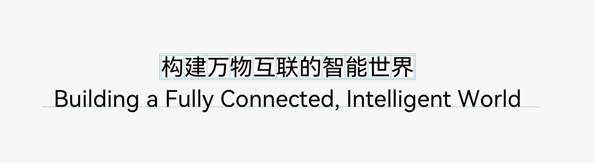

### 标点及符号排版规则

排版引擎将视觉感受转化为可量化的规则体系，明确每一种字符在特定场景下的宽度、间距从行首尾标点的缩进处理，到中西文混合排版的间距挤压与符号纵向微调，逐字逐点地细致调整，以明确每一处细节都经得起审视。

**行首标点缩进**

|  |  |
| --- | --- |
| 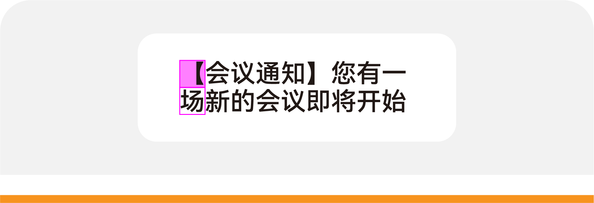 | 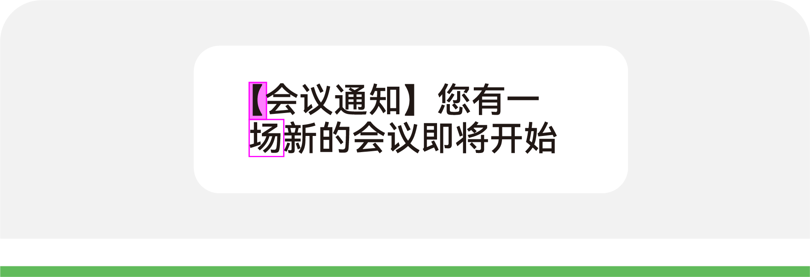 |
| 不建议 | 建议 |

**行首标点禁则**

|  |  |
| --- | --- |
| 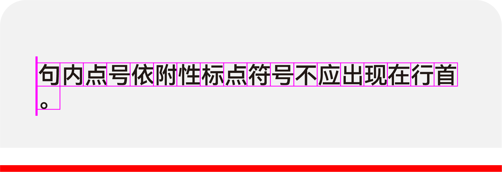 | 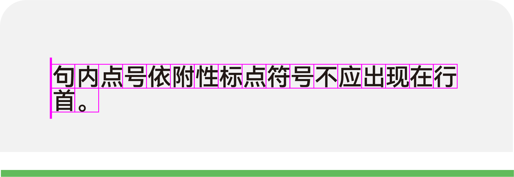 |
| 错误 | 正确 |

**行尾标点悬挂**

|  |  |
| --- | --- |
| 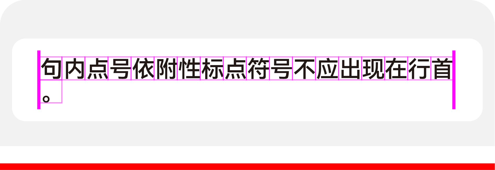 | 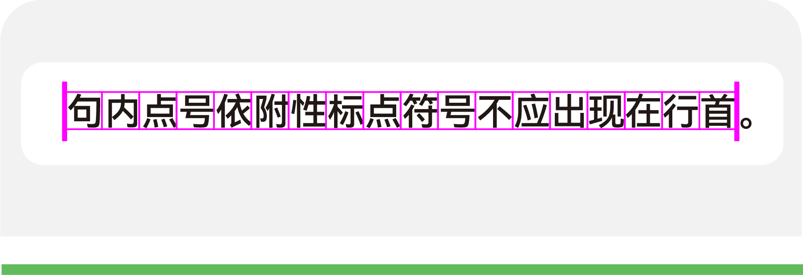 |
| 错误 | 正确 |

**标点符号连用**

|  |  |
| --- | --- |
| 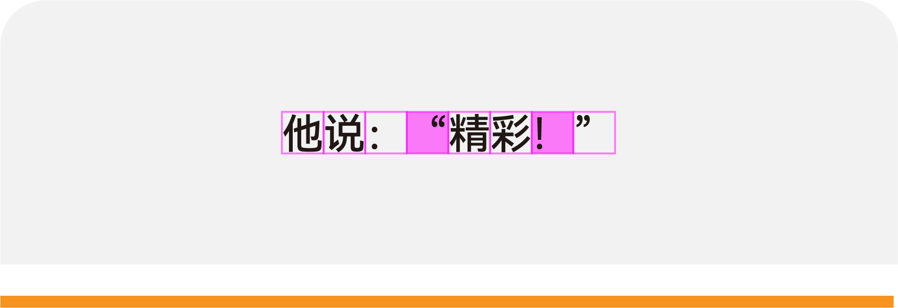 | 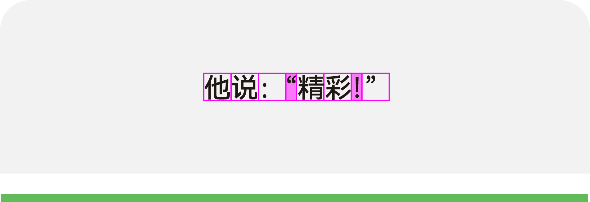 |
| 不建议 | 建议 |

**混合排版间空格**

|  |  |
| --- | --- |
| 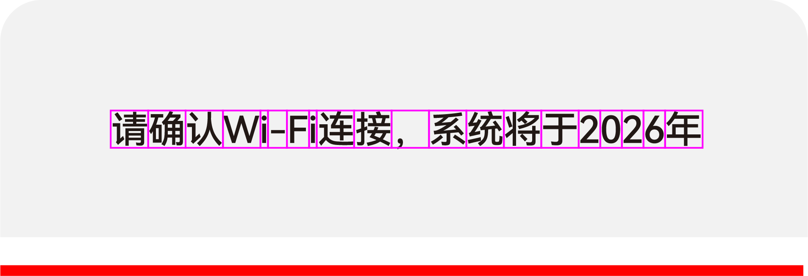 | 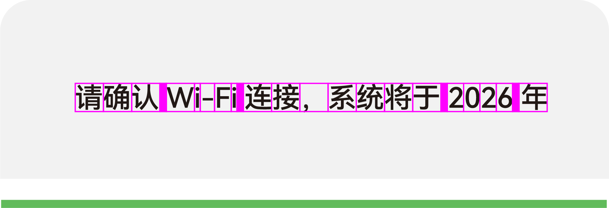 |
| 错误 | 正确 |

### 段落排版规则

通过排版引擎规则，可实现语言排版间距均匀自然，文本两端对齐方式精准，正体版面整洁有序，在有限空间提升信息密度与可读性。

**行尾孤字成行**

|  |  |
| --- | --- |
|  |  |
| 不建议 | 建议 |

**行长缩进**

| 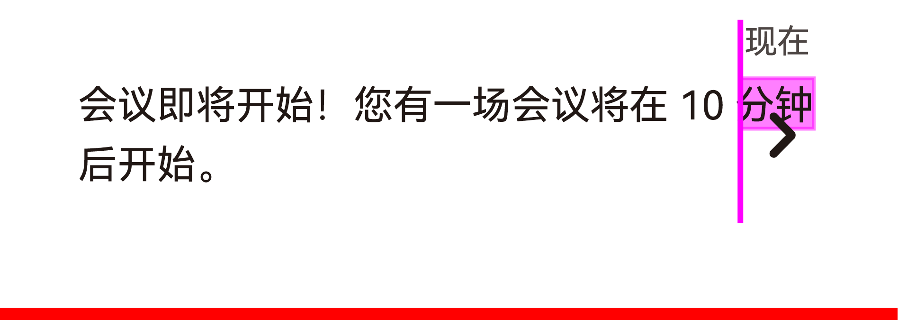 |  |
| --- | --- |
| 错误 | 正确 |

**中文两端对齐**

|  |  |
| --- | --- |
| 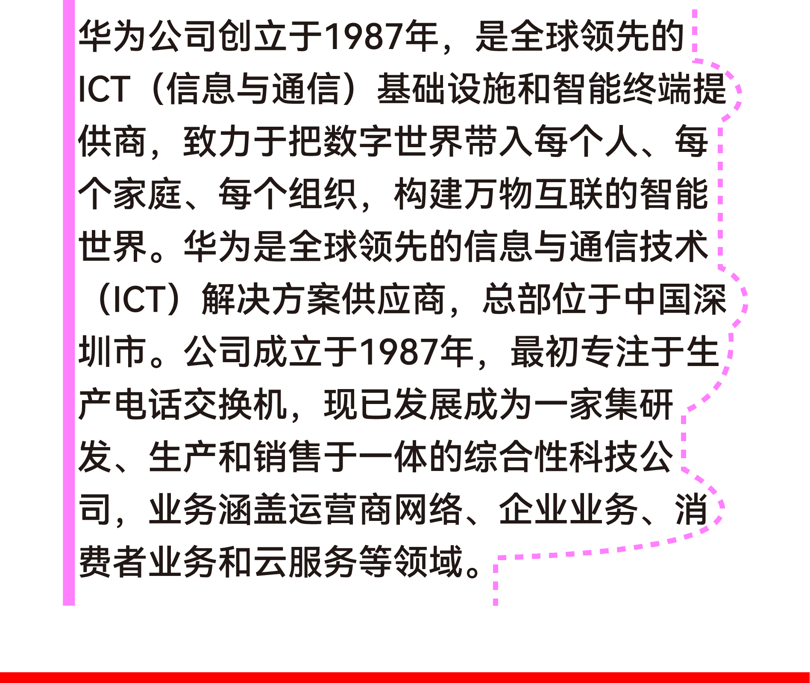 | 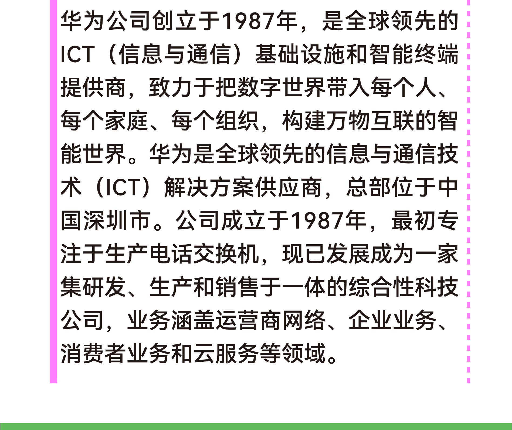 |
| 错误 | 正确 |

**英文平衡排版**

|  |  |
| --- | --- |
| 不建议 | 建议 |

**英文按音节破发换行**

|  |  |
| --- | --- |
|  |  |
| 不建议 | 建议 |

**小语种行高变化**

| 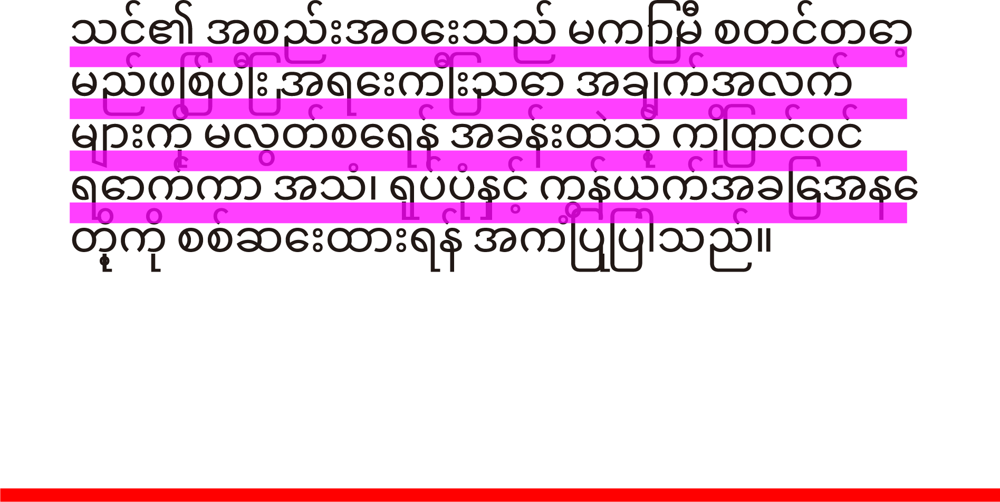 | 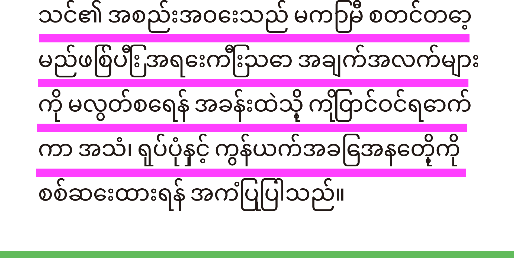 |
| --- | --- |
| 错误 | 正确 |

### 使用自定义字体

如果系统默认字体风格无法满足您的诉求，例如为了宣传品牌或者创造沉浸式的游戏体验，您可以使用自定义字体，但需要确保用户可在不同视距和各种条件下都能轻松阅读。

|  |  |  |  |
| --- | --- | --- | --- |
|  | 鸿蒙黑体    请参阅《鸿蒙黑体指南》，了解如何在 HarmonyOS 平台上的应用中使用这些字体。 |  | 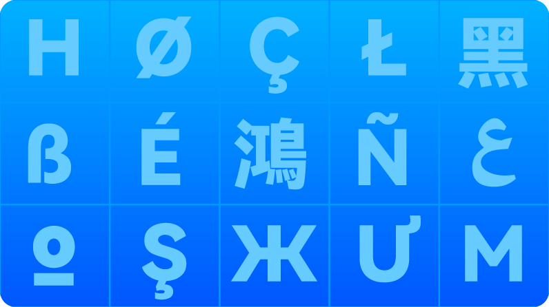 |
|  |  |  |  |