\{/* TODO: 含合并单元格的表格已降级为标准Markdown表格，建议使用\<MergedTable\>组件还原 */\}

# 阔折叠

阔折叠手机是折叠手机的一种，以其宽阔的横向视窗为核心特征，展开态接近书本比例，旨在提供更符合人类视觉习惯的宽屏体验。相较于内屏，外屏幕尺寸较小，对应用的显示和操作要求更高，需要有针对性的设计，确保应用在不同折叠形态间均能提供直观、舒适的交互体验。

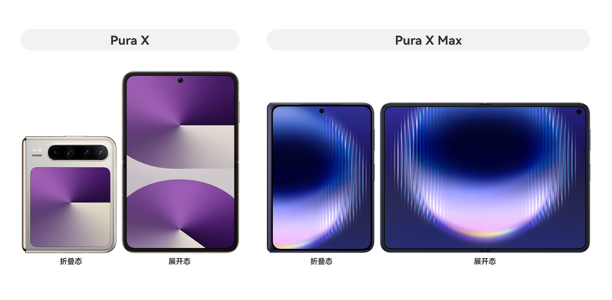

### 通用基础体验设计

## 布局完整

设备在折叠、展开或横竖屏切换时，应用窗口中的图片、视频等界面元素应避免出现错位、截断、变形模糊等问题。

|  |  |
| --- | --- |
| 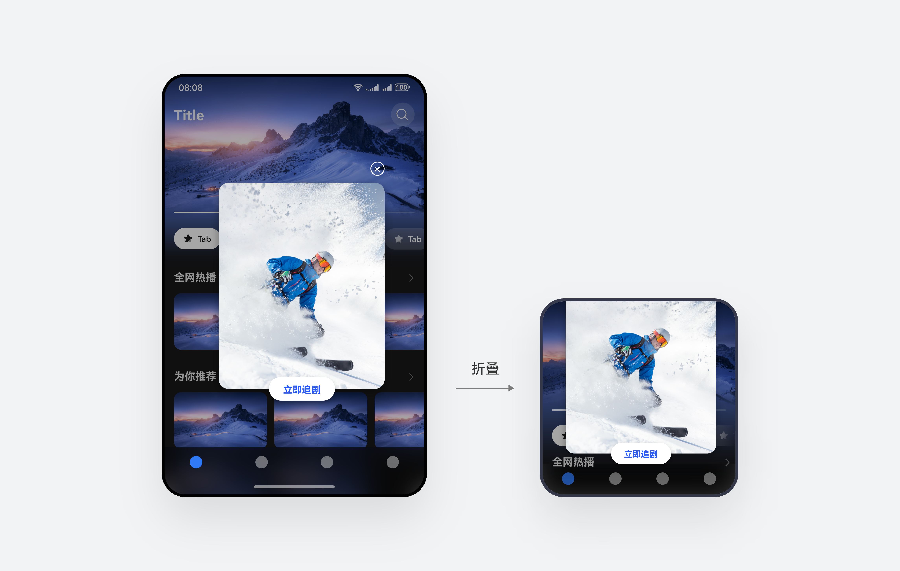 | 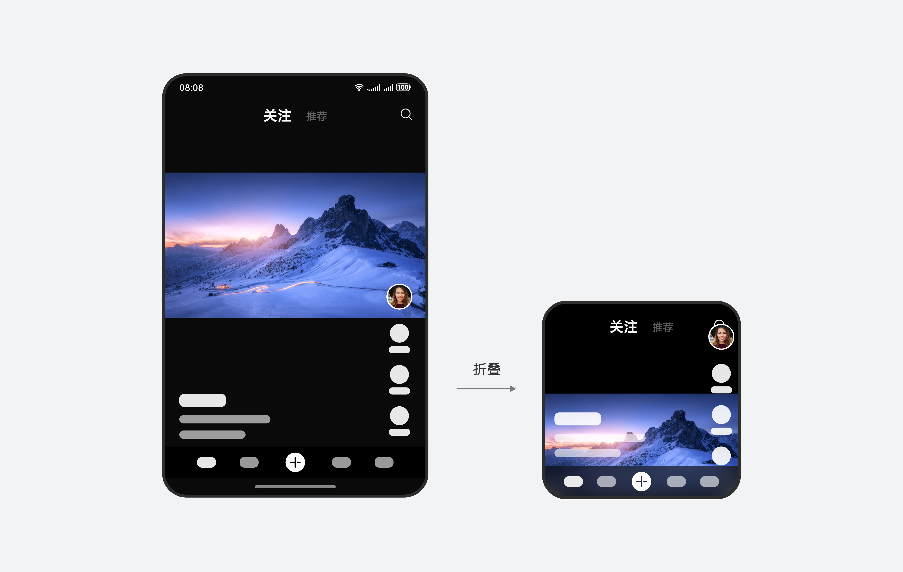 |
|   不推荐（弹框截断） |   不推荐（视频截断、元素重叠） |

外屏文字、图标大小应与内屏保持一致。

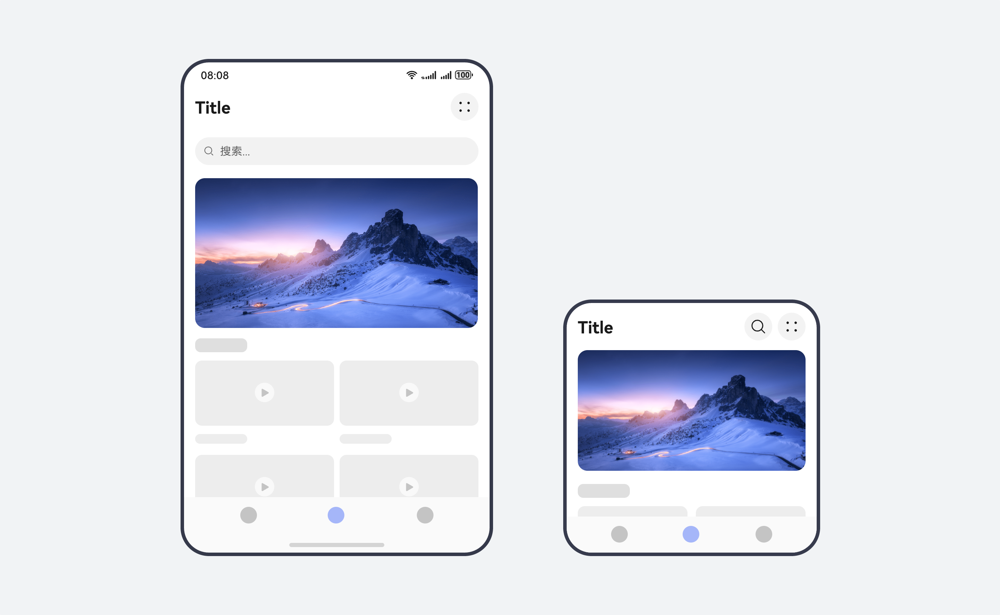

## 导航条适配

外屏无需显示导航条，同时不显示导航条所占的纵向空间。

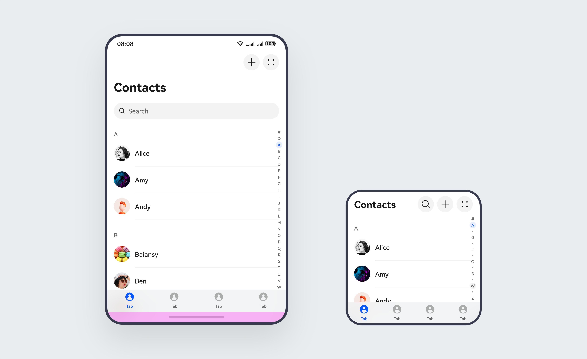

## 状态栏适配

外屏状态栏应隐藏，释放其所占用的纵向空间，增加内容显示区域。

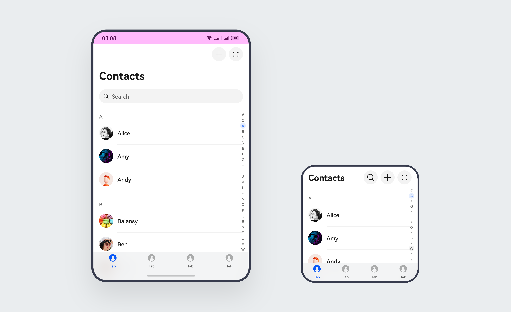

## 多窗适配

外屏不支持悬浮窗、分屏功能，内屏已经形成的悬浮窗或分屏，设备折叠后焦点窗口外屏全屏打开，非焦点窗口退后台。

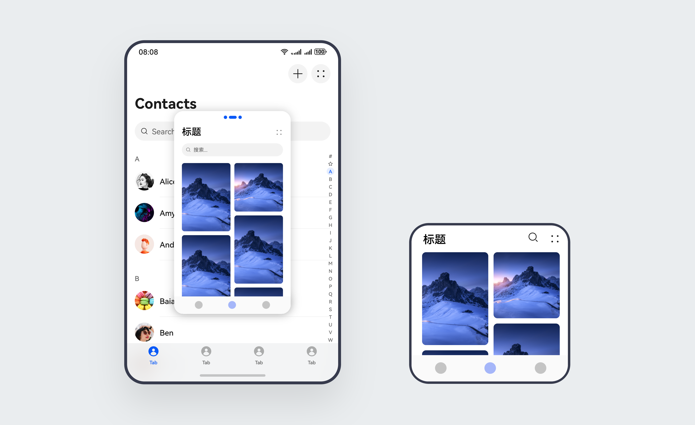

## 画中画适配

外屏支持画中画功能，通过点击画中画按钮、视频详情上滑退出应用等方式可启动画中画。

内屏已经打开画中画，设备折叠进入外屏画中画接续不中断。

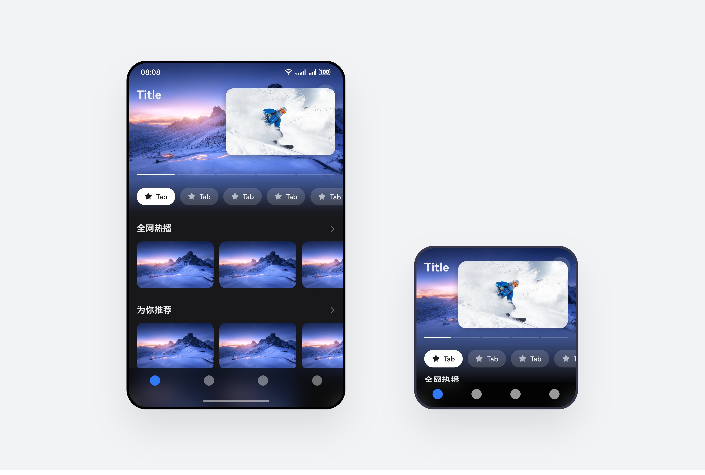

## 通用应用架构

应用的基础布局结构一般为：

* 标题区：大标题、子页签、搜索图标等都在顶部标题区域显示。
* 内容区：内容区显示页面的主要内容，常见的内容区有列表、宫格、瀑布流等布局。
* 底部区 (可选)：底部操作区域，常见为底 tab、工具栏，底部区域为可选区域。

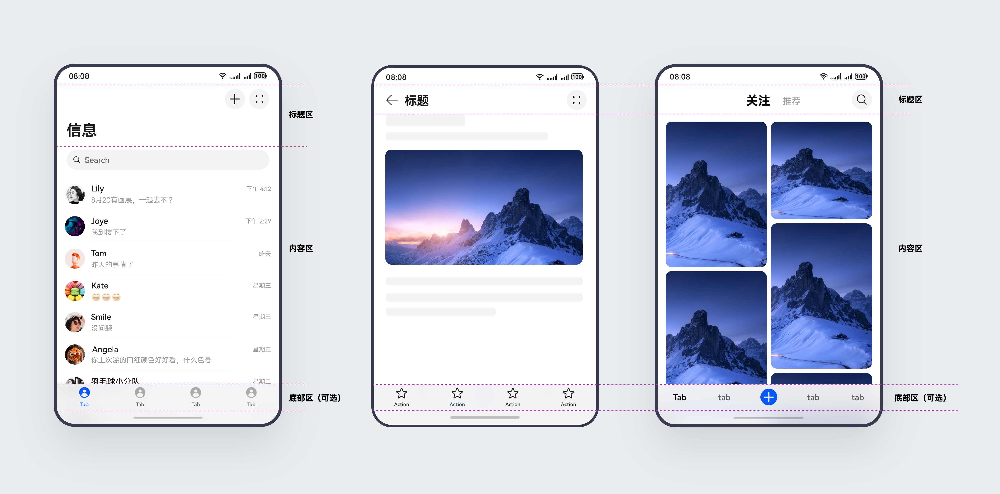

(内屏通用架构)

外屏应与内屏保持一致的应用架构，保证功能和显示完整可交互。

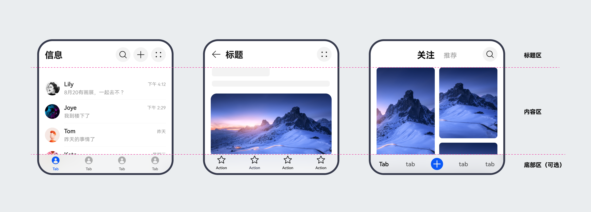

(外屏通用架构)

**瀑布流布局**

* 设备折叠，应用界面遵循基础的布局结构不变，确保功能正常操作。
* 窗口高度发生变化，界面上可滑动的内容溢出到屏幕外，滚动页面查看。滑动过程中，顶部与底部结构如标题栏、底部导航栏可临时隐藏。

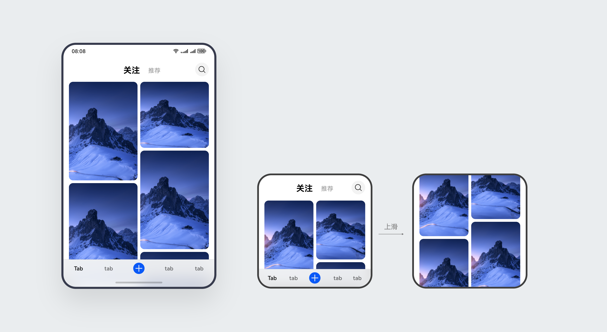

**固定布局**

外屏固定布局应用，界面内元素需支持一定的压缩和变形，在确保功能完整、可交互的前提下保证内容完整显示。

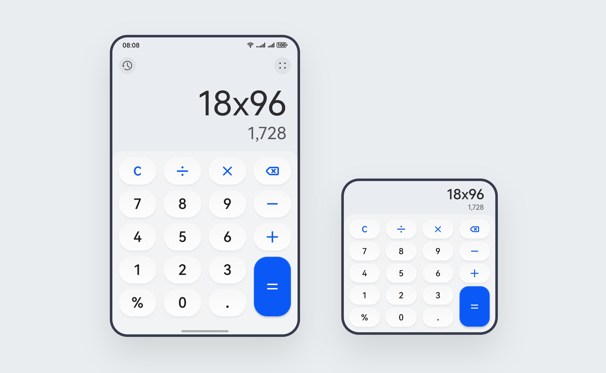

## 滑动沉浸

旨在消除复杂界面对内容主体的干扰，通过动态的交互响应建立“无界”的操作体验。在浏览型页面中，可采用滑动或点击的方式，将顶部或底部的标题栏、导航栏等控件隐藏或弱化处理，以提供更大的信息显示量。此设计旨在提供更好的沉浸感视觉体验，适用于新闻阅读、社交通讯、便捷生活、电商购物、商务办公等场景。

**滑动沉浸适配规则**

考虑到设备种类繁多，小尺寸屏幕设备上，沉浸浏览可以更好地发挥价值。因此提供以下组合判断条件，将屏幕尺寸分为以下两个区间，以判断不同尺寸的设备分别适用于何种沉浸浏览类型，以确保在合适的设备上提供最优的用户体验，同时兼顾不同设备的适配性需求。

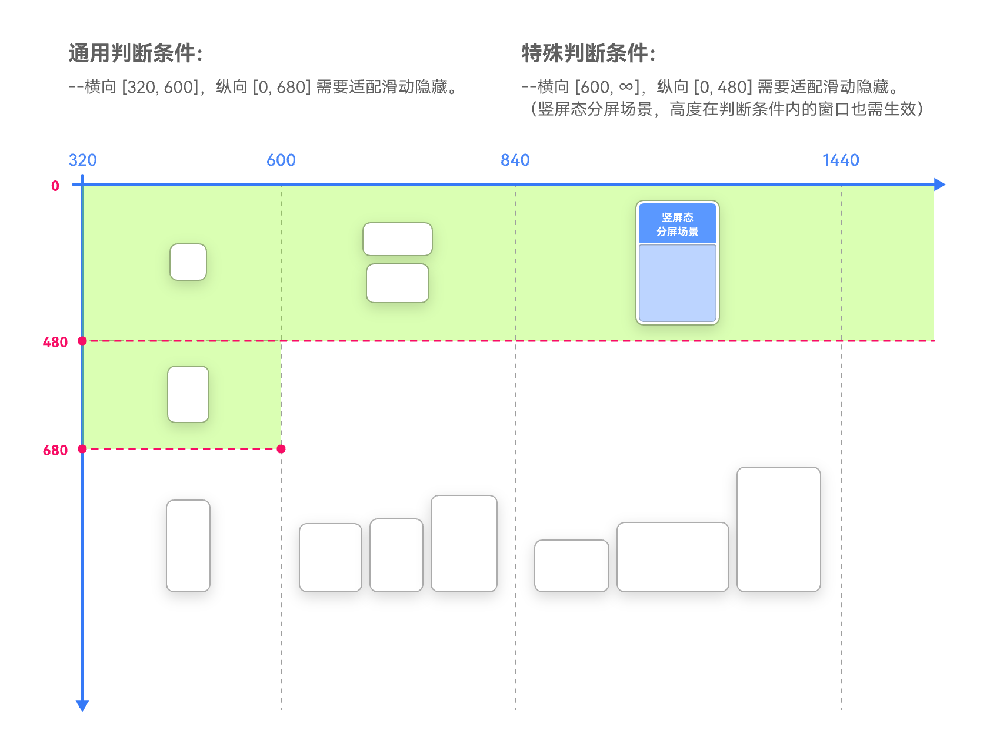

**交互范式**

|  | 类别 | 说明 |
| --- | --- | --- |
| 触发方式 | 上滑隐藏底 Tab/工具栏/标题栏；下滑恢复显示 | 适用于新闻资讯、信息流等通用场景 |
| 下滑隐藏；上滑或点击恢复显示 | 适用于短信、聊天记录场景 |
| 点击隐藏；再次点击恢复显示 | 适用于小说阅读器场景 |

考虑到设备种类繁多，小尺寸屏幕设备上，沉浸浏览可以更好地发挥价值。因此提供以下组合判断条件，将屏幕尺寸分为以下两个区间，以判断不同尺寸的设备分别适用于何种沉浸浏览类型，以确保在合适的设备上提供最优的用户体验，同时兼顾不同设备的适配性需求。

**一、滑动隐藏**

1. 上滑时隐藏，下滑时恢复显示，滑动页面至顶部或底部时恢复显示。此方式适用于新闻资讯、信息流等通用场景。

2. 下滑时隐藏，上滑时恢复显示，滑动页面至顶部或底部时恢复显示。业务也可根据需要采用下滑隐藏，上滑不恢复，点击页面恢复显示的交互方式。此方式适用于短信、聊天记录等浏览更多内容时需要下滑页面的场景。

**二、点击隐藏**

点击隐藏，再次点击即可恢复显示。此方式适用于小说阅读器等场景。

**沉浸类型**

范式一：全部隐藏

滑动或点击应用内容区，同时隐藏顶部和底部的控件，以帮助用户更加专注于页面内容，避免受到非必要元素的干扰，提升浏览沉浸感。此范式适用于新闻阅读、浏览器、资讯详情页等场景。本场景的开发指南，请参阅[滑动沉浸式浏览](/docs/dev/app-dev/multi-device/bpta-purax-guide#section28531824202114)。

|  |  |  |
| --- | --- | --- |
|  |  |  |
| 上滑同时隐藏，触底时同时恢复显示；下滑一并恢复显示 (仅作 Demo 演示) | 上滑分段隐藏，触底时同时恢复显示；下滑同时恢复显示 (仅作 Demo 演示) | 点击隐藏，再次点击恢复显示 (仅作 Demo 演示) |

范式二：局部隐藏

滑动应用内容区，隐藏部分顶部栏或底部栏，以增加内容区域可视空间，同时保留轻量级内容，帮助用户更快速地获取信息，提升浏览效率。此范式适用于列表、信息流等场景。

|  |  |
| --- | --- |
|  |  |
| 悬浮按钮置顶后，固定顶部显示 (仅作 Demo 演示) | 底部悬浮按钮固定显示 (仅作 Demo 演示) |

范式三：渐变模糊

滑动应用内容区，隐藏部分顶部栏或底部栏，以增加内容区域可视空间，同时保留轻量级内容，帮助用户更快速地获取信息，提升浏览效率。此范式适用于列表、信息流等场景。

## 横幅 Banner 适配

应用横幅 Banner 区域在屏幕顶部沉浸式显示，外屏应用横幅 Banner 尺寸需要进行一定的压缩，最大高度不超过屏幕高度的 60% ，压缩后需要确保图片、文字不变形，核心内容在窗口完整显示，例如视频应用。

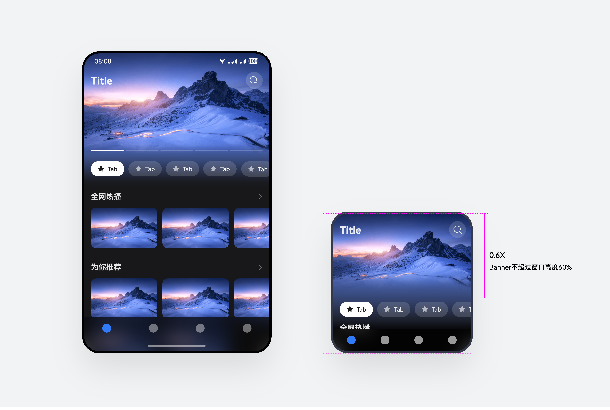

### 组件适配

## 标题栏

外屏应用大标题切为小标题显示，以减少留白区域，增加核心内容显示空间。

本场景的开发指南，请参阅[标题栏外屏适配](https://gitee.com/harmonyos_samples/SmallWindowScene)。

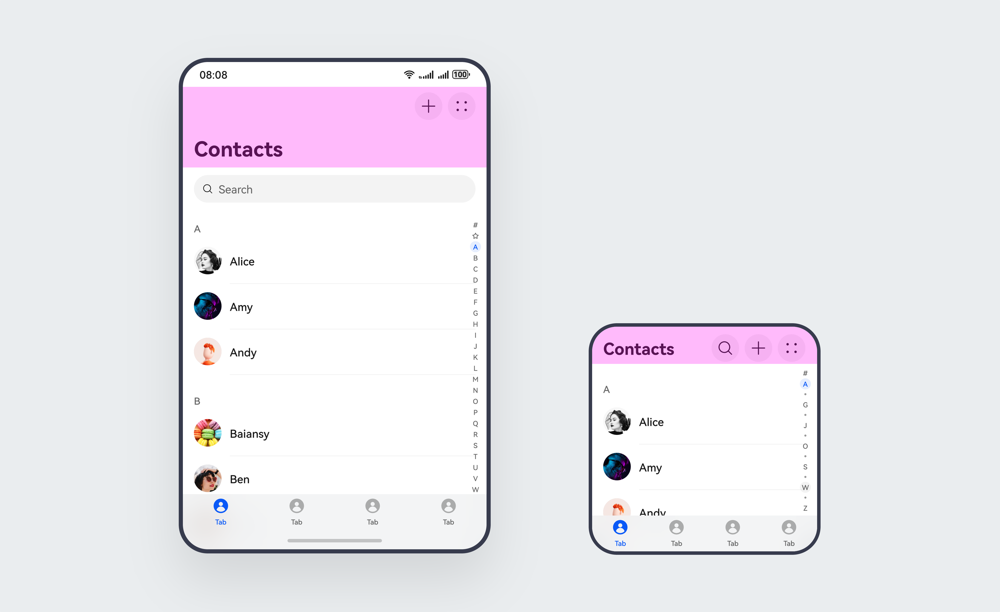

## 搜索框

外屏应用搜索框切换为搜索图标，与标题栏同行显示。

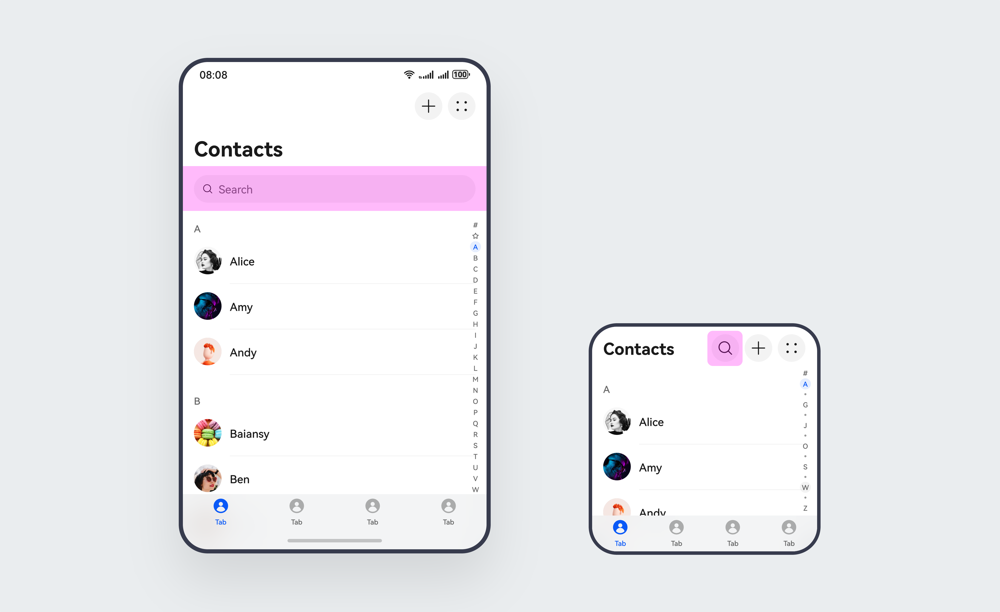

## 索引条

外屏采用分段式索引条，长按指定分段可滑动选取具体字母进行索引。

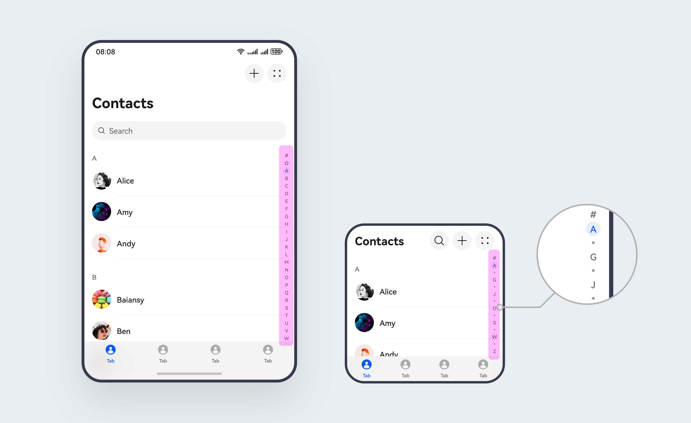

## 弹出框

建议调用系统的弹出框控件，以便更好地适配不同的屏幕尺寸，保持体验的一致性。

弹出框包括系统弹窗、隐私声明、权限弹窗、提示弹窗、Toast、运营类弹窗等。

外屏弹出框需在屏幕内完整显示，包括弹框主体及弹框主体外的交互对象 (按钮等)，弹出框在外屏显示的最大高度不超过屏幕高度的 90% 。

本场景的开发指南，请参阅[弹出框适配](/docs/dev/app-dev/multi-device/bpta-purax-guide)。

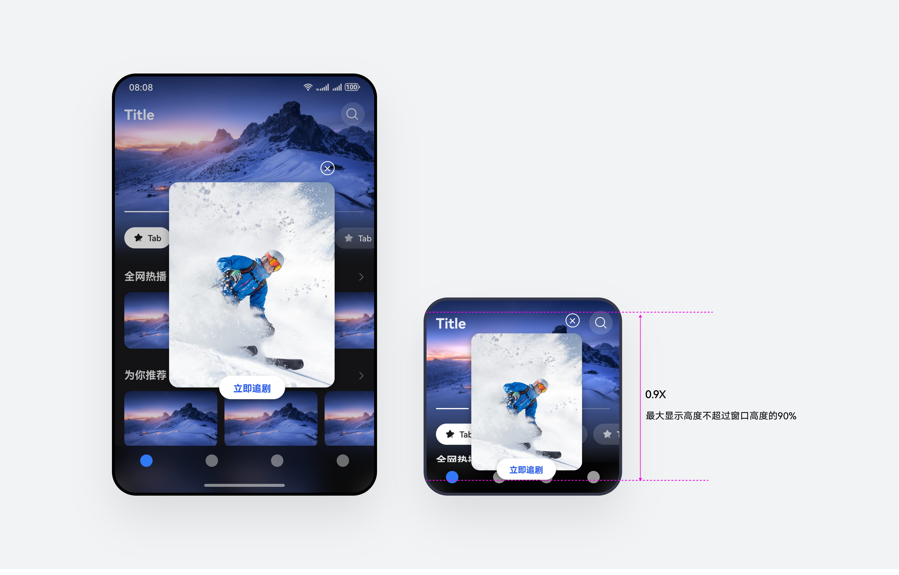

## 半模态

半模态控件在外屏需要保持功能完整，超出窗口的内容支持可滑动，最大尺寸为距离窗口顶部 8vp。

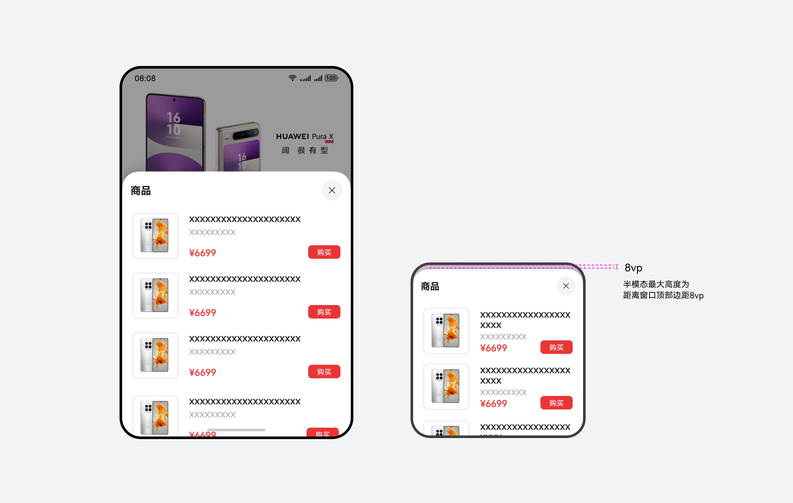

### 典型场景

## 图文详情页

**单图**

外屏上图下文形式的内容详情类页面，图片等比缩放，高度不超过窗口高度的 60% ，确保图片和文本详情都在窗口内显示。

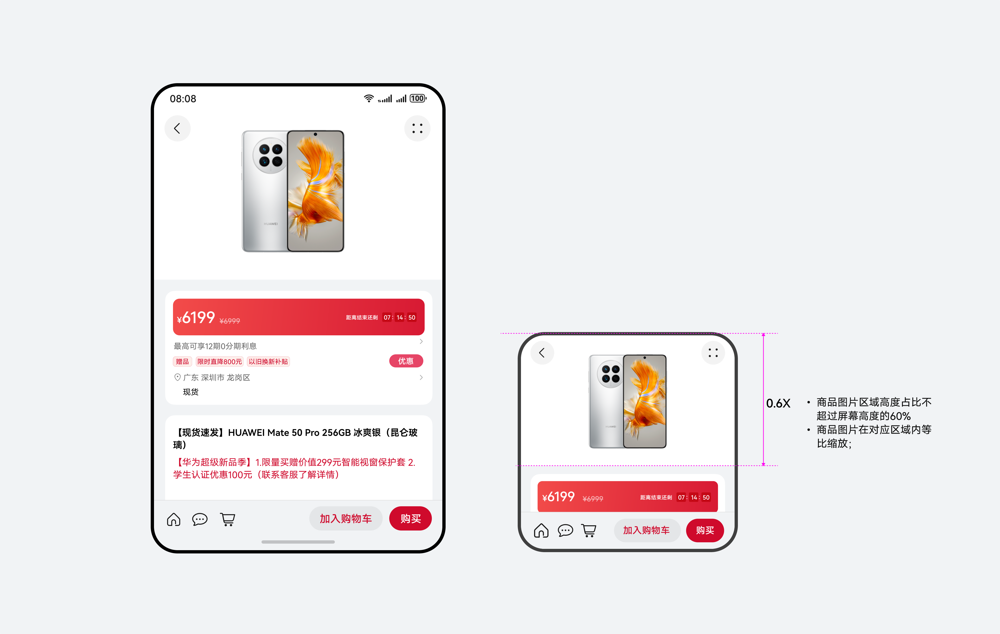

**多图**

使用外屏时，多图的上图下文形式的内容详情类页面图片等比缩放后，原滑动显示的图片采用延展布局显示。

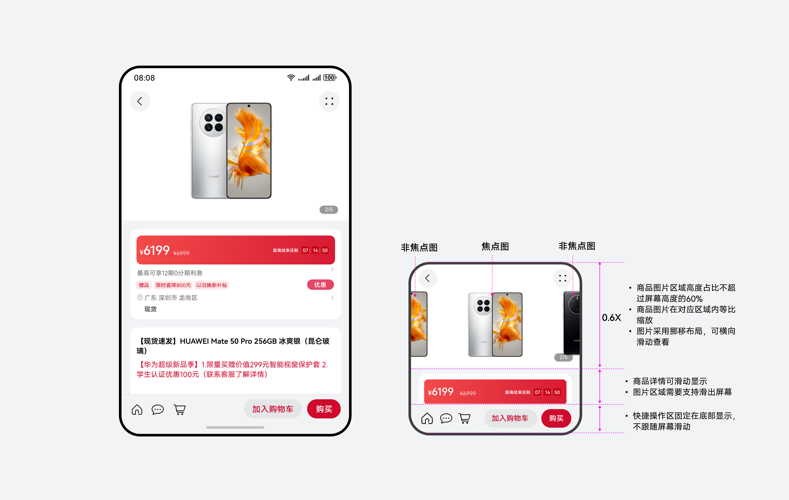

## 长视频

**视频播放详情**

* 外屏视频类应用视频画面区域在窗口内完整显示，顶部设置固定冻结区域
* 上滑页面时顶部冻结区域可等比缩放至屏幕高度的 40% ，下滑恢复

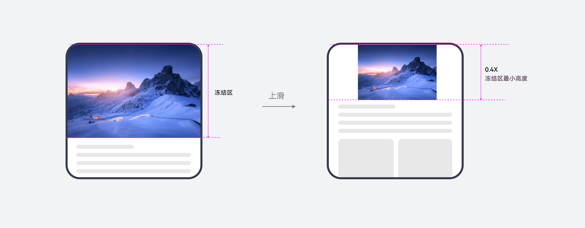

**视频全屏播放不旋转**

外屏视频全屏播放，窗口不旋转，保持当前方向播放。

## 短视频

**短视频播放详情**

* 短视频、直播等视频画面区域在屏幕内完整，画面不被截断
* 横向比例的视频窗口 (16:9、21:9、4:3) 确保宽度占满屏幕，自适应缩放高度
* 纵向比例的视频窗口 (9:16) 确保高度占满纵向内容区自适应缩放宽度。

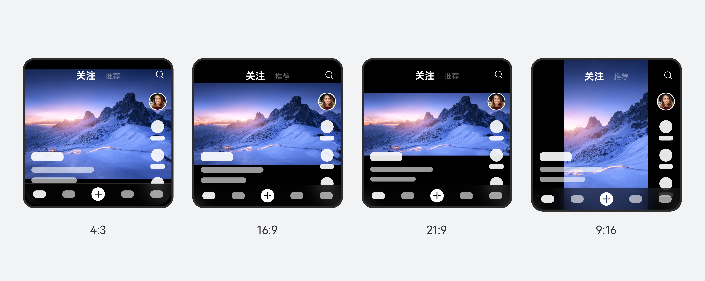

**侧边控件**

外屏应用侧边控件应避免显示截断或重叠，并支持滑动显示。

**直播弹幕**

外屏直播类应用底部弹幕最大高度不超过窗口高度的 50% 。

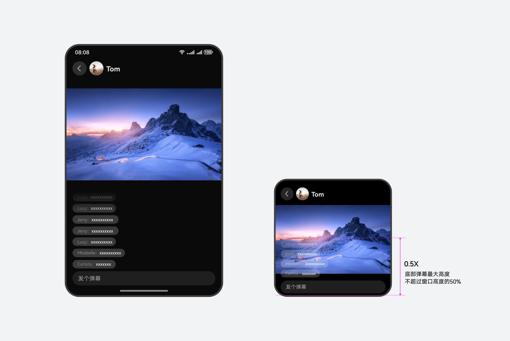

**评论区页面**

* 外屏应用的评论区默认高度最小为屏幕高度 40%
* 评论输入框需完整显示
* 评论区上拉占满全屏，下拉恢复

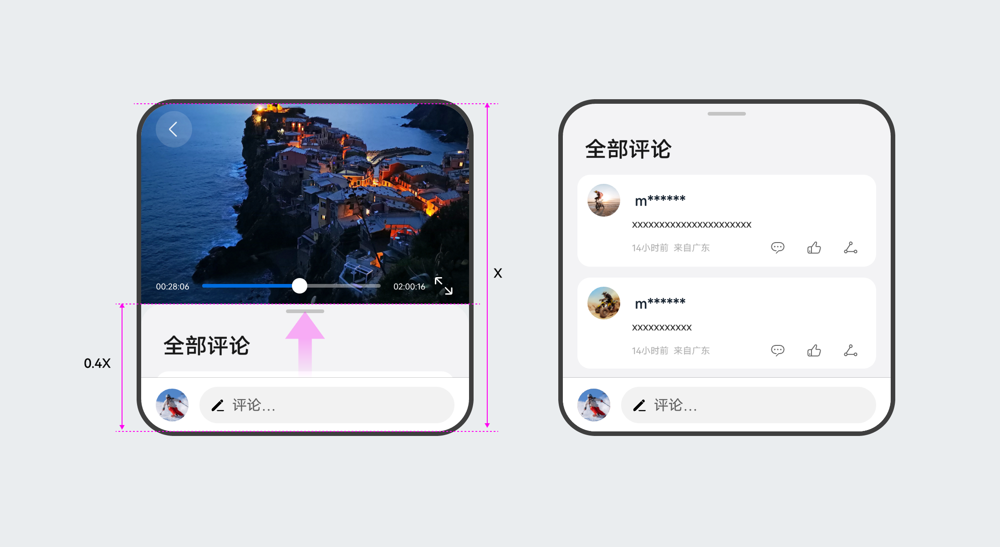

**登录页**

* 压缩留白区域
* 顶部和底部操作区固定显示
* 内容显示不全，需支持滑动查看

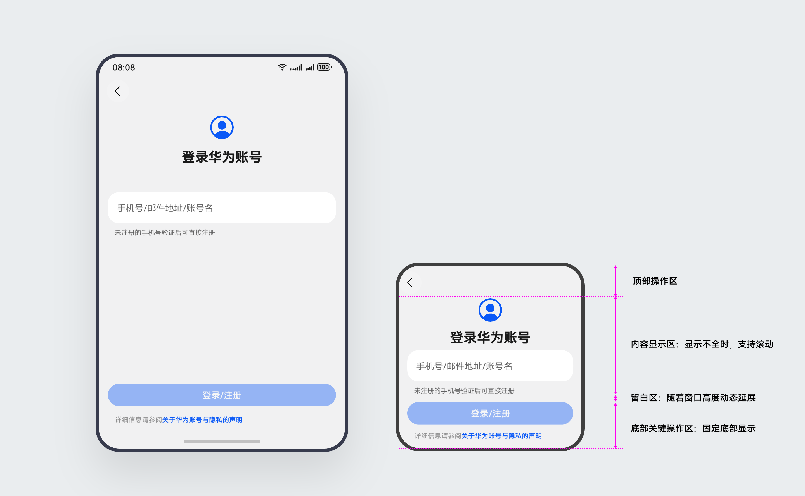

|  |  |
| --- | --- |
| 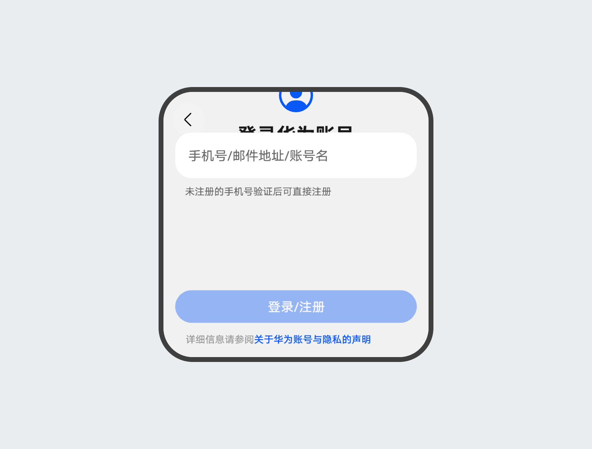  不推荐（元素重叠） | 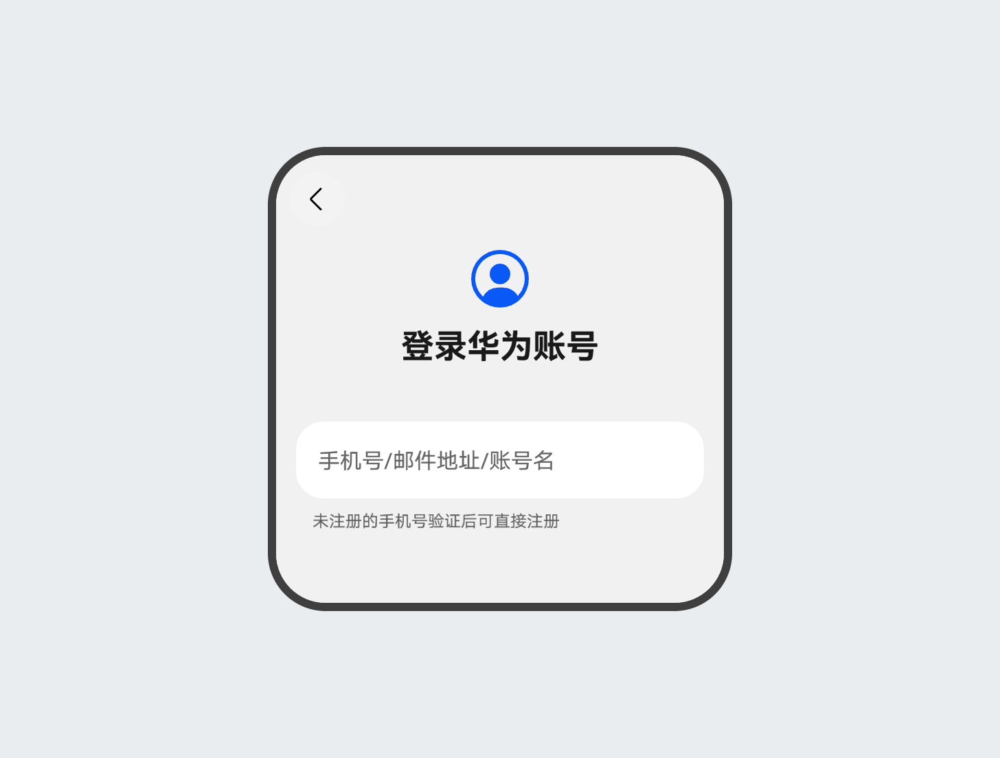  不推荐（页面固定布局且不支持滚动，导致截断） |
|  |  |