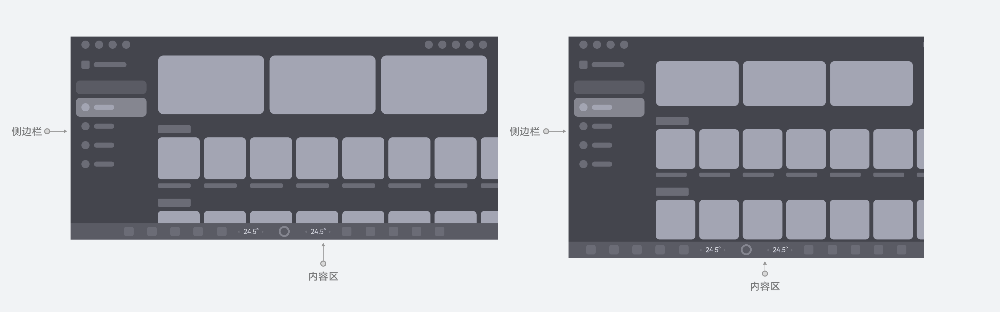
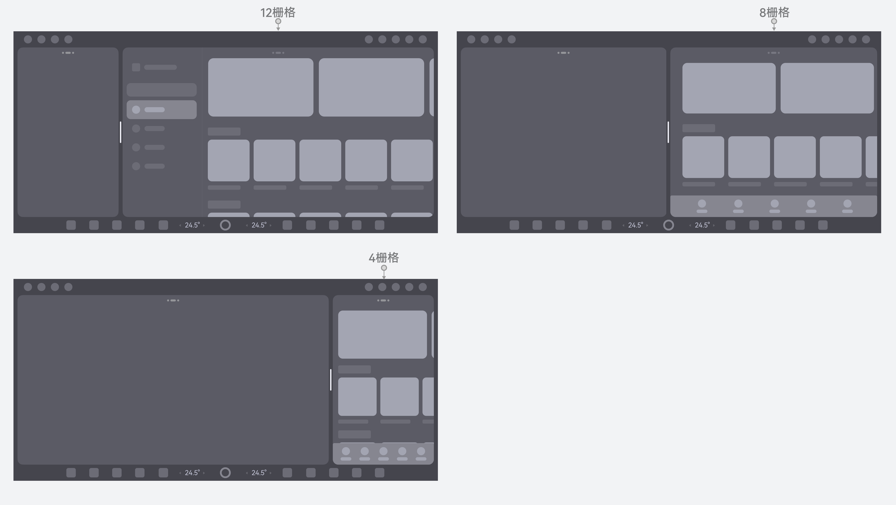
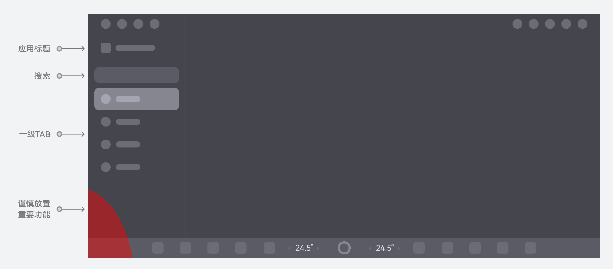
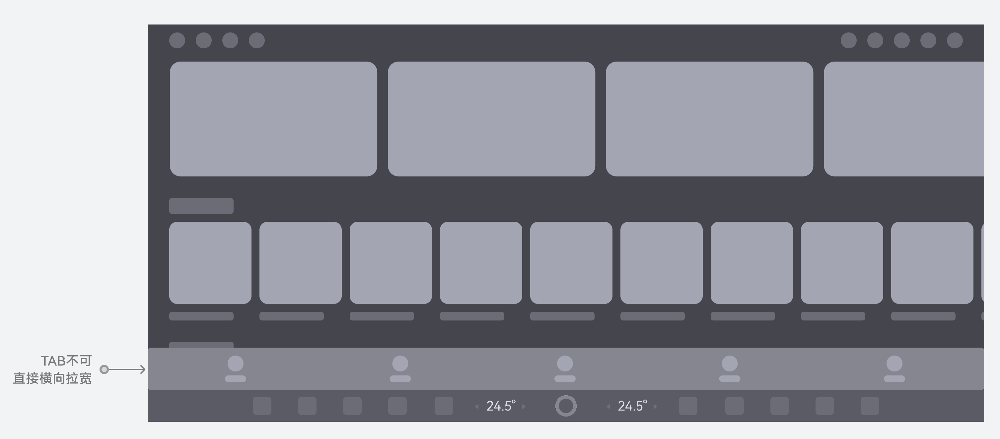
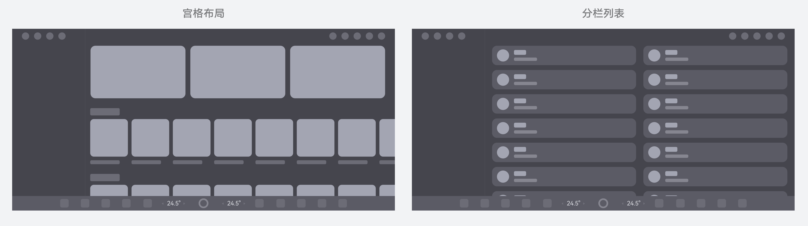
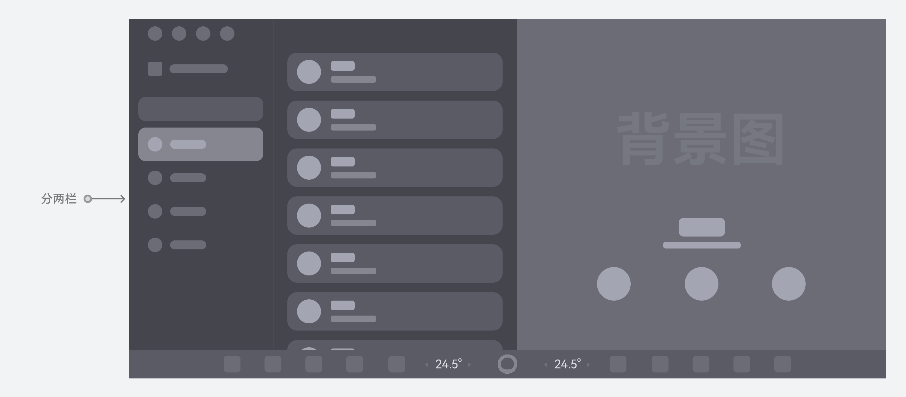
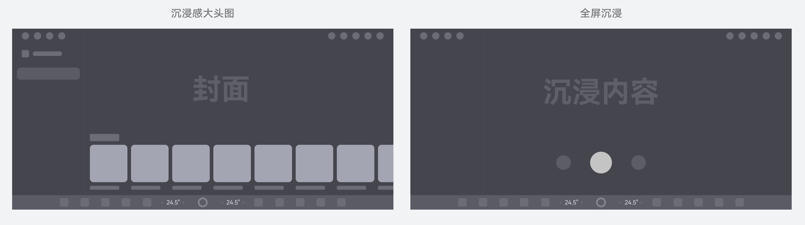
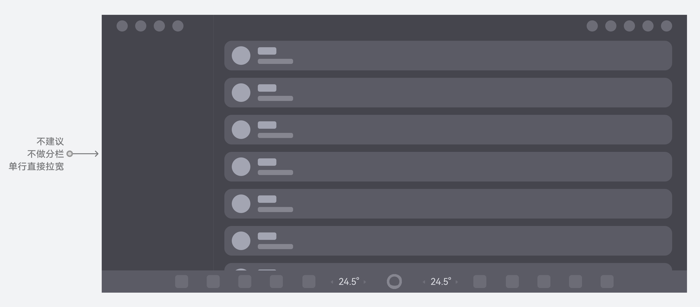

# 应用架构

应用架构是应用对外呈现的基础结构，是系统风格的体现形式之一。通常情况下，三方应用一级界面建议跟车载鸿蒙自研应用保持类似架构，并遵循人因建议的最小图标、字号、热区大小等，保证应用整体体验一致性和操作的易用性，同时在多尺寸与比例的屏幕下要做好响应式布局，避免内容被不同屏幕截断而影响实际使用体验。典型应用架构包括：一级界面框架、侧边栏、内容区。

### 一级界面框架

从车载场景高效操作的角度，建议全屏状态的一级界面框架由侧边栏 + 内容区构成，应用需进行适配调整。界面也需要灵活适配多屏幕比例，避免由于写死某一比例而导致界面显示内容被截断，详细规格请参阅[响应式布局方法](https://developer.huawei.com/consumer/cn/doc/design-guides/design-responsive-layout-method-0000001795698449)。

应用界面需要适配多屏幕比例下的分屏状态，根据断点栅格调整界面布局，若分屏内的窗口宽度 < 8栅格或4栅格，需把应用TAB从侧边挪移至底部，下图建议如下布局自适应，详细规格请参阅[布局基础-断点系统](https://developer.huawei.com/consumer/cn/doc/design-guides/design-layout-basics-0000001795579413#section525952492)、[响应式应用架构](https://developer.huawei.com/consumer/cn/doc/design-guides/design-responsive-layout-structure-0000001748539684#section19123151211225)。

侧边栏布局建议TAB图标和名称左右布局，同时可以聚合应用名、搜索框等应用需要放置的功能组件入口，但需要注意部分屏幕左下角可能会被方向盘遮挡，该区域需谨慎放置重要功能。

推荐（侧边栏布局）

不推荐（应用直接采用手机布局横向拉宽，极大影响TAB页签操作易用性）

### 内容区

内容区主要承载应用生态的各类图文视频等内容，分为效率型和沉浸型，如下提供几种建议布局，具体以生态APP自身应用布局为准。效率型内容区建议采用宫格/列表组合搭配布局，显示效率更高，支持横纵滑动与自适应；也可以继续增加分栏，提高操作效率。下图仅为示意，具体以APP实际功能布局为准。

推荐（宫格/列表布局）

推荐（双分栏）

沉浸型内容区可采用多种沉浸方式布局，增强整体视觉美感，下图仅为示意，具体以APP实际功能布局为准。

推荐（沉浸布局）

不推荐（若采用列表形态，需做好分栏分列处理，不建议一列直接拉宽适配宽度）