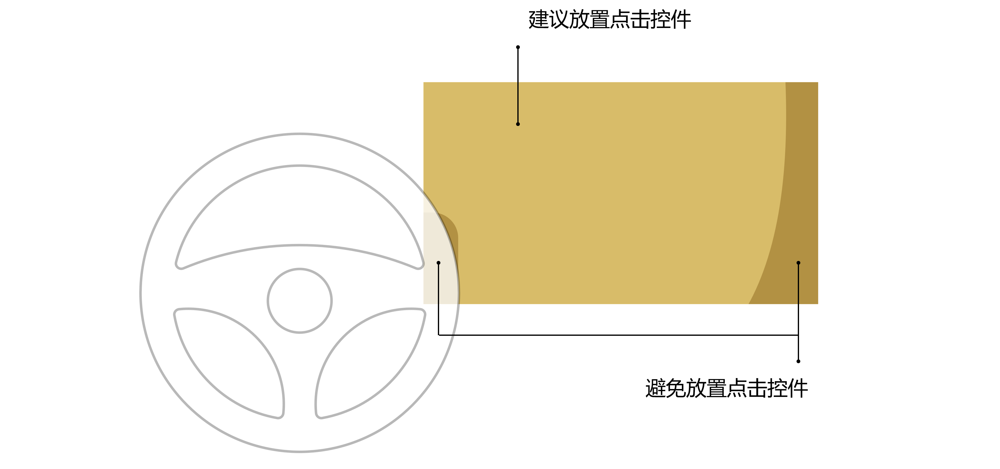
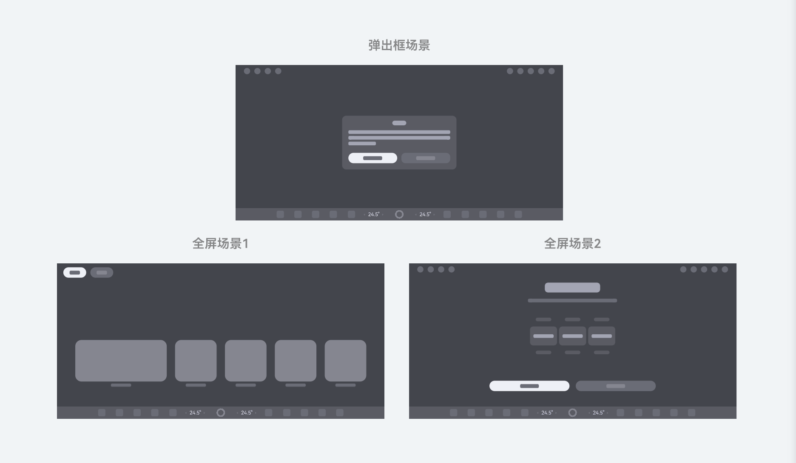

# 基础体验要求

### 概述

座舱视觉与交互设计以驾乘人本需求为核心，坚守安全合规、简约直观、舒适低扰的原则。

在交互设计方面，需充分考虑座舱内多样的用户角色（驾驶员与乘员）和状态（驾驶态与驻车态）。首先，需严守行车安全准则，简化操作流程，避免分散驾驶员注意力。其次，需贴合大众日常使用习惯，遵循直觉化操作逻辑，精简功能层级，提升交互便捷度。

在视觉设计方面，需充分考虑座舱内多屏系统使用距离的变化，以及车辆行进过程中环境光照变化对驾驶员视觉加工能力的影响。考虑到行车安全，驾驶员通常会将足够的视觉注意集中在前方道路上，只会短暂地瞥视座舱内显示屏。因此，结合用户“一瞥即览”的视觉特征，界面元素与布局需要合理设计，以提升视觉信息获取效率。

### 交互操作要求

### 热区点击

触屏点击热区大小为点击的识别区域，点击热区大小至少为15.4mm（推荐），不得小于10.7mm（必须）。

### 主驾易操作

中控屏点击类控件需放置在易操作区内，满足主驾操作效率。

### 界面内按钮布局规范

界面内存在多个按钮时（场景包含但不限于弹出框、全屏界面、气泡提示等）：

* 若其中有强调按钮，则强调按钮居左放置，以便驾驶员操作。
* 若没有强调按钮，则高频核心操作按钮居左放置。

  

### 视觉和信息呈现要求

### 关键信息布局优先

驾驶相关的关键信息建议呈现在靠近驾驶员的中控屏左上角区域，避免呈现在右侧远端区域或左下角方向盘遮挡区域。

### 文字易读

* 文本最小尺寸不低于9fp，正文一级文本最小尺寸不低于15fp
* 对于主要文本，文字与背景对比度需满足：浅色背景下，文字对比度不低于7:1; 深色背景下，文字对比度位于10:1~17:1

### 图标易读

* 图标最小尺寸不低于18vp
* 图标与背景对比度不低于3:1

### 深浅色模式适配

应用需支持深色和浅色模式显示，确保系统在切换显示模式时，界面以对应风格呈现，并且界面内没有因未适配导致的识别性问题。