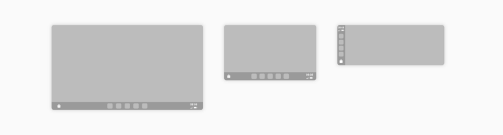
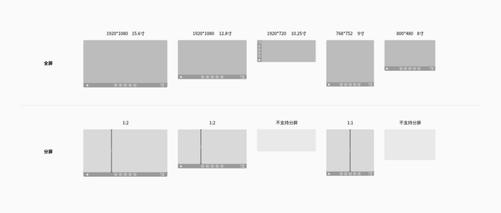

# HUAWEI HiCar

### 深色模式

应用需支持深、浅两种模式。

### 沉浸式导航条

为便于显示时间等信息，并方便用户在桌面、常用应用中跳转，HUAWEI HiCar 设有常显的系统导航条。有以下特点：

1. 在设备屏幕高宽比大于 1/2 时，导航条位于屏幕左侧；小于 1/2 时，位于屏幕底部。

2. 应用的内容区域可包括导航条宽度，以呈现出沉浸式效果，但重要信息、功能（如应用导航），应避开系统导航条。

### 导航与其他应用分屏

为便于导航与应用并行的场景，系统支持导航与其他应用分屏呈现，对于不同的屏幕，有以下分屏规则：

1. 9 寸以下的小屏、扁屏不支持分屏。

2. 常规矩形屏支持左右窗口 1:2 的分屏，应用窗口宽高比约为 9:5。

3. 竖屏和较小的屏幕，使用左右窗口 1:1 的分屏。

强烈建议应用可支持无级调节窗口大小。

