# 系统架构

### 桌面架构

### 桌面层级

桌面架构是智能座舱屏幕依据交互权重、视觉优先级划分的界面交互逻辑。

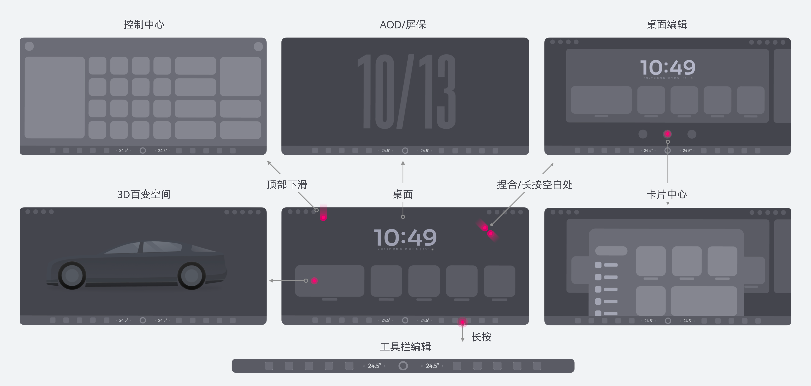

从屏幕顶部下滑，可拉出控制中心。

点击状态栏时间显示/桌面时钟组件，可进入AOD/屏保。

双指捏合/长按空白处，可进入桌面编辑（包含主题、卡片、壁纸设置）。

点击3D百变空间卡片，可进入3D百变空间。

长按工具栏，可进入工具栏编辑。

**通知/Toast**

通知/Toast是轻量化临时提示组件，用于推送状态变更、消息提醒、操作反馈，包含通知弹窗、Toast文字提示。

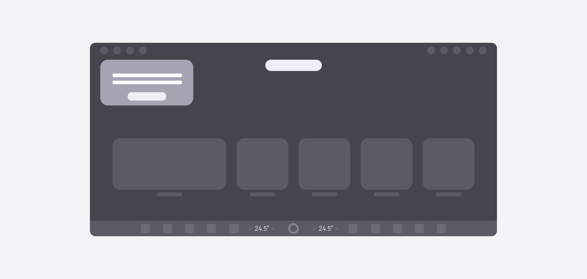

**PIP**

PIP画中画是以小窗口形式悬浮展示的独立画面，典型应用为窄道影像、倒车影像、视频小窗等行车及影音画面。

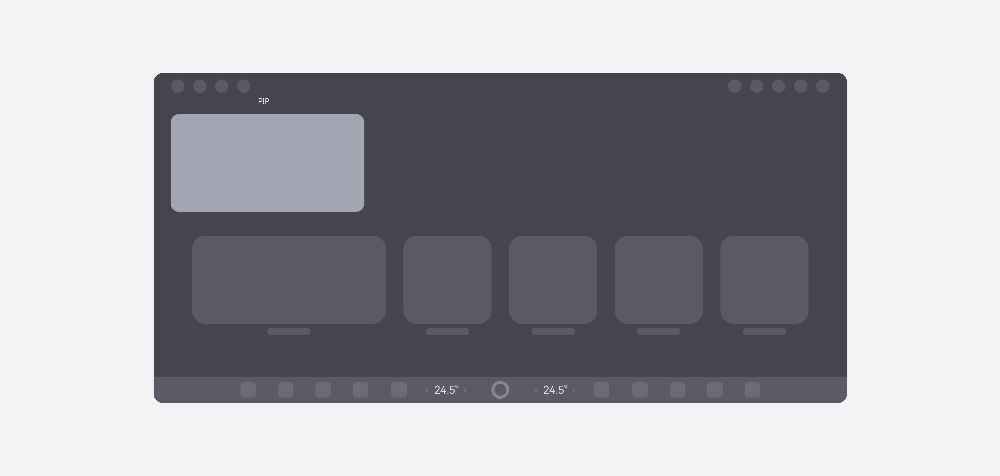

### 桌面卡片

### 卡片简介

将 HarmonyOS 应用和元服务的重要信息以卡片的形式展示在桌面，用户可通过快捷手势使用卡片，通过轻量交互行为实现服务直达、减少层级跳转的目的。卡片的核心理念在于提供用户容易使用且一目了然的信息内容，将智慧化能力融入到服务卡片的体验中供用户选择。

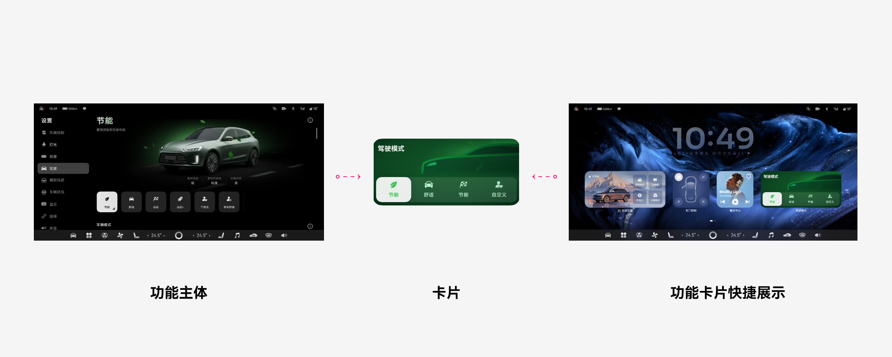

**卡片尺寸与基本参数**

卡片按照桌面宫格布局，以4\*10与4\*12分为3种尺寸。不同大小屏幕之间卡片比例拉通。移动端（PAD）卡片可在车机平台复用，但必须严格遵循车机卡片设计规范。复用过程中需特别注意处理不同屏幕尺寸和显示比例带来的适配差异，并确保所有设计元素、交互逻辑及信息层级均符合车机特定的显示、操作及安全要求。

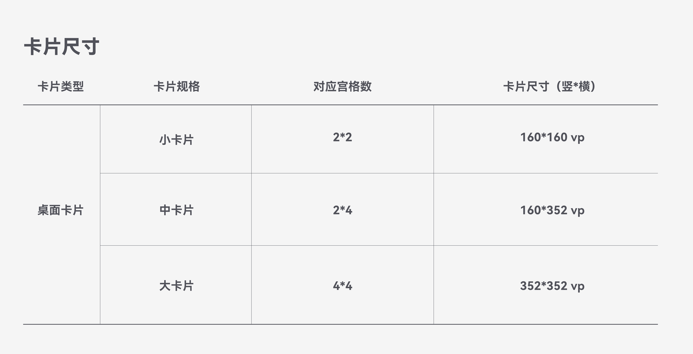

**卡片圆角**

卡片圆角半径统一为 16vp。设计时须保证卡片信息在卡片边距范围内，确保核心信息及关键视觉元素始终完整显示于安全区，避免因圆角剪裁导致内容缺失或被遮挡。

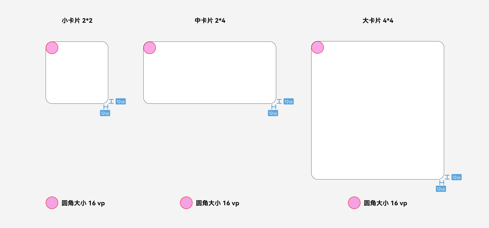

**卡片边距**

车机卡片边距分为内容边距与控件边距。其中内容边距为12vp；控件边距为8vp。

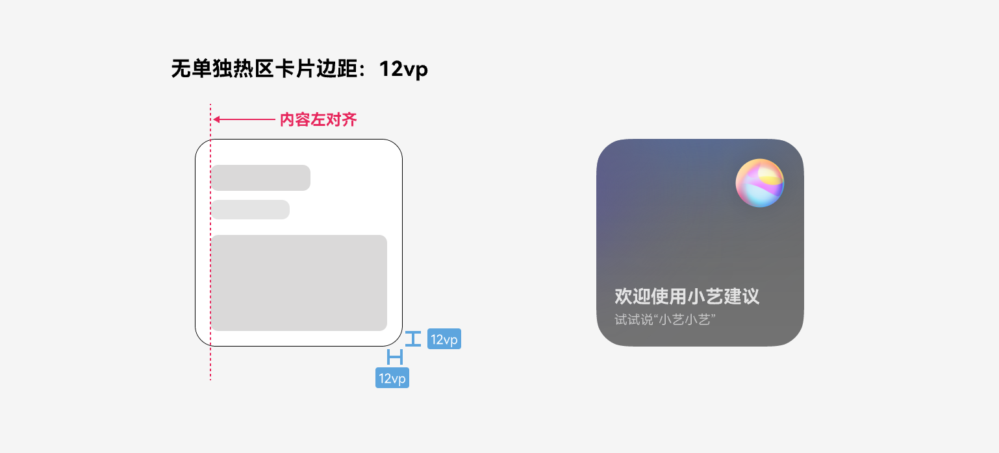

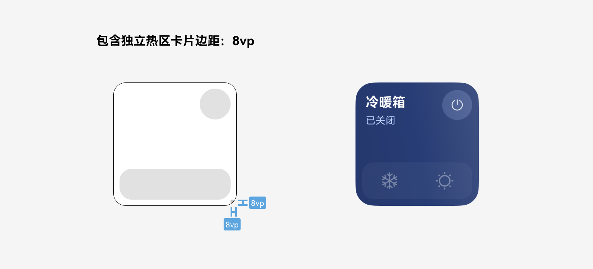

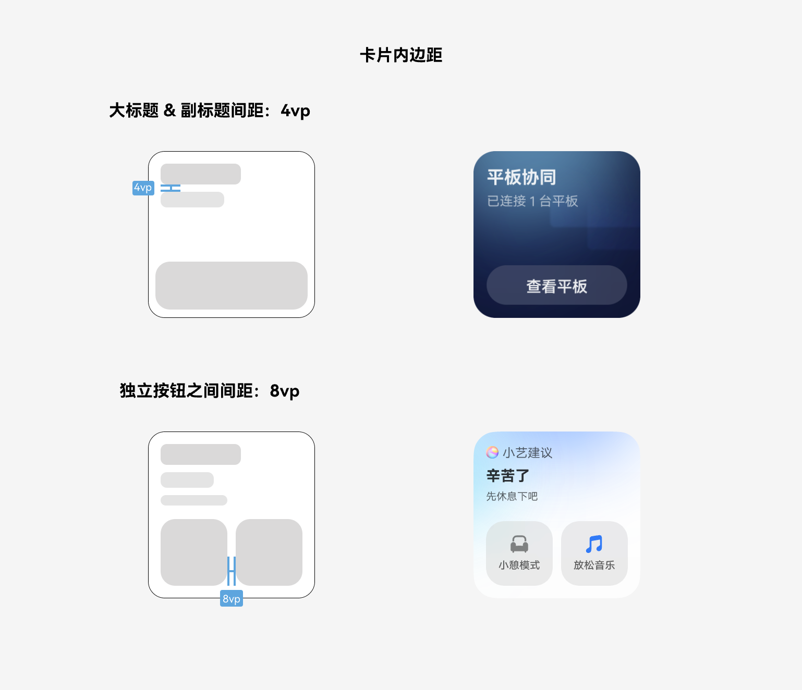

**卡片色彩**

文本色彩跟随车机系统色彩，与手机保持一致。特殊卡片色彩定制化。

a.卡片基础背景色彩

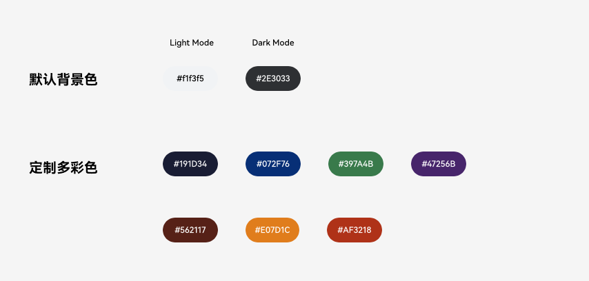

b.卡片按钮图标色彩

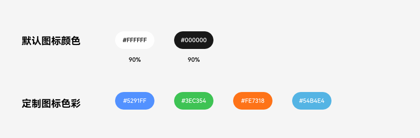

c.文字色彩

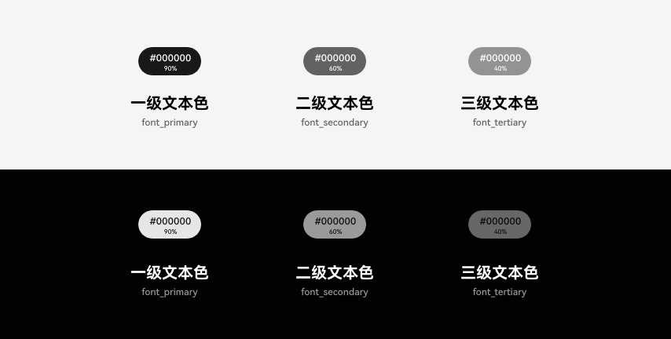

**卡片字号**

卡片内可展示空间较小，在字号使用上尽量避免使用大字号。保证内容信息在界面中可以被明确区分且易于识别即可。合理运用 Regular、Medium、Semi-bold、Bold 字重在卡片内的关系，帮助用户在阅读相对复杂的信息卡片时能够及时做出筛选。

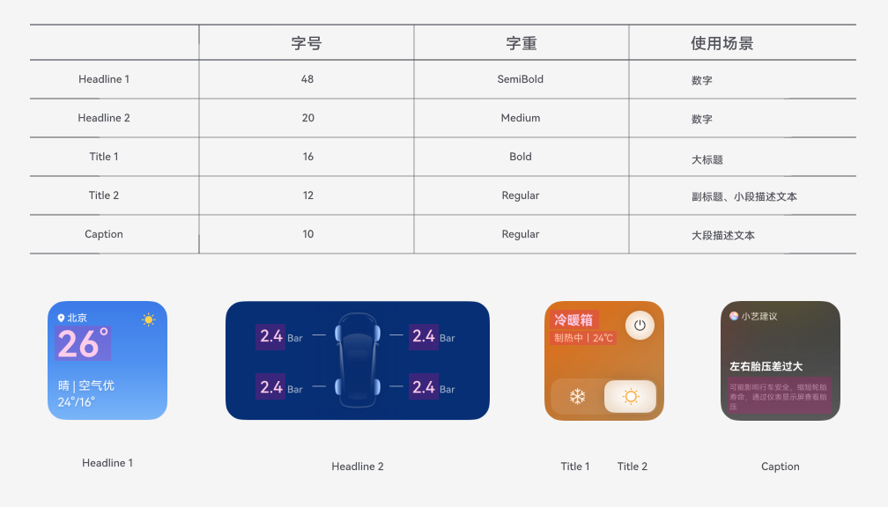

**卡片配图尺寸**

卡片配图大小应遵循以下尺寸规则，避免卡片配图影响标题与正文的正常阅读。配图主体物长度占卡片总长度的0.6倍左右。

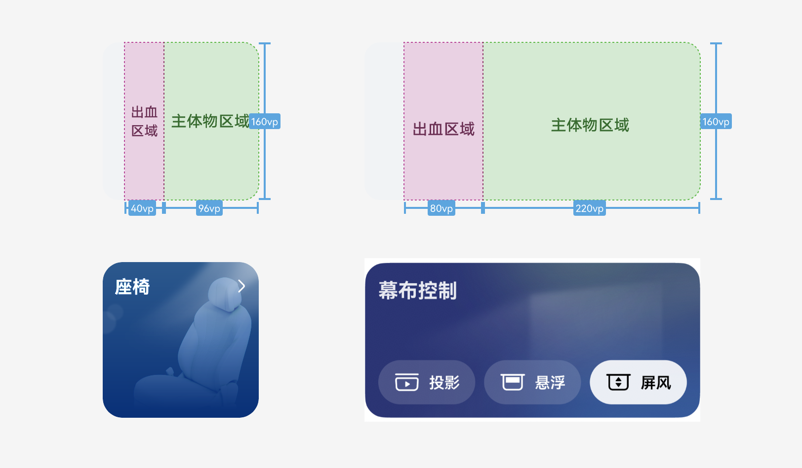

**卡片配图分类**

卡片配图应本着直观、简约、统一的效果进行设计。配图分为插画配图与预览图。

a. 插画

插画风格，分为写实风格插画与抽象风格插画。

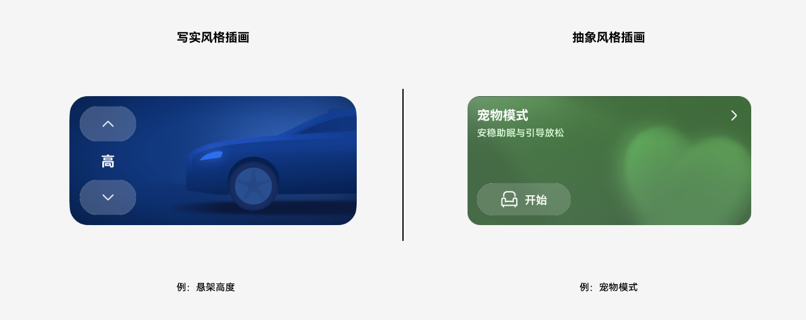

b. 预览图

预览图包含3D配图、主题与封面图等。

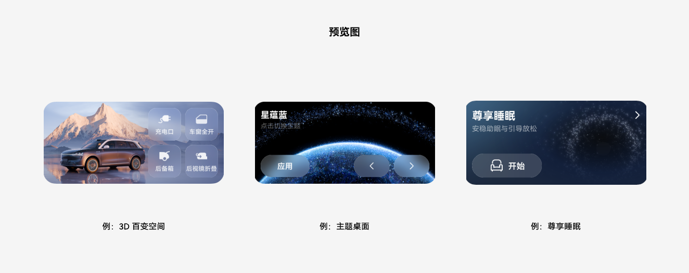

**卡片按钮使用原则与样式**

1.卡片按钮类型

卡片中需要点击操作的元素，尺寸不得小于 24vp，热区大小不得小于 32vp，确保用户点击的准确性。卡片按钮样式类别分为分段按钮与独立按钮。

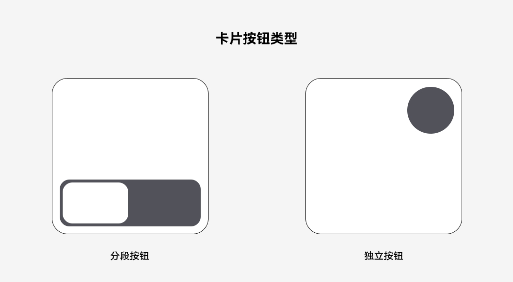

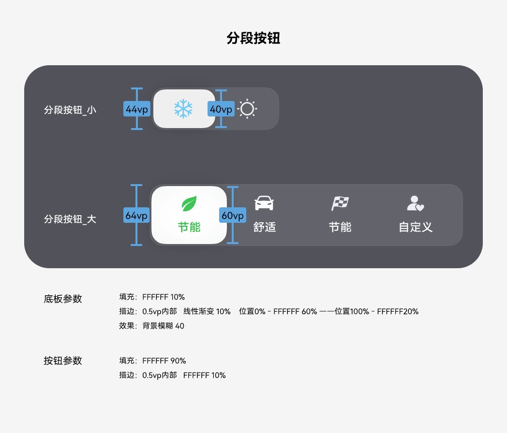

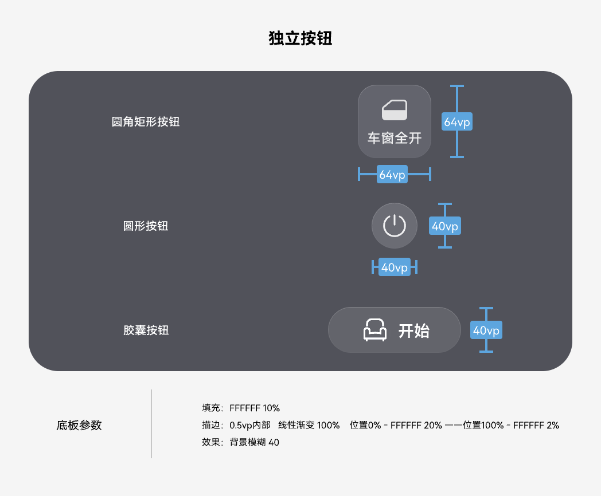

2.按钮状态与形式

按钮分为初始态、选中态、按压态与不可用态四种状态。

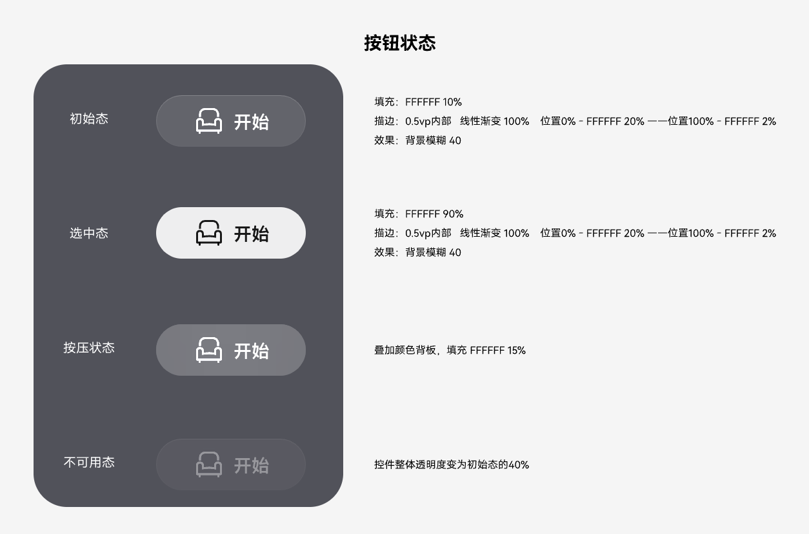

### 数据可视化

**概述**

面向座舱中控桌面，将底层数据转化为卡片可视化图形，让原本隐藏在数据中的驾驶与车辆信息，以直观、友好、视线友好的方式直达用户。在驾驶场景下，这能有效缩短信息获取路径，提升交互效率，同时不分散驾驶注意力。

**如何使用**

部分功能的桌面卡片会基于应用所收集的数据，将其处理结果以可视化形式呈现。例如能量，胎压。这类卡片不仅展示数据的整体参数，也能呈现某一指标在特定时间段内的变化趋势，从而帮助用户快速掌握关键信息。同时，卡片还支持快捷操作，并在用户操作后提供清晰的视觉反馈，进一步增强人车交互的直观性与响应感。

**1.选择合适的数据展示样式。**针对不同场景下数据结构，有的可能是单一功能的进度，有的可能展示不同状态，因此，需要针对数据结构的不同选择合适的组件样式。

**2.合理使用颜色。**数据条控件的颜色应与所展示数据的含义相符，如绿色表示充电。或是可自定义一组套系色彩，呈现功能自己的色彩风格，如不同颜色代表不同空气质量状态。

**类别**

目前数据可视化分为进度、范围、图例，文字四大类型。

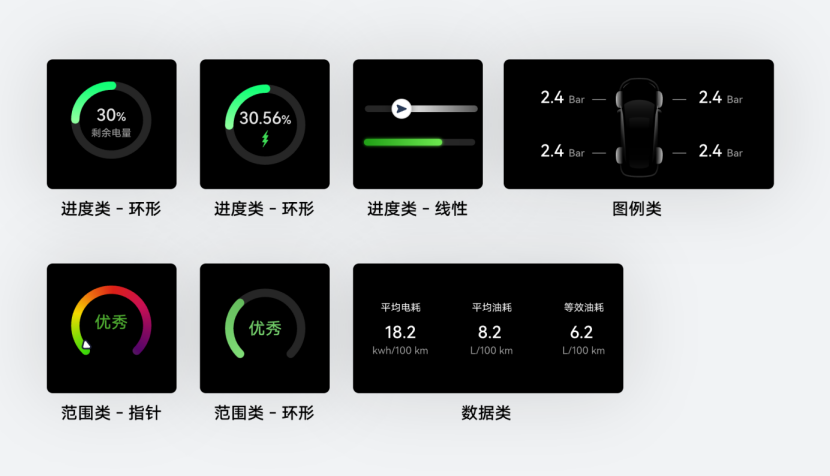

在进行设计时可以根据数据含义使用渐变色等视觉效果，增强数据可读性和色彩的细腻程度。当存在多种状态和数据时，应为不同阶段分配独特的颜色，避免混淆。

a.进度类

适用于显示实时进度，在数据有进度变化时使用，如充电进度，导航。

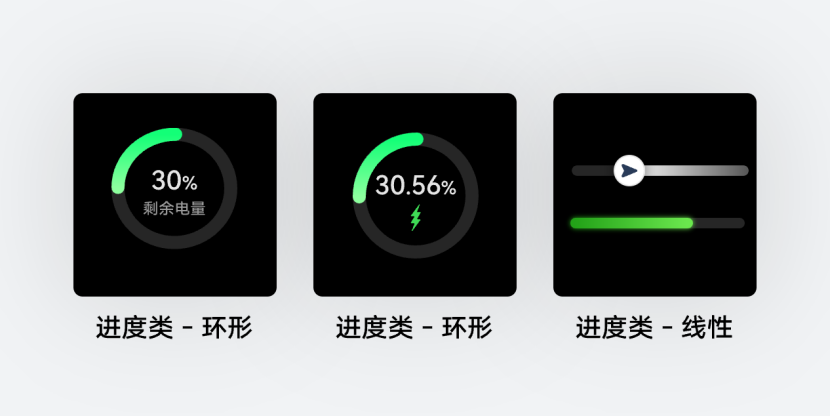

b.范围类

适用于显示一定数值范围内的某个具体数值或实际进度情况。数值环的两侧可分别指示数据范围的最小值和最大值，如空气质量，氧气浓度。

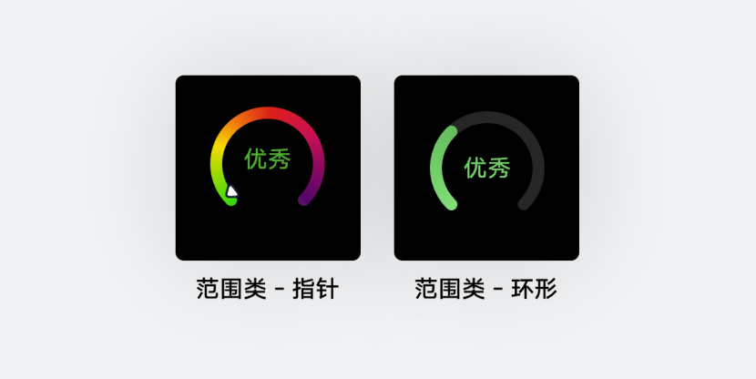

c.图例类

图例用于帮助用户理解抽象视觉属性与数据含义的映射，做到信息文字的简化同时便于理解，例如胎压显示。

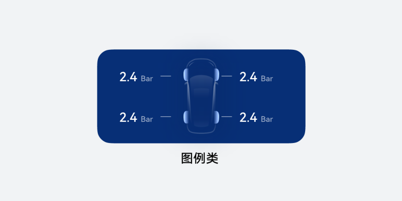

d.数据类

纯文字类桌面卡片适用于信息本质是简短、数字或状态描述的场景，用户主要任务是快速阅读、核对。

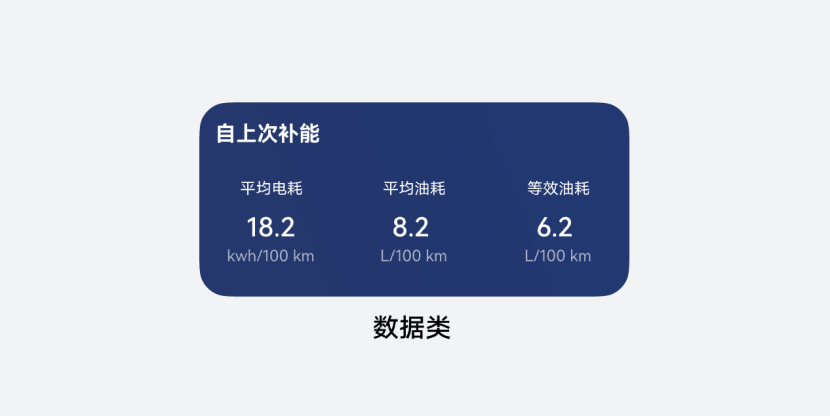

**卡片可视化布局**

1.左右布局

当卡片顶部信息层包含标题和按钮的情况且控件范围为正方形的可视化图形时，建议使用左右布局，需间隔卡片边缘12vp，并视情况保持间距。

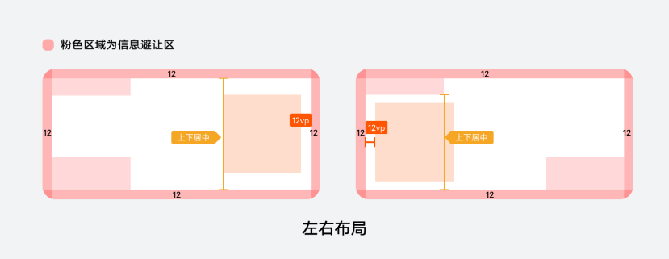

2.居中布局

当卡片顶部信息层包含标题无按钮的情况适用于大多数控件类型，建议使用居中布局，需间隔卡片边缘12vp，并视情况保持间距。

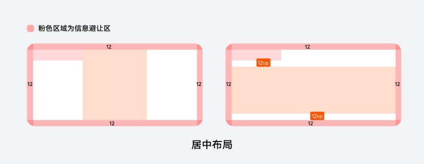

3.底部布局

当卡片顶部信息层包含标题无按钮的情况且为条形控件，建议使用底部布局，需间隔卡片边缘12vp。

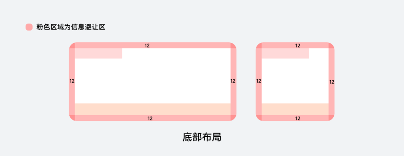

### 播控中心

**媒体播控**

媒体播控用于显示当前设备正在播放的音视频媒体信息，以及帮助用户高效快捷地管理媒体内容的播放。

媒体播控可用于音乐、视频播放，直播，听书，网页流媒体播放等多种场景，并在不同场景下针对性地提供不同功能与统一的界面体验。

座舱媒体播控共有2种尺寸：即2\*2和2\*4。

**播控模板构成**

播控卡片模板由媒体信息和播控功能两类内容组成。

**媒体信息**

媒体信息是媒体内容自有的属性类信息，不因用户的播放行为而改变。

媒体信息包括：

1.标题（主、副标题）；

2.歌词；

3.封面图片；

4.资源标签；

5.歌单；

**播控功能**

播控功能是用于控制、管理媒体播放的系统能力。根据媒体内容类型，或应用服务不同，提供给用户的播控功能也会有差异。

播控功能包括：

6.播放/暂停；

7.上一首/下一首；

8.收藏；

10.切换播放模式；

11.播放进度；

12.切换应用资源；

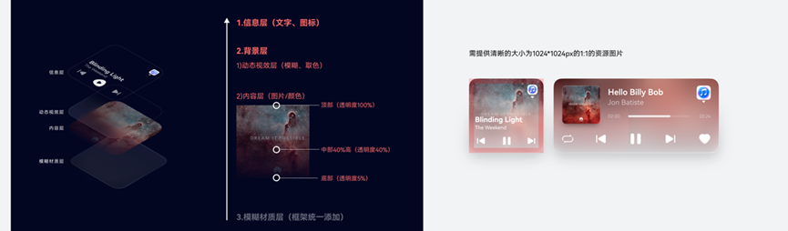

### 多窗口分屏

应用需支持 3 种窗口尺寸，全屏、2/3屏、1/3屏，布局可对应参考平板、折叠机、手机竖屏。应用可支持无级调节功能（推荐）。

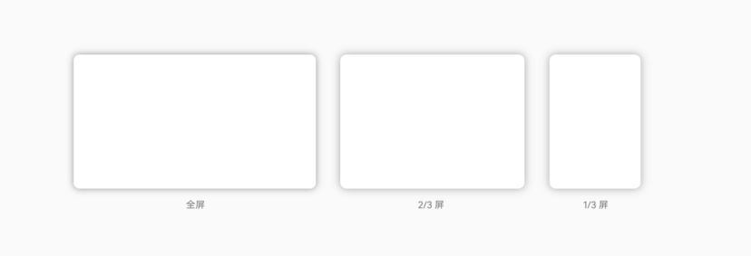