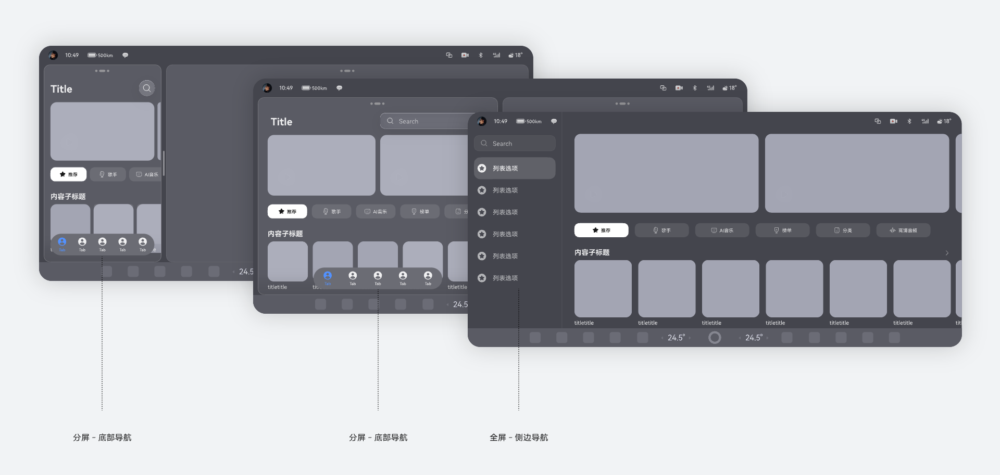

# 设计基础

### 布局基础

布局不是静态固定的，当显示环境发生变化时，如横竖屏切换、调节字体大小、应用分屏，要及时调整内容的布局方式以适应变化。

通过调用断点系统、栅格系统、媒体查询、自适应布局和响应式布局能力就可以让内容更好地适配显示环境的变化。综合运用布局基础能力，可实现常用页面结构的多设备适配。

随着终端设备形态日益多样化，应用设计需要考虑界面安全区及避让区的属性，适配不同的屏幕尺寸、屏幕方向和设备类型。HarmonyOS在设计之初就面向全场景、全设备进行定义。系统整合了手势、基础交互、视效等维度的基础能力，确保不同终端（手机、平板、手表、IoT、座舱 设备等）的交互逻辑和视觉风格高度统一，用户无需重复学习，保证体验最优解。

详细规格请参阅[布局基础](https://developer.huawei.com/consumer/cn/doc/design-guides/design-layout-basics-0000001795579413)；

### 响应式布局

当窗口容器大小发生变化时，界面元素需要自动变化大小和布局形态以适应容器大小的变化。

针对导航组件的响应式变化，我们推荐在座舱应用全屏化显示时采用侧边导航的应用架构，以便于驾驶员在左侧进行操作，当应用进行分屏时，应用的导航结构需要根据窗口容器的宽度进行变化，以保证该窗口尺寸下最佳体验，示例如下：

基础界面元素的响应式布局规格请参阅[响应式布局方法](https://developer.huawei.com/consumer/cn/doc/design-guides/design-responsive-layout-method-0000001795698449)；

