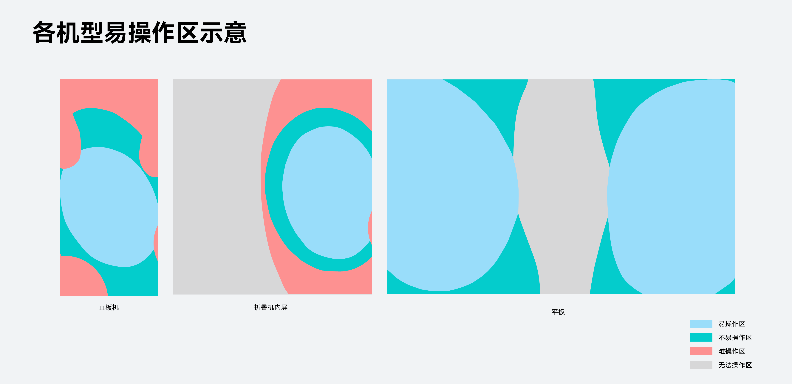
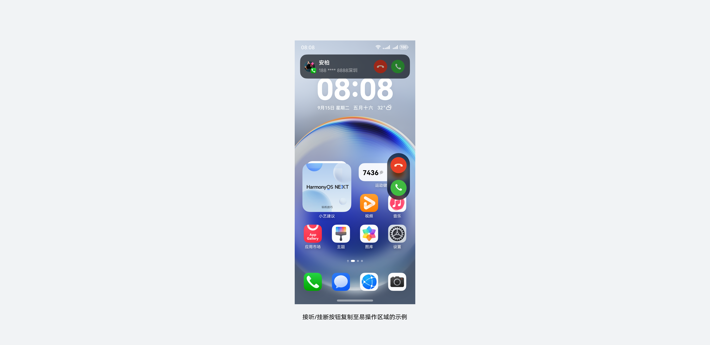
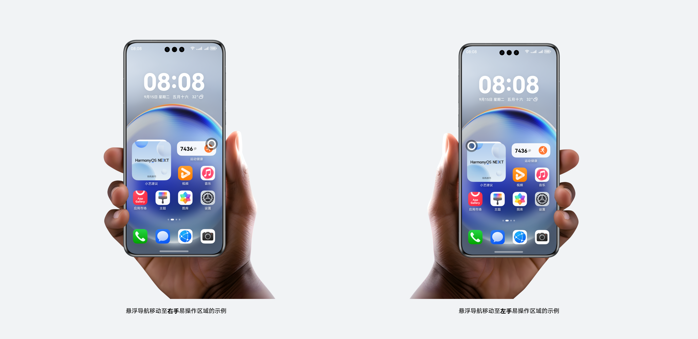
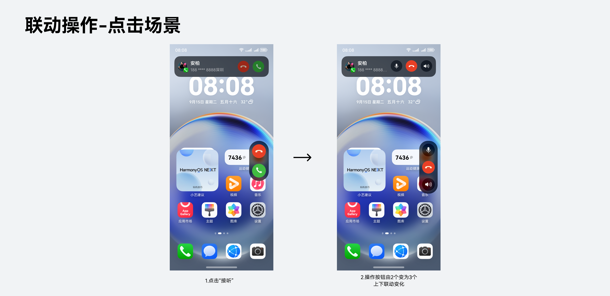
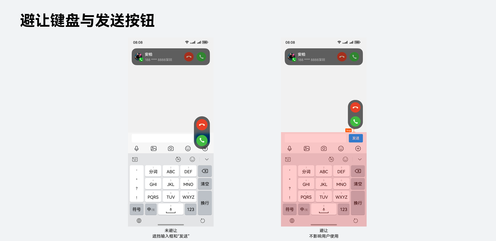

# 智感握姿

### 概述

智感握姿综合多种传感器信息和人因信息，通过先进的 AI 算法，实时识别出手机握持姿势，动态调整界面上交互组件的位置，旨在解决顶部与侧边操作不易触达的问题，让单手操作更易用。

### 典型场景

## 保留已有交互

针对交互组件在难触达区域且用户已有心智的操作，建议保留原有位置的交互，在此基础上在单手易操作区域新复制一组交互组件方便用户操作，两者距离不宜过近，示例如下。

## 移动已有交互

针对交互组件在难触达区域，也可将原有交互区域直接移动至当前单手易操作区域，示例如下。同时需避免过于频繁移动带来不稳定和干扰。

### 接入原则

为确保此能力服务于广泛且准确的用户体验，建议满足以下条件：

**仅针对单手难触达的必要组件。**推荐用户必须操作的组件接入智感握姿，例如来电横幅接听/挂断按钮、侧边悬浮按钮等。避免应用于悬浮广告等营销场景，诱导用户点击。

**不可改变已有的交互逻辑。**在难触达交互组件移动/复制至易操作区域时，避免增加或遗漏功能，并保持与原有交互一致。

**用户可自由关闭此功能。**应用应有此功能的开关设置，在用户不需要时可自行关闭。

**统一术语。**“智感握姿”为 HarmonyOS 独有能力，应用若露出相关介绍，必须准确使用“智感握姿”，避免使用其他类似用词混淆用户心智。

### 交互规则

智感握姿旨在将让单手操作更易用，不限制特定的交互手势，点击、滑动、长按、拖拽等系统常见基础手势均可接入。

1. 在保留已有交互的场景下，两组交互需同步联动，保证两侧反馈一致，示例如下。同时建议将原本的难触达操作按钮弱化，引导用户关注侧边易用按钮。

2. 新增的交互组件避免与已有的系统组件冲突，注意避让键盘、横幅通知、侧边导航栏、画中画、中转站等，示例如下。

### 动效规则

组件出场位移动画使用曲线 interpolatingSpring (velocity 0；mass 1；stiffness 200 ; damping17) 。

组件换位位移建议从屏幕外移动，尽量避免频繁在屏幕内移动，干扰用户视线 。动画使用曲线 interpolatingSpring (velocity 0；mass 1；stiffness 170 ; damping17)。

智感握姿开发文档请参阅：[获取用户动作开发指导](/docs/dev/app-dev/system/system-hardware/multimodal-awareness-kit/motion-guidelines)