# 闪控球和闪控窗

闪控球和闪控窗是悬浮于应用界面上层的轻量化窗口，支持信息展示和轻量任务处理，可实现灵活、安全、便捷地跨应用操作，适配各类高频交互场景。

|  |  |  |  |
| --- | --- | --- | --- |
| **类别** | **定位** | **体验价值** | **适用场景** |
| 闪控球 | 展示少量关键信息，支持应用外一键操作，自动拉起应用 | 实现跨应用快捷操作 | 抢单、记账、比价等 |
| 闪控窗 | 展示更多关键信息，支持应用外便捷操作、实时监测 | 实现跨应用高频、轻量交互操作 | 金融盯盘、游戏直播、歌词显示等 |

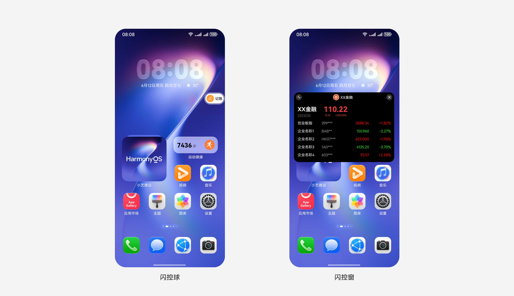

### 闪控球

### 基础交互

**闪控球创建**

应用接入闪控球功能后，用户可通过应用内指定入口手动开启闪控球。点击闪控球，跳转至原应用对应界面。

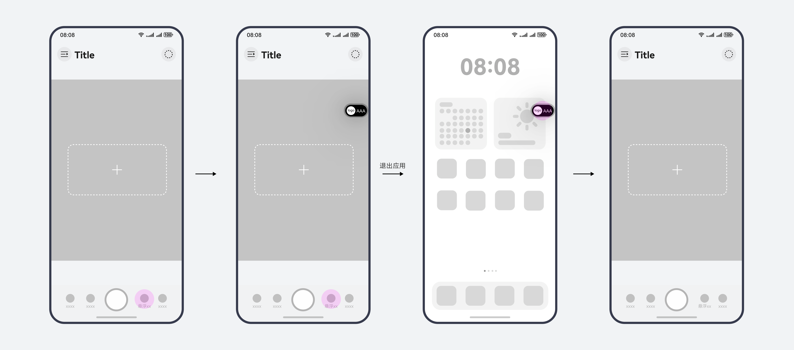

**闪控球数量限制**

系统最多支持2个闪控球，一个应用内仅支持创建一个闪控球。

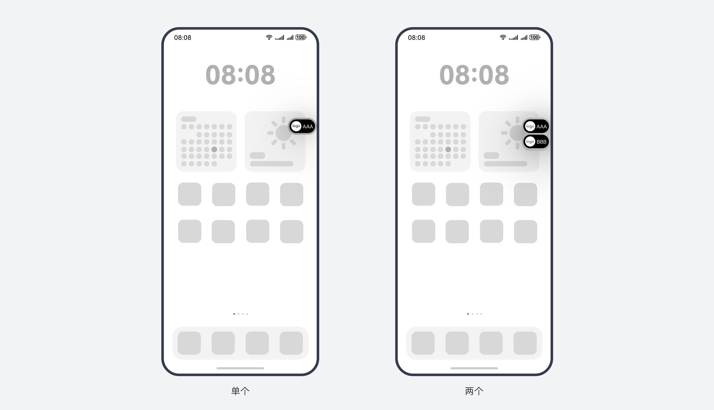

**闪控球最小化**

闪控球支持拖拽收入侧边条。

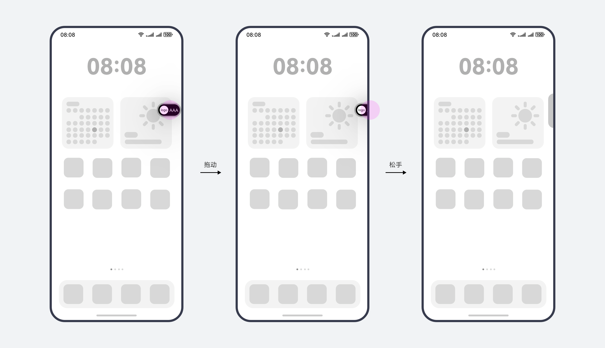

**闪控球删除**

用户可以将单个或多个闪控球整体拖拽至底部垃圾桶删除，也可以长按后通过菜单删除闪控球。

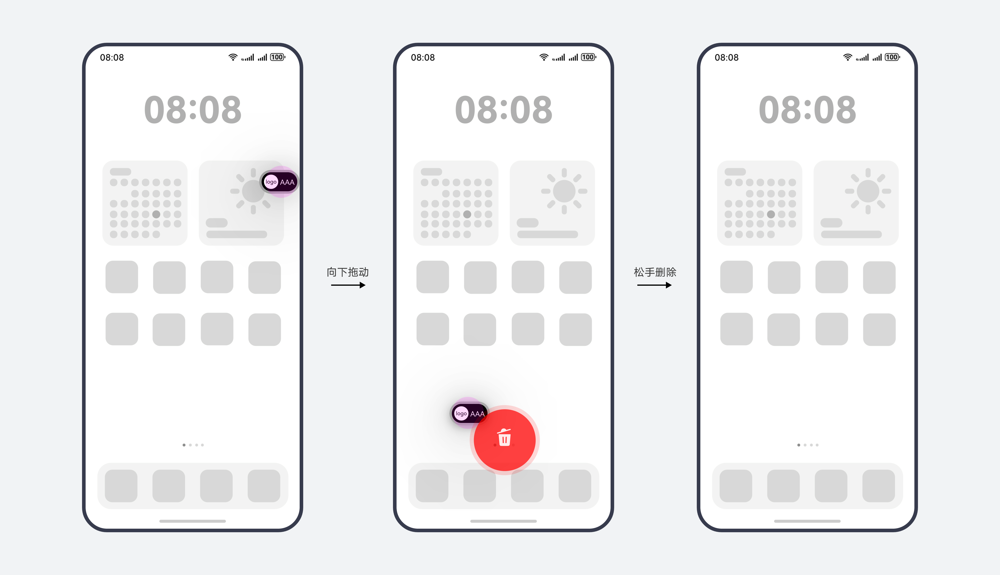

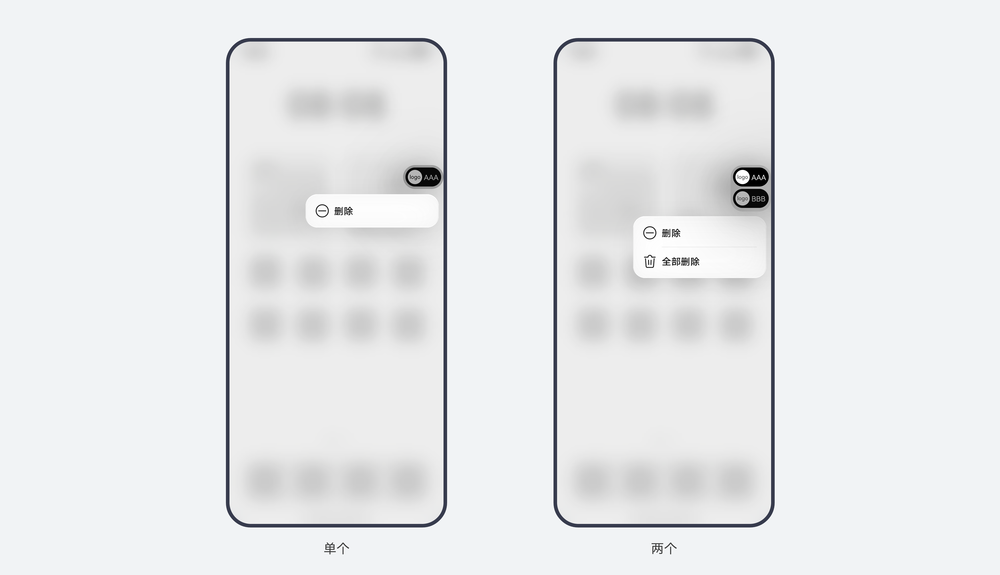

### 视觉规格

**闪控球模板结构**

* 支持动态布局、普通文本布局、强调文本布局、

* 纯文本布局四类模板，应用可根据业务诉求选择接入模板。

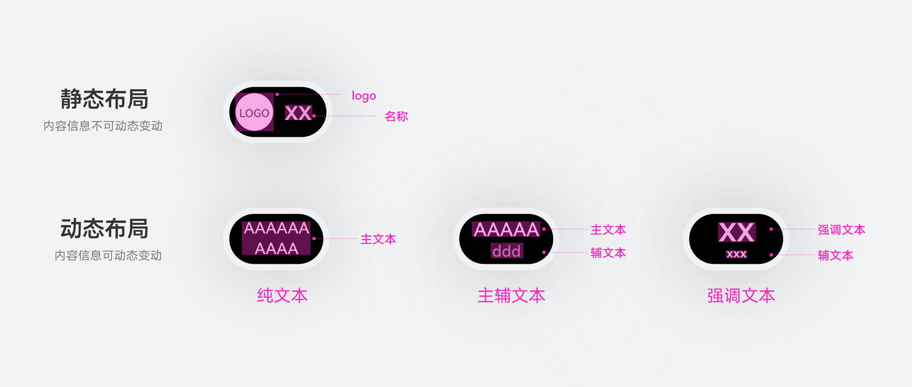

**闪控球不同设备尺寸**

* 闪控球宽度会根据传入内容进行宽度档位切换，高度不变。

  |  |  |  |  |  |  |
  | --- | --- | --- | --- | --- | --- |
  | **设备类型** | **默认尺寸 (vp)** | **档位1** | **档位2** | **档位3** | **档位4** |
  | 直板机 (竖屏) | 70\*40 (包含底板) | 70\*40 (包含底板) | 80\*40 (包含底板) | 90\*40 (包含底板) | 98\*40 (包含底板) |
  | 直板机 (横屏) | 70\*40 (包含底板) | 70\*40 (包含底板) | 80\*40 (包含底板) | 90\*40 (包含底板) | 98\*40 (包含底板) |
  | 双折叠展开态 | 70\*40 (包含底板) | 70\*40 (包含底板) | 80\*40 (包含底板) | 90\*40 (包含底板) | 98\*40 (包含底板) |
  | 三折叠展开态 | 70\*40 (包含底板) | 70\*40 (包含底板) | 80\*40 (包含底板) | 90\*40 (包含底板) | 98\*40 (包含底板) |
  | 平板/电脑 | 104\*60 (包含底板) | 104\*60 (包含底板) | 114\*60 (包含底板) | 124\*60 (包含底板) | 132\*60 (包含底板) |

上方数据为包含外部材质底板宽度，内部底板距离左右边距泛手机为4vp,平板/电脑为6vp。

### 闪控窗

### 基础交互

**闪控窗创建**

应用接入闪控窗功能后，用户可通过应用内指定入口手动开启闪控窗。点击闪控窗，跳转至原应用对应界面。系统内最多可显示一个闪控窗。

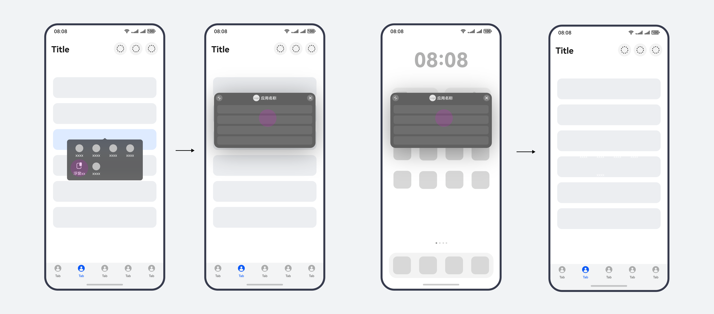

若应用同时接入闪控窗和闪控球，闪控窗和闪控球之间可以互相切换。

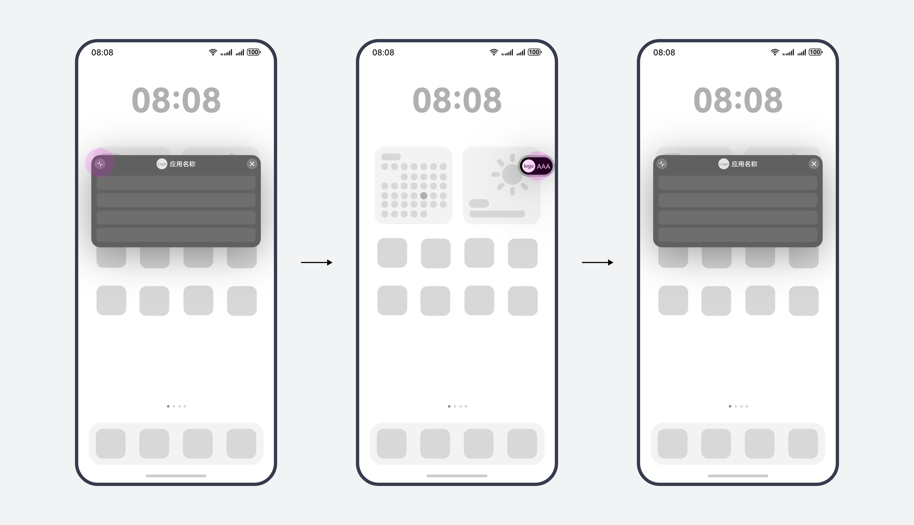

**闪控窗最小化**

闪控窗支持拖拽收入侧边条，也可以通过“最小化”按钮收入侧边条。

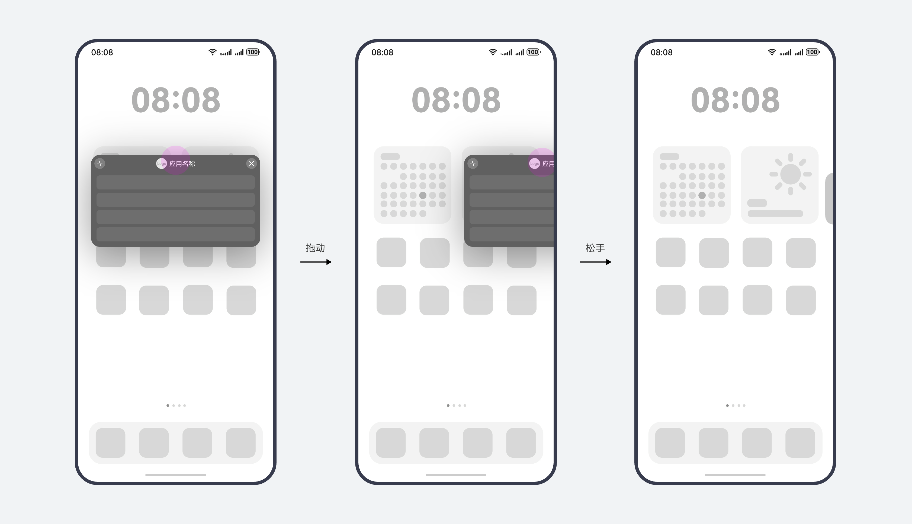

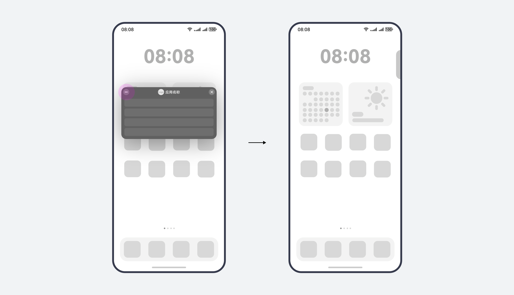

**闪控窗删除**

用户可将闪控窗拖拽至底部垃圾桶删除，也可以直接通过关闭按钮删除闪控窗。

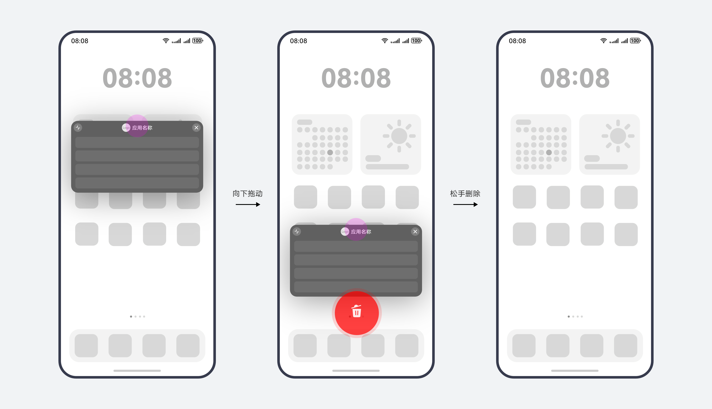

### 视觉规格

**闪控窗窗口显示状态**

|  |  |  |
| --- | --- | --- |
| **显示状态** | **窗口样式** | **应用场景** |
| 常规态 | 矩形，在最大最小尺寸范围内可自由设定宽高 | 适用于大多数使用场景 |
| Mini态 | 横向细长条矩形 | 窗口对于页面遮挡较小，适用于游戏直播、盯盘等场景 |

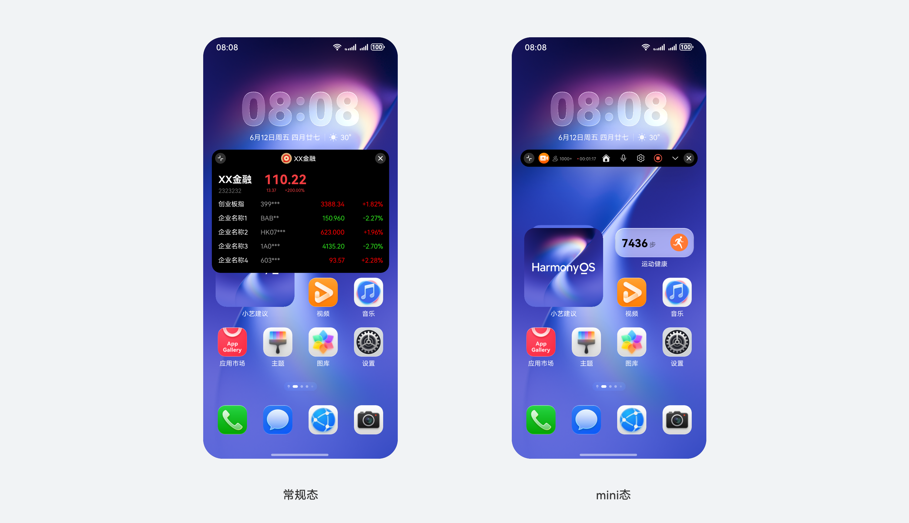

闪控窗窗口样式

**窗口模板 (titlebar 布局、拖拽区、内容区)**

提供常规态与mini态的两种标准状态模板，以帮助快速识别与构建规范的界面体验。如果业务同时接入常规态和mini态两种窗口形态，则需要在窗口内容区自行配置窗口形态切换按钮。

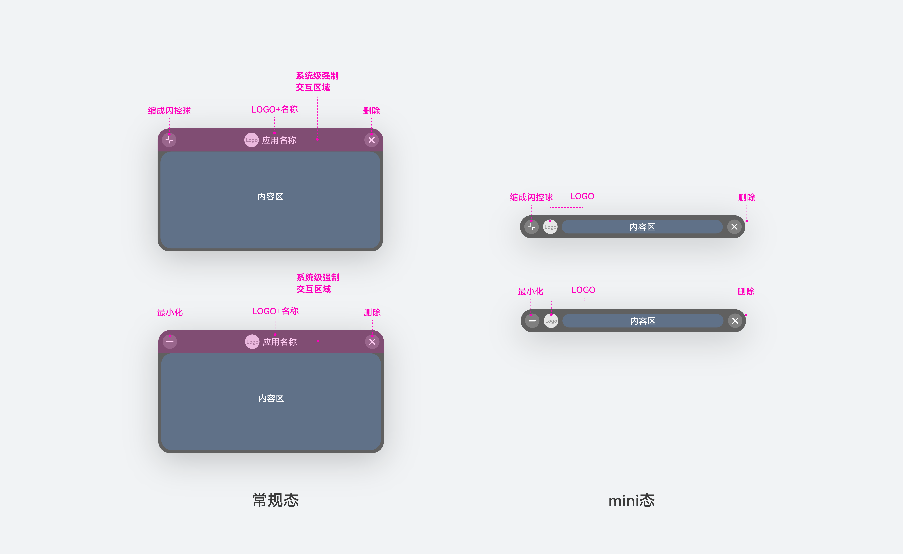

闪控窗窗口模板

**不同设备尺寸**

闪控窗尺寸有最大、最小尺寸限制，可按需在区间内自由定义窗口尺寸大小与比例。为保证在不同设备下窗口视觉体验的一致性，尺寸大小与计算规则根据设备类型有所不同。

|  |  |  |  |  |
| --- | --- | --- | --- | --- |
| **设备类型** | **最小宽度** | **最小高度** | **最大宽度** | **最大高度** |
| 直板机 (竖屏) | 屏幕宽度30% | 窗口宽度\*75% | 屏幕宽度\*90% | 窗口宽度\*75% |
| 直板机 (横屏) | 直板机 (竖屏) 屏幕宽度30% | 窗口宽度\*75% | 屏幕宽度\*45% | 窗口宽度\*75% |
| 双折叠展开态 | 折叠态 (竖屏) 屏幕宽度30% | 窗口宽度\*75% | 屏幕宽度\*55% | 窗口宽度\*75% |
| 三折叠展开态 | 折叠态 (竖屏) 屏幕宽度30% | 窗口宽度\*75% | 屏幕宽度50% | 窗口宽度\*75% |
| 平板/电脑 | 屏幕宽度\*10% | 窗口宽度\*75% | 屏幕宽度\*50% | 窗口宽度\*75% |

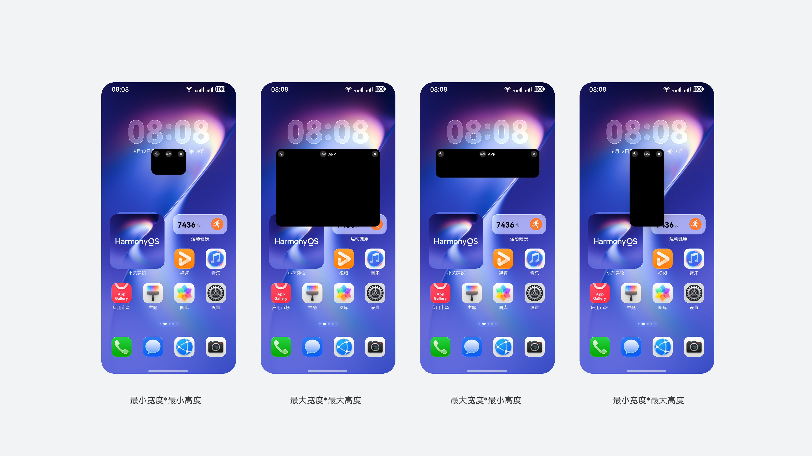

闪控窗自定义尺寸样例

**Mini态尺寸**

Mini态窗口高度限定为32vp,宽度同常规态规格。

### 闪控窗与悬浮窗区别

* 闪控窗：承载应用内单一功能或局部信息，无法覆盖全应用业务；支持应用内悬浮或跨应用悬浮；窗口仅限执行本任务相关功能。

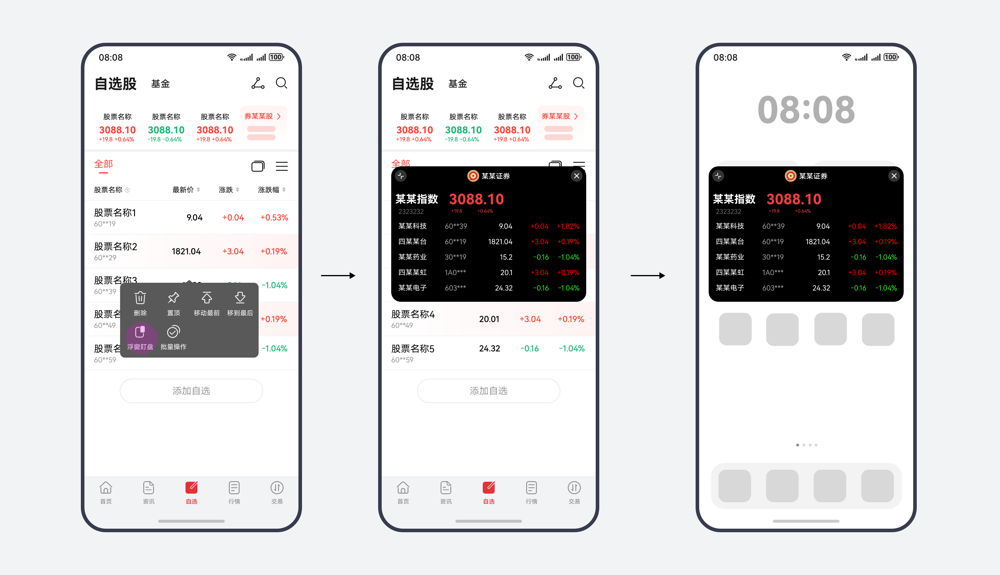

* 系统悬浮窗：承载应用全量功能，在同一个悬浮窗内可进行应用内不同功能的切换和跳转。

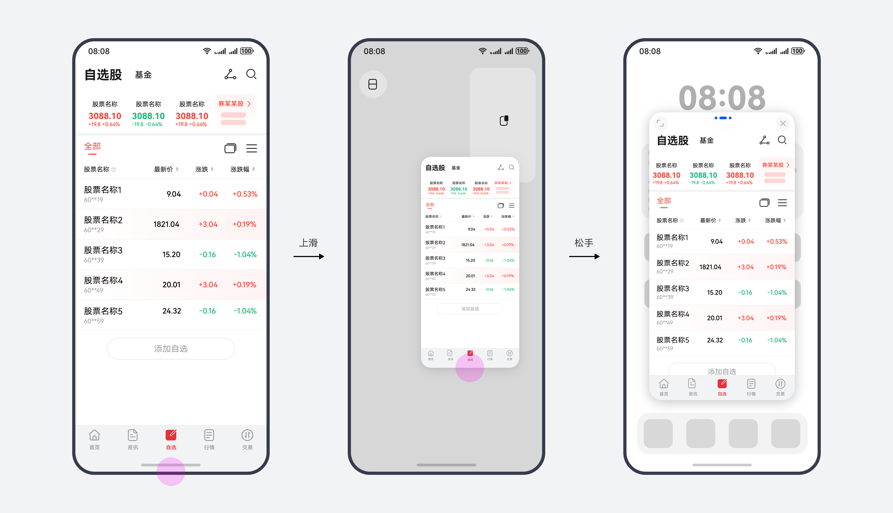