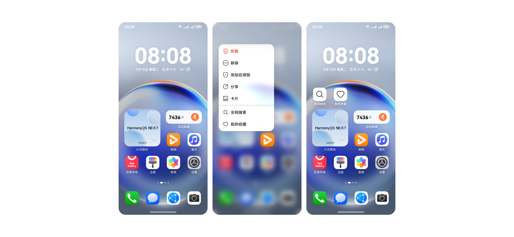
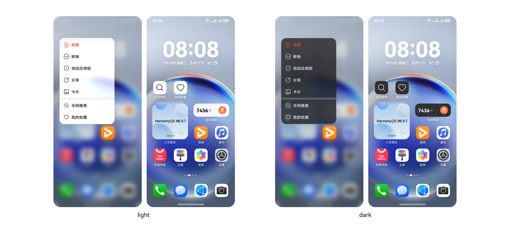
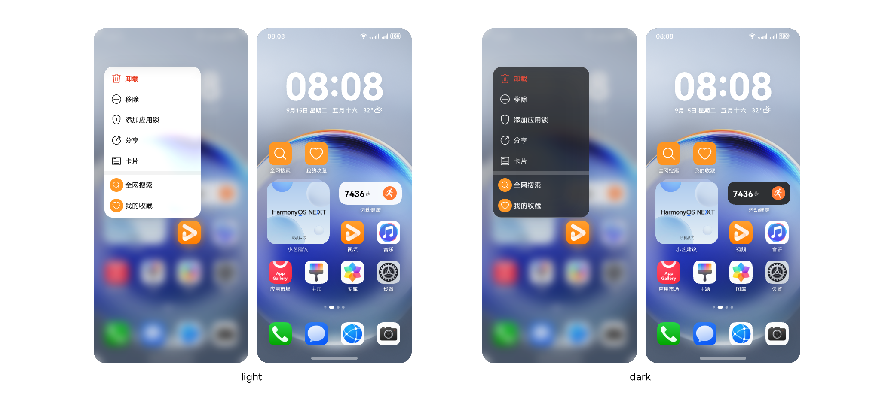
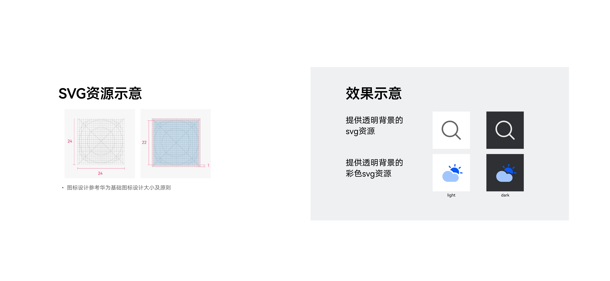
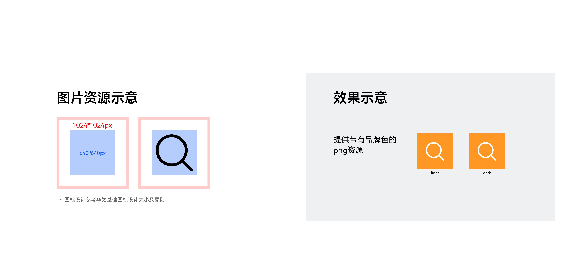

# 桌面快捷方式

### 概述

为了提升用户体验，可以为应用中常用功能创建桌面快捷方式，实现快速启动和一键直达特定功能，例如相机的“快速拍照”、便签的“新建便签”和地图的“常用地点导航”。用户通过快捷方式可以快速进入特定功能页面，提高了操作效率，也满足了用户个性化的工作流程和操作偏好

### 快捷方式桌面图标添加方式

快捷方式桌面图标共有 2 种添加方式：

### 方式一

长按桌面菜单，选中【全网搜索】，拖动至桌面。

### 方式二

从应用内添加至桌面。

### 快捷方式图标规范

为保证快捷方式图标在桌面上显示的一致性，应用预置的图标资源应满足以下审核要素：

### 图标资源样式

为保证快捷方式图标的资源能满足多种诉求，现支持两种资源格式的配置，可上传 Svg 格式或者 Png 格式。

1. Svg 格式的图片资源

   
2. Png 格式的图标资源

### Svg 格式的图标资源

建议优先提供 svg 资源；

须提供透明背景、图标资源大小 24\*24vp 的 svg 资源。

### Png 格式的图片资源资

资源尺寸为 1024 \* 1024 px；

资源必须为正方形图像，无需圆角，加桌由系统处理为最大圆角生成遮罩裁切。

