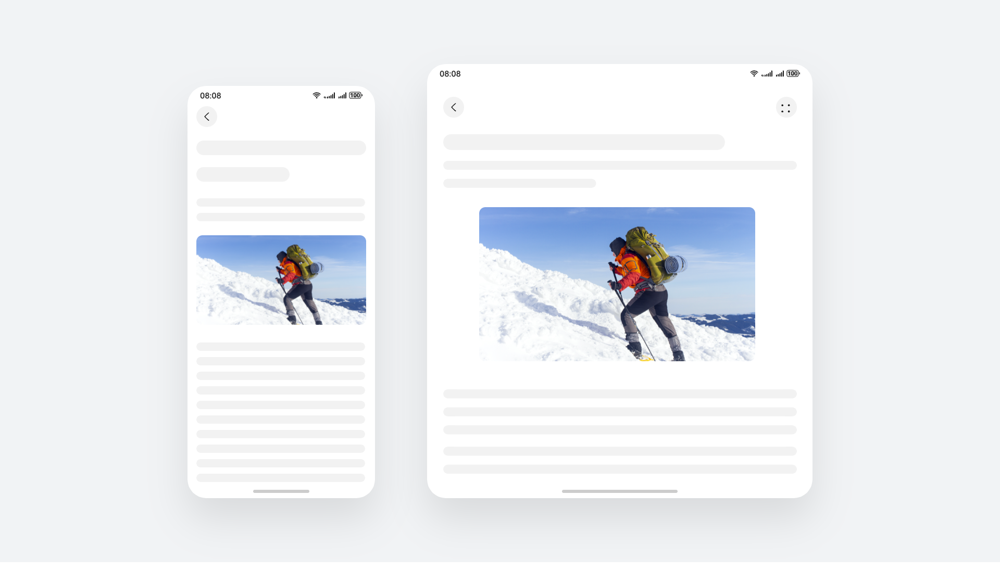
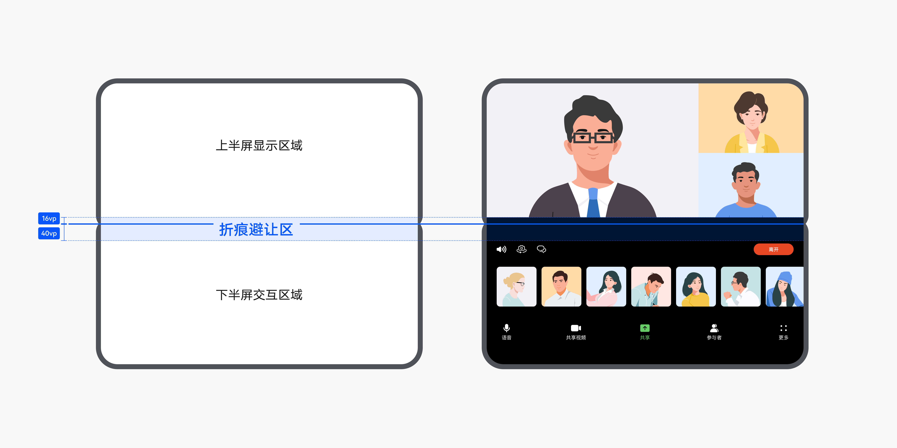
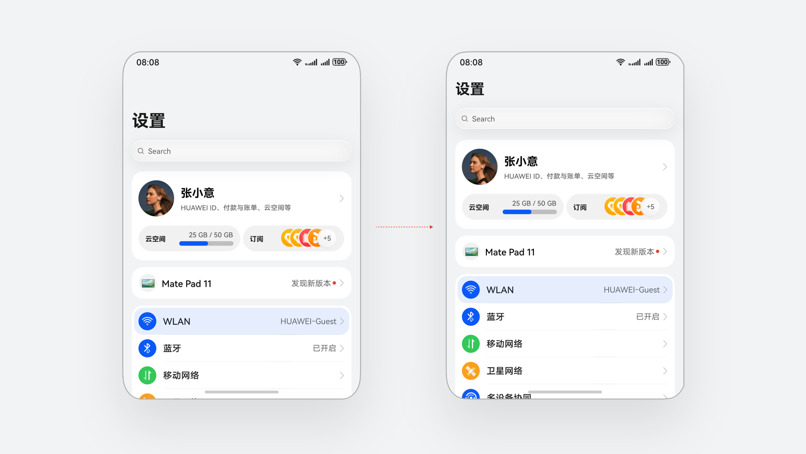
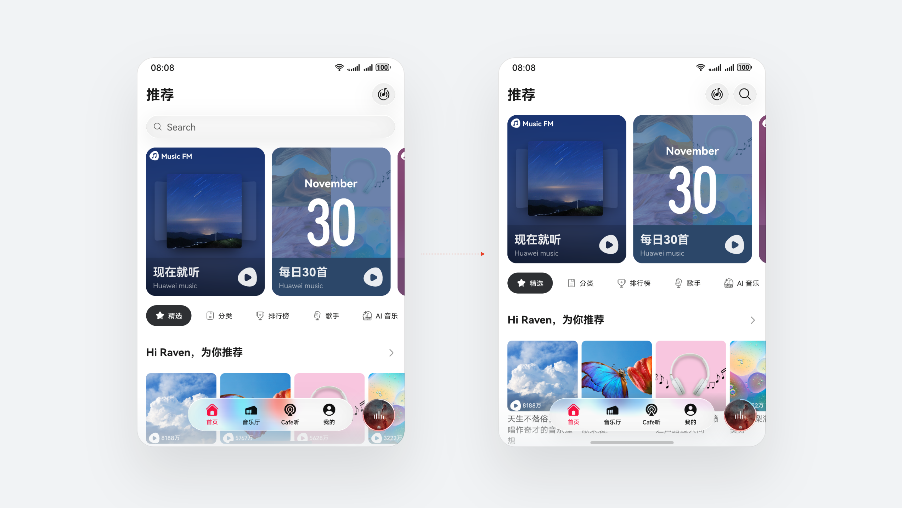
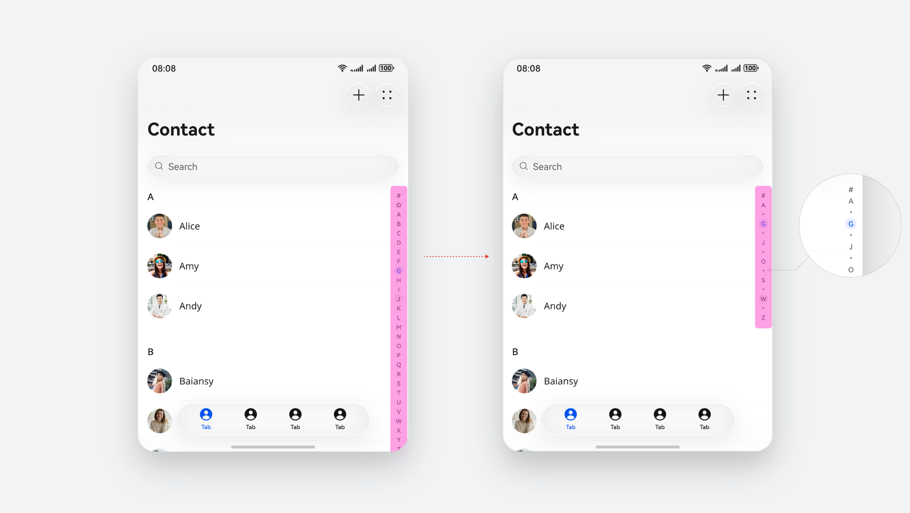
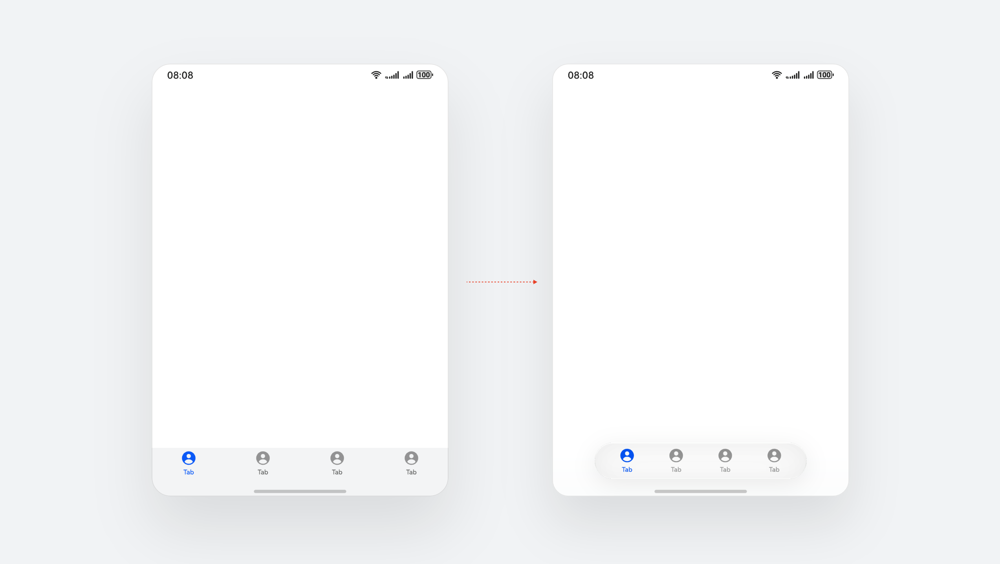

# 折叠屏应用 UX 体验标准

### 基础体验

4.1.1 开合连续性

|  |  |  |
| --- | --- | --- |
| 标准编号 | 4.1.1 | 开合连续性 |
| 标准描述 | | 应用在设备折叠/展开后不应出现操作步骤增加，操作更复杂等体验下降的情况。例如：如页面切换到其他页面、页面滚动位置发生偏移、输入内容丢失、图片模糊、播放进度变化。    页面滚动位置不偏移的示例 |
| 测试方法 | | 设备展开/折叠，观察开合转换过程和页面布局。 |
| 判定标准 | | 设备开合过程流畅，不卡顿，界面布局正常，操作交互正常。 |
| 标准等级 | | 必须 |
| 适用设备类型 | | 折叠屏 |
| 需考虑的特殊事项 | | 无 |
| 系统能力 | | 请参阅[自适应布局](https://developer.huawei.com/consumer/cn/doc/best-practices/bpta-multi-device-adaptive-layout) |

4.1.2 开合流畅

|  |  |  |
| --- | --- | --- |
| 标准编号 | 4.1.2 | 开合流畅 |
| 标准描述 | | 设备在折叠/展开时，变化过程有连续动效，而不是硬切换。 |
| 测试方法 | | 对设备进行折叠/展开操作，观察界面动效。 |
| 判定标准 | | 设备在折叠/展开过程中，界面动效自然流畅，无卡顿等异常。 |
| 标准等级 | | 推荐 |
| 适用设备类型 | | 折叠屏 |
| 需考虑的特殊事项 | | 无 |
| 系统能力 | | 系统能力具备，无需开发者关注 |

4.1.3 悬停适配

|  |  |  |
| --- | --- | --- |
| 标准编号 | 4.1.3 | 悬停适配 |
| 标准描述 | | 长视频、短视频、直播、通话、会议、拍摄类应用需针对折叠屏的悬停态进行单独适配。在界面布局设计时充分考虑悬停态下不同屏幕区域的可视角度及交互难易度。下半屏区域内可放置交互操作，上半屏区域内进行信息显示，呈现浏览型内容。交互型控件，例如弹出框、半模态，在下半屏显示；跟随上下文的控件，例如菜单，跟随触发元素所在侧的屏幕显示。    悬停态适配的示例 |
| 测试方法 | | 在设备悬停态下，观察应用界面的信息显示和交互。 |
| 判定标准 | | 应用能正常适配悬停态，在悬停态下半屏区域内可进行交互操作，上半屏区域内内容信息显示正常。 |
| 标准等级 | | 涉及则必须 |
| 适用设备类型 | | 折叠屏 |
| 需考虑的特殊事项 | | 无 |
| 系统能力 | | 请参阅[一多开发实例（长视频）-视频悬停播放](https://developer.huawei.com/consumer/cn/doc/best-practices/multi-video-app#li96815962218) |

4.1.4 折痕避让

|  |  |  |
| --- | --- | --- |
| 标准编号 | 4.1.4 | 折痕避让 |
| 标准描述 | | 悬停态时，中间弯折区域难以操作且显示内容会变形。长视频、短视频、直播、通话、会议、拍摄类应用需针对折痕区域进行避让适配。上半屏内容由中线向上避让 16 vp (3 毫米)、下半屏内容由中线向下避让 40 vp (7 毫米)。    折痕避让的示例 |
| 测试方法 | | 在设备悬停态下，观察应用对折痕区域的适配。 |
| 判定标准 | | 应用能进行折痕避让，在悬停态应用上半屏内容由中线向上避让 16 vp (3 毫米)、下半屏内容由中线向下避让 40 vp (7 毫米）。 |
| 标准等级 | | 涉及则必须 |
| 适用设备类型 | | 折叠屏 |
| 需考虑的特殊事项 | | 无 |
| 系统能力 | | 请参阅[一多开发实例（长视频）-视频悬停播放](https://developer.huawei.com/consumer/cn/doc/best-practices/multi-video-app#li96815962218) |

### 阔折叠体验

4.2.1 标题栏适配

|  |  |  |
| --- | --- | --- |
| 标准编号 | 4.2.1 | 标题栏适配 |
| 标准描述 | | 针对屏幕高度较小的阔折叠设备，可适当缩小标题栏字号，以减少留白区域，增加核心内容显示空间。   |
| 测试方法 | | 观察应用在阔折叠设备上的标题栏显示效果 |
| 判定标准 | | 标题栏区域留白适中，则满足要求 |
| 标准等级 | | 强烈推荐 |
| 适用设备类型 | | 折叠屏 |
| 需考虑的特殊事项 | | 无 |
| 系统能力 | | 设计规则 |

4.2.2 搜索框适配

|  |  |  |
| --- | --- | --- |
| 标准编号 | 4.2.2 | 搜索框适配 |
| 标准描述 | | 针对屏幕高度较小的阔折叠设备，搜索框推荐切换为搜索图标，与标题栏同行显示，增加核心内容显示空间。   |
| 测试方法 | | 观察应用在阔折叠设备上的搜索框显示效果 |
| 判定标准 | | 搜索框切换为搜索图标，且与标题栏同行显示，则满足要求 |
| 标准等级 | | 强烈推荐 |
| 适用设备类型 | | 折叠屏 |
| 需考虑的特殊事项 | | 无 |
| 系统能力 | | 设计规则 |

4.2.3 索引条适配

|  |  |  |
| --- | --- | --- |
| 标准编号 | 4.2.3 | 索引条适配 |
| 标准描述 | | 针对屏幕高度较小的阔折叠设备，推荐采用分段式索引条，长按指定分段可滑动选取具体字母进行索引。   |
| 测试方法 | | 观察应用在阔折叠设备上的索引条显示效果 |
| 判定标准 | | 应用适配了分段式索引条，则满足要求 |
| 标准等级 | | 强烈推荐 |
| 适用设备类型 | | 折叠屏 |
| 需考虑的特殊事项 | | 无 |
| 系统能力 | | 设计规则 |

4.2.4 底部页签适配

|  |  |  |
| --- | --- | --- |
| 标准编号 | 4.2.4 | 底部页签适配 |
| 标准描述 | | 针对屏幕高度较小的阔折叠设备，建议底部页签由上下结构切换为悬浮式页签。   |
| 测试方法 | | 观察应用在阔折叠设备上的底部页签显示效果 |
| 判定标准 | | 应用适配悬浮式底部页签，则满足要求 |
| 标准等级 | | 强烈推荐 |
| 适用设备类型 | | 折叠屏 |
| 需考虑的特殊事项 | | 无 |
| 系统能力 | | 设计规则 |