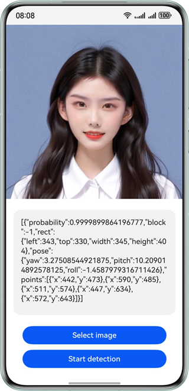

## 适用场景

检测图片中的人脸，返回高精度人脸矩形框坐标、人脸五官位置、人脸朝向、人脸置信度。可通过对人脸的定位，实现对人脸特定位置的美化修饰。广泛应用于各类人脸识别场景，如人脸聚类、美颜等场景中。

效果如下图所示：



## 世界坐标系

以下方图片指示坐标系辅助表示人脸朝向。


## 开发步骤

1. 在使用人脸检测时，将实现人脸检测相关的类添加至工程。

   ```
   import { faceDetector } from '@kit.CoreVisionKit';
   import { image } from '@kit.ImageKit';
   import { hilog } from '@kit.PerformanceAnalysisKit';
   import { BusinessError } from '@kit.BasicServicesKit';
   import { fileIo } from '@kit.CoreFileKit';
   import { photoAccessHelper } from '@kit.MediaLibraryKit';
   ```
2. 初始化和释放：在aboutToAppear中调用[faceDetector.init()](https://developer.huawei.com/consumer/cn/doc/harmonyos-references/core-vision-face-detector-api#facedetectorinit)初始化人脸检测分析器（加载模型），在aboutToDisappear中调用[faceDetector.release()](https://developer.huawei.com/consumer/cn/doc/harmonyos-references/core-vision-face-detector-api#facedetectorrelease)释放资源。

   ```
   async aboutToAppear(): Promise<void> {
     const initResult = await faceDetector.init();
     hilog.info(0x0000, 'faceDetectorSample', `Face detector initialization result:${initResult}`);
   }

   async aboutToDisappear(): Promise<void> {
     await faceDetector.release();
     hilog.info(0x0000, 'faceDetectorSample', 'Face detector released successfully');
   }
   ```
3. 通过photoAccessHelper.PhotoViewPicker拉起图库选择图片，使用fileIo与image模块将URI转换为[PixelMap](https://developer.huawei.com/consumer/cn/doc/harmonyos-references/arkts-apis-image-pixelmap)，为后续检测接口准备输入数据。

   ```
   Button('选择图片')
     .type(ButtonType.Capsule)
     .fontColor(Color.White)
     .alignSelf(ItemAlign.Center)
     .width('80%')
     .margin(10)
     .onClick(() => {
       // 拉起图库，获取图片资源
       void this.selectImage();
     })
   ```

   选择图片与解码图片的方法实现如下：

   ```
   private async selectImage() {
     let uri = await this.openPhoto();
     if (!uri) {
       hilog.error(0x0000, 'faceDetectorSample', 'Failed to get uri.');
       return;
     }
     this.loadImage(uri);
   }

   private async openPhoto(): Promise<string> {
     return new Promise<string>((resolve) => {
       let photoPicker: photoAccessHelper.PhotoViewPicker = new photoAccessHelper.PhotoViewPicker();
       photoPicker.select({
         MIMEType: photoAccessHelper.PhotoViewMIMETypes.IMAGE_TYPE,
         maxSelectNumber: 1
       }).then(res => {
         resolve(res.photoUris[0]);
       }).catch((err: BusinessError) => {
         hilog.error(0x0000, 'faceDetectorSample', `Failed to get photo image uri.code: ${err.code}, message: ${err.message}`);
         resolve('');
       });
     });
   }

   private loadImage(name: string) {
     setTimeout(async () => {
       let imageSource: image.ImageSource | undefined = undefined;
       let fileSource = await fileIo.open(name, fileIo.OpenMode.READ_ONLY);
       imageSource = image.createImageSource(fileSource.fd);
       this.chooseImage = await imageSource.createPixelMap();
       this.dataValues = '';
       await fileIo.close(fileSource);
     }, 100);
   }
   ```
4. 构造[VisionInfo](https://developer.huawei.com/consumer/cn/doc/harmonyos-references/core-vision-face-detector-api#visioninfo)对象并传入待检测图片的PixelMap，调用[faceDetector.detect](https://developer.huawei.com/consumer/cn/doc/harmonyos-references/core-vision-face-detector-api#facedetectordetect)方法，获取人脸位置、五官、朝向等检测结果并展示在界面上。

   ```
   Button('人脸检测')
     .type(ButtonType.Capsule)
     .fontColor(Color.White)
     .alignSelf(ItemAlign.Center)
     .width('80%')
     .margin(10)
     .onClick(() => {
       if (!this.chooseImage) {
         hilog.error(0x0000, 'faceDetectorSample', 'Failed to detect face.');
         return;
       }
       // 调用人脸检测接口
       let visionInfo: faceDetector.VisionInfo = {
         pixelMap: this.chooseImage
       };
       faceDetector.detect(visionInfo)
         .then((data: faceDetector.Face[]) => {
           if (data.length === 0) {
             this.dataValues = 'No face is detected in the image. Select an image that contains a face.';
           } else {
             let faceString = JSON.stringify(data);
             hilog.info(0x0000, 'faceDetectorSample', 'faceString data is ' + faceString);
             this.dataValues = faceString;
           }
         })
         .catch((error: BusinessError) => {
           hilog.error(0x0000, 'faceDetectorSample', `Face detection failed. Code: ${error.code}, message: ${error.message}`);
           this.dataValues = `Error: ${error.message}`;
         });
     })
   ```

## 开发实例

### Index.ets

```
import { faceDetector } from '@kit.CoreVisionKit';
import { image } from '@kit.ImageKit';
import { hilog } from '@kit.PerformanceAnalysisKit';
import { BusinessError } from '@kit.BasicServicesKit';
import { fileIo } from '@kit.CoreFileKit';
import { photoAccessHelper } from '@kit.MediaLibraryKit';

@Entry
@Component
struct Index {
  @State chooseImage: PixelMap | undefined = undefined;
  @State dataValues: string = '';

  async aboutToAppear(): Promise<void> {
    const initResult = await faceDetector.init();
    hilog.info(0x0000, 'faceDetectorSample', `Face detector initialization result:${initResult}`);
  }

  async aboutToDisappear(): Promise<void> {
    await faceDetector.release();
    hilog.info(0x0000, 'faceDetectorSample', 'Face detector released successfully');
  }

  build() {
    Column() {
      Image(this.chooseImage)
        .objectFit(ImageFit.Fill)
        .height('60%')
      Text(this.dataValues)
        .copyOption(CopyOptions.LocalDevice)
        .height('15%')
        .margin(10)
        .width('60%')
      Button('选择图片')
        .type(ButtonType.Capsule)
        .fontColor(Color.White)
        .alignSelf(ItemAlign.Center)
        .width('80%')
        .margin(10)
        .onClick(() => {
          // 拉起图库
          void this.selectImage();
        })
      Button('人脸检测')
        .type(ButtonType.Capsule)
        .fontColor(Color.White)
        .alignSelf(ItemAlign.Center)
        .width('80%')
        .margin(10)
        .onClick(() => {
          if (!this.chooseImage) {
            hilog.error(0x0000, 'faceDetectorSample', 'Failed to detect face.');
            return;
          }
          // 调用人脸检测接口
          let visionInfo: faceDetector.VisionInfo = {
            pixelMap: this.chooseImage
          };
          faceDetector.detect(visionInfo)
            .then((data: faceDetector.Face[]) => {
              if (data.length === 0) {
                this.dataValues = 'No face is detected in the image. Select an image that contains a face.';
              } else {
                let faceString = JSON.stringify(data);
                hilog.info(0x0000, 'faceDetectorSample', 'faceString data is ' + faceString);
                this.dataValues = faceString;
              }
            })
            .catch((error: BusinessError) => {
              hilog.error(0x0000, 'faceDetectorSample', `Face detection failed. Code: ${error.code}, message: ${error.message}`);
              this.dataValues = `Error: ${error.message}`;
            });
        })
    }
    .width('100%')
    .height('100%')
    .justifyContent(FlexAlign.Center)
  }

  private async selectImage() {
    let uri = await this.openPhoto();
    if (!uri) {
      hilog.error(0x0000, 'faceDetectorSample', 'Failed to get uri.');
      return;
    }
    this.loadImage(uri);
  }

  private async openPhoto(): Promise<string> {
    return new Promise<string>((resolve) => {
      let photoPicker: photoAccessHelper.PhotoViewPicker = new photoAccessHelper.PhotoViewPicker();
      photoPicker.select({
        MIMEType: photoAccessHelper.PhotoViewMIMETypes.IMAGE_TYPE,
        maxSelectNumber: 1
      }).then(res => {
        resolve(res.photoUris[0]);
      }).catch((err: BusinessError) => {
        hilog.error(0x0000, 'faceDetectorSample', `Failed to get photo image uri.code: ${err.code}, message: ${err.message}`);
        resolve('');
      });
    });
  }

  private loadImage(name: string) {
    setTimeout(async () => {
      let imageSource: image.ImageSource | undefined = undefined;
      let fileSource = await fileIo.open(name, fileIo.OpenMode.READ_ONLY);
      imageSource = image.createImageSource(fileSource.fd);
      this.chooseImage = await imageSource.createPixelMap();
      this.dataValues = '';
      await fileIo.close(fileSource);
    }, 100);
  }
}
```
