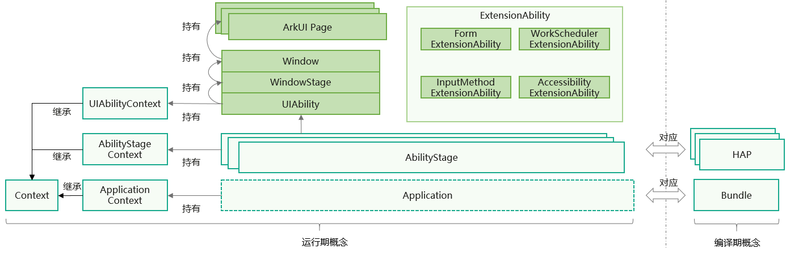

## 基本概念

下图展示了[Stage模型](/docs/dev/app-dev/application-framework/ability-kit/ability-terminology#stage模型)中的基本概念。

**图1** Stage模型概念图

* [AbilityStage](/docs/dev/app-dev/application-framework/ability-kit/stage-model-development/stage-model-application-components/abilitystage)

  每个Entry类型或者Feature类型的[HAP](/docs/dev/app-dev/getting-started/dev-fundamentals/hap-package)在运行期都有一个AbilityStage实例，当[HAP](/docs/dev/app-dev/getting-started/dev-fundamentals/hap-package)中的代码首次被加载到进程中的时候，系统会先创建AbilityStage实例。
* [UIAbility组件](/docs/dev/app-dev/application-framework/ability-kit/stage-model-development/stage-model-application-components/uiability/uiability-overview)和[ExtensionAbility组件](/docs/dev/app-dev/application-framework/ability-kit/stage-model-development/stage-model-application-components/extensionability-overview)

  Stage模型提供UIAbility和ExtensionAbility两种类型的组件，这两种组件都有具体的类承载，支持面向对象的开发方式。

  + UIAbility组件是一种包含UI的应用组件，主要用于和用户交互。例如，图库类应用可以在UIAbility组件中展示图片瀑布流，在用户选择某个图片后，在新的页面中展示图片的详细内容。同时用户可以通过返回键返回到瀑布流页面。UIAbility组件的生命周期只包含创建、销毁、前台、后台等状态，与显示相关的状态通过WindowStage的事件暴露给开发者。
  + ExtensionAbility组件是一种面向特定场景的应用组件。开发者并不直接从ExtensionAbility组件派生，而是需要使用ExtensionAbility组件的派生类。目前ExtensionAbility组件有用于卡片场景的FormExtensionAbility，用于输入法场景的InputMethodExtensionAbility，用于延时任务场景的WorkSchedulerExtensionAbility等多种派生类，这些派生类都是基于特定场景提供的。例如，用户在桌面创建应用的卡片，需要开发者从FormExtensionAbility派生，实现其中的回调函数，并在配置文件中配置该能力。ExtensionAbility组件的派生类实例由用户触发创建，并由系统管理生命周期。在Stage模型上，三方应用开发者不能开发自定义服务，而需要根据自身的业务场景通过ExtensionAbility组件的派生类来实现。

  一个HAP包中可以包含一个或多个UIAbility/ExtensionAbility组件，这些组件在运行时共用同一个AbilityStage实例。当[HAP](/docs/dev/app-dev/getting-started/dev-fundamentals/hap-package)中的代码（无论是UIAbility组件还是ExtensionAbility组件）首次被加载到进程中的时候，系统会先创建对应的AbilityStage实例。
* [WindowStage](https://developer.huawei.com/consumer/cn/doc/harmonyos-references/arkts-apis-window-windowstage)

  每个UIAbility实例都会与一个WindowStage类实例绑定，该类起到了应用进程内窗口管理器的作用。它包含一个主窗口。也就是说UIAbility实例通过WindowStage持有了一个主窗口，该主窗口为ArkUI提供了绘制区域，可以加载不同的ArkUI页面。
* [Context](/docs/dev/app-dev/application-framework/ability-kit/stage-model-development/stage-model-application-components/application-context-stage)

  在Stage模型上，Context及其派生类向开发者提供在运行期可以调用的各种资源和能力。UIAbility组件和各种ExtensionAbility组件的派生类都有各自不同的Context类，他们都继承自基类Context，但是各自又根据所属组件，提供不同的能力。
* ArkUI页面

  ArkUI页面是基于ArkUI框架构建的用户界面组件，可以将不同UI组件组合在一起，实现复杂的页面效果。UIAbility组件可以通过ArkUI页面展示其功能，同时也可以通过ArkUI页面与用户进行交互。
* Application

  Application是应用在设备上的运行实例，作为一个完整的软件实体与用户交互。在Stage模型中，它由一个或多个HAP作为功能模块构成，这些HAP可以共享一个或多个HSP中的代码与资源。
* Bundle

  Bundle是应用在安装部署阶段的静态文件，包含了所有HAP、HSP及相关资源；当其被安装并启动后，便形成了在运行期的动态实例Application。

## 开发流程

基于Stage模型开发应用时，在应用模型部分，涉及如下开发过程。

**表1** Stage模型开发流程

| 任务 | 简介 | 相关指导 |
| --- | --- | --- |
| 应用组件开发 | 本章节介绍了如何使用Stage模型的UIAbility组件和ExtensionAbility组件开发应用。 | - [应用/组件级配置](/docs/dev/app-dev/application-framework/ability-kit/stage-model-development/stage-model-application-components/application-component-configuration-stage)  - [UIAbility组件](/docs/dev/app-dev/application-framework/ability-kit/stage-model-development/stage-model-application-components/uiability/uiability-overview)  - [ExtensionAbility组件](/docs/dev/app-dev/application-framework/ability-kit/stage-model-development/stage-model-application-components/extensionability-overview)  - [AbilityStage组件管理器](/docs/dev/app-dev/application-framework/ability-kit/stage-model-development/stage-model-application-components/abilitystage)  - [应用上下文Context](/docs/dev/app-dev/application-framework/ability-kit/stage-model-development/stage-model-application-components/application-context-stage)  - [组件启动规则](/docs/dev/app-dev/application-framework/ability-kit/stage-model-development/stage-model-application-components/component-startup-rules) |
| 了解进程模型 | 本章节介绍了Stage模型的进程模型，包括基本进程类型、其他进程类型。 | [进程模型概述](/docs/dev/app-dev/application-framework/ability-kit/stage-model-development/process-model-stage) |
| 了解线程模型 | 本章节介绍了Stage模型的线程模型，包括线程类型以及使用EventHub进行线程内通信的方法。 | [线程模型概述](/docs/dev/app-dev/application-framework/ability-kit/stage-model-development/thread-model-stage) |
| 应用配置文件 | 本章节介绍Stage模型中应用配置文件的开发要求。 | [Stage模型应用配置文件](/docs/dev/app-dev/getting-started/dev-fundamentals/application-configuration-file-overview-stage) |
